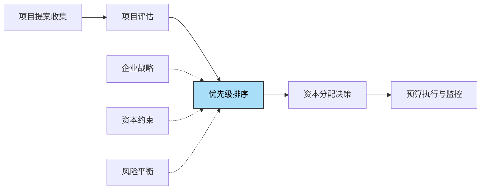
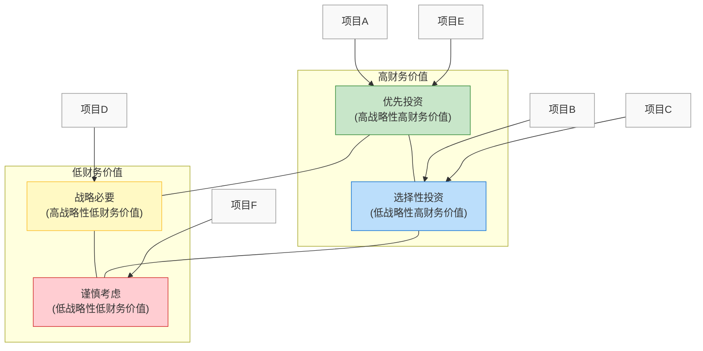
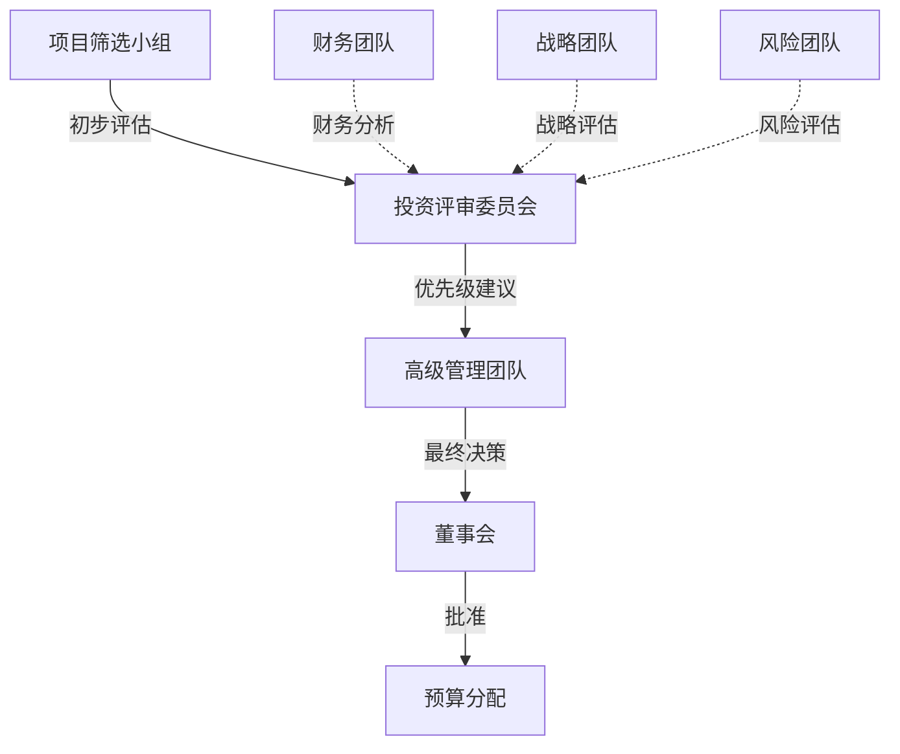

---
{"tags":["财务BP","预算规划","资本预算","优先级排序","资源分配"],"aliases":["资本项目优先排序","投资项目排序","资本支出决策"],"created":"2023-11-20","dg-publish":true,"permalink":"/知识共享/001_财务/01_财务BP/01_学习内容/02_预算编制基础/资本支出预算/资本支出优先级排序/","dgPassFrontmatter":true}
---

> [!abstract] 概述
> 资本支出优先级排序是企业在资源有限条件下，对多个资本项目进行系统评估和排序的管理过程。本文详细介绍资本支出优先级排序的理论基础、方法体系和实施流程，帮助企业在有限的资本约束下，优化投资组合，实现资本效率最大化，支持战略目标达成和可持续发展。

## 基本概念

### 资本支出优先级排序的定义与目的

**资本支出优先级排序**是指企业基于一系列评估标准，对待选资本投资项目进行系统性评价、比较和排序，并在资本约束条件下选择最优投资组合的决策过程。

**主要目的**：
1. 在有限资本条件下实现价值最大化
2. 确保战略性项目优先获得资金支持
3. 平衡短期收益与长期战略需求
4. 合理分配资源，避免低效投资
5. 建立客观、透明的资本分配机制

### 优先级排序在资本预算中的地位

优先级排序是连接项目评估与最终资本分配的关键环节：

- **评估结果整合**：将不同评估维度的结果综合考量
- **分配决策支持**：为最终资金分配提供客观依据
- **价值创造保障**：确保资金流向价值最高的项目
- **投资组合优化**：考虑项目间的关联性和平衡性

## 核心内容

### 优先级排序的基本原则

#### 1. 价值最大化原则

- **核心思想**：资本应优先配置给单位投资创造价值最高的项目
- **实施要点**：
  - 使用标准化指标比较不同规模项目的投资效率
  - 优先考虑获利指数(PI)高的项目
  - 在资本充足情况下，选择所有NPV为正的项目

#### 2. 战略一致性原则

- **核心思想**：项目优先级应与企业战略重点保持一致
- **实施要点**：
  - 明确战略目标和优先级
  - 评估项目对战略目标的贡献度
  - 战略项目可适当降低财务门槛要求

#### 3. 风险平衡原则

- **核心思想**：在追求回报的同时平衡整体投资组合风险
- **实施要点**：
  - 评估单个项目风险及其对整体组合的影响
  - 平衡高风险高回报与低风险低回报项目
  - 考虑项目间的风险相关性

#### 4. 资源约束原则

- **核心思想**：优先级排序必须考虑多种资源约束条件
- **实施要点**：
  - 考虑资金约束、人力资源约束和时间约束
  - 评估项目对关键资源的需求冲突
  - 确保项目排序结果在约束条件下可执行

#### 5. 依存关系原则

- **核心思想**：考虑项目间的依存关系和序列要求
- **实施要点**：
  - 识别项目间的前置依赖关系
  - 优先考虑基础性和使能性项目
  - 考虑项目组合的协同效应

### 优先级排序方法

#### 1. 财务指标排序法

**基本方法**：
根据主要财务评估指标对项目进行排序。

**常用指标**：
- **获利指数(PI)**：适用于资本约束条件下
- **内部收益率(IRR)**：适用于风险相似项目比较
- **净现值(NPV)**：适用于资本充足情况
- **调整后ROI**：考虑风险调整后的投资回报

**应用步骤**：
1. 选择适合企业情况的主要排序指标
2. 按指标值从高到低排序
3. 从顶部开始选择项目直至达到资本预算上限
4. 考虑其他约束条件进行调整

**优缺点**：
- **优点**：客观量化，易于实施和沟通
- **缺点**：单一指标可能忽略其他重要因素

#### 2. 多准则评分排序法

**基本方法**：
建立多维评价体系，根据加权总分排序。

**评分维度示例**：
- 财务回报(30-40%)
- 战略一致性(20-30%)
- 风险水平(15-20%)
- 创新贡献(10-15%)
- 实施可行性(10-15%)

**应用步骤**：
1. 确定评分维度和权重
2. 为每个维度设计评分标准(通常1-5分或1-10分)
3. 对每个项目在各维度进行评分
4. 计算加权总分
5. 按总分从高到低排序

**评分矩阵示例**：

| 项目 | 财务(40%) | 战略(25%) | 风险(15%) | 创新(10%) | 可行性(10%) | 加权总分 | 排名 |
|------|----------|----------|----------|----------|-----------|---------|------|
| A项目 | 4.5 | 3.0 | 4.0 | 2.0 | 4.5 | 3.9 | 1 |
| B项目 | 3.8 | 4.5 | 3.5 | 4.5 | 3.0 | 3.9 | 2 |
| C项目 | 4.0 | 2.5 | 3.0 | 3.0 | 4.0 | 3.4 | 4 |
| D项目 | 3.0 | 4.0 | 4.0 | 4.0 | 3.5 | 3.6 | 3 |

**优缺点**：
- **优点**：综合考虑多种因素，平衡财务与非财务目标
- **缺点**：评分过程存在主观性，权重设定需要专业判断

#### 3. 类别优先级排序法

**基本方法**：
先对项目进行分类，再在类别内和类别间排序。

**常见分类方式**：
- **战略重要性分类**：
  - 核心战略项目
  - 业务支持项目
  - 一般改进项目
  
- **项目性质分类**：
  - 必须投资(合规/安全)
  - 维持性投资
  - 成长性投资
  - 转型创新投资

**应用步骤**：
1. 根据企业实际情况确定分类框架
2. 将项目分配到适当类别
3. 确定类别间的优先顺序
4. 在各类别内部使用适当方法进行排序
5. 形成整体优先级顺序

**优缺点**：
- **优点**：结构清晰，确保资源合理分配到各类投资需求
- **缺点**：类别边界有时模糊，类别定义需谨慎设计

#### 4. 投资组合优化方法

**基本方法**：
应用数学优化方法，在约束条件下寻找价值最大的项目组合。

**数学模型示例**：
目标函数：最大化 $\sum_{i=1}^{n} x_i \cdot NPV_i$
约束条件：
- 资金约束：$\sum_{i=1}^{n} x_i \cdot C_i \leq Budget$
- 风险约束：$\sum_{i=1}^{n} x_i \cdot R_i \leq R_{max}$
- 资源约束：$\sum_{i=1}^{n} x_i \cdot Resource_{ij} \leq Resource_{j}$
- 依存约束：若项目j依赖项目i，则$x_j \leq x_i$

其中，$x_i$为0-1变量，表示是否选择项目i

**应用工具**：
- 线性规划软件
- 资本预算专业工具
- Excel求解器

**优缺点**：
- **优点**：能找到全局最优解，同时考虑多种约束
- **缺点**：复杂问题可能计算量大，输入数据质量要求高

### 优先级排序实施流程

#### 1. 准备阶段

- **明确资本约束**：确定可用资本总额和分期情况
- **确立评价标准**：根据企业战略和投资目标设定评价维度和权重
- **设定决策规则**：确定最终选择项目的规则和程序
- **组建评审团队**：包括财务、业务和战略人员的跨职能团队

#### 2. 评估阶段

- **收集项目信息**：确保所有项目基于相同标准和假设进行评估
- **统一评估方法**：使用一致的方法评估所有项目
- **计算关键指标**：为每个项目计算财务指标和其他评分
- **敏感性分析**：测试关键假设变化对优先排序的影响

#### 3. 排序阶段

- **初步排序**：基于主要方法得出初步排序结果
- **考虑依存关系**：调整排序以反映项目间依存关系
- **资源约束检验**：确保排序结果符合各类资源约束
- **平衡性检查**：评估项目组合的业务单元分布、短期/长期平衡和风险分散

#### 4. 决策与反馈阶段

- **编制决策报告**：呈现排序结果和建议方案
- **召开决策会议**：由高层管理团队或投资委员会进行最终决策
- **结果公布**：向相关方公布决策结果和依据
- **收集反馈**：记录本次过程中的经验和改进机会

## 应用方法

### 优先级决策矩阵构建

优先级决策矩阵是多准则排序的可视化工具，帮助决策者对比不同项目：

#### 基本矩阵结构

| 评估维度 | 权重 | 评分标准 | 项目1 | 项目2 | 项目3 | ... |
|---------|------|---------|------|------|------|-----|
| 财务价值 | 35% | NPV, IRR, PI | 4.2 | 3.6 | 4.8 | ... |
| 战略一致性 | 25% | 与战略契合度 | 3.5 | 4.5 | 3.0 | ... |
| 风险评估 | 15% | 技术/市场风险 | 4.0 | 3.0 | 2.5 | ... |
| 资源要求 | 10% | 人力/技术需求 | 3.0 | 4.0 | 3.5 | ... |
| 时间要素 | 10% | 实施周期/紧急性 | 3.5 | 4.0 | 4.0 | ... |
| 其他因素 | 5% | 社会影响/合规性 | 4.0 | 3.5 | 4.0 | ... |
| **加权总分** | 100% |  | **3.79** | **3.85** | **3.68** | ... |
| **排序** |  |  | 2 | 1 | 3 | ... |

#### 评分标准示例

以财务价值维度为例：

| 评分 | NPV | IRR | PI | 综合描述 |
|-----|-----|-----|----|----|
| 5分 | >1000万 | >25% | >1.5 | 极高财务回报 |
| 4分 | 500-1000万 | 20-25% | 1.3-1.5 | 优良财务回报 |
| 3分 | 200-500万 | 15-20% | 1.1-1.3 | 良好财务回报 |
| 2分 | 0-200万 | 10-15% | 1.0-1.1 | 可接受财务回报 |
| 1分 | <0 | <10% | <1.0 | 不达标财务回报 |

### 投资组合可视化分析

可视化工具能直观展示项目组合情况，辅助优先级决策：

#### 1. 二维矩阵图

**四象限解读**：
- **优先投资区**：财务价值高且战略重要性高的项目，应优先投资
- **选择性投资区**：财务价值高但战略重要性低的项目，可在资源充足时选择
- **战略必要区**：财务价值低但战略重要性高的项目，需要战略性投资
- **谨慎考虑区**：财务价值低且战略重要性低的项目，应谨慎考虑或拒绝

#### 2. 气泡图分析

气泡图可同时展示三个维度：X轴(如风险)、Y轴(如回报)和气泡大小(如投资额)。

**应用价值**：
- 直观展示项目规模差异
- 识别风险-回报不匹配的项目
- 发现投资组合中的集中风险

#### 3. 投资效率前沿线

绘制投资效率前沿线，识别最优项目组合：

**构建步骤**：
1. 横轴表示累计投资额
2. 纵轴表示累计价值(NPV)
3. 按获利指数排序项目
4. 绘制累计投资与累计价值曲线
5. 前沿线斜率代表边际投资效率

**应用价值**：
- 识别投资效率最高点
- 确定最优投资规模
- 发现边际收益递减拐点

### 资本分配策略

优先级排序后，需要制定合理的资本分配策略：

#### 1. 分类预算分配法

**方法概述**：
先按项目类别分配预算，再在类别内部基于优先级分配资金。

**分配比例示例**：
- 必须类项目(合规/安全)：15-20%
- 维持类项目(设备更新/系统维护)：25-30%
- 增长类项目(扩产/市场拓展)：35-40%
- 转型类项目(创新/战略转型)：15-20%

**优点**：确保各类投资需求都得到满足，避免短视行为

#### 2. 阈值分配法

**方法概述**：
设定不同财务指标阈值，按阈值层级分配资金。

**分配策略示例**：
- 第一层级：IRR≥25%或PI≥1.4的项目优先获批
- 第二层级：IRR 18-25%或PI 1.2-1.4的项目次优先
- 第三层级：IRR 12-18%或PI 1.0-1.2的项目视剩余资金情况考虑

**优点**：强调投资效率，易于执行和沟通

#### 3. 弹性分配法

**方法概述**：
将资本预算分为核心预算和弹性预算两部分。

**应用方式**：
- 核心预算(70-80%)：按严格的优先级分配
- 弹性预算(20-30%)：保留给年中可能出现的机会型项目

**优点**：兼顾计划性和灵活性，应对不确定环境

## 案例分析

### 案例1：制造企业的设备更新与扩产项目排序

**背景**：
某制造企业有1亿元资本预算，面临8个投资项目，包括设备更新、产能扩张和新产品开发，需要确定投资优先顺序。

**项目基本情况**：

| 项目 | 投资额(万元) | NPV(万元) | IRR | PI | 类别 |
|------|------------|----------|-----|----|----|
| A: 生产线1升级 | 1500 | 420 | 18% | 1.28 | 维持 |
| B: 生产线2升级 | 1800 | 396 | 16% | 1.22 | 维持 |
| C: 仓储自动化 | 2200 | 660 | 20% | 1.30 | 效率 |
| D: 产能扩张1厂 | 2500 | 1000 | 25% | 1.40 | 增长 |
| E: 产能扩张2厂 | 3000 | 900 | 19% | 1.30 | 增长 |
| F: 新产品开发A | 1200 | 480 | 23% | 1.40 | 创新 |
| G: 新产品开发B | 1500 | 300 | 15% | 1.20 | 创新 |
| H: 安全合规项目 | 800 | 80 | 8% | 1.10 | 必须 |

**优先级排序方法**：
应用多准则评分法，考虑财务、战略、风险和实施难度等因素。

**评分结果**：

| 项目 | 财务(40%) | 战略(30%) | 风险(20%) | 实施(10%) | 加权总分 | 排名 |
|------|----------|----------|----------|----------|---------|------|
| A | 3.8 | 3.0 | 4.5 | 4.0 | 3.7 | 5 |
| B | 3.5 | 3.0 | 4.0 | 3.8 | 3.5 | 7 |
| C | 4.0 | 3.5 | 3.8 | 3.5 | 3.8 | 4 |
| D | 4.6 | 4.5 | 3.5 | 3.8 | 4.3 | 1 |
| E | 4.0 | 4.0 | 3.3 | 3.5 | 3.9 | 3 |
| F | 4.5 | 4.2 | 3.0 | 4.0 | 4.1 | 2 |
| G | 3.5 | 3.8 | 2.8 | 3.5 | 3.5 | 6 |
| H | 2.0 | 4.0 | 4.5 | 4.0 | 3.4 | 8 |

**资金分配决策**：
考虑上述排名和项目依存关系，最终资金分配如下：

1. H项目(800万)：尽管排名靠后，但作为安全合规项目必须首先实施
2. D项目(2500万)：综合得分最高的产能扩张项目
3. F项目(1200万)：高回报新产品开发项目
4. C项目(2200万)：效率提升项目，支持其他增长项目
5. A项目(1500万)：必要的设备升级项目
6. E项目(1800万)：与D项目协同的产能扩张

共计投资10000万元，项目B和G暂不纳入本年度预算。

**决策点分析**：
1. 安全合规项目(H)纳入必选项，尽管财务回报较低
2. 产能扩张项目(D)优先于设备升级项目(A、B)
3. 效率提升项目(C)与产能扩张协同，提高优先级
4. 两个新产品开发项目中，选择回报更高的F项目

### 案例2：科技公司研发项目组合优先级排序

**背景**：
某科技公司有5000万元研发预算，需要在10个候选研发项目中选择最佳组合，项目特点包括高度不确定性和潜在高回报。

**项目基础评估**：
由于研发项目的高不确定性，将采用期望NPV(概率加权)和实物期权价值作为评估基础。

| 项目 | 投资额(万元) | 成功概率 | 期望NPV(万元) | 期权价值(万元) | 战略评分(1-10) | 技术难度(1-10) |
|------|------------|---------|-------------|--------------|-------------|--------------|
| R1 | 800 | 40% | 600 | 200 | 7 | 8 |
| R2 | 1200 | 60% | 1500 | 400 | 8 | 6 |
| R3 | 700 | 70% | 800 | 150 | 6 | 5 |
| R4 | 1500 | 30% | 1800 | 600 | 9 | 9 |
| R5 | 900 | 50% | 900 | 300 | 7 | 7 |
| R6 | 600 | 80% | 700 | 100 | 5 | 4 |
| R7 | 1000 | 45% | 1100 | 350 | 8 | 8 |
| R8 | 1800 | 35% | 2000 | 700 | 9 | 9 |
| R9 | 500 | 75% | 600 | 120 | 6 | 5 |
| R10 | 1100 | 55% | 1300 | 400 | 7 | 7 |

**排序策略**：
采用投资组合优化方法，同时考虑以下约束：
1. 总预算不超过5000万元
2. 至少选择一个战略评分≥8的项目
3. 技术难度总和不超过30(防止同时进行过多高难度项目)
4. R4和R8项目技术路线类似，不能同时选择

**优化结果**：
经模型计算，最优项目组合为：R2、R3、R4、R6、R9，总投资4500万元，期望NPV+期权价值总和为5370万元。

**投资组合构成分析**：
- 高风险高回报项目(R4)：占比33%
- 中等风险中等回报项目(R2、R3)：占比42%
- 低风险低回报项目(R6、R9)：占比25%

**战略考量**：
- 平衡了短期回报与长期战略
- 分散了技术路线风险
- 保留了500万元机动资金用于年中可能出现的机会

### 案例3：零售企业多业态扩张项目优先级排序

**背景**：
某零售连锁企业计划投资2亿元用于门店扩张和升级，面临不同城市、不同业态的15个备选项目，需要确定最佳扩张顺序。

**分类评估方法**：
将项目按业态和城市等级分类，先确定各类别资源分配比例，再在各类别内排序。

**类别资源分配**：

| 业态/城市类别 | 战略重要性 | 预算分配 | 项目数量 |
|-------------|----------|---------|--------|
| 旗舰店/一线城市 | 高 | 35%(7000万) | 2-3个 |
| 标准店/一线城市 | 中高 | 25%(5000万) | 3-4个 |
| 标准店/二线城市 | 中 | 30%(6000万) | 5-6个 |
| 社区店/多线城市 | 中低 | 10%(2000万) | 2-3个 |

**评估指标差异化**：
- 旗舰店：品牌价值权重40%，财务回报权重30%
- 标准店：财务回报权重50%，运营效率权重30%
- 社区店：回收期权重40%，初期投入权重30%

**最终项目组合**：
通过差异化评估，确定了9个项目的投资组合：
- 2个旗舰店项目(上海、深圳)：6800万元
- 3个一线城市标准店(北京2个、广州1个)：4800万元
- 3个二线城市标准店(杭州、成都、武汉)：6300万元
- 1个社区店试点(南京)：1900万元

**组合特点分析**：
- 地域分散：覆盖7个重点城市
- 业态平衡：兼顾品牌建设和规模扩张
- 投资节奏：旗舰店前置，为后续标准店扩张铺路
- 试点验证：通过社区店试点验证新业态可行性

## 优先级排序的组织保障

### 决策机制设计

有效的优先级排序需要恰当的组织决策机制：

#### 投资委员会构成

- **高层管理者**：CFO、COO、业务部门负责人
- **专业人员**：财务分析、战略规划、风险管理专家
- **外部顾问**：适当引入外部专业意见

#### 决策流程设计

#### 授权体系设计

建立层级授权体系，提高决策效率：
- 小型项目(如<500万)：部门负责人批准
- 中型项目(500-2000万)：投资委员会批准
- 大型项目(>2000万)：高管团队和董事会批准

### 沟通与管理

#### 结果沟通策略

- **透明化**：公开决策标准和过程
- **全面性**：不仅解释获批项目，也解释未获批原因
- **针对性**：针对不同利益相关方调整沟通内容和方式

#### 项目动态管理

- **定期评估**：季度/半年度重新评估项目状态
- **触发点机制**：设立预警指标，触发重新排序
- **预算重分配**：建立弹性调整机制，支持资源重分配

## 相关链接

- [[知识共享/001_财务/01_财务BP/01_学习内容/02_预算编制基础/资本支出预算/资本支出分类\|资本支出分类]] - 了解不同类型资本支出的特点
- [[知识共享/001_财务/01_财务BP/01_学习内容/02_预算编制基础/资本支出预算/资本支出评估方法\|资本支出评估方法]] - 评估方法是优先级排序的基础
- [[学习内容/预算编制基础/资本支出预算/资本支出的财务影响\|资本支出的财务影响]] - 理解资本支出对企业财务的影响
- [[知识共享/001_财务/01_财务BP/01_学习内容/05_高级分析方法/投资回报分析/投资决策指标的应用\|投资决策指标的应用]] - 深入了解投资指标在决策中的应用
- [[学习内容/高级分析方法/风险评估/风险量化方法\|风险量化方法]] - 风险评估在项目排序中的应用

## 参考文献

1. Benninga, S., & Sarig, O. (2021). *Corporate Finance: A Valuation Approach*. McGraw-Hill Education.
2. Cooper, R. G., Edgett, S. J., & Kleinschmidt, E. J. (2001). *Portfolio Management for New Products*. Perseus Publishing.
3. Kaplan, R. S., & Norton, D. P. (2008). *The Execution Premium: Linking Strategy to Operations for Competitive Advantage*. Harvard Business Press.
4. Levine, H. A. (2005). *Project Portfolio Management: A Practical Guide to Selecting Projects, Managing Portfolios, and Maximizing Benefits*. Jossey-Bass.
5. Meredith, J. R., & Mantel, S. J. (2011). *Project Management: A Managerial Approach*. Wiley.
6. Pike, R., & Neale, B. (2006). *Corporate Finance and Investment: Decisions & Strategies*. Financial Times/Prentice Hall.
7. Souder, W. E. (1983). *Project Selection and Economic Appraisal*. Van Nostrand Reinhold.
8. 程云涛. (2018). 《投资组合与项目评估》. 清华大学出版社.
9. 李心丹. (2017). 《财务投资决策》. 中国人民大学出版社.
10. 张维迎. (2019). 《企业投资决策与资本预算》. 北京大学出版社. 