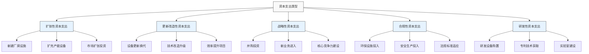
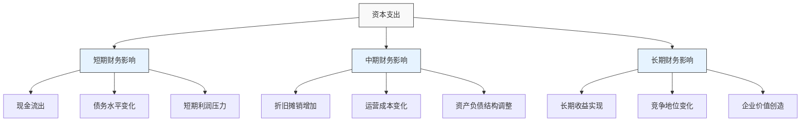
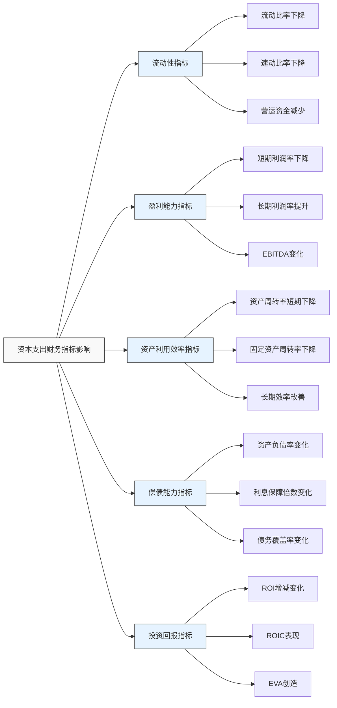

---
{"dg-publish":true,"tags":["财务BP","资本支出","财务影响","投资分析","资本管理"],"创建日期":"2024-05-11","permalink":"/知识共享/001_财务/01_财务BP/01_学习内容/02_预算编制基础/资本支出预算/资本支出的财务影响/","dgPassFrontmatter":true}
---

资本支出对企业财务状况产生深远而持久的影响，涉及短期和长期的财务状况、现金流、利润能力和风险水平。深入理解资本支出的财务影响，是进行科学预算决策和有效资源配置的关键。

## 基础知识

### 资本支出的定义与特征

资本支出(Capital Expenditure，简称CAPEX)是指企业购买、改良或扩展长期资产所支付的资金，这些资产预期将在多个会计期间内为企业创造价值。

资本支出的主要特征：
- **长期性**：影响期限通常超过一个会计年度
- **不可逆性**：一旦投入，难以撤回或调整
- **金额较大**：通常涉及大额资金投入
- **递延收益**：效益在未来多个期间实现
- **风险较高**：回报具有不确定性

### 资本支出与收益费用的区别

| 特征 | 资本支出 | 收益费用 |
|-----|---------|---------|
| 会计处理 | 资本化，计入资产负债表 | 费用化，计入当期损益 |
| 影响期间 | 多个会计期间 | 当前会计期间 |
| 价值创造 | 创造未来经济价值 | 维持当前经营活动 |
| 金额规模 | 通常金额较大 | 通常金额较小 |
| 决策层级 | 高层决策，需要严格审批 | 日常运营决策 |

### 资本支出的主要类型

## 理论框架

### 资本支出的财务影响模型

### 资本支出对主要财务报表的影响

#### 1. 对资产负债表的影响

- **资产方面**：
  - 短期：流动资产(现金)减少，非流动资产增加
  - 中期：非流动资产通过折旧逐渐减少
  - 长期：资产结构优化，可能带来总资产增长

- **负债与权益方面**：
  - 如果通过借款融资：负债增加，资产负债率上升
  - 如果通过权益融资：股东权益增加，资产负债率下降
  - 长期影响：通过盈利积累增加留存收益，改善资本结构

#### 2. 对利润表的影响

- **短期影响**：
  - 折旧摊销费用增加，降低利润
  - 可能增加利息费用(如债务融资)，进一步降低利润
  - 可能产生前期运营成本，进一步压缩利润

- **中长期影响**：
  - 收入增加(若为扩张性投资)
  - 成本效率改善(若为效率提升投资)
  - 新产品/服务利润贡献(若为创新投资)

#### 3. 对现金流量表的影响

- **投资活动现金流**：大额现金流出
- **筹资活动现金流**：可能增加(若通过融资支持资本支出)
- **经营活动现金流**：
  - 短期：可能因新增运营成本而减少
  - 中长期：增加(随收入增长和效率提升)

### 资本支出的财务指标影响框架

## 应用指南

### 资本支出财务影响分析步骤

#### 1. 前期分析准备

- **确定分析范围**：明确资本支出项目的类型和规模
- **收集基础数据**：历史财务数据、行业标准、竞争对手情况
- **确定分析周期**：根据项目预期寿命设定分析时间范围
- **建立基准情景**：明确"不进行资本支出"的基准情景财务预测

#### 2. 短期财务影响分析

- **现金流出分析**：
  - 制定资本支出时间表
  - 评估对短期现金持有量的影响
  - 确定是否需要外部融资

- **财务结构影响**：
  - 分析对流动比率、速动比率的即时影响
  - 评估对营运资金的压力
  - 分析资产负债结构变化

- **短期盈利影响**：
  - 计算新增折旧摊销对利润的影响
  - 估算新增融资成本(如适用)
  - 评估前期运营成本对利润的影响

#### 3. 中长期财务影响分析

- **收入增长分析**：
  - 预测资本支出带来的收入增长
  - 分析市场份额变化
  - 评估产品/服务组合变化的影响

- **成本结构分析**：
  - 分析固定成本与变动成本比例变化
  - 评估规模效益影响
  - 分析效率提升对单位成本的影响

- **资产效率分析**：
  - 预测固定资产周转率变化
  - 分析总资产周转率趋势
  - 评估资本支出对资产效率的长期影响

#### 4. 财务指标综合影响评估

| 指标类别 | 短期影响 | 中期影响 | 长期影响 | 评估重点 |
|---------|---------|---------|---------|---------|
| 流动性指标 | 通常下降 | 逐步恢复 | 可能增强 | 是否低于安全阈值 |
| 盈利能力指标 | 通常下降 | 开始改善 | 通常增强 | 转折点时间 |
| 资产利用效率 | 通常下降 | 逐步提升 | 通常提高 | 改善速度和幅度 |
| 偿债能力指标 | 可能恶化 | 逐步稳定 | 通常增强 | 是否突破债务契约 |
| 投资回报指标 | 通常下降 | 接近预期 | 高于预期 | 回报实现时间 |

#### 5. 敏感性和情景分析

- **关键变量敏感性分析**：
  - 资本支出成本变动
  - 项目完成时间变化
  - 收入实现时间和幅度变化
  - 运营成本变动

- **情景分析**：
  - 乐观情景：更快收益、更高效率
  - 基准情景：按预期进展
  - 悲观情景：延迟收益、超支成本

- **压力测试**：
  - 市场需求大幅下滑
  - 竞争激烈导致价格压力
  - 成本大幅上升

### 常用资本支出财务影响分析工具

1. **财务模型**：
   - 三表联动模型(资产负债表、利润表、现金流量表)
   - 情景分析模型
   - 敏感性分析工具

2. **财务指标分析**：
   - 投资回报指标(ROI、IRR、NPV、回收期)
   - 运营效率指标(资产周转率、营运资金周转)
   - 财务结构指标(资产负债率、利息保障倍数)

3. **现金流分析**：
   - 自由现金流分析
   - 现金流缺口分析
   - 融资需求预测

4. **价值创造分析**：
   - 经济增加值(EVA)分析
   - 股东价值增加分析
   - 市场价值增加分析

## 资本支出财务影响的行业差异

| 行业 | 资本支出特点 | 主要财务影响 | 关键指标 |
|-----|------------|------------|---------|
| 制造业 | 设备投资占比高、周期性强 | 折旧影响大，产能利用率关键 | 固定资产周转率、单位成本 |
| 科技业 | 研发投入高、更新快 | 无形资产摊销影响大，产品生命周期短 | ROI、产品开发周期 |
| 零售业 | 门店扩张、系统升级 | 租金成本高，库存周转关键 | 同店销售增长、平方米产出 |
| 能源业 | 资本密集、周期长 | 折旧影响大，回收期长 | 资产负债率、资本回报率 |
| 金融业 | IT系统、网点建设 | 无形资产占比高，规模效应明显 | 成本收入比、资本充足率 |

## 案例分析

### 案例一：制造企业设备更新对财务的影响

**背景**：
某汽车零部件制造企业计划投资2亿元更新自动化生产线，预计项目完成后可提高产能30%，降低单位生产成本15%。

**资本支出计划**：
- 总投资：2亿元
- 资金来源：80%银行贷款(年利率5%)，20%自有资金
- 实施期：18个月
- 预计使用寿命：10年
- 折旧方法：直线法，残值率5%

**财务影响分析**：

1. **短期影响(1-2年)**
   - 现金流出：第一年1.2亿，第二年0.8亿
   - 负债增加：1.6亿元长期借款
   - 利息费用：第一年400万元，第二年800万元
   - 折旧增加：从项目完成后每年1,900万元
   - 流动比率：从1.8下降至1.4
   - 资产负债率：从45%上升至58%

2. **中期影响(3-5年)**
   - 产能提升：销售收入年均增长20%
   - 毛利率：从23%提升至28%
   - 利息支出：逐年下降(随贷款偿还)
   - 经营现金流：年均增加5,000万元
   - 投资回收期：预计4.2年收回全部投资
   - ROA：第五年恢复并超过投资前水平

3. **长期影响(6-10年)**
   - 市场份额：从行业第五提升至第二
   - 累计现金流入：超过投资额的3倍
   - 资产结构：固定资产平均年龄下降
   - EVA：持续为正且逐年增加
   - 债务结构：长期负债比例下降至35%

**结论和启示**：
1. 该设备更新投资虽然短期内对流动性和盈利有压力，但中长期财务影响显著正面
2. 通过产能提升和成本降低，投资回报期合理
3. 关键监控指标：产能利用率、单位成本下降幅度、销售增长实现情况
4. 风险管理重点：实施期延误风险、市场需求不及预期风险

### 案例二：零售企业门店扩张的财务影响

**背景**：
某连锁超市计划在未来3年内开设100家新门店，平均每家投资500万元，包括装修、设备和初始库存。

**资本支出计划**：
- 总投资：5亿元(每年约1.7亿元)
- 资金来源：40%银行贷款，30%供应商融资，30%经营现金流
- 实施期：3年(每年约33家新店)
- 租约期限：平均10年
- 装修折旧期：5年

**财务影响分析**：

1. **短期影响(1-3年)**
   - 现金流压力：每年经营现金流出5,000万元用于扩张
   - 负债增加：3年间增加短期和长期负债3.5亿元
   - 新店前期亏损：每家店平均6个月达到盈亏平衡
   - 整体利润率：从4.5%下降至3.2%
   - 营运资金周转：从9天增加到15天
   - 利息保障倍数：从8倍下降至4倍

2. **中期影响(4-6年)**
   - 收入规模：从50亿元增长至120亿元
   - 市场覆盖：从8个城市扩展至25个城市
   - 毛利率：由于采购规模增加提升0.8个百分点
   - 费用率：由于规模效应下降1.5个百分点
   - 资产周转率：逐步从1.8提升至2.2
   - ROIC：从12%先降至9%，后回升至15%

3. **长期影响(7-10年)**
   - 品牌价值：市场估值提升80%
   - 供应链优势：独家产品比例从10%提升至30%
   - 区域市场份额：主要市场份额从15%提升至28%
   - 资产结构：轻资产模式，固定资产占总资产比重下降
   - 股东回报：股息支付能力大幅提升

**结论和启示**：
1. 门店扩张战略短期内对财务指标产生明显压力，但长期创造显著价值
2. 关键成功因素：新店选址质量、前期培育期管理、采购规模效应实现
3. 财务监控重点：单店投资回收周期、新店成熟度提升速度、整体负债水平
4. 风险防范：保持充足流动性缓冲，建立明确的扩张中止或调整触发条件

### 案例三：科技企业研发中心建设的财务影响

**背景**：
某软件企业计划投资1.5亿元建设研发中心，包括办公楼购置、研发设备和实验室设施等。

**资本支出计划**：
- 总投资：1.5亿元
- 资金来源：60%自有资金，40%股权融资
- 建设期：12个月
- 折旧年限：房产20年，设备及软件3-5年
- 预期效益：加速新产品开发，降低研发成本

**财务影响分析**：

1. **短期影响(1-2年)**
   - 现金储备：减少9,000万元
   - 资产结构：非流动资产占比从30%上升至55%
   - 折旧摊销：年增加1,200万元
   - 研发费用：短期内可能增加20%
   - 流动比率：从3.2下降至2.1
   - 新产品上市速度：尚未显著改善

2. **中期影响(3-5年)**
   - 研发效率：新产品开发周期缩短30%
   - 研发人员生产力：人均创收提高40%
   - 知识产权：专利申请数量年均增长50%
   - 产品毛利率：由于技术领先优势提高5个百分点
   - 固定成本占比：上升，导致盈亏平衡点上移
   - ROI：研发投入回报率从110%提升至180%

3. **长期影响(6-10年)**
   - 市场地位：从行业第四提升至行业领先
   - 人才吸引力：高端研发人才吸引能力大幅提升
   - 产品组合：高附加值产品占比从40%提升至70%
   - 盈利能力：净利率从15%提升至25%
   - 企业估值：市盈率从15倍提升至28倍

**结论和启示**：
1. 研发中心投资对科技企业长期竞争力影响深远，但短期内对财务指标构成压力
2. 关键价值体现在无形资产(知识产权、研发能力)增长，而非直接财务回报
3. 财务监控重点：研发效率指标、新产品上市节奏、研发人员效能
4. 风险管理：技术方向选择风险、研发成果转化不及预期风险

## 资本支出决策中的财务影响考量要点

### 全生命周期财务影响

资本支出的财务影响应当从资产全生命周期视角考量：

1. **投资期**：
   - 关注现金流出规模和节奏
   - 评估融资结构对财务指标的影响
   - 监控项目实施进度与预算

2. **运营期**：
   - 收入增长或成本节约实现情况
   - 运营效率改善程度
   - 资产利用率和维护成本控制

3. **处置期**：
   - 资产残值回收
   - 更新替代投资需求
   - 技术淘汰风险管理

### 财务风险与回报平衡

资本支出决策需要平衡财务风险与回报：

1. **风险评估维度**：
   - 流动性风险：现金流压力
   - 财务杠杆风险：债务水平提高
   - 投资回收风险：收益不及预期
   - 机会成本风险：资金占用影响其他机会

2. **回报评估维度**：
   - 直接财务回报：投资回报率、内部收益率等
   - 战略价值回报：市场地位、竞争优势
   - 运营效率回报：流程改善、自动化程度
   - 创新能力回报：新产品开发能力提升

### 与资本预算的整合

资本支出财务影响分析应与资本预算过程紧密整合：

1. **预算编制阶段**：
   - 评估各投资方案的财务影响差异
   - 根据财务承受能力确定总资本支出规模
   - 设定财务影响阈值筛选项目

2. **项目实施阶段**：
   - 监控实际财务影响与预期的偏差
   - 建立预警机制及时识别财务风险
   - 根据实际情况调整后续资本支出计划

3. **后评估阶段**：
   - 对比实际财务影响与预测差异
   - 总结经验教训改进未来预测准确性
   - 优化资本支出决策流程和标准

## 延伸内容

### 与其他财务BP概念的联系

1. **与资本预算的关系**
   - 资本预算确定支出规模和项目选择
   - 资本支出财务影响分析为资本预算提供决策依据
   - 两者共同构成资本决策的完整流程

2. **与融资策略的联系**
   - 资本支出的规模影响融资需求
   - 融资结构影响资本支出的财务影响
   - 资本支出回报与融资成本的平衡关系

3. **与财务预测的关系**
   - 资本支出财务影响是财务预测的重要输入
   - 准确的财务预测有助于评估资本支出的真实影响
   - 历史资本支出影响分析可提高财务预测准确性

4. **与风险管理的关联**
   - 资本支出财务影响分析是风险识别的重要工具
   - 敏感性分析和情景规划帮助管理资本支出风险
   - 设定财务指标预警阈值进行风险控制

### 新兴趋势

1. **数字化转型对资本支出特征的改变**
   - 软件和服务支出比例上升，传统设备支出比例下降
   - 资本支出周期缩短，资产使用寿命减少
   - "即服务"模式减少前期资本支出，转为运营费用

2. **环境、社会和治理(ESG)因素的影响**
   - 环保投资的长期财务影响评估挑战
   - 社会责任投资的无形回报计量
   - 碳排放限制对资本支出决策的影响

3. **后疫情时代的资本支出变化**
   - 供应链韧性投资增加，回报评估模式变化
   - 远程办公和数字化基础设施投资增长
   - 不确定性增加导致资本支出决策更为谨慎

## 学习资源

### 思考问题

1. 为什么资本支出对企业短期和长期财务状况的影响方向可能相反？如何在决策中平衡这种矛盾？
2. 不同类型的资本支出(扩张性、更新改造性、战略性等)对财务报表的影响有何差异？
3. 在评估资本支出的财务影响时，为什么要关注全生命周期成本而非仅关注初始投资？
4. 资本支出如何影响企业的资本结构和融资能力？过度资本支出可能带来哪些财务风险？
5. 企业应当如何确定合理的资本支出规模？哪些财务指标可以作为判断依据？
6. 在高通胀环境下，资本支出决策和财务影响评估应当有哪些特殊考量？
7. 数字化转型背景下，传统的资本支出财务影响评估模型是否仍然适用？需要哪些调整？
8. 如何评估不确定性对资本支出财务影响的影响？情景分析和敏感性分析在这一过程中的作用是什么？
9. 对于成长型企业和成熟型企业，资本支出对财务影响的关注重点有何不同？
10. 资本支出产生的财务影响如何影响企业的战略决策和市场估值？

### 自测题

1. 资本支出对企业流动比率的短期影响通常是：
   A. 提高  B. 降低  C. 不变  D. 不确定，取决于融资方式

2. 在资本支出初期，以下哪个指标最可能改善？
   A. 资产周转率  B. 净利润率  C. EBITDA率  D. 流动比率

3. 对于制造业企业大规模设备更新，以下哪个财务指标在评估中最为关键？
   A. 资产负债率  B. 单位产品成本  C. 应收账款周转率  D. 毛利率

4. 资本支出通常在企业财务报表中体现为：
   A. 经营活动现金流出  B. 投资活动现金流出  C. 筹资活动现金流出  D. 不在现金流量表中体现

5. 在资本支出评估中，"J曲线效应"指的是：
   A. 投资初期财务指标恶化，长期改善的现象  B. 投资回报的非线性增长  C. 折旧费用变动趋势  D. 现金流波动模式

### 实践练习

**练习1: 资本支出的财务影响分析**

某制造企业计划投资3,000万元购置新设备，预计使用年限为8年，残值500万元，采用直线法折旧。新设备投产后，预计年销售收入增加2,000万元，年运营成本(不含折旧)增加1,200万元。企业所得税税率为25%，加权平均资本成本(WACC)为12%。

要求：
1. 计算该项目对企业利润表的年度影响
2. 分析短期(1-2年)和长期(3-8年)对ROA的影响
3. 计算该项目的IRR和NPV，并评价其财务可行性
4. 讨论该项目对企业资产负债表和现金流量表的主要影响
5. 如果项目延迟半年完成，且成本超支15%，对财务指标有何影响？

**练习2: 资本支出的情景分析与决策**

某科技公司正考虑两个资本支出项目，预算有限只能选择其中一个：
- 项目A：研发中心扩建，投资2,000万元，预期提高研发效率，缩短产品开发周期
- 项目B：生产线自动化升级，投资1,800万元，预期降低生产成本，提高产能

两个项目都有乐观、基准和悲观三种情景的财务预测数据。

要求：
1. 设计一个综合评价框架，考虑多维度财务影响
2. 在不同情景下分析两个项目对公司关键财务指标的影响
3. 比较两个项目的风险和回报特征
4. 提出最终选择建议并说明理由
5. 对所选项目提出财务风险管理措施

## 参考文献

1. Brigham, E. F., & Houston, J. F. (2019). *Fundamentals of Financial Management*. Cengage Learning.
2. Damodaran, A. (2012). *Investment Valuation: Tools and Techniques for Determining the Value of Any Asset*. Wiley Finance.
3. Hawawini, G., & Viallet, C. (2019). *Finance for Executives: A Practical Guide for Managers*. Cengage Learning.
4. Vernimmen, P., Quiry, P., Dallocchio, M., Le Fur, Y., & Salvi, A. (2018). *Corporate Finance: Theory and Practice*. Wiley.
5. Higgins, R. C. (2015). *Analysis for Financial Management*. McGraw-Hill Education.
6. Peterson Drake, P., & Fabozzi, F. J. (2012). *Capital Budgeting: Theory and Practice*. Wiley.
7. 张先治. (2018). 《投资项目财务评价》. 中国人民大学出版社.
8. 刘玉珍. (2016). 《资本预算与投资决策》. 清华大学出版社.
9. 王化成. (2017). 《资本支出与企业价值创造》. 中国财政经济出版社. 