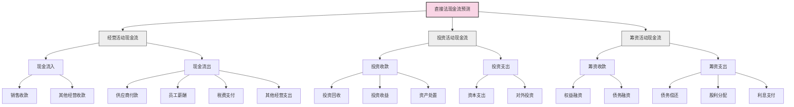

---
{"dg-publish":true,"tags":["财务BP","现金流预测","直接法","预测方法","财务规划"],"创建日期":"2024-04-26","permalink":"/知识共享/001_财务/01_财务BP/01_学习内容/03_财务预测与模型/现金流预测/直接法现金流预测/","dgPassFrontmatter":true}
---

## 基础知识

### 定义与概念

直接法现金流预测是一种现金流量预测技术，通过直接预测企业未来实际收到和支付的现金流入和流出来估计现金流量状况。与间接法不同，直接法不依赖于对净利润进行调整，而是直接模拟企业的收付款行为，因而能够更直观地反映企业的实际现金流动情况。

根据国际财务报告准则(IFRS)和美国公认会计原则(GAAP)的定义，直接法现金流量表按主要类别列示现金收入和现金支出的总额。中国《企业会计准则第31号——现金流量表》同样支持使用直接法编制现金流量表，并鼓励企业采用此方法。

### 历史背景与演变

直接法现金流预测的发展与现金流量表的演变密切相关：

- **1970年代初期**：美国会计准则委员会(FASB)开始研究资金流量报表改革
- **1987年**：FASB发布第95号财务会计准则公告(SFAS 95)，首次正式提出直接法和间接法
- **1990年代**：随着企业破产风险管理的重视，直接法现金流预测开始在企业财务规划中得到应用
- **2000年后**：随着企业信息系统的发展，直接法预测的数据支持更加完善
- **2008年金融危机后**：现金流管理重要性提升，直接法现金流预测技术获得进一步发展

### 核心构成要素

直接法现金流预测的核心要素包括：

1. **经营活动现金流预测**
   - 销售商品、提供劳务收到的现金
   - 收到的税费返还
   - 收到的其他与经营活动有关的现金
   - 购买商品、接受劳务支付的现金
   - 支付给职工以及为职工支付的现金
   - 支付的各项税费
   - 支付的其他与经营活动有关的现金

2. **投资活动现金流预测**
   - 收回投资所收到的现金
   - 取得投资收益所收到的现金
   - 处置固定资产、无形资产和其他长期资产所收回的现金净额
   - 购建固定资产、无形资产和其他长期资产所支付的现金
   - 投资所支付的现金

3. **筹资活动现金流预测**
   - 吸收投资所收到的现金
   - 取得借款所收到的现金
   - 偿还债务所支付的现金
   - 分配股利、利润或偿付利息所支付的现金

## 理论框架

### 直接法现金流预测的基本框架

### 直接法与间接法的比较框架

直接法和间接法是现金流预测的两种主要方法，下面是它们在理论框架上的主要区别：

| 特征 | 直接法 | 间接法 |
|------|--------|--------|
| 出发点 | 实际现金收支 | 净利润调整 |
| 数据来源 | 原始现金交易记录 | 资产负债表和利润表 |
| 信息透明度 | 高（直观显示现金流动） | 低（调整项目复杂） |
| 预测难度 | 中等（需要详细预测各项收支） | 相对简单（基于利润预测） |
| 实施复杂性 | 较高（需要更多明细数据） | 较低（利用已有会计信息） |
| 与预算联系 | 紧密（直接对应预算科目） | 间接（需要转换） |
| 管理决策价值 | 较高（直观反映现金管理） | 中等（关注盈利与现金的差异） |

### 理论支撑

直接法现金流预测的理论基础主要包括：

1. **现金流管理理论**：关注企业的现金流量时间、金额和确定性
2. **流动性风险管理理论**：强调现金流预测对识别和管理企业流动性风险的重要性
3. **企业持续经营假设**：企业必须保持充足的现金流以维持正常运营
4. **现金转换周期理论**：分析企业从支付供应商到收回客户款项的整个周期
5. **经济价值理论**：企业价值取决于未来产生现金流的能力

## 应用指南

### 直接法现金流预测的步骤

#### 1. 准备阶段

- **确定预测期间**：根据企业需求确定短期（月度/季度）或中长期（年度）预测
- **收集历史数据**：收集过去12-36个月的现金收支数据
- **分析收支模式**：识别主要现金流入和流出项目的季节性和周期性特征
- **审查业务计划**：了解未来业务发展计划，包括销售策略、采购计划等

#### 2. 预测经营活动现金流

- **销售收款预测**：
  - 分析销售预测和收款条款
  - 考虑客户付款习惯和账龄情况
  - 预测每月实际收款金额

- **支出预测**：
  - 预测采购支出（基于销售计划和库存策略）
  - 预测工资及相关费用（考虑人员变动计划）
  - 预测税费支出（考虑税率变化和缴纳时间）
  - 预测其他经营性支出（租金、水电、办公等）

#### 3. 预测投资活动现金流

- **资本支出预测**：
  - 审查固定资产投资计划
  - 评估技术升级和维护支出
  - 预测分期付款时点和金额

- **投资收益预测**：
  - 分析现有投资的预期回报
  - 预测资产处置计划和收益

#### 4. 预测筹资活动现金流

- **债务预测**：
  - 现有借款的利息和本金支付计划
  - 新增借款的需求和可能的借款时间
  
- **权益预测**：
  - 股利分配计划
  - 可能的增资或股权回购计划

#### 5. 整合与校验

- **汇总各类现金流**：
  - 计算期初现金余额
  - 加总经营、投资和筹资活动现金流
  - 得出预测期末现金余额

- **合理性检查**：
  - 与历史数据对比分析
  - 检查现金结余是否满足最低流动性要求
  - 与间接法预测结果比对（如有）

- **敏感性分析**：
  - 测试关键假设变动对现金流的影响
  - 识别关键风险因素

### 适用场景与局限性

**适用场景**：
- 短期现金流管理（1-3个月）
- 流动性危机预警
- 季节性业务的现金需求规划
- 新项目或业务线的现金流影响评估
- 融资需求的精确预测

**局限性**：
- 需要详细的收支数据，增加预测工作量
- 对历史数据质量和数据收集系统要求高
- 长期预测的准确性随时间推移而降低
- 难以准确预测非常规或突发性现金流事件
- 较难进行与同行业的标准化比较

### 数据收集与分析方法

#### 数据收集

1. **内部数据**：
   - 销售订单和合同（包含付款条件）
   - 采购订单和合同（包含付款条件）
   - 历史收付款记录和模式
   - 员工数量和薪酬计划
   - 固定资产购置和更新计划
   - 债务偿还计划

2. **外部数据**：
   - 行业付款周期标准
   - 主要客户的财务状况
   - 市场利率和融资环境变化
   - 宏观经济指标

#### 分析方法

1. **趋势分析**：分析历史现金流的变化趋势和增长率
2. **季节性分析**：识别月度/季度现金流的季节性模式
3. **客户/供应商分析**：按重要性分类，评估其对现金流的影响
4. **周转天数分析**：分析应收账款周转天数和应付账款周转天数
5. **比率分析**：计算现金流相关比率，如经营现金流/销售额等

## 案例分析

### 案例一：制造业企业季节性生产的现金流预测

**背景**：某家电制造企业，产品销售具有明显的季节性特征，每年第四季度销售占全年的40%，但生产需要提前3-4个月备货。

**挑战**：如何确保旺季前的生产备货期有足够的现金流支持。

**应用直接法预测过程**：

1. **销售收款预测**：
   - 分析不同季度的销售预测
   - 考虑客户付款条件（主要是30天和60天账期）
   - 预测每月的实际收款
   
2. **生产支出预测**：
   - 根据生产计划预测原材料采购支出
   - 考虑生产旺季临时工人增加的人力成本
   - 预测能源等制造费用支出

3. **其他经营支出预测**：
   - 预测销售费用（广告、促销等）
   - 预测管理费用（较为稳定）

4. **融资安排**：
   - 预测生产期和销售期的现金缺口
   - 规划短期融资方案

**实施效果**：

- 成功预测到第二、三季度生产备货期的1,200万元现金缺口
- 提前三个月安排了800万元的银行贷款和400万元的供应商延期付款
- 避免了生产计划中断，顺利完成旺季销售

**关键经验**：
- 销售收款模式的季节性分析是关键
- 提前4-6个月开始预测对季节性业务至关重要
- 与供应商建立灵活的付款条件能够降低融资成本

### 案例二：科技服务公司的项目制现金流预测

**背景**：一家软件服务公司，业务主要是为客户开发定制软件，采用项目制管理，项目周期3-12个月不等，付款通常与项目里程碑挂钩。

**挑战**：如何在多个项目并行开展的情况下准确预测公司现金流。

**应用直接法预测过程**：

1. **项目收款预测**：
   - 分项目列出所有里程碑和对应的收款时间点
   - 考虑客户验收和付款审批的平均延迟时间
   - 按风险等级给收款时间设置不同的缓冲期

2. **人力资源支出预测**：
   - 基于项目人力资源分配计划预测工资支出
   - 考虑项目奖金和提成的支付时间
   
3. **项目直接成本预测**：
   - 预测项目所需的第三方服务采购
   - 预测差旅和客户现场支持成本

4. **办公及其他固定支出预测**：
   - 预测租金、设备更新、软件许可等固定支出

**实施效果**：
- 建立了基于项目的现金流预测模型
- 准确率提高了约30%（相比以前的粗略估计）
- 发现某大客户项目可能导致的阶段性现金短缺，提前与客户协商调整了付款条件
- 优化了新项目的付款条件设计，提高了前期收款比例

**关键经验**：
- 项目风险分类是准确预测的基础
- 建立项目里程碑与财务收款的明确对应关系
- 定期（每周）更新项目进度对现金流预测至关重要

### 案例三：零售连锁企业的直接法现金流预测

**背景**：某连锁超市企业，拥有50家门店，销售收入以现金和信用卡为主，对供应商付款条件为30-90天。

**挑战**：如何准确预测各门店的现金流，并做好集团层面的现金池管理。

**应用直接法预测过程**：

1. **销售收款预测**：
   - 分门店预测日均销售收入
   - 分析不同支付方式的占比及结算周期
   - 预测每日/每周的实际现金流入

2. **采购支出预测**：
   - 基于销售预测和库存水平规划采购计划
   - 按供应商付款条件分类，预测每周的付款金额
   - 考虑季节性商品采购的特殊付款安排

3. **门店运营支出预测**：
   - 预测人工成本（基本工资和销售提成）
   - 预测租金和物业费用（考虑合同约定的支付时间）
   - 预测水电等能源费用（考虑季节性因素）

4. **总部管理支出预测**：
   - 预测管理人员薪酬
   - 预测市场推广费用（节假日促销活动）
   - 预测IT和其他基础设施维护费用

**实施效果**：
- 建立了日级和周级的现金流预测模型
- 实现了门店和总部的现金池协同管理
- 降低了集团整体现金持有量15%，提高了资金使用效率
- 为季节性大型促销活动提供了精准的资金支持

**关键经验**：
- 不同门店的销售模式和客户支付习惯差异较大，需要分别分析
- 供应商付款时间的灵活调整是管理短期流动性的重要手段
- 建立标准化的数据收集流程对多门店企业尤为重要

## 延伸内容

### 与其他财务BP概念的联系

#### 直接法现金流预测与预算编制的关系

直接法现金流预测与预算编制密切相关，但存在明显区别：

- **预算编制**关注的是计划期内的收入、成本和利润，通常采用权责发生制
- **直接法现金流预测**关注的是实际现金收支的时间和金额，采用收付实现制
- 两者的时间匹配关系：预算中的销售可能在当期确认收入，但现金流预测中可能需要考虑30-90天的收款延迟
- 集成应用：优秀的财务BP会将预算编制与现金流预测集成，确保业务计划有充足的现金流支持

#### 与间接法现金流预测的互补应用

直接法和间接法现金流预测可以互补使用：

- 间接法可以帮助解释净利润与经营活动现金流的差异
- 直接法可以提供更详细的实际现金流动情况
- 实践中，可以使用间接法进行长期现金流趋势预测，使用直接法进行短期精确预测
- 两种方法的对比分析可以帮助识别潜在的财务管理问题

#### 与资本支出预算的协同

资本支出预算与直接法现金流预测的协同：

- 资本支出预算确定长期资产投资计划
- 直接法现金流预测将资本支出分解为具体的现金支付时点
- 资本支出通常在投资活动现金流中反映
- 两者结合可以评估大型投资项目对企业整体流动性的影响

### 不同环境下的应用变体

#### 高增长企业的应用调整

对于处于高速增长阶段的企业，直接法现金流预测需要特别关注：

- 销售增长与收款周期延长的平衡关系
- 新客户付款习惯的不确定性
- 扩张带来的前期支出与滞后收益的时间差
- 预测中纳入更多的缓冲余量
- 更频繁的预测更新（如每周更新）

#### 跨国企业的应用变体

对于跨国经营的企业，直接法现金流预测需要考虑：

- 不同国家/地区的客户付款习惯差异
- 汇率波动对现金流的影响
- 跨境资金调拨的时间和成本
- 不同国家的税收制度和支付时点
- 国际贸易条款对现金流的影响

#### 季节性业务的特殊处理

季节性强的行业（如玩具、服装、节日产品等）的直接法现金流预测需要：

- 按旺季和淡季分别建立预测模型
- 特别关注生产期与销售期之间的现金缺口
- 建立多层次的敏感性分析（考虑销售旺季延迟或提前的影响）
- 制定季节性融资策略，如季节性信贷额度

### 新兴趋势与发展方向

#### 数字化工具与直接法现金流预测

现代技术对直接法现金流预测的影响：

- ERP系统集成现金流预测模块，实现数据自动采集
- 大数据分析提高客户付款行为预测准确性
- 人工智能算法辅助识别现金流模式和异常
- 区块链技术潜在应用于供应链融资和付款确认
- 可视化工具提升现金流分析效率和决策支持

#### 动态现金流预测模型

传统静态预测模型向动态模型发展：

- 从固定周期预测转向滚动预测
- 自动整合市场数据调整预测假设
- 情景分析与蒙特卡洛模拟的应用
- 基于机器学习的预测模型持续优化
- 实时预警系统对异常现金流波动的监控

#### ESG因素的融入

环境、社会和治理(ESG)因素对现金流预测的影响：

- 环保投资和碳中和目标对现金流的长期影响
- 可持续发展相关税收和补贴对现金流的影响
- 社会责任项目的现金流出模式
- ESG绩效对融资成本和现金流的潜在影响
- 气候风险对供应链和现金流的长期影响

## 学习资源

### 思考问题

1. 直接法现金流预测与间接法相比，在哪些场景下更有优势？哪些场景下可能不适用？
2. 一家企业的净利润持续增长，但经营活动现金流却持续为负，通过直接法现金流预测，可能发现哪些原因？
3. 如何判断企业的现金流预测周期（日、周、月、季度）应该如何设定？影响这一决策的关键因素有哪些？
4. 在直接法现金流预测中，如何处理客户延迟付款或提前付款的不确定性？
5. 直接法现金流预测如何帮助企业发现潜在的流动性危机？有哪些预警指标可以纳入预测模型？
6. 直接法现金流预测与预算编制流程如何有效整合？两者的时间安排应如何协调？
7. 在企业并购情境下，如何运用直接法现金流预测评估并购后的现金流整合效果？
8. 如果企业同时使用直接法和间接法进行现金流预测，两种方法结果存在较大差异时应如何分析原因？
9. 季节性业务的现金流预测中，如何平衡旺季与淡季的现金需求？有哪些具体策略？
10. 在经济下行周期，直接法现金流预测模型需要如何调整以提高准确性？

### 自我测评问题

1. 直接法现金流预测的主要内容包括哪三大类活动？每类活动的主要组成部分是什么？
2. 企业采用直接法进行现金流预测的主要优势和局限性各有哪些？
3. 在直接法现金流预测中，销售收款预测应考虑哪些主要因素？
4. 简述预测供应商付款时应考虑的关键变量和数据来源。
5. 如何计算并使用现金转换周期来优化直接法现金流预测？
6. 什么是现金流敏感性分析？在直接法现金流预测中如何应用？
7. 如何评估直接法现金流预测模型的准确性？有哪些评估指标？
8. 一家公司销售额大幅增长但现金流紧张，通过直接法现金流分析可能会发现哪些问题？
9. 在项目制企业中，如何基于项目里程碑建立直接法现金流预测模型？
10. 直接法现金流预测与财务预警系统如何结合？需要监控哪些关键指标？

### 实践练习

#### 练习一：零售企业现金流预测

假设您是一家中型零售企业的财务经理，负责建立直接法现金流预测模型。该企业拥有10家门店，销售主要为现金和信用卡支付，供应商付款期为45天。请完成以下任务：

1. 设计一个周度现金流预测模板，包括所有主要现金流入和流出项目
2. 列出收集预测所需数据的来源和收集方法
3. A门店9月销售预计增长20%，但新客户的信用卡支付比例预计从40%上升到60%，分析对现金流的影响
4. 设计一个简单的现金流预警机制，包括关键监控指标和预警阈值

#### 练习二：制造业季节性现金流分析

您是一家制造季节性产品的企业财务BP专员，该企业第四季度销售占全年的50%，但生产主要在第二、三季度完成。请完成以下练习：

1. 构建一个季度直接法现金流预测模型框架，特别关注生产期与销售期的现金流差异
2. 分析企业可能采取的策略来解决季节性现金流不平衡问题
3. 如果核心原材料供应商要求将付款条件从60天缩短至30天，分析对预测模型的影响
4. 设计3-5个情景分析，评估不同外部环境下的现金流状况

### 推荐学习资源

#### 书籍与学术文献
1. 《现金流量表分析与应用》，朱荣恩著，中国财政经济出版社
2. 《企业现金流管理实务》，张志铭著，机械工业出版社
3. 《Cash Flow Forecasting》，Andrew Hiles，Wiley Finance
4. "Cash is King: How to Forecast and Manage Cash Flow Effectively"，Journal of Accountancy

#### 在线资源
1. 中国会计准则委员会网站：现金流量表准则解读
2. 财务经理协会(FMA)：现金流预测专题
3. CFO.com：现金流管理最佳实践资源库
4. LinkedIn Learning：企业现金流预测课程

#### 软件工具
1. Excel现金流预测模板资源
2. 财务规划专业软件：Anaplan, Adaptive Insights, Prophix
3. SAP Business Planning and Consolidation：现金流预测模块
4. Oracle Hyperion Financial Management：现金流分析工具 