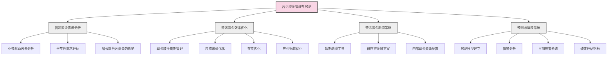

---
{"dg-publish":true,"tags":["财务BP","现金流预测","营运资金","流动性管理","财务规划"],"创建日期":"2024-04-26","permalink":"/知识共享/001_财务/01_财务BP/01_学习内容/03_财务预测与模型/现金流预测/营运资金管理与预测/","dgPassFrontmatter":true}
---


## 基础知识

### 定义与概念

营运资金（Working Capital）是指企业日常经营活动中流动资产与流动负债的差额，是评估企业短期偿债能力和经营效率的重要指标。营运资金管理与预测是财务BP（Business Planning）中的关键环节，直接影响企业的现金流状况、营运效率和财务弹性。

净营运资金（Net Working Capital）通常计算为：
```
净营运资金 = 流动资产 - 流动负债
```

更精确的计算公式是：
```
净营运资金 = 应收账款 + 存货 + 预付款项 - 应付账款 - 预收款项
```

营运资金管理与预测的核心目标是确保企业拥有足够的营运资金支持业务运营，同时避免过多资金滞留在营运资金中导致资金使用效率低下。这一平衡对企业现金流健康至关重要，特别是在业务快速增长或经济环境不确定的情况下。

### 历史背景与演变

营运资金管理理念的演变经历了几个重要阶段：

- **1950-1960年代**：传统的营运资金管理主要关注企业的流动比率（流动资产/流动负债）和速动比率（速动资产/流动负债），以评估短期偿债能力。

- **1970-1980年代**：随着财务理论的发展，学者们开始研究现金转换周期（Cash Conversion Cycle, CCC）的概念，将营运资金管理与企业价值创造联系起来。

- **1990年代**：供应链理念兴起，企业开始将营运资金管理视为跨部门协作的综合管理活动，而非仅限于财务部门的职责。

- **2000年代初**：企业资源规划（ERP）系统的普及使得营运资金的实时监控和精细化管理成为可能。

- **2008年金融危机后**：营运资金管理的战略重要性得到普遍认可，成为企业现金流管理和风险防范的核心组成部分。

- **2010年至今**：大数据分析、人工智能等技术在营运资金预测中的应用，使预测更加精准；同时，供应链金融的发展为营运资金优化提供了新的工具和方法。

- **2020年疫情后**：全球供应链中断和市场波动突显了营运资金弹性管理的重要性，企业更加注重情景规划和压力测试。

### 核心构成要素

营运资金管理与预测的核心构成要素包括：

1. **应收账款管理**
   - 客户信用政策制定
   - 账龄分析与监控
   - 收款流程优化
   - 应收账款周转天数预测

2. **存货管理**
   - 库存水平优化
   - 采购策略与生产计划协调
   - 存货周转率监控
   - 库存需求预测与规划

3. **应付账款管理**
   - 供应商付款条件谈判
   - 付款时间优化
   - 供应商关系管理
   - 应付账款周转天数预测

4. **预付与预收款管理**
   - 预付款比例控制
   - 预收款策略制定
   - 季节性变动管理

5. **现金转换周期分析**
   - 周期长度监控
   - 影响因素分析
   - 行业对标分析
   - 改善措施规划

6. **营运资金融资**
   - 短期融资工具选择
   - 供应链金融方案
   - 融资成本管理
   - 融资需求预测

7. **预测与规划系统**
   - 营运资金需求预测模型
   - 情景分析与敏感性测试
   - 季节性波动管理
   - 与整体财务规划的集成

## 理论框架

### 营运资金管理与预测的基本框架



### 现金转换周期模型

现金转换周期（Cash Conversion Cycle, CCC）是营运资金管理的核心理论框架，它衡量了企业从购买原材料、生产销售产品到最终收回销售款项的整个过程所需的时间。


现金转换周期计算公式：
```
CCC = 应收账款周转天数 + 存货周转天数 - 应付账款周转天数
```

其中：
- 应收账款周转天数 = 365 / 应收账款周转率 = 365 × 平均应收账款 / 销售收入
- 存货周转天数 = 365 / 存货周转率 = 365 × 平均存货 / 销售成本
- 应付账款周转天数 = 365 / 应付账款周转率 = 365 × 平均应付账款 / 销售成本

CCC越短，表示企业营运资金效率越高，资金占用越少。

### 营运资金与增长关系模型

营运资金需求与企业增长之间存在紧密关系，可以通过以下模型表达：

| 增长类型 | 营运资金需求变化 | 关键管理重点 |
|---------|----------------|------------|
| 有机增长 | 随销售收入线性增长 | 保持营运资金占比稳定 |
| 高速增长 | 可能超线性增长 | 控制应收账款和存货增速 |
| 业务转型 | 模式变化导致占比变化 | 重新评估各组成部分需求 |
| 季节性增长 | 周期性波动显著 | 季节性资金规划与平衡 |
| 收购增长 | 一次性大幅增加 | 并购后营运资金整合 |

营运资金需求预测公式：
```
增量营运资金需求 = 增量销售收入 × 营运资金销售比率
```

其中，营运资金销售比率是净营运资金与销售收入之比，反映了企业每单位销售需要多少营运资金支持。

### 理论支撑

营运资金管理与预测的理论基础主要包括：

1. **权衡理论（Trade-off Theory）**
   - 在营运资金管理中体现为流动性与盈利能力的权衡
   - 过多营运资金提高流动性但降低资本回报率
   - 过少营运资金提高效率但增加流动性风险

2. **交易成本理论（Transaction Cost Theory）**
   - 解释为何企业持有一定水平的营运资金
   - 降低融资交易频率和相关成本
   - 为意外情况和商业机会提供缓冲

3. **代理理论（Agency Theory）**
   - 供应链中不同主体之间的利益冲突
   - 信用条件和付款期限的博弈行为
   - 通过契约和激励机制优化营运资金

4. **价值链理论（Value Chain Theory）**
   - 营运资金管理贯穿企业价值链
   - 跨职能协作对营运资金效率的影响
   - 供应链整体优化而非局部最优

5. **系统动力学（System Dynamics）**
   - 营运资金各组成部分的相互关系
   - 时滞效应对现金流的影响
   - 反馈循环对营运资金稳定性的作用

## 应用指南

### 营运资金管理与预测的步骤

#### 1. 需求分析与规划

- **业务特性分析**
  - 评估行业特点和业务模式对营运资金的影响
  - 分析产品生命周期和销售渠道结构
  - 确定关键业务驱动因素

- **历史数据分析**
  - 收集2-3年历史财务数据
  - 计算关键比率和周转天数的历史趋势
  - 识别季节性模式和异常值

- **增长影响评估**
  - 分析销售增长对营运资金各组成部分的影响
  - 评估新产品、新市场对营运资金结构的影响
  - 预测业务模式变化对营运资金需求的影响

- **行业对标分析**
  - 比较同行业企业的营运资金指标
  - 识别差距和改进机会
  - 设定合理的优化目标

#### 2. 应收账款管理与预测

- **客户信用政策制定**
  - 建立客户信用评级体系
  - 根据客户风险特征设计差异化信用条件
  - 制定清晰的逾期处理流程

- **收款预测模型建立**
  - 基于历史收款模式建立预测模型
  - 考虑客户类型、季节性和经济环境因素
  - 预测不同账龄段的应收账款分布

- **改善措施实施**
  - 优化发票流程，确保及时准确
  - 建立积极的客户沟通机制
  - 考虑早付折扣等激励措施
  - 评估应收账款保理等金融工具

- **监控与调整**
  - 设置关键绩效指标(KPIs)监控收款效率
  - 定期账龄分析和异常预警
  - 根据实际情况调整预测模型和收款策略

#### 3. 存货管理与预测

- **存货分类与策略制定**
  - 采用ABC分析法对存货分类管理
  - 制定不同类别存货的库存策略
  - 确定安全库存水平

- **需求预测与库存规划**
  - 建立销售预测与库存规划的联动机制
  - 考虑生产周期、供应商交货时间等因素
  - 开发季节性库存计划

- **库存优化措施**
  - 改进采购流程和批量策略
  - 实施准时制(JIT)或精益生产
  - 评估供应商管理库存(VMI)的可行性
  - 定期清理呆滞和过时库存

- **存货预测模型**
  - 建立基于销售预测的存货需求模型
  - 考虑产品组合变化对库存结构的影响
  - 模拟不同供应链策略对存货水平的影响

#### 4. 应付账款管理与预测

- **供应商付款策略制定**
  - 分析供应商结构和重要性
  - 评估延长付款期的成本和收益
  - 与关键供应商谈判最优付款条件

- **现金流协调**
  - 将付款计划与现金流预测相协调
  - 开发灵活的付款优先级规则
  - 平衡提前付款折扣与资金成本

- **应付账款预测**
  - 基于采购计划预测应付账款水平
  - 考虑季节性采购和价格波动因素
  - 模拟不同付款政策对现金流的影响

- **供应链金融方案**
  - 评估供应商融资计划的可行性
  - 考虑反向保理等金融工具
  - 分析供应链金融对资产负债表的影响

#### 5. 营运资金预测模型构建

- **关键假设设定**
  - 确定销售增长率
  - 设定周转天数目标或预期变化
  - 考虑价格、成本、汇率等变动因素

- **预测方法选择**
  - 基于历史比率的简单预测
  - 基于业务驱动因素的详细预测
  - 基于统计模型的高级预测

- **模型构建**
  - 建立各组成部分的预测模块
  - 将预测结果集成到现金流预测模型
  - 确保与财务预测的其他部分协调一致

- **情景分析与敏感性测试**
  - 设计基准、乐观和悲观情景
  - 测试关键变量变动对营运资金的影响
  - 确定营运资金需求的可能范围

#### 6. 融资策略与优化

- **融资需求确定**
  - 基于预测模型计算营运资金缺口
  - 评估季节性需求和长期增长需求
  - 确定永久性和临时性融资需求

- **融资方案设计**
  - 评估短期信贷工具（银行透支、票据融资等）
  - 考虑中长期融资选项（循环贷款、债券等）
  - 分析内部现金资源调配可能性

- **成本效益分析**
  - 比较不同融资方案的成本
  - 评估操作复杂性和资源需求
  - 分析对财务报表和关键指标的影响

- **应急计划制定**
  - 制定应对预期外现金需求的策略
  - 建立融资渠道备用选项
  - 设计营运资金压力测试方案

#### 7. 监控与持续改进

- **关键指标设定**
  - 设立营运资金占销售比例目标
  - 监控现金转换周期和各组成部分
  - 建立行业对标指标

- **报告机制建立**
  - 设计管理层营运资金报告
  - 建立跨部门沟通渠道
  - 制定预警指标和升级流程

- **绩效评估机制**
  - 将营运资金指标纳入绩效考核
  - 设计针对不同部门的激励措施
  - 建立责任划分和协作机制

- **持续优化流程**
  - 定期回顾预测准确性
  - 更新假设和预测模型
  - 根据业务变化调整管理策略

### 适用场景与局限性

**适用场景**：
- 季节性波动明显的企业（如零售、农业）
- 高增长企业面临营运资金压力
- 供应链复杂或国际化程度高的企业
- 行业竞争激烈需优化资金效率的企业
- 经济下行期需加强现金流管理的企业
- 业务转型期营运资金结构发生变化的企业

**局限性**：
- 新创企业缺乏历史数据支持预测
- 高度不确定的外部环境降低预测准确性
- 跨行业多元化企业难以采用统一标准
- 与供应商/客户谈判力量不对等时优化空间有限
- 财务系统不完善时数据质量可能影响预测
- 缺乏跨部门协作会降低管理效果

### 数据收集与分析方法

#### 关键数据收集

1. **内部财务数据**
   - 历史销售数据（季度/月度）
   - 应收账款明细和账龄分析
   - 存货分类和周转数据
   - 应付账款和付款时间表
   - 历史现金流数据

2. **业务规划数据**
   - 销售预测和增长计划
   - 新产品发布时间表
   - 市场拓展和渠道发展计划
   - 采购和生产计划

3. **外部市场数据**
   - 行业标杆数据和最佳实践
   - 客户行业财务健康状况
   - 供应商财务状况和风险
   - 经济指标和趋势预测

4. **战略数据**
   - 企业战略规划
   - 产品生命周期阶段
   - 定价策略和促销计划
   - 并购或业务重组计划

#### 分析方法

1. **趋势分析**
   - 营运资金组成部分的历史趋势
   - 周转天数变化趋势
   - 季节性模式识别
   - 异常值检测和分析

2. **比率分析**
   - 营运资金比率（如：营运资金/销售额）
   - 流动比率和速动比率
   - 各组成部分的周转率和周转天数
   - 同行业比较分析

3. **回归分析**
   - 销售与营运资金需求的关系模型
   - 影响应收账款回收的因素分析
   - 存货水平预测模型
   - 多变量预测模型

4. **情景分析**
   - 基准、乐观和悲观情景构建
   - 模拟不同业务条件下的营运资金需求
   - 压力测试极端情况下的资金需求
   - 敏感性分析确定关键影响因素

5. **现金流量图分析**
   - 绘制资金流动路径
   - 识别资金瓶颈和积压点
   - 分析价值链各环节的资金占用
   - 模拟改进措施的影响

## 案例分析

### 案例一：制造业企业的营运资金优化

**背景**：某机械制造企业，年销售额10亿元，面临市场竞争加剧和原材料成本上涨的双重压力。财务分析发现，公司现金转换周期为105天，显著高于行业平均的75天，导致营运资金需求较大，影响资金使用效率和盈利能力。

**挑战**：
- 应收账款周转天数90天，高于行业平均的60天
- 存货周转天数75天，未能有效控制
- 应付账款周转天数仅60天，优化空间较大
- 季节性生产导致部分月份现金压力大

**营运资金管理与预测方案**：

1. **全面评估与规划**：
   - 通过数据分析，确定每个环节的优化空间
   - 设立营运资金改善目标：将现金转换周期由105天缩短至70天
   - 建立季度滚动的营运资金预测模型

2. **应收账款优化**：
   - 制定差异化客户信用政策，对大客户维持90天账期，中小客户压缩至60天
   - 实施早付折扣计划：提前30天付款享受1.5%折扣
   - 建立销售人员应收账款管理激励机制
   - 预测结果：应收账款周转天数降至70天

3. **存货管理改进**：
   - 实施ABC存货分类管理，对A类物料（占成本80%的20%物料）实施严格控制
   - 与核心供应商建立VMI（供应商管理库存）模式
   - 优化生产计划，减少在产品占用
   - 预测结果：存货周转天数降至60天

4. **应付账款策略优化**：
   - 与非核心供应商重新谈判，将付款期从60天延长至75天
   - 建立集中采购和付款体系，提高议价能力
   - 利用供应链融资解决关键供应商的付款需求
   - 预测结果：应付账款周转天数增至75天

5. **融资策略调整**：
   - 基于改善后的现金转换周期，预测营运资金需求减少2亿元
   - 将节约的资金用于偿还高成本贷款和扩大设备投资

**实施效果**：
- 一年后，现金转换周期成功降至65天，优于预期目标
- 营运资金占销售比率从35%降至28%
- 释放资金2.3亿元，超过预期
- 财务费用年降低约800万元
- 资产收益率提高2.1个百分点

**关键经验**：
- 营运资金管理需跨部门协作，特别是销售、采购和生产
- 数据驱动的预测模型对目标设定和进度监控至关重要
- 供应链金融工具可有效平衡供应商关系和现金流需求
- 定期预测和调整比一次性改革更有效

### 案例二：零售企业的季节性营运资金管理

**背景**：某服装零售连锁企业，拥有200家门店，销售呈明显季节性，第四季度销售额占全年的40%，但需要提前3-4个月备货。每年第二、三季度现金流紧张，影响业务发展。

**挑战**：
- 销售季节性强，而采购和开支相对平均
- 存货周期长，从订货到销售完成平均需要150天
- 供应商要求预付30%订金，库存周转资金需求大
- 缺乏精确的营运资金预测导致频繁应急融资，成本高

**营运资金管理与预测方案**：

1. **季节性模式分析**：
   - 建立月度粒度的销售和存货历史数据分析
   - 绘制现金流入和流出的季节性模式图
   - 识别关键时间点：最大资金需求月份和现金富余月份

2. **精细化预测模型**：
   - 开发基于SKU级别的存货需求预测模型
   - 建立"前推型"的资金需求预测，从销售预测反推采购时点
   - 制定月度和周度的滚动营运资金预测流程

3. **供应商策略优化**：
   - 与核心供应商建立战略合作，将预付款从30%降至15%
   - 设计订单分批交付机制，降低峰值库存
   - 谈判延长旺季前的付款条件至60天

4. **库存布局优化**：
   - 实施"核心+季节性"的库存策略，稳定核心品类库存
   - 建立季节性商品的门店间调拨机制
   - 优化配送中心与门店的库存分配比例

5. **融资规划与管理**：
   - 建立季节性信贷工具组合：短期流动资金贷款+银行承兑汇票
   - 预测旺季现金流入，制定系统性的还款计划
   - 设立预留资金，应对预测偏差

6. **数字化监控体系**：
   - 开发营运资金驾驶舱，实时监控关键指标
   - 建立预警机制，当库存或应收账款超出预测10%时触发
   - 每周审视预测准确性并滚动调整后续预测

**实施效果**：
- 准确预测到年度最大资金缺口为3.2亿元（发生在8月）
- 提前3个月完成银行融资安排，融资成本比应急融资降低1.5个百分点
- 存货周转天数从150天优化至120天
- 资金使用效率提高，营运资金需求减少约5,000万元
- 旺季销售增长15%，同时避免了断货和资金紧张

**关键经验**：
- 季节性业务需要更精细和更频繁的营运资金预测
- 供应链设计直接影响营运资金需求
- 数据分析能力对精准预测至关重要
- 融资安排应与预测的资金缺口紧密匹配，既不过度也不不足

### 案例三：科技企业的高增长期营运资金管理

**背景**：一家SaaS软件企业，处于快速增长阶段，年增长率超过80%，但面临"增长陷阱"——销售增长导致应收账款和预付成本（主要是销售佣金）快速增加，吞噬现金流，影响可持续发展。

**挑战**：
- 收入确认与现金流入存在时间差（平均90天）
- 销售佣金在客户签约时支付，但收入在服务期内确认
- 增长速度导致融资需求不断扩大
- 现有预测模型无法准确反映高增长对营运资金的影响

**营运资金管理与预测方案**：

1. **高增长模式分析**：
   - 构建销售-收入-现金流入的时间序列模型
   - 分析不同增长率下的营运资金需求弹性
   - 识别关键转折点：什么增长率会导致现金流转负

2. **收款模式优化**：
   - 重新设计客户合同结构，增加预付款比例从30%至50%
   - 引入阶段性付款机制，缩短平均收款周期
   - 建立大客户专属收款跟踪流程

3. **成本支出重新设计**：
   - 将销售佣金支付与客户实际付款挂钩，部分延后
   - 重新安排市场推广支出，与现金流入周期匹配
   - 优化员工招聘节奏，避免人力成本陡增

4. **动态预测模型开发**：
   - 建立基于客户获取成本(CAC)和客户生命周期价值(LTV)的现金流模型
   - 开发增长—营运资金需求动态仪表盘
   - 设置多个增长情景，分析不同增长路径的资金需求

5. **融资策略规划**：
   - 基于预测模型，预先确定融资时点和金额
   - 评估多种融资工具组合：股权、可转债和银行贷款
   - 将营运资金预测与企业估值模型集成，优化融资时机

**实施效果**：
- 成功预测到在90%增长率下，次年Q2需要额外3,000万元营运资金
- 合同结构调整使收款周期从90天缩短至60天
- 佣金结构调整降低了前期现金流出约25%
- 在销售继续增长80%的情况下，营运资金需求增长控制在50%
- 提前半年完成融资，避免了现金流危机，并获得了更有利的融资条件

**关键经验**：
- 高增长企业的营运资金预测需特别关注"增长陷阱"
- 收款模式和成本结构对现金流影响显著
- 动态预测和情景分析对把握融资节奏至关重要
- 将营运资金管理纳入公司战略，而非简单的财务问题

## 延伸内容

### 与其他财务BP概念的联系

#### 营运资金管理与现金流预测的协同

营运资金管理与现金流预测在财务BP中紧密关联：

- **互为支撑的关系**：
  - 营运资金预测构成现金流预测的重要组成部分
  - 现金流预测为营运资金管理提供流动性保障
  - 两者共享关键假设和业务驱动因素

- **预测模型的集成**：
  - 营运资金预测精度直接影响现金流预测准确性
  - 理想的财务模型应将两者无缝集成
  - 共享的关键参数：销售增长率、周转天数、季节性模式

- **管理责任的协调**：
  - 财务BP专员对两个领域通常同时负责
  - 跨部门协作需要统一的管理框架
  - 绩效指标需要平衡短期现金流和长期营运效率

#### 与预算编制的关联

营运资金管理与预算编制过程的交互：

- **时间维度的差异与协调**：
  - 预算通常按月/季度设定，而营运资金可能需要更细粒度
  - 预算确立收入和成本目标，营运资金管理关注时间差异
  - 预算修订应考虑对营运资金需求的影响

- **预算假设对营运资金的影响**：
  - 销售季节性在预算中的设定直接影响营运资金波动
  - 成本结构变化影响应付账款模式
  - 定价策略变化影响收款周期和金额

- **整合方法**：
  - 在预算编制早期阶段引入营运资金需求评估
  - 将营运资金效率目标纳入部门预算KPI
  - 预算审批过程中审视营运资金预测的合理性

#### 与财务风险管理的联系

营运资金管理在企业风险管理框架中的位置：

- **流动性风险管理**：
  - 营运资金不足是流动性风险的主要来源
  - 预测模型有助于早期识别潜在资金缺口
  - 为现金流压力测试提供关键参数

- **信用风险管理**：
  - 应收账款管理与客户信用风险密切相关
  - 预测模型可以模拟客户延付或违约情景
  - 帮助设计信用政策和风险缓释措施

- **供应链风险管理**：
  - 供应商财务状况影响采购和付款策略
  - 营运资金模型可评估供应链中断风险
  - 帮助设计弹性供应链策略

### 不同环境下的应用变体

#### 制造业与服务业的差异

营运资金管理在不同行业的特点比较：

| 特征 | 制造业 | 服务业 |
|------|--------|--------|
| 营运资金主要组成 | 存货占比大 | 应收账款为主 |
| 现金转换周期长度 | 通常较长（60-120天） | 通常较短（30-60天） |
| 季节性影响 | 原材料采购和生产计划 | 合同签订和人力资源调配 |
| 预测关键点 | 存货优化和供应商管理 | 收款管理和人力成本控制 |
| 改善重点 | 生产计划与库存协调 | 合同条款与收款流程优化 |

适用的差异化策略：
- 制造业：注重JIT生产、供应商整合和存货精细管理
- 服务业：注重客户信用评估、合同设计和人力资源弹性

#### 全球化企业的特殊考量

跨国经营对营运资金管理的特殊挑战：

- **汇率风险管理**：
  - 预测不同币种的营运资金需求
  - 评估汇率波动对现金转换周期的影响
  - 设计货币匹配策略减少暴露

- **多国税务与合规**：
  - 考虑不同国家的税务支付时间表
  - 评估转移定价对营运资金分布的影响
  - 遵循各国监管要求的资金保留规定

- **全球供应链协调**：
  - 平衡本地采购与全球集中采购
  - 管理跨境交易的延长交付周期
  - 协调不同地区的季节性差异

- **资金池管理**：
  - 建立区域或全球资金池优化配置
  - 评估资金跨境流动的限制
  - 设计考虑税务效率的内部融资结构

#### 项目型企业的特殊处理

项目导向型企业（如建筑、咨询、工程服务）的营运资金管理特点：

- **项目生命周期管理**：
  - 按项目阶段预测现金流入和流出
  - 管理项目预付款和保留金
  - 平衡多个项目的资金需求

- **合同条款设计**：
  - 建立有利的里程碑付款结构
  - 减少完工后收款比例
  - 谈判可行的预付款安排

- **供应商支付安排**：
  - 将分包商付款与业主付款周期匹配
  - 设计主要设备采购的付款节奏
  - 建立供应商融资机制支持项目交付

- **预测模型特点**：
  - 基于项目组合的资金需求预测
  - 考虑项目延期和变更的影响
  - 情景分析项目获取率变化的影响

### 新兴趋势与发展方向

#### 技术创新对营运资金管理的影响

数字化转型正在改变营运资金管理的实践：

- **区块链应用**：
  - 智能合约自动触发付款流程
  - 供应链透明度提升，减少信息不对称
  - 贸易融资流程简化，降低交易成本

- **人工智能与机器学习**：
  - 预测模型准确性提升
  - 客户付款行为模式识别
  - 异常交易自动检测
  - 智能现金管理建议生成

- **大数据分析**：
  - 多维度数据整合分析
  - 非结构化数据（如社交媒体、新闻）纳入预测
  - 实时数据处理能力提升决策速度

- **API和开放银行**：
  - 银行账户和ERP系统实时集成
  - 自动化收付款处理
  - 现金头寸实时可视化

#### 供应链金融的创新发展

供应链金融正在为营运资金管理提供新工具：

- **多层级供应链融资**：
  - 从核心企业延伸至二、三级供应商
  - 降低整体供应链融资成本
  - 增强供应链韧性

- **平台化供应链金融**：
  - 技术平台连接买方、卖方和金融机构
  - 基于交易数据进行信用评估
  - 降低中小企业融资门槛

- **动态贴现方案**：
  - 基于市场流动性和风险定价的浮动贴现率
  - 供应商自主选择贴现时间
  - 优化买卖双方的现金流和财务成本

- **ESG因素集成**：
  - 将可持续发展表现纳入供应链金融条件
  - 激励供应链上下游改善ESG表现
  - 降低长期环境和社会风险

#### 营运资金管理的战略定位提升

营运资金管理正从战术性提升至战略性：

- **商业模式创新**：
  - 营运资金效率成为商业模式设计考量
  - 订阅模式等新型商业模式改变传统营运资金结构
  - 通过资金效率创造竞争优势

- **生态系统思维**：
  - 将营运资金视为价值网络整体优化问题
  - 与客户和供应商共同设计高效资金流结构
  - 从竞争性延长付款转向协作性优化

- **董事会关注度提升**：
  - 营运资金成为董事会定期审视的关键指标
  - 作为战略执行力的重要评判标准
  - 纳入长期激励计划的绩效指标

- **投资者视角变化**：
  - 分析师越来越关注营运资金效率
  - 营运资金管理能力影响企业估值
  - 成为企业质量和管理能力的重要信号

## 学习资源

### 思考问题

1. 在企业现金流管理中，营运资金管理为何被称为"低垂的果实"？相比长期投资决策，营运资金优化有哪些独特优势？

2. 不同行业的现金转换周期有何特点？为什么零售业和技术服务业的营运资金管理策略会有显著不同？

3. 企业增长对营运资金需求有何影响？为什么高速增长企业往往会面临"现金流危机"？如何预防"增长陷阱"？

4. 在经济衰退期，企业应如何调整营运资金管理策略？哪些预测参数需要特别关注？

5. 供应链金融工具（如保理、反向保理、供应商融资）如何改变传统的营运资金管理方式？其主要优势和潜在风险是什么？

6. 季节性业务如何平衡旺季与淡季的营运资金需求？设计一个季节性业务的营运资金预测模型应考虑哪些关键因素？

7. 如何评估并购对合并后企业营运资金状况的影响？在并购整合过程中，营运资金管理的关键挑战有哪些？

8. 在全球化经营中，不同国家和地区的商业习惯和支付文化对营运资金管理有何影响？如何设计适应全球业务的营运资金预测框架？

9. 数字化转型如何改变营运资金管理的实践？区块链、人工智能和大数据分析在这一领域有哪些具体应用？

10. 如何将营运资金管理与企业可持续发展战略相结合？ESG因素会如何影响未来的营运资金管理实践？

### 自我测评问题

1. 净营运资金的计算公式是什么？为什么有些分析师更倾向于使用修正后的计算方法？

2. 现金转换周期的三个组成部分是什么？如何计算每个部分？CCC缩短对企业有何好处？

3. 应收账款周转天数从45天延长到60天，对企业营运资金需求有何影响？如果年销售额为1亿元，需要增加多少营运资金？

4. 列举三种可以缩短存货周转天数的管理策略，并分析各自的优势和局限性。

5. 如何评估延长应付账款付款期的成本效益？在什么情况下，提前付款可能更有利？

6. 销售增长率为20%时，假设营运资金销售比率为25%，新增营运资金需求应如何计算？

7. 项目型企业的营运资金管理有何特点？如何预测基于项目组合的营运资金需求？

8. 季节性业务的营运资金需求预测应采用什么样的模型？如何处理旺季和淡季的资金缺口？

9. 全球化经营对营运资金管理带来哪些挑战？汇率波动如何影响营运资金预测？

10. 评估三种常见供应链金融工具对买方和卖方营运资金的影响，并分析适用条件。

### 实践练习

#### 练习一：零售企业营运资金预测模型

假设您是一家中型零售企业的财务BP专员。该企业拥有50家门店，销售呈现季节性，且正以每年15%的速度增长。请完成以下任务：

1. 设计一个月度营运资金预测模型框架，特别考虑季节性因素
2. 列出模型中必须包含的关键输入变量和假设
3. 如果企业计划在明年开设10家新店，增加20%的SKU数量，并延长供应商付款期，您将如何调整营运资金预测？
4. 设计一个简单的敏感性分析矩阵，测试不同场景下的营运资金需求变化

#### 练习二：高增长科技企业的营运资金分析

您是一家SaaS软件公司的财务顾问，该公司的年增长率为70%，但现金余额持续下降。通过初步分析，您发现公司的营运资金管理存在问题。请完成以下任务：

1. 分析高增长环境下可能导致营运资金压力的关键因素
2. 设计一个分析框架，帮助识别"增长陷阱"的早期信号
3. 提出三个可能的解决方案，并评估各方案的优缺点
4. 建议一套营运资金KPI监控体系，帮助公司持续跟踪营运资金状况

### 推荐学习资源

#### 书籍与学术文献
1. 《营运资金管理：理论与实践》，张维，中国人民大学出版社
2. 《供应链金融与营运资金优化》，刘宏，机械工业出版社
3. "Working Capital Management: Theory and Strategy"，James Sagner，Wiley Finance
4. "The Relationship between Working Capital Management and Profitability"，Journal of Financial Economics

#### 在线资源
1. 普华永道：《全球营运资金研究报告》年度版
2. 麦肯锡：《优化营运资金——释放现金并提升业绩》
3. 财务总监协会(CFO.com)：营运资金管理最佳实践专栏
4. 德勤：季度营运资金趋势报告

#### 专业工具
1. 营运资金预测Excel模板与仪表盘
2. SAP营运资金分析模块
3. Oracle NetSuite营运资金管理工具
4. HighRadius营运资金优化平台
5. Working Capital Analytics (WCA)软件工具 