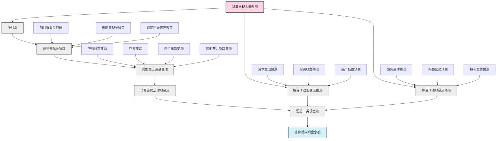

---
{"dg-publish":true,"tags":["财务BP","现金流预测","间接法","预测方法","财务规划"],"创建日期":"2024-04-26","permalink":"/知识共享/001_财务/01_财务BP/01_学习内容/03_财务预测与模型/现金流预测/间接法现金流预测/","dgPassFrontmatter":true}
---

## 基础知识

### 定义与概念

间接法现金流预测是一种现金流量分析技术，通过对净利润进行调整来预测企业未来现金流量状况。不同于直接法直接预测现金收支，间接法以会计利润为起点，通过加回非现金支出项目(如折旧、摊销)、调整营运资金变动和非营运项目，将权责发生制利润转换为收付实现制现金流量。

根据国际会计准则理事会(IASB)和财务会计准则委员会(FASB)的定义，间接法现金流量表从净利润开始，通过一系列调整项目来反映经营活动产生的现金流量净额。这种方法突显了利润与现金流之间的差异，帮助管理者理解为什么盈利企业可能面临现金短缺。

作为财务BP(Business Planning)的重要组成部分，间接法现金流预测为企业提供了一种从财务报表出发，系统评估未来流动性状况的工具，特别适合已建立完整会计系统并拥有可靠财务预测的企业使用。

### 历史背景与演变

间接法现金流预测的发展历程与企业现金流管理实践和会计准则演变密切相关：

- **1970年代初期**：传统财务管理主要关注收益表和资产负债表，现金流量表尚未成为必备报表
- **1971年**：美国会计原则委员会(APB)发布第19号意见书，要求企业提供"资金来源与运用表"，这是现金流量表的前身
- **1987年**：FASB发布第95号财务会计准则公告(SFAS 95)，明确规定现金流量表为必备财务报表，并正式提出直接法和间接法两种编制方式
- **1992年**：国际会计准则委员会(IASC，IASB的前身)发布第7号国际会计准则(IAS 7)，与美国准则保持一致，同样认可间接法
- **2000年代初**：安然、世通等财务丑闻后，现金流分析受到更多重视，间接法现金流预测技术得到进一步发展
- **2008年金融危机**：危机强调了流动性管理的重要性，促使更多企业采用系统化的现金流预测方法
- **2010年至今**：数字化工具和财务系统的发展，使基于间接法的现金流建模和预测更加精确和自动化

在实践中，尽管直接法能提供更直观的现金流动信息，但多数企业在对外报告时选择使用间接法，主要因为与现有会计系统更兼容且数据收集更为便捷。这也导致间接法现金流预测在财务规划和分析中更为普遍。

### 核心构成要素

间接法现金流预测的核心构成要素包括：

1. **净利润调整**
   - 净利润或税前利润作为起点
   - 加回非现金支出项目（如折旧与摊销）
   - 剔除非现金收入项目（如投资收益）
   - 调整非经营性损益项目（如资产处置损益）

2. **营运资金变动调整**
   - 应收账款变动（增加为负调整，减少为正调整）
   - 存货变动（增加为负调整，减少为正调整）
   - 应付账款变动（增加为正调整，减少为负调整）
   - 预收预付款项变动（预收增加为正调整，预付增加为负调整）
   - 其他经营性项目的变动（如应交税费、应付工资等）

3. **非经营性现金流预测**
   - 投资活动现金流（资本支出、长期资产处置、对外投资等）
   - 筹资活动现金流（发行股票、债券融资、股利支付、债务偿还等）

4. **现金余额计算**
   - 期初现金余额
   - 各类现金流量净额的汇总
   - 期末现金余额预测

间接法现金流预测的结构与现金流量表保持一致，但着重于未来预测而非历史记录，且通常会结合多种情景分析，以评估不同业务假设下的流动性状况。

## 理论框架

### 间接法现金流预测的基本框架

### 间接法与直接法的比较框架

| 特征 | 间接法 | 直接法 |
|------|--------|--------|
| 起始点 | 净利润 | 实际现金收支 |
| 基本逻辑 | 调整会计利润 | 预测具体现金交易 |
| 数据来源 | 财务报表预测 | 现金收支明细记录 |
| 与会计系统的兼容性 | 高（基于现有会计记录） | 低（需要额外数据收集） |
| 实施难度 | 较低（直接从财务预测延伸） | 较高（需要详细的收支计划） |
| 透明度 | 较低（调整项目复杂） | 较高（直观反映现金流动） |
| 分析价值 | 突出利润与现金流差异 | 直观展示现金来源与用途 |
| 适用场景 | 成熟企业的中长期预测 | 初创企业和短期流动性管理 |
| 与预算的结合度 | 需要先有利润预测 | 可直接与业务预算关联 |

### 理论支撑

间接法现金流预测的理论基础主要包括：

1. **权责发生制与收付实现制的转换理论**
   - 权责发生制下的会计利润与收付实现制下的现金流存在时间差和内容差异
   - 转换过程需要考虑非现金项目和时间性差异调整

2. **营运资金管理理论**
   - 营运资金循环（现金-存货-应收-现金）对企业现金流的重要影响
   - 现金转换周期长短与企业现金需求的关系

3. **财务杠杆与流动性管理理论**
   - 债务结构和偿还计划对未来现金流的影响
   - 最优资本结构下的现金流可持续性

4. **企业价值评估理论**
   - 未来现金流的贴现价值是企业价值的核心指标
   - 间接法预测提供了从财务规划到现金流评估的系统方法

5. **会计信息系统理论**
   - 财务信息的生成、处理和传递机制
   - 间接法利用现有会计系统的优势，保持了信息的一致性 

## 应用指南

### 间接法现金流预测的步骤

#### 1. 准备阶段

- **确定预测期间和粒度**：
  - 确定预测的时间跨度（月度、季度或年度）
  - 根据企业需求选择适当的预测周期（通常1-3年）
  - 明确短期预测与长期预测的不同精度要求

- **收集历史数据**：
  - 近2-3年的财务报表（利润表、资产负债表、现金流量表）
  - 营运资金项目的历史周转率或周转天数
  - 历史非现金项目数据（如折旧和摊销）

- **了解业务计划**：
  - 销售和利润增长预期
  - 资本支出计划
  - 融资和还款计划
  - 股利政策变化

#### 2. 利润预测与调整

- **编制利润预测**：
  - 预测销售收入（考虑价格和数量变化）
  - 预测销售成本和各项费用
  - 计算预期净利润或税前利润

- **识别和预测非现金项目**：
  - 固定资产折旧计划（考虑新增资产）
  - 无形资产摊销计划
  - 长期资产减值准备
  - 计提的各类准备金和预计负债

- **调整非经营性项目**：
  - 资产处置损益
  - 投资收益
  - 非经常性损益项目

#### 3. 营运资金变动预测

- **应收账款变动预测**：
  - 分析历史应收账款周转天数
  - 预测未来信用政策变化
  - 计算预期应收账款余额及其变动

- **存货变动预测**：
  - 分析历史存货周转率
  - 考虑生产模式和供应链战略变化
  - 预测未来存货水平及其变动

- **应付账款变动预测**：
  - 分析历史应付账款周转天数
  - 考虑供应商付款条件变化
  - 预测未来应付账款余额及其变动

- **其他营运项目变动**：
  - 预收款项变动（结合销售模式）
  - 预付款项变动（结合采购策略）
  - 应交税费变动（结合税率和纳税时间）
  - 应付职工薪酬变动（结合人员规划）

#### 4. 投资活动现金流预测

- **资本支出预测**：
  - 基于业务扩张计划预测固定资产投资
  - 预测技术升级和维护所需资本支出
  - 考虑分期付款安排对现金流的影响

- **长期投资预测**：
  - 预测战略性投资计划的现金支出
  - 估计投资收回的现金流入
  - 预测长期资产处置的现金流

#### 5. 筹资活动现金流预测

- **债务变动预测**：
  - 现有债务的还款计划
  - 新增借款的时间和金额
  - 利息支付的时间和金额

- **权益变动预测**：
  - 计划中的股权融资
  - 股票回购计划
  - 股利支付计划

#### 6. 汇总与验证

- **汇总现金流预测**：
  - 经营活动现金流 = 净利润 + 非现金项目调整 + 营运资金变动调整
  - 加上投资活动现金流
  - 加上筹资活动现金流
  - 计算每期现金净增加额

- **计算期末现金余额**：
  - 期初现金余额 + 现金净增加额 = 期末现金余额

- **验证与调整**：
  - 检查现金余额是否满足最低运营需求
  - 对比历史现金流模式，评估预测合理性
  - 调整预测参数以解决潜在现金短缺

- **敏感性分析**：
  - 测试关键假设变动对现金流的影响
  - 识别对现金流影响最大的因素
  - 设计不同情景下的现金流预测

### 适用场景与局限性

**适用场景**：
- 已有完整财务报表和成熟会计系统的企业
- 中长期财务规划（1-5年）
- 需要理解利润与现金流差异的分析场景
- 年度预算中的现金流预测
- 并购重组的财务影响评估
- 融资需求的前瞻性分析

**局限性**：
- 对历史财务数据质量依赖较高
- 预测准确性受利润预测准确性影响
- 难以捕捉短期内的具体现金流动
- 不适合日常或周度现金流管理
- 对营运资金周转率变化敏感
- 可能无法准确反映非常规业务交易的现金影响
- 对不同业务线或部门的现金贡献分析不够直观

### 数据收集与分析方法

#### 关键数据收集

1. **财务报表历史数据**：
   - 过去2-3年的完整财务报表
   - 财务报表附注中的相关信息（如折旧明细）

2. **业务规划数据**：
   - 销售和市场拓展计划
   - 生产和采购计划
   - 费用和成本控制策略

3. **资本预算数据**：
   - 资本支出计划和时间表
   - 资产处置计划
   - 重大投资项目信息

4. **融资计划数据**：
   - 债务偿还时间表
   - 新增融资计划
   - 股利政策文件

5. **营运资金历史数据**：
   - 月度或季度级别的应收账款、存货、应付账款历史数据
   - 客户付款历史和供应商付款条款
   - 季节性波动模式

#### 分析方法

1. **比率分析**：
   - 应收账款周转天数 = 365 / 应收账款周转率
   - 存货周转天数 = 365 / 存货周转率
   - 应付账款周转天数 = 365 / 应付账款周转率
   - 现金转换周期 = 应收账款周转天数 + 存货周转天数 - 应付账款周转天数

2. **趋势分析**：
   - 分析营运资金比率的历史趋势
   - 评估非现金支出(如折旧)占收入的比例趋势
   - 分析现金流与利润的历史比率变化

3. **回归分析**：
   - 使用历史数据建立销售收入与营运资金需求的关系模型
   - 估计资本支出与折旧的关系模型

4. **情景分析**：
   - 制定基准、乐观和悲观情景
   - 评估各情景下的现金流状况
   - 识别现金短缺风险和应对方案

5. **敏感性分析**：
   - 测试关键变量变动对现金流的影响
   - 识别对现金流预测影响最大的变量

## 案例分析

### 案例一：医疗器械制造商的间接法现金流预测

**背景**：某医疗器械制造商计划在未来两年内将产能提升30%，同时开发新一代产品。管理层需要评估这一扩张计划对公司现金流的影响，并确定是否需要额外融资。

**挑战**：
- 扩产需要大量资本支出
- 研发投入增加但收益滞后
- 市场拓展将导致应收账款增加
- 需要维持足够现金储备应对行业监管变化

**应用间接法预测过程**：

1. **利润预测**：
   - 根据销售计划预测收入增长率：第一年15%，第二年25%
   - 预测毛利率：由于规模效应提升，从42%提高到44%
   - 研发支出：第一年增加50%，第二年增加30%
   - 预测净利润：第一年小幅增长10%，第二年增长20%

2. **非现金项目调整**：
   - 由于新设备投入，折旧费用增加：第一年增加30%，第二年增加25%
   - 研发资本化部分的摊销增加

3. **营运资金预测**：
   - 应收账款周转天数由原来的75天增加到85天（考虑市场拓展因素）
   - 存货周转率由原来的4次/年降低到3.5次/年（为扩产备货）
   - 应付账款周转保持相对稳定，约60天

4. **投资活动预测**：
   - 扩产资本支出：第一年2,000万元，第二年1,500万元
   - 研发设备投入：两年共800万元

5. **筹资活动预测**：
   - 现有长期贷款按计划还款：每年600万元
   - 股利支付：保持利润的25%

**预测结果**：

通过间接法现金流预测模型计算，公司发现：
- 第一年末将出现约1,200万元的现金缺口
- 第二年末累计现金缺口将扩大到2,000万元
- 经营活动现金流虽然为正，但无法覆盖高额资本支出

**决策与执行**：
- 公司决定提前安排1,500万元的银行授信额度
- 调整资本支出时间表，部分投资推迟6个月
- 强化应收账款管理，设立专项激励机制缩短收款周期
- 与核心供应商商议更有利的付款条件

**实施效果**：
- 应收账款周转天数成功控制在80天以内
- 存货周转改善至3.8次/年
- 实际现金缺口控制在1,000万元以内，低于预期的2,000万元
- 公司顺利完成扩产而无需额外权益融资

### 案例二：软件服务企业的间接法现金流预测

**背景**：一家SaaS软件服务企业，正从传统许可模式转向订阅模式。虽然长期看订阅模式更有利，但转型期收入确认和现金流模式将发生重大变化，需要进行现金流预测确保转型平稳。

**挑战**：
- 收入确认模式改变导致短期利润下降
- 销售佣金支付与收入确认时间不匹配
- 运维成本上升而收入滞后
- 投资者关注短期利润下降的影响

**应用间接法预测过程**：

1. **利润预测**：
   - 传统许可收入预计三年内下降70%
   - 订阅收入第一年增长100%，第二年增长120%，第三年增长80%
   - 总收入第一年下降15%，第二年恢复增长10%，第三年增长25%
   - 净利润预计第一年下降50%，第二年下降20%，第三年转为增长30%

2. **非现金项目调整**：
   - 合同获取成本资本化并摊销
   - 软件开发成本部分资本化，摊销期延长

3. **营运资金预测**：
   - 应收账款周转加快（订阅模式下客户提前支付）
   - 递延收入大幅增加（订阅模式下收入递延确认）
   - 预付佣金增加（销售激励提前支付）

4. **投资活动预测**：
   - 云基础设施投资：三年共2,400万元
   - 客户体验平台改造：1,000万元

5. **筹资活动预测**：
   - 计划引入战略投资：第一年1,500万元
   - 暂停股利支付直到转型完成

**预测结果**：

间接法现金流预测显示：
- 虽然利润下降，但现金流状况出人意料地良好
- 第一年现金净增加约500万元（主要受益于递延收入增加）
- 第二年现金略有减少，约300万元（主要受资本支出影响）
- 第三年现金大幅增加约1,200万元（订阅模式开始显现优势）

**决策与执行**：
- 基于预测现金流充足，公司向投资者解释了短期利润下降但现金流改善的情况
- 加速转型计划，增加营销预算推动客户迁移
- 放弃原计划的1,000万元债务融资
- 提前支付部分技术开发费用，加速平台升级

**实施效果**：
- 转型速度超过预期，第二年末订阅收入占比达到75%
- 现金流比预期更好，第二年末现金净增加而非预期的减少
- 股价在初期下跌后逐步回升，反映投资者对长期现金生成能力的认可
- 公司得以在无额外融资压力下完成战略转型

### 案例三：零售连锁企业的间接法现金流预测

**背景**：一家拥有200家门店的零售连锁企业，计划在三年内开设100家新店并升级现有门店。同时，电商业务比重将从10%提升至30%。公司需要评估这一扩张计划的资金需求。

**挑战**：
- 新店前期投入大，盈利滞后
- 电商业务增长迅速但毛利率低于实体店
- 季节性波动较大，高峰期资金需求集中
- 供应链转型需要调整库存战略

**应用间接法预测过程**：

1. **利润预测**：
   - 按照新店成熟曲线分别预测不同阶段门店贡献的销售和利润
   - 预测电商销售和毛利率变化
   - 考虑规模效应带来的成本优化
   - 预测净利润：第一年增长10%，第二年15%，第三年25%

2. **非现金项目调整**：
   - 门店装修和设备折旧
   - 电商平台开发成本摊销
   - 门店租赁使用权资产折旧（应用新租赁准则）

3. **营运资金预测**：
   - 季节性存货波动模式（考虑线上线下不同需求）
   - 电商业务对应收账款的影响（与支付平台结算周期）
   - 随采购规模增加争取更优供应商付款条件

4. **投资活动预测**：
   - 新店开设资本支出：三年共1.5亿元
   - 现有门店升级改造：5,000万元
   - 电商平台和物流系统投资：3,000万元

5. **筹资活动预测**：
   - 租赁负债支付（新店租金）
   - 计划中的长期银行贷款：第一年1亿元
   - 股利支付：保持利润的20%

**预测结果**：

间接法现金流预测显示：
- 前18个月将出现约8,000万元的累计现金缺口
- 季节性波动加剧，每年第四季度前现金压力最大
- 第三年开始现金流转正，但自由现金流改善有限

**决策与执行**：
- 修改扩张计划，将开店计划从三年100家调整为四年120家，缓解前期压力
- 与银行谈判获得1.2亿元分期放款的授信额度
- 引入供应链融资方案，优化采购付款条件
- 制定详细的季节性现金管理策略，包括临时性信用额度

**实施效果**：
- 新店开设进度与修订计划一致，且单店投资成本降低8%
- 通过供应链融资将高峰期现金缺口控制在预期的60%以内
- 实际融资成本低于预算2个百分点
- 到第三年中期现金流转正，比预期提前3个月 

## 延伸内容

### 与其他财务BP概念的联系

#### 间接法现金流预测与财务报表预测的集成

间接法现金流预测与财务报表预测紧密相连，两者形成一个有机整体：

- **集成模型的优势**：
  - 确保预测的一致性，避免财务报表与现金流预测的逻辑矛盾
  - 自动反映业务假设变化对现金流的影响
  - 提高预测效率，减少重复工作

- **实施方法**：
  - 构建"三表联动"模型，利润表、资产负债表和现金流量表相互关联
  - 利用资产负债表等式校验模型准确性
  - 以关键业务驱动因素为基础，统一驱动各表预测

- **常见挑战**：
  - 确保非现金项目在各表中的一致处理
  - 准确捕捉资产负债表与现金流之间的时间差异
  - 平衡模型的复杂性与实用性

#### 间接法与资本支出预算的关联

资本支出预算与间接法现金流预测的关联体现在多个方面：

- **投资决策反馈循环**：
  - 资本支出决策影响间接法现金流预测中的投资活动现金流
  - 现金流预测结果反过来影响资本支出的可行性评估和优先级

- **折旧影响链**：
  - 资本支出产生新增折旧
  - 新增折旧影响利润预测
  - 折旧作为非现金项目在间接法中加回
  - 长期资本计划通过折旧影响长期现金流预测

- **整合视角**：
  - 资本支出预算应考虑企业整体现金流承受能力
  - 间接法现金流预测应包含详细的资本支出时间表
  - 两者结合可优化企业长期价值与短期流动性的平衡

#### 与预算编制流程的整合

间接法现金流预测在预算编制流程中的整合点：

- **时间安排**：
  - 预算编制流程中，现金流预测通常是最后一个环节
  - 需要等待销售、成本、费用和资本支出等预算完成后进行

- **反馈机制**：
  - 现金流预测结果可能导致预算修订
  - 例如：预测现金短缺可能促使调整资本支出计划或运营预算

- **责任分配**：
  - 预算中心提供基础数据
  - 财务BP负责整合和调整
  - 企业司库负责融资方案设计
  - 管理层审批最终预算和现金流计划

- **敏感性分析的应用**：
  - 评估不同预算方案下的现金流影响
  - 识别预算中对现金流影响最大的关键变量

### 不同环境下的应用变体

#### 高增长企业的应用调整

对于处于高速增长阶段的企业，间接法现金流预测需要特别关注：

- **更频繁的预测更新**：
  - 从年度预测调整为季度或月度滚动预测
  - 设置关键触发事件自动启动预测更新

- **增长与流动性平衡**：
  - 特别关注销售增长与应收账款增长的比例关系
  - 监控存货增长是否超过销售增长
  - 评估供应商付款条件对现金流的缓冲作用

- **融资需求前瞻性预测**：
  - 提前识别增长过程中的现金缺口时点
  - 制定分阶段融资计划，降低融资成本
  - 结合估值增长预期优化融资时机

- **弹性预测**：
  - 使用更大范围的敏感性分析
  - 针对高、中、低三种增长情景设计现金流应对策略
  - 设置清晰的预警指标监控实际增长与预测的偏差

#### 季节性业务的特殊处理

季节性业务采用间接法现金流预测需要的特殊调整：

- **季节性模式的精确建模**：
  - 基于历史数据分析季节性模式
  - 在月度级别（而非季度或年度）进行预测
  - 将营运资金项目的周转率差异化处理，区分旺季和淡季

- **旺季前现金准备**：
  - 特别关注旺季前的存货积累期
  - 预测旺季销售产生的应收账款峰值
  - 评估淡季现金流入对旺季准备的支持程度

- **特殊融资安排**：
  - 设计季节性信贷工具（如季节性贷款额度）
  - 评估供应商融资和保理等工具的季节性应用
  - 预测季节性现金盈余期的短期投资机会

- **淡旺季资金平衡**：
  - 预测并优化淡季和旺季之间的现金流转移
  - 设计淡季保持最低库存、最大应付账款的策略
  - 评估淡季现金流对旺季备货的支持能力

#### 项目型企业的应用变体

对于以项目为基础的企业（如建筑、咨询、工程服务等），间接法现金流预测需要：

- **基于项目组合的预测**：
  - 汇总各项目现金流预测形成公司整体预测
  - 考虑项目之间的资源共享和相互依赖

- **完工百分比与收款不同步的处理**：
  - 特别关注项目进度确认收入与实际收款之间的时间差
  - 模拟不同项目阶段的现金流曲线

- **项目风险的现金流影响**：
  - 评估项目延期对现金流的影响
  - 分析项目成本超支对利润和现金流的双重影响
  - 建立项目风险准备金机制

- **新项目获取的预测**：
  - 模拟项目招投标成功率对未来现金流的影响
  - 评估新项目前期投入与后期回报的现金流模式
  - 预测项目结束后的资源重新配置对现金流的影响

### 新兴趋势与发展方向

#### 数字化工具与自动化预测

现代技术正在改变间接法现金流预测的实践：

- **集成财务系统**：
  - ERP系统与财务预测工具的无缝集成
  - 自动化数据收集与处理
  - 实时更新营运资金数据

- **人工智能应用**：
  - 机器学习算法预测应收账款收款模式
  - 自动识别季节性和周期性模式
  - 智能推荐现金流优化措施

- **情景模拟工具**：
  - 蒙特卡洛模拟技术评估复杂情景
  - 动态调整假设的交互式仪表板
  - 基于概率的现金流风险评估

- **可视化决策支持**：
  - 交互式现金流预测图表
  - 预警系统自动识别潜在现金流风险
  - 管理层移动端随时查看关键现金流指标

#### 现金流与价值创造的关联

现金流预测正越来越多地与价值创造分析关联：

- **基于现金流的价值驱动因素分析**：
  - 识别对企业价值影响最大的现金流组成部分
  - 将战略举措与现金流改善直接关联
  - 用自由现金流提升而非短期利润作为管理目标

- **股东回报规划**：
  - 基于可持续现金流预测的股利政策
  - 股票回购计划与现金流预测的结合
  - 优化现金持有与股东回报的平衡

- **财务杠杆优化**：
  - 使用现金流预测评估最优债务水平
  - 债务期限结构与预期现金流的匹配
  - 不同资本结构下的企业价值模拟

- **投资者沟通工具**：
  - 利用现金流预测提升企业估值沟通
  - 展示自由现金流增长潜力
  - 用现金流指标替代传统利润指标进行业绩解释

#### ESG因素与现金流预测

环境、社会和治理(ESG)因素正逐渐纳入间接法现金流预测：

- **环境因素的现金流影响**：
  - 碳排放定价对成本结构的长期影响
  - 环保投资的现金流出和节约效益
  - 气候风险对资产价值和保险成本的影响

- **社会因素的影响**：
  - 劳工实践变化对人力成本的影响
  - 社区关系管理对运营稳定性的贡献
  - 社会责任项目的现金流出与品牌价值提升

- **治理因素的整合**：
  - 治理改善对资本成本的降低效应
  - 合规投入与风险降低的平衡
  - 高效决策流程对现金流周期的优化

- **ESG风险预测**：
  - 模拟ESG事件对现金流的冲击
  - 预测ESG表现提升对融资条件的改善
  - 评估ESG投资的长期现金流回报

## 学习资源

### 思考问题

1. 在什么情况下，企业应该优先选择间接法而非直接法进行现金流预测？具体优势是什么？

2. 一家企业的净利润持续增长，但现金余额却在减少，通过间接法现金流预测，可能会发现哪些潜在原因？

3. 营运资金管理对间接法现金流预测的准确性有何影响？如何改善营运资金预测的准确性？

4. 企业扩张期间，间接法现金流预测应特别关注哪些因素？为什么这些因素在扩张期尤为重要？

5. 在经济衰退预期下，如何调整间接法现金流预测模型的关键参数？哪些假设需要特别审慎？

6. 间接法现金流预测如何帮助识别企业的"增长陷阱"（即销售增长反而导致现金流恶化的情况）？

7. 如何将间接法现金流预测与企业价值评估模型（如DCF模型）有效结合？两者之间存在哪些挑战？

8. 比较分析基于ERP系统自动生成的现金流预测与基于财务BP专业判断的现金流预测各有什么优劣势？

9. 如果一家企业同时使用直接法和间接法进行现金流预测，出现较大差异时应如何分析原因？哪种方法更可靠？

10. 在并购交易中，如何运用间接法现金流预测评估目标公司的实际价值和并购后的现金流整合效果？

### 自我测评问题

1. 间接法现金流预测的起始点是什么？列出进行调整的主要类别。

2. 应收账款增加对经营活动现金流有何影响？在间接法调整中如何处理？

3. 折旧和摊销在间接法现金流预测中如何处理？为什么要这样处理？

4. 如何预测未来期间的应收账款余额？需要哪些数据和计算方法？

5. 在间接法现金流预测中，资本支出如何影响现金流量表的三个部分（经营活动、投资活动、筹资活动）？

6. 库存周转率下降对现金流有何影响？在间接法预测中如何体现这一影响？

7. 如何判断间接法现金流预测模型的准确性？有哪些评估指标？

8. 预测净利润增长15%，但经营活动现金流可能只增长5%的原因可能有哪些？

9. 间接法预测中，应如何处理以下非常规项目：资产减值、外币汇兑损益、股份支付费用？

10. 计算并解释现金转换周期(CCC)与间接法现金流预测的关系。CCC延长对现金流的具体影响是什么？

### 实践练习

#### 练习一：制造业企业间接法现金流预测

假设您是一家中型制造企业的财务BP专员，该企业计划在下一年度将销售额提升20%，同时资本支出预算为2,000万元。请完成以下任务：

1. 设计一个简化的间接法现金流预测模型框架，确定所有必要的输入变量
2. 假设以下情景，分析对现金流的影响：
   - 应收账款周转天数从60天延长至75天
   - 存货周转率从6次/年降低至5次/年
   - 产品平均毛利率从35%下降至32%
3. 如果企业希望在预测期末保持现金余额不低于年度销售额的10%，在上述情景下是否需要额外融资？如需，金额约为多少？

#### 练习二：服务业企业季节性现金流分析

您是一家季节性明显的旅游服务公司的财务BP经理，该公司第三季度营收占全年的50%，而第一季度仅占15%。请使用间接法现金流预测完成以下练习：

1. 建立一个按季度预测的间接法现金流模型框架，特别关注季节性因素
2. 分析以下变动对各季度现金流的影响：
   - 季节性预付款（旅游旺季前3个月）增加30%
   - 淡季固定成本占比从40%上升到50%
3. 设计一个季节性现金管理策略，包括最低现金持有量、季节性信贷安排和短期投资策略
4. 提出3-5个关键指标，用于监控季节性现金流预测的准确性和及时发现偏差

### 推荐学习资源

#### 书籍与学术文献
1. 《企业现金流分析与管理》，张明编著，中国财政经济出版社
2. 《财务建模与估值：金融分析师的实用指南》，[美]皮格纳塔罗著，机械工业出版社
3. "Cash Flow Forecasting: Art or Science?"，Journal of Financial Management
4. 《从财务报表到现金流预测》，王永生著，中信出版社
5. "Financial Forecasting: Evidence from the Field"，Journal of Accounting Research

#### 在线资源
1. 中国注册会计师协会：现金流量表准则解读
2. Financial Modeling World：现金流预测最佳实践
3. Corporate Finance Institute (CFI)：间接法现金流预测课程
4. LinkedIn Learning：财务预测与规划课程
5. 清华大学会计网络课程：现代企业现金流管理

#### 实用工具
1. 间接法现金流预测Excel模板
2. 集成财务预测软件：Anaplan, Oracle Hyperion
3. 现金流管理专业软件：Kyriba, HighRadius
4. 财务建模工具：Modano, Smart View
5. 现金流可视化工具：Power BI财务仪表板模板 