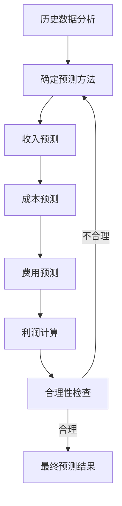

---
{"tags":["财务BP","利润表预测","财务预测","报表预测","预测方法"],"aliases":["利润表预测技术","损益表预测"],"dg-publish":true,"permalink":"/知识共享/001_财务/01_财务BP/01_学习内容/03_财务预测与模型/财务报表预测/利润表预测方法/","dgPassFrontmatter":true}
---


> [!NOTE] 概述
> 利润表预测是[[财务报表预测\|财务报表预测]]的核心环节，通过科学方法对企业未来收入、成本和利润进行合理预测，为管理决策和投资规划提供依据。本文详细介绍利润表预测的方法、步骤和最佳实践。

## 利润表预测的意义

利润表预测在财务BP中具有核心地位，主要体现在以下几方面：

- **战略规划支持**：帮助企业评估战略目标的财务可行性
- **绩效目标设定**：为企业各部门提供明确的财务目标
- **资源分配指导**：指导企业资源的优化配置
- **投资者沟通工具**：向外部投资者展示企业盈利前景
- **风险评估基础**：为[[知识共享/001_财务/01_财务BP/01_学习内容/03_财务预测与模型/敏感性分析/敏感性分析的目的与方法\|敏感性分析]]和[[风险评估\|风险评估]]提供基础数据

## 利润表预测的基本方法

### 1. 增长率法

最常用的简单预测方法，主要步骤包括：

1. 分析历史增长趋势
2. 考虑行业发展状况
3. 结合公司战略目标
4. 设定各项目的增长率
5. 应用增长率计算预测值

**案例应用**：
某零售企业在制定三年期财务BP时，根据过去5年的平均增长率(8%)和行业预期增长(6%)，结合公司新店扩张计划，设定销售收入年增长率为10%，成本增长率为9%，从而预测未来三年的利润表。

### 2. 驱动因素法

基于业务驱动因素的预测方法，更具逻辑性和精确度：

1. 识别关键业务驱动因素(如销量、单价、市场份额等)
2. 建立驱动因素与财务项目的关系模型
3. 预测驱动因素的变化
4. 根据关系模型计算财务项目的预测值

这种方法与[[成本驱动因素识别\|成本驱动因素识别]]和[[知识共享/001_财务/01_财务BP/01_学习内容/02_预算编制基础/收入预测方法/收入预测方法\|收入预测方法]]密切相关，需要深入理解业务运营模式。

**案例应用**：
一家酒店集团预测收入时，使用以下驱动因素：
- 房间数量 × 入住率 × 平均房价 = 客房收入
- 客人数量 × 人均消费 = 餐饮收入
- 会议天数 × 日均会议收入 = 会议收入

通过预测这些驱动因素的变化，得出更精确的收入预测。

### 3. 百分比法

以销售收入为基准的百分比预测方法：

1. 分析历史财务数据中各成本、费用项目占销售收入的比例
2. 预测未来各项目占销售的百分比
3. 预测销售收入总额
4. 计算各项目的预测值

**案例应用**：
某制造企业历史数据显示，直接材料成本约占销售收入的42%，直接人工成本约占10%，制造费用约占15%，销售费用约占12%，管理费用约占8%。预测销售收入为1亿元时，各成本费用预测如下：
- 直接材料：4200万元
- 直接人工：1000万元
- 制造费用：1500万元
- 销售费用：1200万元
- 管理费用：800万元

### 4. 回归分析法

使用统计学方法建立变量间关系，进行预测：

1. 收集历史数据
2. 确定自变量和因变量
3. 建立回归模型
4. 检验模型有效性
5. 使用模型进行预测

这种方法与[[财务指标预测\|财务指标预测]]的技术相通，但更侧重于利润表各项目的预测。

**案例应用**：
某家电企业通过回归分析发现销售额与广告支出、GDP增长和季节因素有显著相关性。建立模型：
```
销售额 = 2500万 + 3.2×广告支出(万元) + 150×GDP增长率(%) + 季节因子调整
```
通过预测这些变量，得出更准确的销售预测。

## 利润表预测的步骤流程

完整的利润表预测流程包括：



1. **历史数据分析**
   - 收集3-5年历史数据
   - 分析增长趋势和波动情况
   - 识别异常值并调整

2. **收入预测**
   - 按产品线/业务单元预测
   - 考虑价格和数量因素
   - 纳入新产品/市场因素

3. **成本预测**
   - 区分固定成本和变动成本
   - 考虑规模效应
   - 纳入成本控制计划

4. **费用预测**
   - 销售费用与销售收入的关系
   - 管理费用的固定与变动部分
   - 研发费用的战略安排

5. **税费和净利润计算**
   - 考虑税率变化
   - 计算各级利润指标

6. **合理性检查**
   - 与历史业绩比较
   - 与行业标准对比
   - 各利润率指标的合理性

## 利润表预测的高级技巧

### 分部门预测与整合

对于复杂组织结构的企业，可采用自下而上的预测方法：

1. 各部门/事业部单独预测
2. 考虑部门间协同效应
3. 整合为公司层面预测
4. 消除内部交易影响

### 基于情景的预测

结合[[情景分析\|情景分析]]，制定多情景利润表预测：

1. 定义乐观、基准、悲观情景
2. 针对各情景设定假设
3. 为各情景制定预测
4. 分析情景间的差异

**案例应用**：
某科技公司在三个情景下的收入增长率假设：
- 乐观情景：25%（新产品成功，市场份额增加）
- 基准情景：15%（符合行业平均水平）
- 悲观情景：5%（竞争加剧，市场饱和）

### 预测周期与滚动更新

采用滚动预测方法，持续更新利润表预测：

1. 设定18个月或24个月的预测期
2. 每季度更新预测
3. 始终保持完整预测期
4. 分析预测与实际的差异

这种方法与[[知识共享/001_财务/01_财务BP/01_学习内容/01_财务BP基础概念/BP定义与作用/财务BP的作用与目标\|财务BP的作用与目标]]中提到的动态规划理念一致，增强了预测的适应性。

## 常见预测陷阱与规避

1. **过度乐观预测**
   - 表现：持续高增长率假设
   - 规避：对照行业数据，设定合理上限

2. **季节性因素忽略**
   - 表现：使用年度均值进行月度预测
   - 规避：分析历史季节性模式，纳入季节因子

3. **单一情景依赖**
   - 表现：只制定一种"最可能"预测
   - 规避：采用多情景预测，评估不确定性

4. **缺乏驱动因素分析**
   - 表现：简单应用历史增长率
   - 规避：识别关键驱动因素，建立逻辑模型

5. **忽视外部环境变化**
   - 表现：封闭式预测，不考虑宏观因素
   - 规避：纳入宏观经济指标，行业趋势分析

## 实际案例分析

### 案例一：互联网企业利润表预测

某互联网企业使用驱动因素法预测利润表：

**关键驱动因素**：
- 月活跃用户数(MAU)
- 付费转化率
- 用户平均收入(ARPU)
- 获客成本(CAC)
- 用户留存率

**预测模型**：
1. 收入 = MAU × 付费转化率 × ARPU
2. 获客费用 = 新增用户数 × CAC
3. 运营成本 = 固定成本 + 变动成本率 × 用户数

**预测结果**：三年期利润表显示从亏损到盈利的转变轨迹，第三年实现5%的净利润率。

### 案例二：零售企业多情景预测

某零售连锁企业在新冠疫情后制定恢复计划，采用多情景预测：

**基准情景**（60%概率）：
- 销售恢复至疫情前90%
- 毛利率轻微下降1%
- 费用率保持不变

**乐观情景**（20%概率）：
- 销售恢复至疫情前100%
- 毛利率恢复至疫情前水平
- 费用率降低0.5%

**悲观情景**（20%概率）：
- 销售恢复至疫情前75%
- 毛利率下降2%
- 费用率上升1%

通过情景权重计算，得出预期利润率为疫情前水平的85%。

## 与其他预测方法的关联

利润表预测与其他财务预测密切相关：

- **与[[知识共享/001_财务/01_财务BP/01_学习内容/03_财务预测与模型/财务报表预测/资产负债表预测方法\|资产负债表预测方法]]的关联**：净利润影响留存收益和现金
- **与[[现金流预测\|现金流预测]]的关联**：经营利润是间接法现金流预测的起点
- **与[[财务指标预测\|财务指标预测]]的关联**：提供计算财务比率的基础数据

## 小结

利润表预测是财务BP的核心组成部分，通过科学的方法和流程，可以为企业提供有价值的决策参考。有效的利润表预测需要结合企业特点、行业趋势和宏观环境，选择适当的预测方法，并通过多情景分析提高预测的可靠性和适应性。

## 参考文献

1. Bragg, S. M. (2018). *Financial Analysis: A Business Decision Guide*. Accounting Tools.
2. Damodaran, A. (2012). *Investment Valuation: Tools and Techniques for Determining the Value of Any Asset*. Wiley Finance.
3. 《企业财务计划与预测技术》，张维宁，中国财政经济出版社，2019.
4. McKinsey & Company. (2015). *Valuation: Measuring and Managing the Value of Companies*. Wiley.
5. 《管理会计》，孙茂竹，中国人民大学出版社，2018. 