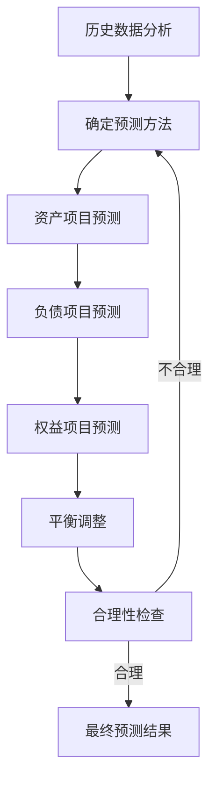

---
{"tags":["财务BP","资产负债表预测","财务预测","报表预测","预测方法"],"aliases":["资产负债表预测技术","资产负债预测"],"dg-publish":true,"permalink":"/知识共享/001_财务/01_财务BP/01_学习内容/03_财务预测与模型/财务报表预测/资产负债表预测方法/","dgPassFrontmatter":true}
---

> [!NOTE] 概述
> 资产负债表预测是[[财务报表预测\|财务报表预测]]的重要组成部分，通过合理预测企业未来资产、负债和所有者权益的状况，为企业财务健康状况评估和资本结构优化提供支持。本文详细介绍资产负债表预测的方法、步骤和实践技巧。

## 资产负债表预测的意义

资产负债表预测在财务BP中具有独特价值，主要体现在：

- **资本结构评估**：了解未来债务与权益的比例变化
- **流动性风险管理**：评估企业未来的短期偿债能力
- **资金需求规划**：确定企业未来的融资需求
- **投资决策支持**：为资本支出和投资提供决策依据
- **估值分析基础**：为[[投资回报分析\|企业估值]]提供基础数据

## 资产负债表预测的基本方法

### 1. 趋势分析法

基于历史数据趋势的预测方法：

1. 收集3-5年历史资产负债表数据
2. 分析各项目的增长趋势和波动规律
3. 结合业务发展预期，预测未来变化
4. 应用趋势模式计算预测值

**案例应用**：
某制造企业在预测固定资产时，分析了过去5年的资本支出和折旧模式，发现固定资产净值年均增长率为12%。结合未来三年的[[资本支出预算\|资本支出预算]]，预测固定资产净值将以平均10%的速度增长。

### 2. 比率法

基于财务比率的资产负债表预测：

1. 计算关键财务比率（如资产周转率、存货周转天数等）
2. 预测未来比率变化
3. 根据已知项目和预测比率，推算其他项目

这种方法与[[财务指标预测\|财务指标预测]]密切相关，特别是针对运营效率指标。

**案例应用**：
某零售企业资产负债表预测使用以下比率：
- 应收账款周转天数：30天
- 存货周转天数：45天
- 应付账款周转天数：60天

基于销售收入预测和成本预测，计算出期末应收账款、存货和应付账款余额。

### 3. 直接关联法

与利润表和现金流预测直接关联的预测方法：

1. 利用[[知识共享/001_财务/01_财务BP/01_学习内容/03_财务预测与模型/财务报表预测/利润表预测方法\|利润表预测]]结果
2. 分析各项目与收入或成本的关联关系
3. 建立预测模型并计算
4. 平衡资产负债关系

**案例应用**：
某服务企业预测资产负债表时，建立以下关联模型：
- 应收账款 = 月均收入 × 1.5（假设平均45天收款期）
- 预付费用 = 年营运成本 × 5%
- 应付账款 = 月均成本 × 1.0（假设平均30天付款期）

### 4. 投入产出法

基于业务活动水平的资产负债表预测：

1. 确定关键业务活动指标（如产量、客户数、订单数等）
2. 分析这些指标与资产负债项目的关系
3. 预测业务活动水平
4. 计算相应的资产负债项目

**案例应用**：
某汽车零部件制造商使用产能利用率作为关键指标，发现：
- 每增加10%的产能利用率，存货增加约7%
- 每增加10%的产能利用率，应收账款增加约9%
- 每增加10%的产能利用率，固定资产投资需求增加约5%

## 资产负债表预测的步骤流程

完整的资产负债表预测流程包括：

### 1. 资产项目预测

#### 流动资产预测

- **现金及现金等价物**
  - 可通过[[现金流预测\|现金流预测]]得出期末余额
  - 或设定最低现金持有量，余额作为浮动项

- **应收账款**
  - 结合销售收入和应收账款周转天数
  - 公式：应收账款 = 日均销售额 × 应收账款周转天数

- **存货**
  - 基于销售成本和存货周转天数
  - 公式：存货 = 日均销售成本 × 存货周转天数
  - 考虑行业特性和库存管理策略调整

- **其他流动资产**
  - 通常与业务规模挂钩
  - 可设定占收入或总资产的百分比

#### 非流动资产预测

- **固定资产**
  - 期初余额 + [[资本支出预算\|资本支出预算]] - 预计折旧
  - 考虑资产处置和重估因素

- **无形资产**
  - 期初余额 + 新增投资 - 摊销
  - 考虑研发资本化政策

- **长期投资**
  - 基于投资计划预测
  - 考虑投资回报和价值变动

### 2. 负债项目预测

#### 流动负债预测

- **应付账款**
  - 结合采购额和付款周期
  - 公式：应付账款 = 日均采购额 × 应付账款周转天数

- **短期借款**
  - 根据营运资金需求和债务政策
  - 可作为平衡项（插头变量）

- **应付税费**
  - 基于利润和适用税率
  - 考虑纳税时间差

#### 非流动负债预测

- **长期借款**
  - 当前长期借款 + 新增借款 - 转为流动负债的部分
  - 结合[[债务管理策略\|债务管理策略]]预测

- **递延税负债**
  - 基于资产账面价值与税基差异
  - 考虑税法变化影响

### 3. 所有者权益预测

- **股本**
  - 加入预期的新股发行
  - 考虑股票回购计划

- **资本公积**
  - 结合融资计划预测
  - 考虑股权激励计划影响

- **留存收益**
  - 期初留存收益 + 净利润 - 股利支付
  - 考虑[[知识共享/001_财务/01_财务BP/01_学习内容/05_高级分析方法/增长模型/可持续增长率分析\|可持续增长率分析]]进行调整

### 4. 平衡调整

资产负债表必须保持平衡，通常采用以下方法之一：

- **现金作为平衡项**：多余资金增加现金，资金缺口减少现金
- **短期借款作为平衡项**：资金缺口增加借款，多余资金减少借款
- **混合调整法**：结合现金政策和融资策略进行调整

## 资产负债表预测的高级技巧

### 基于增长模型的综合预测

结合[[知识共享/001_财务/01_财务BP/01_学习内容/05_高级分析方法/增长模型/可持续增长率分析\|可持续增长率分析]]预测整体资产负债表：

1. 计算可持续增长率(SGR)
2. 预测收入增长
3. 比较实际增长与可持续增长
4. 调整资本结构或营运效率

**案例应用**：
某企业计算可持续增长率为12%，但计划增长率为20%。通过预测模型发现：
- 需增加负债比率或
- 提高净利润率或
- 增加资产周转率

### 分部门及分地区预测

对于复杂企业结构：

1. 分别预测各业务部门或地区的资产负债表
2. 考虑内部交易和资源分配
3. 合并调整后得出整体预测

**案例应用**：
某跨国企业分别预测国内和海外业务的资产负债表，然后：
- 消除集团内部往来
- 调整内部转移定价影响
- 考虑汇率变动对合并报表的影响

### 敏感性分析与压力测试

结合[[知识共享/001_财务/01_财务BP/01_学习内容/03_财务预测与模型/敏感性分析/敏感性分析的目的与方法\|敏感性分析]]和[[压力测试应用\|压力测试应用]]：

1. 识别关键影响因素
2. 设定波动范围
3. 构建敏感性矩阵
4. 分析极端情况下的财务弹性

**案例应用**：
某贸易企业对以下因素进行敏感性分析：
- 应收账款周转天数增加10天
- 存货周转天数增加15天
- 销售收入下降20%

分析这些变化对流动比率和负债率的影响，评估企业的财务弹性。

## 行业特殊项目预测

不同行业资产负债表预测需关注的特殊项目：

### 金融业

- **贷款和垫款**：基于信贷政策和经济周期
- **客户存款**：基于市场份额和客户行为
- **投资资产**：基于投资战略和市场预期
- **监管资本**：确保符合资本充足率要求

### 制造业

- **存货细分**：原材料、在产品和产成品分别预测
- **生产设备**：关注更新改造和技术升级
- **保修负债**：基于销量和历史保修率

### 房地产业

- **开发成本**：基于项目周期和开发计划
- **预收账款**：基于销售计划和收款模式
- **土地储备**：基于扩张战略和市场前景

## 实际案例分析

### 案例一：科技企业资产负债表预测

某软件企业在快速增长阶段进行三年资产负债表预测：

**关键假设**：
- 收入年增长率：30%
- 应收账款周转天数：从75天降至60天（信用政策收紧）
- 固定资产投资：每年营收的8%
- 研发支出资本化：研发总支出的20%
- 债务融资：2亿元长期借款（第二年）

**预测结果**：
- 资产总额三年期复合增长率为25%
- 自动计算的短期借款需求稳步减少
- 资本密集度（总资产/收入）从0.9降至0.78
- 预测期末负债率从48%降至40%

### 案例二：制造企业并购后资产负债表预测

某制造企业计划并购一家同行，进行并购后资产负债表预测：

**关键假设**：
- 并购对价：10亿元，其中60%现金，40%股权
- 协同效应：运营成本年节省1,000万元
- 存货优化：合并后存货周转提升20%
- 商誉确认：并购对价超过可辨认净资产的部分
- 债务融资：并购现金部分通过新增长期借款解决

**预测结果**：
- 并购后资产负债率短期上升15个百分点
- 商誉占合并后总资产的22%
- 存货周转优化带来2,000万营运资金释放
- 预测第三年末负债率恢复至并购前水平

## 与其他预测的协调与整合

资产负债表预测需与其他预测相互协调：

- **与[[知识共享/001_财务/01_财务BP/01_学习内容/03_财务预测与模型/财务报表预测/利润表预测方法\|利润表预测]]的协调**
  - 净利润影响留存收益
  - 收入和成本影响营运资本需求
  - 折旧摊销与固定资产变动匹配

- **与[[现金流预测\|现金流预测]]的协调**
  - 期初现金加现金流变动等于期末现金
  - 资本支出与固定资产变动一致
  - 融资活动与债务变动一致

- **与[[资本支出预算\|资本支出预算]]的协调**
  - 预算资本支出反映在固定资产增加
  - 考虑资产处置计划
  - 折旧与资产基础匹配

## 常见预测陷阱与规避

1. **忽视资产负债表平衡原则**
   - 表现：资产总额与负债加所有者权益不等
   - 规避：建立自动平衡机制，设定平衡项目

2. **未考虑营运资本的季节性波动**
   - 表现：使用年度平均数预测期末值
   - 规避：分析历史季节性模式，纳入季节因素

3. **对折旧摊销的简化处理**
   - 表现：使用简单百分比计算折旧
   - 规避：建立资产明细表，分别计算不同资产类别的折旧

4. **股利政策不一致**
   - 表现：股利支付与既定股利政策不符
   - 规避：明确股利政策，保持一致应用

5. **债务结构不合理**
   - 表现：过度依赖短期债务平衡资金需求
   - 规避：制定合理的债务结构目标，平衡长短期债务

## 小结

资产负债表预测是财务BP的重要组成部分，提供了企业未来财务状况的全面视图。有效的资产负债表预测需要准确理解企业业务模式、结合利润表和现金流预测，并通过多种技术方法提高预测的精度和可靠性。通过合理的资产负债表预测，企业可以前瞻性地管理资本结构、识别资金需求并优化资源配置。

## 参考文献

1. Wahlen, J. M., Baginski, S. P., & Bradshaw, M. T. (2017). *Financial Reporting, Financial Statement Analysis, and Valuation*. Cengage Learning.
2. Brealey, R. A., Myers, S. C., & Allen, F. (2019). *Principles of Corporate Finance*. McGraw-Hill Education.
3. Titman, S., Keown, A. J., & Martin, J. D. (2017). *Financial Management: Principles and Applications*. Pearson.
4. 《财务报表分析与预测》，张新民，中国人民大学出版社，2020.
5. 《企业价值评估》，刘玉平，中国财政经济出版社，2018. 