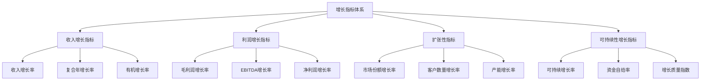

---
{"tags":["财务BP","财务预测","指标预测","增长指标","业务扩张","可持续发展"],"aliases":"增长率预测,发展潜力评估","created":"2024-04-24","update":"2024-04-24","dg-publish":true,"permalink":"/知识共享/001_财务/01_财务BP/01_学习内容/03_财务预测与模型/财务指标预测/增长指标预测/","dgPassFrontmatter":true}
---

## 引言

增长指标预测是财务BP工作中的重要组成部分，它关注企业未来发展态势，帮助管理层了解业务扩张潜力和可持续性。准确的增长指标预测能够为战略决策提供依据，同时为资源配置、融资规划和投资者沟通提供支持。本文将系统介绍增长指标预测的方法体系、应用技巧和实践案例，为财务BP提供全面的指导。

## 核心增长指标体系

企业增长可以从多个维度进行衡量，常用的增长指标包括：

### 1. 收入增长指标

- **收入增长率** = (本期收入 - 上期收入) ÷ 上期收入
- **复合年增长率(CAGR)** = (期末值 ÷ 期初值)^(1/年数) - 1
- **同比增长率**：与去年同期相比的增长率
- **环比增长率**：与上一时期相比的增长率
- **有机增长率**：剔除并购、汇率等因素后的增长率

### 2. 利润增长指标

- **毛利润增长率** = (本期毛利润 - 上期毛利润) ÷ 上期毛利润
- **EBITDA增长率** = (本期EBITDA - 上期EBITDA) ÷ 上期EBITDA
- **净利润增长率** = (本期净利润 - 上期净利润) ÷ 上期净利润
- **每股收益增长率** = (本期EPS - 上期EPS) ÷ 上期EPS

### 3. 扩张性指标

- **市场份额增长率** = (本期市场份额 - 上期市场份额) ÷ 上期市场份额
- **客户数量增长率** = (本期客户数 - 上期客户数) ÷ 上期客户数
- **产能增长率** = (本期产能 - 上期产能) ÷ 上期产能
- **员工数量增长率** = (本期员工数 - 上期员工数) ÷ 上期员工数

### 4. 可持续性增长指标

- **可持续增长率(SGR)** = ROE × (1 - 派息率)
- **资金自给率** = 经营活动现金流 ÷ 资本支出
- **增长质量指数** = 经营活动现金流增长率 ÷ 净利润增长率
- **增长弹性系数** = 收入增长率 ÷ 资产增长率

## 增长指标预测方法

### 1. 市场驱动的增长预测

该方法基于市场规模、增速和企业竞争地位预测企业增长潜力。

- **宏观市场预测**：
  - 分析目标市场规模及增长趋势
  - 研究市场渗透率和成熟度曲线
  - 评估技术变革和消费者行为变化的影响

- **竞争地位分析**：
  - 评估企业在市场中的相对位置和份额
  - 分析竞争优势的可持续性
  - 预测市场格局变化和份额转移趋势

- **市场进入与扩张策略**：
  - 评估现有市场深耕潜力
  - 分析新市场进入时机和障碍
  - 预测产品线扩展对增长的贡献

### 2. 资源驱动的增长预测

该方法基于企业资源禀赋和能力发展预测增长潜力。

- **核心资源分析**：
  - 评估关键生产资源的扩张能力
  - 分析人才队伍的增长支撑能力
  - 评估技术创新的发展路径

- **资源瓶颈识别**：
  - 识别制约增长的关键资源瓶颈
  - 评估突破瓶颈的可行性和时间
  - 分析资源瓶颈对增长曲线的影响

- **资源扩张规划**：
  - 建立资源扩张与增长的对应关系
  - 预测资源投入的增长回报率
  - 设计分阶段资源扩张路径

### 3. 财务模型驱动的增长预测

该方法通过财务建模和情景分析预测企业增长。

- **收入驱动因素分解**：
  - 分解收入为数量、价格等关键驱动因素
  - 建立驱动因素的预测模型
  - 整合驱动因素预测形成收入预测

- **财务敏感性分析**：
  - 分析关键增长指标的敏感性
  - 识别影响增长的关键财务杠杆
  - 设计不同增长情景的财务模型

- **资本结构与增长关系**：
  - 分析融资能力对增长的支撑和限制
  - 评估不同资本结构对增长的影响
  - 预测增长与财务风险的平衡点

### 4. 历史趋势与模式识别

该方法基于历史数据分析，识别增长规律和模式。

- **增长周期分析**：
  - 识别企业历史增长的周期性特征
  - 分析行业增长周期与企业关联
  - 预测周期性变化对未来增长的影响

- **增长模式识别**：
  - 分析企业所处的增长阶段（启动期、加速期、成熟期、转型期）
  - 参考类似企业的增长曲线模式
  - 预测企业在S曲线上的位置移动

- **突变点预测**：
  - 识别可能导致增长突变的关键事件
  - 评估突变事件的发生概率和影响
  - 设计突变情景下的增长预测模型

## 增长指标预测流程

有效的增长指标预测通常遵循以下流程：

### 1. 战略与目标分析

- 明确企业战略方向和增长愿景
- 分析管理层的增长目标和预期
- 评估战略执行的历史效果

### 2. 增长驱动因素识别

- 识别影响收入增长的关键驱动因素
- 分析利润增长的核心杠杆
- 评估各驱动因素的相对重要性和可控性

### 3. 内外部环境评估

- 分析宏观经济环境对增长的影响
- 评估行业趋势和竞争格局变化
- 审视内部能力和资源对增长的支撑

### 4. 增长假设制定

- 制定关键驱动因素的基准假设
- 设定增长限制条件和约束
- 确定增长的时间框架和阶段

### 5. 预测模型构建

- 建立驱动因素与增长指标的关系模型
- 设计自下而上和自上而下相结合的预测方法
- 确保模型的内部一致性和逻辑性

### 6. 多情景分析

- 构建基准情景、乐观情景和保守情景
- 分析不同策略选择对增长的影响
- 评估外部环境变化对增长的冲击

### 7. 风险与限制因素评估

- 识别可能阻碍增长的风险因素
- 评估资源限制对增长的约束
- 分析增长过快可能带来的风险

### 8. 最终增长路径确定

- 综合各种因素确定最可能的增长路径
- 设定增长的阶段性目标和检验点
- 制定支持增长预测的行动计划

## 增长指标预测案例分析

### 案例一：电子商务企业的增长预测

**背景情况**：
某电子商务平台已经完成了早期快速增长阶段，现在面临市场成熟度提高和竞争加剧的挑战，需要预测未来3-5年的增长路径。

**预测方法**：
1. **市场饱和度分析**：
   - 分析目标市场的渗透率：当前30%，预计5年后达到45%
   - 评估品类扩张空间：当前覆盖8个核心品类，计划扩展至12个
   - 用户增长预测：活跃用户年增长率从当前25%逐步下降至10%

2. **增长驱动因素转变分析**：
   | 阶段 | 主要增长驱动因素 | 贡献度 |
   |-----|----------------|--------|
   | 前期（过去） | 用户数量增长 | 70% |
   | 中期（当前） | 客单价提升+复购率提高 | 60% |
   | 后期（未来） | 新品类扩展+高价值用户留存 | 预计50% |

3. **多维度增长指标预测**：
   | 指标 | 当年 | 第一年 | 第二年 | 第三年 | 第四年 | 第五年 |
   |-----|------|------|-------|-------|-------|-------|
   | 收入增长率 | 50% | 40% | 30% | 25% | 18% | 15% |
   | 毛利润增长率 | 60% | 45% | 35% | 28% | 20% | 17% |
   | 净利润增长率 | 80% | 55% | 40% | 30% | 25% | 20% |
   | 用户增长率 | 25% | 20% | 15% | 12% | 10% | 8% |
   | GMV增长率 | 55% | 45% | 35% | 28% | 20% | 16% |

**增长策略建议**：
- 当前处于增长转型期，需要从用户规模驱动向效率和深度驱动转变
- 推荐优先发展高毛利品类，提高平均客单价
- 用户获取策略从广覆盖转向精准营销，降低获客成本
- 通过数据分析提高用户精准匹配度，提升复购率
- 积极探索新兴品类，为长期增长储备动力
- 设置季度增长预警机制，密切关注获客成本和用户留存率变化

### 案例二：制造业企业的产能扩张与增长预测

**背景情况**：
某制造企业计划在未来两年投资新建生产线，产能将提升60%，需要评估产能扩张后的合理增长预期。

**预测方法**：
1. **产能利用与增长关系分析**：
   - 当前产能利用率：90%，处于高负荷状态
   - 历史产能扩张后的吸收周期：通常需要18-24个月达到稳定利用率
   - 产能与收入线性关系模型：收入 = 产能 × 利用率 × 单位产出价值

2. **多阶段增长路径设计**：
   | 阶段 | 时间跨度 | 特点 | 增长重点 |
   |-----|---------|------|----------|
   | 投资建设期 | 0-12个月 | 资本支出高，现有产能满负荷 | 维持现有客户服务，为新产能做市场准备 |
   | 产能爬坡期 | 13-24个月 | 新产能逐步释放，利用率从30%提升至70% | 扩大市场份额，优化产品结构 |
   | 规模效益期 | 25-36个月 | 产能利用率稳定在80%以上 | 提升运营效率，优化客户结构 |

3. **增长指标分阶段预测**：
   | 阶段 | 收入增长率 | 产能利用率 | 毛利率变化 | 资金自给率 |
   |-----|-----------|----------|-----------|-----------|
   | 投资建设期 | 5-8% | 90-95% | 持平 | 下降至0.7 |
   | 产能爬坡期 | 15-25% | 65-75% | 下降1-2个百分点 | 逐步回升至0.9 |
   | 规模效益期 | 20-30% | 80-85% | 提升2-3个百分点 | 超过1.0 |

**可持续增长评估**：
- 资本支出对现金流的短期压力较大，建议分两批投放产能
- 预计投资回收期约为36个月，内部收益率约18%
- 产能爬坡期将面临一定毛利率压力，需要通过优化产品组合对冲
- 长期可持续增长率约为15%，与行业平均水平相比具有竞争力
- 关键风险点在于产能消化速度，建议采取订单驱动的扩产策略

### 案例三：SaaS企业从高增长转向稳健增长的预测

**背景情况**：
某SaaS企业在过去三年保持了80%以上的年收入增长率，但随着规模扩大和市场成熟，需要预测未来增长路径并调整战略重点。

**预测方法**：
1. **SaaS业务增长模式分析**：
   - 识别增长驱动因素：新客户获取、客户留存、客户扩张（upsell/cross-sell）
   - 构建简化增长公式：本年收入 = 上年收入 × (1 - 客户流失率) + 新增收入
   - 分析增长贡献结构变化：从新客户主导转向存量客户价值挖掘

2. **增长阶段转换预测**：
   - 分析同行业成熟SaaS公司的增长曲线
   - 识别引起增长变拐点的关键指标
   - 建立"金字塔"增长模型：初期扩客户数、中期扩客户价值、后期提效率

3. **关键增长指标预测**：
   | 指标 | 当前 | 一年后 | 两年后 | 三年后 |
   |-----|------|-------|-------|-------|
   | 年收入增长率 | 85% | 60% | 45% | 35% |
   | 年经常性收入增长率 | 90% | 65% | 50% | 40% |
   | 新客户贡献收入比例 | 70% | 55% | 40% | 30% |
   | 客户留存率 | 85% | 88% | 90% | 92% |
   | 客户获取成本回收月数 | 18个月 | 15个月 | 12个月 | 10个月 |
   | 净美元留存率 | 110% | 120% | 125% | 130% |

**增长战略转型建议**：
- 增长重点从用户数量转向客户生命周期价值最大化
- 投入重点从营销获客向客户成功和产品开发转移
- 建立客户分层策略，对高价值客户采取精细化运营
- 开发高级功能和附加产品，提升ARPU(每用户平均收入)
- 提高定价策略的科学性，逐步抬升新客户起步价格
- 设计适合规模化企业的销售模式，降低边际获客成本

## 增长指标预测常见挑战与解决方案

### 1. 市场天花板评估困难

**挑战**：难以准确评估目标市场的实际规模和潜力，导致增长预测缺乏上限约束。

**解决方案**：
- 采用多角度市场规模估算：自上而下和自下而上相结合
- 分析行业成熟市场的渗透率曲线，寻找参考基准
- 设计不同市场情景，避免单一路径预测
- 定期更新市场评估，调整增长预期

### 2. 增长驱动因素变化预测

**挑战**：企业增长的核心驱动因素会随着发展阶段变化，难以准确预测转变时点和影响。

**解决方案**：
- 建立增长驱动因素转变的早期预警指标
- 分析行业内成熟企业的增长驱动变化路径
- 构建多因素增长模型，不过度依赖单一驱动
- 设计阶段性增长策略，为驱动因素转变做准备

### 3. 竞争动态影响评估

**挑战**：市场竞争格局变化难以预测，竞争对手行动可能显著影响企业增长路径。

**解决方案**：
- 建立竞争情报监测系统，跟踪主要竞争对手动向
- 设计竞争压力情景，评估对增长的潜在冲击
- 识别竞争优势的可持续性，预测防御壁垒变化
- 保留战略灵活性，能对竞争变化快速响应

### 4. 资源瓶颈与增长限制

**挑战**：企业内部资源限制（人才、资金、技术等）可能成为制约增长的瓶颈。

**解决方案**：
- 进行全面的资源瓶颈分析，识别潜在制约因素
- 设计分阶段资源扩充计划，匹配增长需求
- 建立资源弹性机制，应对增长波动
- 将资源限制纳入增长模型，提高预测准确性

## 增长指标预测的最佳实践

### 1. 多维度增长测量

- **平衡短期与长期指标**：
  - 短期：季度收入增长率、新客户获取数量
  - 长期：市场份额变化、客户生命周期价值增长

- **量化与质量并重**：
  - 量化指标：收入规模、客户数量增长
  - 质量指标：利润率变化、客户满意度、增长质量指数

### 2. 自上而下与自下而上相结合

- **自上而下方法**：
  - 基于市场规模、渗透率和份额目标设定增长预期
  - 考虑宏观经济趋势和行业周期影响

- **自下而上方法**：
  - 基于具体业务线、产品和地区的详细预测
  - 聚焦操作层面可实现的增长目标

### 3. 增长预测与资源规划结合

- **人力资源规划**：
  - 根据增长预测制定人才需求计划
  - 设计招聘、培训和组织扩张时间表

- **资本需求预测**：
  - 将增长预测转化为资本支出和营运资金需求
  - 设计匹配增长阶段的融资计划

### 4. 建立增长预测的闭环系统

- **定期回顾与调整**：
  - 按季度对比实际增长与预测
  - 分析差异原因，调整预测模型

- **设置增长预警机制**：
  - 识别关键增长指标的预警阈值
  - 建立异常波动的快速响应机制

## 相关链接

- [[财务BP/学习内容/高级分析方法/增长模型/可持续增长率分析\|可持续增长率分析]]
- [[财务BP/学习内容/高级分析方法/增长模型/增长驱动因素识别\|增长驱动因素识别]]
- [[财务BP/学习内容/高级分析方法/增长模型/增长瓶颈分析\|增长瓶颈分析]]
- [[财务BP/学习内容/财务预测与模型/情景分析/情景构建方法\|情景构建方法]]
- [[财务BP/学习内容/BP工具与模板/Excel模型构建/财务模型设计原则\|财务模型设计原则]]

## 参考文献

1. Christensen, C. M., & Raynor, M. E. (2013). *The Innovator's Solution: Creating and Sustaining Successful Growth*. Harvard Business Review Press.
2. 张华. (2022). 《企业增长模型与预测》. 中国财政经济出版社.
3. Baghai, M., Coley, S., & White, D. (2000). *The Alchemy of Growth: Practical Insights for Building the Enduring Enterprise*. Basic Books.
4. 李伟. (2021). 《增长黑客：如何实现爆发式成长》. 机械工业出版社.
5. McGrath, R. G. (2019). *Seeing Around Corners: How to Spot Inflection Points in Business Before They Happen*. Houghton Mifflin Harcourt.
6. Ries, E. (2011). *The Lean Startup: How Today's Entrepreneurs Use Continuous Innovation to Create Radically Successful Businesses*. Crown Business.
7. 吴晓波. (2020). 《增长的本质：商业模式创新与企业可持续发展》. 中信出版社. 