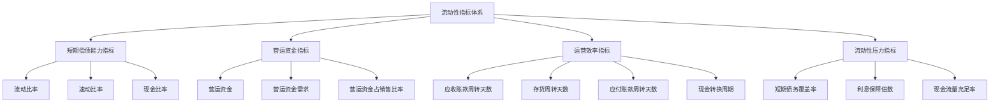

---
{"tags":["财务BP","财务预测","指标预测","流动性指标","现金管理","偿债能力"],"aliases":["偿债能力预测","短期清偿能力分析"],"created":"2024-04-24","update":"2024-04-24","dg-publish":true,"permalink":"/知识共享/001_财务/01_财务BP/01_学习内容/03_财务预测与模型/财务指标预测/流动性指标预测/","dgPassFrontmatter":true}
---

# 流动性指标预测

## 引言

流动性指标是衡量企业短期偿债能力和资金周转效率的重要财务指标。作为财务BP工作的关键组成部分，流动性指标预测帮助企业评估未来的资金状况，防范流动性风险，优化营运资金管理。本文将系统介绍流动性指标预测的方法、技巧和实践案例，为财务BP提供全面的工作指导。

## 核心流动性指标体系

流动性指标体系主要包括以下几类：

### 1. 短期偿债能力指标

- **流动比率** = 流动资产 ÷ 流动负债
- **速动比率** = (流动资产 - 存货) ÷ 流动负债
- **现金比率** = 现金及现金等价物 ÷ 流动负债

### 2. 营运资金指标

- **营运资金** = 流动资产 - 流动负债
- **营运资金需求** = 经营性流动资产 - 经营性流动负债
- **营运资金占销售比率** = 营运资金 ÷ 销售收入

### 3. 运营效率指标

- **应收账款周转天数** = 365 ÷ 应收账款周转率
- **存货周转天数** = 365 ÷ 存货周转率
- **应付账款周转天数** = 365 ÷ 应付账款周转率
- **现金转换周期** = 应收账款周转天数 + 存货周转天数 - 应付账款周转天数

### 4. 流动性压力指标

- **短期债务覆盖率** = 经营活动现金流量 ÷ 短期债务
- **利息保障倍数** = EBIT ÷ 利息支出
- **现金流量充足率** = 经营活动现金流量 ÷ (资本支出 + 债务偿还 + 股利支付)

## 流动性指标预测方法

### 1. 基于业务驱动因素的预测法

该方法识别影响各项流动性指标的关键业务驱动因素，建立驱动因素与指标间的关系模型进行预测。

- **应收账款周转天数预测**：
  - 分析客户结构变化：不同类型客户的付款条件和习惯
  - 考虑信用政策变化：收紧或放宽信用条件的影响
  - 评估行业支付趋势：行业整体付款周期的变化趋势

- **存货周转天数预测**：
  - 分析供应链变化：供应商交货周期、物流效率变化
  - 评估生产周期变化：生产效率提升、工艺流程优化
  - 考虑需求预测准确性：需求波动对安全库存的影响

- **应付账款周转天数预测**：
  - 分析供应商管理策略：供应商集中度、议价能力变化
  - 考虑资金成本变化：延迟付款的机会成本
  - 评估供应链关系策略：与关键供应商的合作模式变化

### 2. 比率分析与趋势预测法

该方法基于历史数据的趋势分析和比率关系，预测未来流动性指标变化。

- **历史趋势分析**：
  - 分析流动性指标的历史趋势和周期性波动
  - 识别趋势背后的结构性因素和临时性因素
  - 基于合理假设延伸历史趋势

- **行业对标比较**：
  - 参考行业平均水平和最佳实践
  - 分析行业领先企业的流动性管理策略
  - 设定合理的流动性指标改进目标

### 3. 情景分析法

针对不同业务情景构建流动性指标预测模型，评估企业在各种情况下的流动性状况。

- **基准情景**：基于最可能的业务预期
- **压力情景**：假设业务面临重大挑战（如销售下滑、收款延迟）
- **增长情景**：假设业务快速扩张带来的流动性压力
- **行业冲击情景**：行业系统性风险导致的流动性挑战

### 4. 现金流模型法

通过详细的现金流预测模型，从根本上预测流动性状况和相关指标。

- **直接法现金流预测**：
  - 按业务活动直接预测现金流入和流出
  - 考虑季节性波动和特殊事件影响
  - 整合资本支出和融资活动的现金流

- **间接法现金流预测**：
  - 基于利润表和资产负债表的变动推导现金流
  - 分析折旧摊销、营运资金变动等非现金项目
  - 考虑资产处置、债务变动等特殊项目

## 流动性指标预测流程

流动性指标预测通常遵循以下流程：

### 1. 业务计划分析

- 分析销售预测及其对收款周期的影响
- 评估生产计划对存货水平的影响
- 考虑采购策略对应付账款的影响
- 分析资本支出计划对现金流的影响

### 2. 驱动因素识别

- 确定各流动性指标的关键驱动因素
- 量化驱动因素与指标之间的关系
- 制定驱动因素的预测假设

### 3. 资产负债预测

- 预测流动资产项目：现金、应收账款、存货等
- 预测流动负债项目：应付账款、短期借款等
- 确保资产负债表预测的平衡性

### 4. 流动性指标计算

- 基于预测的资产负债数据计算流动性指标
- 对比历史水平和行业标准
- 分析指标变化趋势及原因

### 5. 情景压力测试

- 设计多种业务情景，测试流动性承受能力
- 识别可能导致流动性风险的临界点
- 评估流动性缓冲的充足性

### 6. 风险评估与建议

- 识别潜在流动性风险点
- 提出优化流动性结构的建议
- 制定应对流动性压力的预案

### 7. 持续监控与调整

- 建立流动性指标预警系统
- 定期对比实际结果与预测
- 根据实际情况调整预测模型

## 流动性指标预测案例

### 案例一：制造企业业务扩张的流动性预测

**背景情况**：
某制造企业计划在未来两年将产能扩大50%，需要评估扩张过程中的流动性状况。

**预测方法**：
1. **扩张期流动性驱动因素分析**：
   - 前期设备投资导致现金流出增加
   - 产能爬坡期存货水平临时上升
   - 新客户导致应收账款周期可能延长
   - 原材料采购量增加带来的应付账款变化

2. **多阶段流动性预测模型**：
   | 阶段 | 特点 | 重点关注指标 |
   |-----|------|------------|
   | 前期投资阶段 | 资本支出高，产出有限 | 现金比率，短期债务覆盖率 |
   | 产能爬坡阶段 | 存货增加，收入增长滞后 | 存货周转天数，营运资金需求 |
   | 规模效益阶段 | 收入增长，边际成本下降 | 现金转换周期，流动比率 |

3. **流动性指标预测结果**：
   | 指标 | 当前水平 | 投资期 | 爬坡期 | 规模效益期 |
   |-----|---------|-------|-------|-----------|
   | 流动比率 | 1.8 | 1.4 | 1.5 | 1.9 |
   | 速动比率 | 1.2 | 0.9 | 0.8 | 1.3 |
   | 现金转换周期(天) | 45 | 60 | 65 | 40 |
   | 营运资金需求(百万) | 50 | 80 | 95 | 75 |

**关键发现与建议**：
- 在产能爬坡期（第9-18个月），企业将面临最大的流动性压力，速动比率可能降至0.8
- 建议提前安排1亿元的信贷额度作为流动性缓冲
- 针对新客户制定差异化信用政策，控制应收账款增长
- 与核心供应商协商，基于增加的采购量争取更有利的付款条件
- 实施分阶段设备交付，优化投资期现金流

### 案例二：零售企业季节性波动的流动性预测

**背景情况**：
某服装零售企业销售具有明显的季节性特征，面临季节性流动性管理挑战。

**预测方法**：
1. **季节性流动性模式分析**：
   - 分析近3年按月的销售、收款和库存数据
   - 识别季节性高峰期和低谷期的流动性特征
   - 构建季节性指数，反映各月份与年平均水平的偏离度

2. **流动性指标季节性调整模型**：
   | 月份 | 销售季节性指数 | 存货季节性指数 | 现金流季节性指数 |
   |-----|--------------|--------------|----------------|
   | 1月 | 0.7 | 1.2 | 0.9 |
   | 2月 | 0.6 | 1.4 | 0.6 |
   | ... | ... | ... | ... |
   | 11月 | 1.5 | 0.8 | 1.4 |
   | 12月 | 1.8 | 0.6 | 1.7 |

3. **季节性调整后的流动性预测**：
   - 预测各月关键流动性指标，包括现金比率、库存周转天数
   - 识别年内流动性高风险期（2-4月）和低风险期（11-12月）
   - 设计季节性流动性缓冲策略

**优化建议**：
- 建立季节性流动性预警系统，设置月度监控指标
- 配置弹性信贷额度，在低流动性季节（2-4月）提供保障
- 优化采购计划，减少季节性库存堆积
- 设计淡季促销策略，加速存货周转
- 实施季节性供应商付款策略，将大额付款安排在高流动性季节
- 分析并减少非核心资本支出在低流动性季节的安排

### 案例三：科技初创企业融资间隙期的流动性预测

**背景情况**：
某科技初创企业在两轮融资之间需要精确预测和管理流动性，确保资金链安全。

**预测方法**：
1. **现金消耗率分析**：
   - 按周跟踪现金净流出
   - 将消耗分解为固定消耗和可变消耗
   - 建立业务增长与现金消耗的关系模型

2. **创业企业专用流动性指标**：
   - 现金跑道 = 可用现金 ÷ 月均现金消耗
   - 收入对现金比 = 月收入 ÷ 月现金消耗
   - 客户获取成本回收期 = 客户获取成本 ÷ 客户月贡献利润

3. **多情景流动性压力测试**：
   | 情景 | 收入实现率 | 成本控制水平 | 现金跑道 |
   |-----|-----------|------------|---------|
   | 基准情景 | 100% | 100% | 14个月 |
   | 收入延迟 | 70% | 100% | 10个月 |
   | 严峻情景 | 70% | 110% | 8个月 |
   | 生存模式 | 70% | 80% | 12个月 |

**融资间隙期流动性管理策略**：
- 制定精确的每周现金流预测，设置触发级别的支出控制
- 建立"生存模式"支出计划，在现金跑道低于9个月时启动
- 设计客户预付款激励机制，改善早期现金流
- 与供应商协商延期付款或分期付款条件
- 实施"精益启动"原则，将资源优先配置在验证产品市场匹配的核心活动
- 建立低于预期收入的预警机制和快速调整计划

## 流动性指标预测常见挑战与解决方案

### 1. 业务增长带来的流动性压力

**挑战**：业务快速增长往往带来营运资金需求的同步或超比例增长，造成"增长陷阱"。

**解决方案**：
- 建立营运资金需求与销售增长的弹性系数模型
- 设计阶段性增长策略，确保流动性与增长匹配
- 提前安排增长所需融资，避免被动应对
- 优化客户和供应商条款，减少增长对现金周期的压力

### 2. 季节性和周期性波动

**挑战**：季节性和周期性业务波动导致流动性需求不均衡，传统指标可能无法反映真实风险。

**解决方案**：
- 开发季节性调整后的流动性指标
- 建立滚动预测机制，更新短期流动性预期
- 设计时间匹配的融资结构，与业务周期协调
- 维持行业周期底部的流动性缓冲策略

### 3. 外部环境冲击

**挑战**：疫情、金融危机等外部冲击难以预测，但对流动性影响巨大。

**解决方案**：
- 构建流动性冲击情景库，定期测试企业承受能力
- 设计分层流动性缓冲：日常操作层、意外事件层、极端情况层
- 建立早期预警指标，监测外部环境变化信号
- 准备多元化应急融资渠道和预案

### 4. 业务模式转型的流动性影响

**挑战**：从一次性销售转向订阅模式等业务模型转型，对流动性产生结构性影响。

**解决方案**：
- 创建转型期流动性预测专项模型
- 设计业务模式转型的分阶段实施策略
- 平衡短期流动性压力与长期经济价值
- 提前与投资者和债权人沟通转型期流动性变化预期

## 流动性指标预测的最佳实践

### 1. 整合业务与财务视角

- 将销售、采购、生产等业务计划直接映射到流动性预测
- 让业务部门理解其决策对流动性的影响
- 建立流动性导向的业务决策框架

### 2. 采用滚动预测

- 实施13周滚动现金流预测，每周更新
- 季度更新中期（1-2年）流动性指标预测
- 根据预测结果动态调整融资和运营计划

### 3. 设立流动性预警机制

- 建立分级流动性预警指标体系
- 设定不同风险级别的行动触发点
- 定期测试预警系统的有效性

### 4. 培养流动性意识文化

- 将流动性目标纳入绩效考核
- 开展流动性管理培训，提高组织意识
- 在关键决策中强调流动性影响评估

## 相关链接

- [[财务BP/学习内容/财务预测与模型/现金流预测/现金流预测的重要性\|现金流预测的重要性]]
- [[财务BP/学习内容/财务预测与模型/财务报表预测/资产负债表预测方法\|资产负债表预测方法]]
- [[财务BP/学习内容/财务预测与模型/敏感性分析/敏感性分析的目的与方法\|敏感性分析的目的与方法]]
- [[财务BP/学习内容/高级分析方法/风险评估/财务风险识别\|财务风险识别]]
- [[财务BP/学习内容/预算编制基础/资本支出预算/资本支出的财务影响\|资本支出的财务影响]]

## 参考文献

1. Richards, V., & Laughlin, E. (2018). *A Cash Conversion Cycle Approach to Liquidity Analysis*. Financial Management, 29(1), 32-38.
2. 王军. (2021). 《企业现金流管理实务》. 中国财政经济出版社.
3. Weston, J. F., & Brigham, E. F. (2020). *Essentials of Managerial Finance*. The Dryden Press.
4. McKinsey & Company. (2021). *Valuation: Measuring and Managing the Value of Companies*. Wiley Finance.
5. 张明. (2022). 《流动性风险管理》. 机械工业出版社.
6. Brealey, R. A., Myers, S. C., & Allen, F. (2019). *Principles of Corporate Finance*. McGraw-Hill Education.
7. 刘伟东. (2020). 《营运资金管理与优化》. 企业管理出版社. 