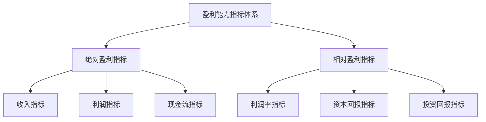

---
{"tags":["财务BP","财务预测","指标预测","盈利能力","财务分析","业绩评估"],"aliases":["盈利指标预测","利润指标预测"],"created":"2024-04-24","update":"2024-04-24","dg-publish":true,"permalink":"/知识共享/001_财务/01_财务BP/01_学习内容/03_财务预测与模型/财务指标预测/盈利能力指标预测/","dgPassFrontmatter":true}
---

# 盈利能力指标预测

## 引言

盈利能力指标预测是财务BP工作中的核心内容，通过对企业未来盈利能力的科学预测，可以帮助管理层评估业务发展趋势，制定合理的经营决策。本文将系统介绍盈利能力指标预测的方法体系、应用技巧和实践案例，帮助财务BP更好地支持企业盈利规划与决策。

## 关键盈利能力指标体系

盈利能力指标可以分为绝对指标和相对指标两大类，预测工作需要对两类指标进行综合考量：

### 绝对盈利指标

- **收入相关指标**：总收入、主营业务收入、其他业务收入
- **利润相关指标**：毛利润、营业利润、利润总额、净利润、EBIT、EBITDA
- **现金流相关指标**：经营现金流、自由现金流

### 相对盈利指标

- **利润率指标**：毛利率、营业利润率、净利润率、EBITDA利润率
- **资本回报指标**：ROE(净资产收益率)、ROA(总资产收益率)、ROIC(投入资本回报率)
- **投资回报指标**：每股收益(EPS)、股息率、每股自由现金流

## 盈利能力指标预测方法

### 1. 历史趋势分析法

- **时间序列分析**：对历史数据进行时间序列分析，识别增长模式和趋势
- **移动平均法**：使用移动平均消除短期波动，识别长期趋势
- **趋势延伸法**：基于历史趋势进行合理延伸，预测未来表现

### 2. 驱动因素分析法

- **收入驱动因素**：市场规模、市场份额、产品价格、销量等
- **成本驱动因素**：原材料价格、人工成本、技术创新、规模效应等
- **资产效率驱动因素**：资产周转率、资产利用效率等

### 3. 行业对标法

- **行业平均水平参考**：参考行业平均盈利水平设定目标
- **领先企业对标**：以行业领先企业作为标杆，设定追赶目标
- **同等规模企业比较**：与类似规模、业务模式的企业进行对比分析

### 4. 情景分析与敏感性分析

- **基准情景预测**：基于最可能的假设预测正常情况下的盈利能力
- **乐观/悲观情景**：构建多种情景，预测不同条件下的盈利表现
- **关键变量敏感性**：分析关键变量变动对盈利能力的影响程度

### 5. 模型预测法

- **回归分析**：利用多元回归分析收入、成本与各种因素的关系
- **分解预测法**：将复杂指标分解为多个子因素分别预测后合成
- **概率模型**：采用蒙特卡洛模拟等概率模型进行风险调整预测

## 盈利能力指标预测流程

盈利能力指标的预测通常遵循以下流程：

### 1. 数据收集与清洗

- 收集历史财务数据，确保数据一致性和完整性
- 收集行业数据、竞争对手信息和宏观经济指标
- 整理内部业务计划、管理层目标和战略变化信息

### 2. 假设条件设定

- 制定宏观经济假设：GDP增长率、通货膨胀率、汇率变动等
- 设定行业假设：市场增长率、竞争格局变化、技术发展趋势等
- 确定公司特定假设：产品线变化、产能扩张、成本结构变革等

### 3. 驱动因素分析

- 识别收入驱动因素：价格、数量、客户渗透率等
- 分析成本驱动因素：材料价格、人工成本、规模效应等
- 评估资产效率驱动因素：资产利用率、资产结构变化等

### 4. 基础指标预测

- 预测收入：按业务线、地区、产品类别等维度预测
- 预测成本：按固定成本、变动成本结构预测
- 预测资产负债：预测营运资金需求、固定资产投资等

### 5. 衍生指标计算

- 基于基础预测计算利润率指标：毛利率、净利率等
- 计算资本回报指标：基于资产负债预测计算ROE、ROA等
- 计算投资回报指标：EPS、股息率等

### 6. 结果验证与调整

- 与历史表现比较，检验合理性
- 与行业数据对标，评估竞争力
- 与战略目标核对，确保一致性
- 根据验证结果进行必要调整

## 盈利能力指标预测案例

### 案例一：零售企业盈利能力指标预测

**背景情况**：
某零售连锁企业计划未来三年扩张门店数量，需要预测盈利能力指标变化。该企业当前拥有100家门店，计划每年新增20家。

**预测方法**：
1. **驱动因素识别**：
   - 收入驱动因素：门店数量、单店销售额、顾客流量、客单价
   - 成本驱动因素：租金成本、人工成本、商品成本、营销费用
   - 资产驱动因素：存货周转率、固定资产投资效率

2. **预测模型构建**：
   - 创建门店成熟度模型：新店、成长期店、成熟店分别设定不同的收入和成本结构
   - 建立门店扩张时间表，映射到财务模型
   - 设计规模效应系数，捕捉批量采购和管理效率提升带来的成本优势

3. **盈利指标预测**：
   | 指标 | 当年 | 第一年 | 第二年 | 第三年 |
   |-----|------|-------|-------|-------|
   | 总收入(百万) | 500 | 600 | 720 | 864 |
   | 毛利率 | 35% | 35.5% | 36% | 36.5% |
   | 营业利润率 | 8% | 8.2% | 8.5% | 9% |
   | 净利润(百万) | 30 | 37 | 46 | 58 |
   | ROE | 15% | 16% | 17% | 18% |

**财务BP提供的洞见**：
- 新店前期投入将短期影响整体利润率，但长期将提升盈利能力
- 规模效应预计在第二年开始明显体现，促使毛利率逐步提升
- 建议重点关注新店达到盈亏平衡点的时间，控制在8个月以内
- 提醒管理层关注单店坪效下降风险，避免过度扩张

### 案例二：科技企业转型期盈利能力预测

**背景情况**：
某软件企业正从传统许可模式转向SaaS订阅模式，需要预测转型期及转型后的盈利能力变化。

**预测方法**：
1. **收入模型转换**：
   - 构建收入转换模型，将一次性许可收入转换为分期订阅收入
   - 设计客户转换曲线，预测现有客户迁移速度和新客户获取情况
   - 预测订阅模式下的客户留存率和生命周期价值

2. **成本结构变化**：
   - 云基础设施成本模型：按用户数和使用量预测
   - 销售模式转变：从大额佣金转向长期激励机制
   - 开发模式变化：从版本发布转向持续交付模式下的成本预测

3. **盈利指标预测**：
   | 指标 | 转型前 | 转型第一年 | 转型第二年 | 转型完成后 |
   |-----|-------|-----------|-----------|-----------|
   | 经常性收入占比 | 20% | 40% | 60% | 85% |
   | 毛利率 | 75% | 70% | 68% | 72% |
   | EBITDA利润率 | 25% | 18% | 15% | 30% |
   | 客户获取成本回收期 | 6个月 | 9个月 | 12个月 | 8个月 |
   | 平均客户生命周期价值 | $50,000 | $65,000 | $80,000 | $100,000 |

**转型期盈利"低谷"分析**：
财务BP提供了详细的"低谷期"分析，说明在转型过程中，企业将经历短期盈利能力下降，但长期将获得更高的预测性收入和客户价值：

- 第一年盈利下滑主要受收入递延确认影响，现金流状况好于利润表表现
- 预计在转型第二年达到盈利低点，第三年开始恢复并超越转型前水平
- 客户生命周期价值提升将成为长期ROI的主要驱动力
- 建议管理层重点关注转型期现金流管理和投资者沟通策略

### 案例三：制造业企业自动化投资盈利能力预测

**背景情况**：
某制造企业计划投资2亿元进行自动化改造，希望预测改造后盈利能力的变化。

**预测方法**：
1. **投资回报模型**：
   - 建立分阶段投资计划和产能释放模型
   - 预测自动化后的人效提升和成本节约
   - 量化质量改进对返工率和客户满意度的影响

2. **情景分析**：
   - 基准情景：按计划完成自动化改造
   - 延迟情景：实施时间延长50%
   - 效益波动情景：自动化效益实现不及预期

3. **盈利指标预测**（基准情景）：
   | 指标 | 改造前 | 改造第一年 | 改造第二年 | 改造完成后 |
   |-----|-------|-----------|-----------|-----------|
   | 产能利用率 | 75% | 70% | 80% | 90% |
   | 单位生产成本 | 100 | 105 | 90 | 75 |
   | 毛利率 | 30% | 28% | 35% | 42% |
   | ROA | 12% | 8% | 14% | 20% |
   | 投资回报期 | - | - | - | 4.5年 |

**多角度盈利分析**：
财务BP不仅提供了基本财务指标预测，还从多角度分析了自动化投资对盈利能力的影响：

- 人工成本结构变化：低技能工人减少，高技能工人增加
- 生产弹性提升对订单响应速度的影响
- 质量提升对品牌溢价的长期贡献
- 自动化与数字化协同效应创造的新业务机会

## 盈利能力指标预测常见挑战及应对策略

### 1. 外部环境不确定性

**挑战**：宏观经济波动、政策变化、市场竞争等外部因素难以准确预测。

**应对策略**：
- 采用情景分析，覆盖乐观、基准、悲观等多种可能
- 构建敏感性分析模型，评估关键外部因素变化的影响
- 设计早期预警指标，及时发现预测偏差

### 2. 业务模式转型的影响

**挑战**：业务模式转型对盈利能力指标产生的短期冲击和长期影响难以准确量化。

**应对策略**：
- 分阶段预测，详细分析转型各阶段的盈利表现
- 利用同行业已完成类似转型的企业数据进行参考
- 使用现金流指标与传统会计指标相结合，全面评估转型影响

### 3. 创新业务缺乏历史数据

**挑战**：新产品、新市场缺乏历史数据支持预测。

**应对策略**：
- 使用类比法，借鉴相似产品或市场的发展轨迹
- 采用"假设-测试-学习"循环，通过小规模试点优化预测
- 设计阶段性里程碑和指标，动态调整预测模型

### 4. 集团多业务单元协同效应

**挑战**：预测多业务单元之间的协同效应对整体盈利能力的提升。

**应对策略**：
- 建立业务单元矩阵模型，识别关键协同点
- 对协同效应进行保守估计，避免过度乐观
- 设计协同效应跟踪机制，验证实际协同成果

## 盈利能力指标预测展示技巧

有效的盈利能力指标预测展示对于决策支持至关重要，推荐以下技巧：

### 1. 可视化展示

- **增长趋势图**：使用折线图展示关键盈利指标的趋势变化
- **情景对比图**：使用条形图或雷达图对比不同情景下的盈利表现
- **驱动因素瀑布图**：展示各因素对盈利能力变化的贡献度
- **预测区间图**：展示预测的置信区间，传达不确定性

### 2. 分层次展示

- **管理层摘要**：一页纸概述核心盈利预测和关键洞见
- **详细分析**：按业务线、区域等维度展示细化预测
- **敏感性分析**：展示关键变量变动对盈利的影响
- **方法论附录**：提供预测方法和关键假设的详细说明

### 3. 叙事技巧

- **讲述盈利故事**：将预测数据与企业战略故事结合
- **明确因果关系**：清晰解释驱动因素如何影响盈利能力
- **提供行动建议**：基于预测结果提出具体优化建议
- **设置预警点**：标识预测中需特别关注的风险节点

## 相关链接

- [[知识共享/001_财务/01_财务BP/01_学习内容/03_财务预测与模型/财务报表预测/利润表预测方法\|利润表预测方法]]
- [[知识共享/001_财务/01_财务BP/01_学习内容/03_财务预测与模型/敏感性分析/敏感性分析的目的与方法\|敏感性分析的目的与方法]]
- [[知识共享/001_财务/01_财务BP/01_学习内容/03_财务预测与模型/情景分析/情景构建方法\|情景构建方法]]
- [[知识共享/001_财务/01_财务BP/01_学习内容/05_高级分析方法/增长模型/可持续增长率分析\|可持续增长率分析]]
- [[知识共享/001_财务/01_财务BP/01_学习内容/06_BP工具与模板/Excel模型构建/财务模型设计原则\|财务模型设计原则]]

## 参考文献

1. Damodaran, A. (2022). *Investment Valuation: Tools and Techniques for Determining the Value of Any Asset*. Wiley Finance.
2. 李明. (2021). 《财务预测与分析》. 中国财政经济出版社.
3. McKinsey & Company. (2020). *Valuation: Measuring and Managing the Value of Companies*. Wiley.
4. 陈志铭. (2023). 《企业价值评估与预测》. 中信出版社.
5. Higgins, R. C. (2022). *Analysis for Financial Management*. McGraw-Hill Education.
6. 刘海龙. (2020). 《盈利能力分析与预测模型》. 经济管理出版社.
7. Palepu, K. G., & Healy, P. M. (2021). *Business Analysis and Valuation: Using Financial Statements*. Cengage Learning. 