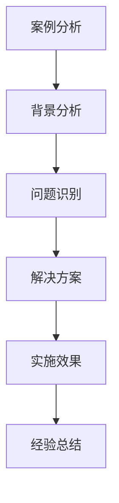

---
{"tags":["财务BP","初创企业","案例分析","预算管理","创业管理"],"aliases":["创业BP案例","初创企业预算案例"],"created":"2024-03-20","dg-publish":true,"permalink":"/知识共享/001_财务/01_财务BP/01_学习内容/04_行业应用/初创企业BP特点/初创企业BP案例分析/","dgPassFrontmatter":true}
---

# 初创企业BP案例分析

> [!abstract] 概述
> 本文档通过具体案例分析，深入探讨初创企业BP的实践应用。通过分析不同行业、不同阶段的初创企业的BP实践，总结成功经验和失败教训，为初创企业提供可借鉴的BP管理方法。

## 一、案例分析方法

### 1. 分析框架

### 2. 分析维度
- 战略目标分析
- 预算编制方法
- 成本控制措施
- 绩效评估体系
- 风险管理机制

## 二、互联网创业案例

### 案例1：社交平台创业
**背景**：
- 企业规模：初创期
- 行业特点：用户增长导向
- 主要挑战：用户获取、变现

**BP实践**：
1. 战略规划
   - 用户增长策略
   - 变现模式设计
   - 产品路线规划
   - 团队建设计划

2. 预算管理
   - 用户获取预算
   - 运营成本预算
   - 团队建设预算
   - 市场推广预算

3. 绩效管理
   - 用户增长指标
   - 变现效率指标
   - 运营效率指标
   - 团队建设指标

**实施效果**：
- 用户快速增长
- 变现模式有效
- 运营效率提升
- 团队建设成功

### 案例2：电商平台创业
**背景**：
- 企业规模：初创期
- 行业特点：交易导向
- 主要挑战：供应链、运营

**BP实践**：
1. 战略规划
   - 供应链建设
   - 运营体系构建
   - 用户增长策略
   - 团队建设计划

2. 预算管理
   - 供应链预算
   - 运营成本预算
   - 市场推广预算
   - 团队建设预算

3. 绩效管理
   - 交易量指标
   - 运营效率指标
   - 用户增长指标
   - 团队建设指标

**实施效果**：
- 供应链完善
- 运营效率提升
- 用户快速增长
- 团队建设成功

## 三、科技创业案例

### 案例3：人工智能创业
**背景**：
- 企业规模：初创期
- 行业特点：技术导向
- 主要挑战：技术突破、市场

**BP实践**：
1. 战略规划
   - 技术路线规划
   - 产品开发计划
   - 市场拓展策略
   - 团队建设计划

2. 预算管理
   - 研发投入预算
   - 市场推广预算
   - 团队建设预算
   - 运营成本预算

3. 绩效管理
   - 技术突破指标
   - 产品开发指标
   - 市场拓展指标
   - 团队建设指标

**实施效果**：
- 技术突破成功
- 产品开发顺利
- 市场拓展有效
- 团队建设成功

### 案例4：硬件创业
**背景**：
- 企业规模：初创期
- 行业特点：产品导向
- 主要挑战：产品开发、供应链

**BP实践**：
1. 战略规划
   - 产品开发计划
   - 供应链建设
   - 市场拓展策略
   - 团队建设计划

2. 预算管理
   - 产品开发预算
   - 供应链预算
   - 市场推广预算
   - 团队建设预算

3. 绩效管理
   - 产品开发指标
   - 供应链指标
   - 市场拓展指标
   - 团队建设指标

**实施效果**：
- 产品开发成功
- 供应链完善
- 市场拓展有效
- 团队建设成功

## 四、案例经验总结

### 1. 成功经验
- 战略规划方法
- 预算管理实践
- 成本控制措施
- 绩效管理体系

### 2. 失败教训
- 战略规划问题
- 预算管理不足
- 成本控制缺陷
- 绩效管理缺失

### 3. 最佳实践建议
1. **战略规划**
   - 明确战略目标
   - 制定实施路径
   - 优化资源配置
   - 完善管理体系

2. **预算管理**
   - 科学预算编制
   - 动态预算调整
   - 预算执行监控
   - 预算评估体系

3. **成本控制**
   - 成本结构优化
   - 运营效率提升
   - 资源利用优化
   - 成本预警机制

## 相关链接

- [[知识共享/001_财务/01_财务BP/01_学习内容/04_行业应用/初创企业BP特点/初创期BP的特殊挑战\|初创期BP的特殊挑战]]
- [[知识共享/001_财务/01_财务BP/01_学习内容/04_行业应用/初创企业BP特点/融资计划与财务规划\|融资计划与财务规划]]
- [[知识共享/001_财务/01_财务BP/01_学习内容/04_行业应用/初创企业BP特点/现金消耗率管理\|现金消耗率管理]]
- [[预算编制基础\|预算编制基础]]
- [[知识共享/001_财务/01_财务BP/01_学习内容/02_预算编制基础/成本预测方法/成本预测方法\|成本预测方法]]

## 参考文献

1. Blank, S. (2013). *The Four Steps to the Epiphany: Successful Strategies for Products that Win*. K&S Ranch.
2. Ries, E. (2011). *The Lean Startup: How Today's Entrepreneurs Use Continuous Innovation to Create Radically Successful Businesses*. Crown Business.
3. 《初创企业BP管理实践研究》，张明，管理科学学报，2020.
4. 《初创企业预算管理案例分析》，李强，财务与会计，2021.
5. 《初创企业成本控制最佳实践》，王华，商业经济研究，2019. 