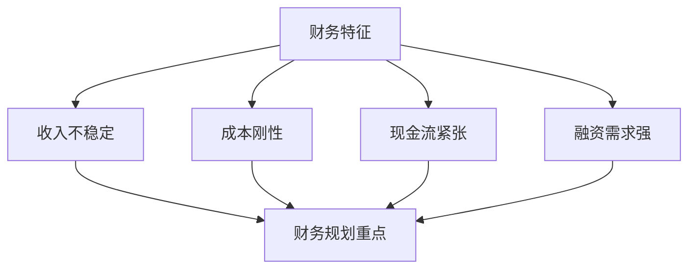
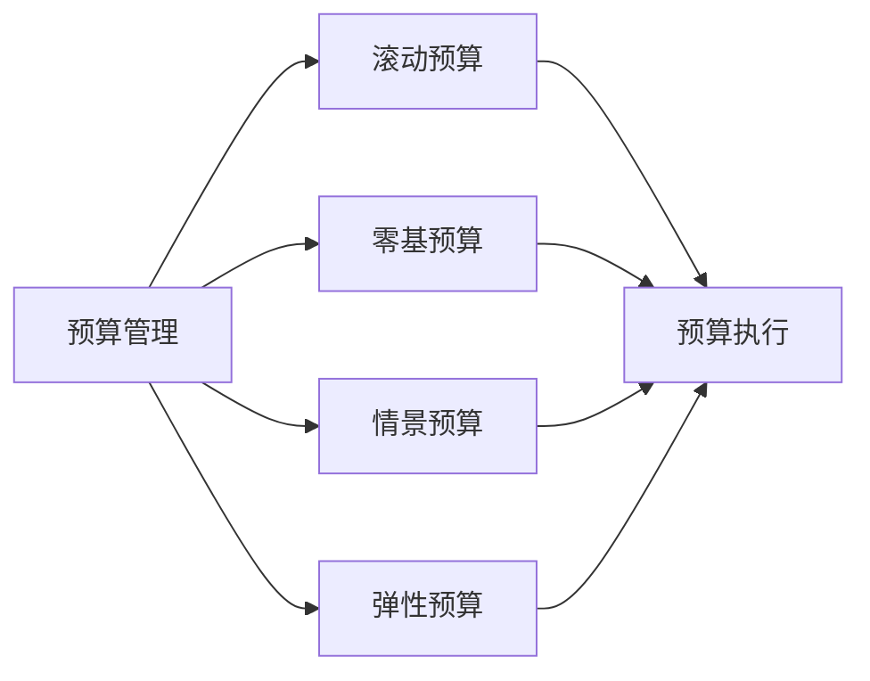

---
{"tags":["财务BP","初创企业","创业管理","预算管理","风险控制"],"aliases":["初创企业BP挑战","创业期预算管理"],"created":"2024-03-20","dg-publish":true,"permalink":"/知识共享/001_财务/01_财务BP/01_学习内容/04_行业应用/初创企业BP特点/初创期BP的特殊挑战/","dgPassFrontmatter":true}
---

# 初创期BP的特殊挑战

> [!abstract] 概述
> 本文档详细分析初创企业在BP管理过程中面临的特殊挑战。初创企业具有资源有限、不确定性高、快速变化等特点，这些特点对财务规划、预算管理和风险控制提出了特殊要求。通过深入理解这些挑战，可以制定更有效的BP策略。

## 一、初创企业的基本特征

### 1. 资源特征
- **资源有限**：资金、人才、技术等资源有限
- **快速变化**：市场、产品、团队快速变化
- **不确定性高**：商业模式、市场前景不确定
- **风险集中**：经营风险、财务风险集中

### 2. 财务特征

## 二、BP管理的主要挑战

### 1. 预算编制挑战
- 收入预测困难
- 成本控制难度大
- 资源分配复杂
- 预算调整频繁

### 2. 现金流管理挑战
- 收入不稳定
- 支出刚性
- 融资困难
- 资金链风险

### 3. 风险控制挑战
- 市场风险
- 运营风险
- 财务风险
- 人才风险

### 4. 绩效管理挑战
- 目标设定困难
- 考核标准模糊
- 激励机制不完善
- 团队管理复杂

## 三、应对策略

### 1. 预算管理策略

### 2. 现金流管理策略
- 收入预测优化
- 成本控制加强
- 融资渠道拓展
- 资金链管理

### 3. 风险控制策略
- 风险识别
- 风险评估
- 风险应对
- 风险监控

### 4. 绩效管理策略
- 目标设定
- 考核体系
- 激励机制
- 团队建设

## 四、案例分析

### 案例1：互联网创业公司
**背景**：某互联网创业公司处于初创期。

**挑战**：
1. 预算管理
   - 收入预测困难
   - 成本控制难度大
   - 资源分配复杂
   - 预算调整频繁

2. 现金流管理
   - 收入不稳定
   - 支出刚性
   - 融资困难
   - 资金链风险

3. 风险控制
   - 市场风险
   - 运营风险
   - 财务风险
   - 人才风险

**应对策略**：
1. 预算管理
   - 实施滚动预算
   - 加强成本控制
   - 优化资源分配
   - 建立预算调整机制

2. 现金流管理
   - 优化收入预测
   - 加强成本控制
   - 拓展融资渠道
   - 加强资金链管理

3. 风险控制
   - 建立风险识别机制
   - 加强风险评估
   - 制定风险应对措施
   - 建立风险监控体系

**实施效果**：
- 预算管理改善
- 现金流状况改善
- 风险控制加强
- 经营状况改善

### 案例2：科技创业公司
**背景**：某科技创业公司处于初创期。

**挑战**：
1. 产品开发
   - 技术不确定性
   - 开发周期长
   - 成本控制难
   - 质量保证难

2. 市场拓展
   - 市场不确定性
   - 竞争激烈
   - 获客成本高
   - 变现困难

3. 团队管理
   - 人才招聘难
   - 团队不稳定
   - 激励机制不完善
   - 文化建设难

**应对策略**：
1. 产品开发
   - 加强技术评估
   - 优化开发流程
   - 加强成本控制
   - 完善质量保证

2. 市场拓展
   - 加强市场调研
   - 优化营销策略
   - 控制获客成本
   - 创新变现模式

3. 团队管理
   - 优化招聘策略
   - 加强团队建设
   - 完善激励机制
   - 加强文化建设

**实施效果**：
- 产品开发改善
- 市场拓展有效
- 团队管理改善
- 经营状况改善

## 五、最佳实践建议

1. **预算管理**
   - 实施滚动预算
   - 加强成本控制
   - 优化资源分配
   - 建立预算调整机制

2. **现金流管理**
   - 优化收入预测
   - 加强成本控制
   - 拓展融资渠道
   - 加强资金链管理

3. **风险控制**
   - 建立风险识别机制
   - 加强风险评估
   - 制定风险应对措施
   - 建立风险监控体系

4. **绩效管理**
   - 设定合理目标
   - 建立考核体系
   - 完善激励机制
   - 加强团队建设

## 相关链接

- [[知识共享/001_财务/01_财务BP/01_学习内容/04_行业应用/初创企业BP特点/融资计划与财务规划\|融资计划与财务规划]]
- [[知识共享/001_财务/01_财务BP/01_学习内容/04_行业应用/初创企业BP特点/现金消耗率管理\|现金消耗率管理]]
- [[知识共享/001_财务/01_财务BP/01_学习内容/04_行业应用/初创企业BP特点/初创企业BP案例分析\|初创企业BP案例分析]]
- [[预算编制基础\|预算编制基础]]
- [[现金流预测\|现金流预测]]

## 参考文献

1. Blank, S. (2013). *The Four Steps to the Epiphany: Successful Strategies for Products that Win*. K&S Ranch.
2. Ries, E. (2011). *The Lean Startup: How Today's Entrepreneurs Use Continuous Innovation to Create Radically Successful Businesses*. Crown Business.
3. 《初创企业预算管理研究》，张明，管理科学学报，2020.
4. 《初创企业现金流管理实践》，李强，财务与会计，2021.
5. 《初创企业风险控制最佳实践》，王华，商业经济研究，2019. 