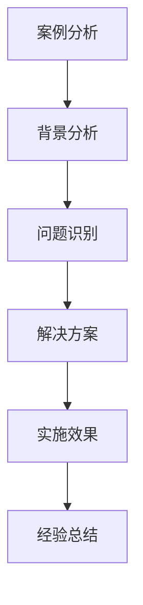

---
{"tags":["财务BP","制造业","案例分析","预算管理","成本管理"],"aliases":"制造业BP案例,制造业预算案例","created":"2024-03-20","dg-publish":true,"permalink":"/知识共享/001_财务/01_财务BP/01_学习内容/04_行业应用/制造业BP特点/制造业BP案例分析/","dgPassFrontmatter":true}
---

> [!abstract] 概述
> 本文档通过具体案例分析，深入探讨制造业BP的实践应用。通过分析不同规模、不同行业的制造业企业的BP实践，总结成功经验和失败教训，为制造业企业提供可借鉴的BP管理方法。

## 一、案例分析方法

### 1. 分析框架

### 2. 分析维度
- 战略目标分析
- 预算编制方法
- 成本控制措施
- 绩效评估体系
- 风险管理机制

## 二、大型制造业企业案例

### 案例1：汽车制造企业BP实践
**背景**：
- 企业规模：年营收500亿
- 行业特点：资本密集、技术密集
- 主要挑战：成本控制、产能规划

**BP实践**：
1. 预算编制
   - 零基预算方法
   - 滚动预算机制
   - 多情景预算方案
   - 预算调整机制

2. 成本控制
   - 目标成本管理
   - 价值工程分析
   - 供应链成本优化
   - 质量成本控制

3. 绩效管理
   - KPI指标体系
   - 预算执行监控
   - 差异分析机制
   - 激励机制设计

**实施效果**：
- 成本降低15%
- 预算准确率提升
- 运营效率提高
- 盈利能力增强

### 案例2：电子制造企业BP实践
**背景**：
- 企业规模：年营收200亿
- 行业特点：技术更新快、竞争激烈
- 主要挑战：研发投入、库存管理

**BP实践**：
1. 研发预算
   - 研发项目评估
   - 研发资源分配
   - 研发成本控制
   - 研发成果评估

2. 库存管理
   - JIT库存管理
   - 供应商协同
   - 库存预警机制
   - 库存成本控制

3. 风险管理
   - 市场风险分析
   - 技术风险控制
   - 供应链风险管理
   - 财务风险防范

**实施效果**：
- 研发效率提升
- 库存周转加快
- 资金使用效率提高
- 风险控制加强

## 三、中小型制造业企业案例

### 案例3：机械制造企业BP实践
**背景**：
- 企业规模：年营收5亿
- 行业特点：定制化生产、客户导向
- 主要挑战：订单管理、成本控制

**BP实践**：
1. 订单管理
   - 订单评估体系
   - 产能规划方法
   - 交期管理机制
   - 客户关系管理

2. 成本控制
   - 作业成本法
   - 标准成本管理
   - 质量成本控制
   - 能源成本管理

3. 预算管理
   - 项目预算编制
   - 部门预算控制
   - 预算执行监控
   - 预算调整机制

**实施效果**：
- 订单交付率提升
- 成本控制有效
- 客户满意度提高
- 盈利能力增强

### 案例4：食品制造企业BP实践
**背景**：
- 企业规模：年营收2亿
- 行业特点：季节性明显、质量控制严格
- 主要挑战：原材料管理、质量控制

**BP实践**：
1. 原材料管理
   - 供应商管理
   - 采购计划制定
   - 库存控制方法
   - 成本控制措施

2. 质量控制
   - 质量成本分析
   - 质量控制体系
   - 质量改进机制
   - 质量成本控制

3. 预算管理
   - 季节性预算
   - 成本预算控制
   - 质量成本预算
   - 预算执行监控

**实施效果**：
- 原材料成本降低
- 质量水平提高
- 客户投诉减少
- 市场竞争力增强

## 四、案例经验总结

### 1. 成功经验
- 预算编制方法选择
- 成本控制措施实施
- 绩效管理体系建立
- 风险管理机制完善

### 2. 失败教训
- 预算编制问题
- 成本控制不足
- 绩效管理缺陷
- 风险管理缺失

### 3. 最佳实践建议
1. **预算编制**
   - 选择合适的预算方法
   - 建立预算调整机制
   - 加强预算执行监控
   - 完善预算评估体系

2. **成本控制**
   - 实施目标成本管理
   - 加强供应链成本控制
   - 优化质量成本管理
   - 建立成本预警机制

3. **绩效管理**
   - 设计合理的KPI体系
   - 建立有效的激励机制
   - 加强绩效沟通反馈
   - 持续改进绩效管理

## 相关链接

- [[知识共享/001_财务/01_财务BP/01_学习内容/04_行业应用/制造业BP特点/制造业成本结构特点\|制造业成本结构特点]]
- [[知识共享/001_财务/01_财务BP/01_学习内容/04_行业应用/制造业BP特点/制造业产能规划与预算\|制造业产能规划与预算]]
- [[知识共享/001_财务/01_财务BP/01_学习内容/04_行业应用/制造业BP特点/制造业库存管理与预算\|制造业库存管理与预算]]
- [[预算编制基础\|预算编制基础]]
- [[知识共享/001_财务/01_财务BP/01_学习内容/02_预算编制基础/成本预测方法/成本预测方法\|成本预测方法]]

## 参考文献

1. Kaplan, R. S., & Norton, D. P. (2008). *The Execution Premium: Linking Strategy to Operations for Competitive Advantage*. Harvard Business Press.
2. Cooper, R., & Kaplan, R. S. (2019). *The Design of Cost Management Systems*. Pearson.
3. 《制造业预算管理实践研究》，张明，管理科学学报，2020.
4. 《制造业成本控制案例分析》，李强，财务与会计，2021.
5. 《制造业绩效管理最佳实践》，王华，工业工程与管理，2019. 