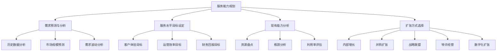
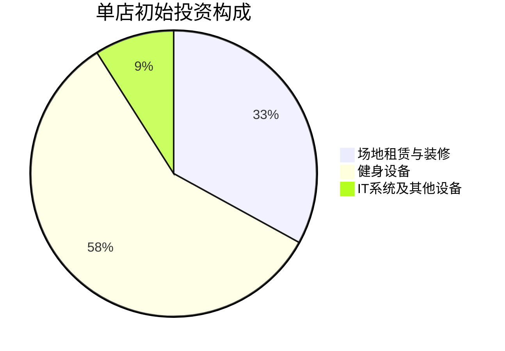
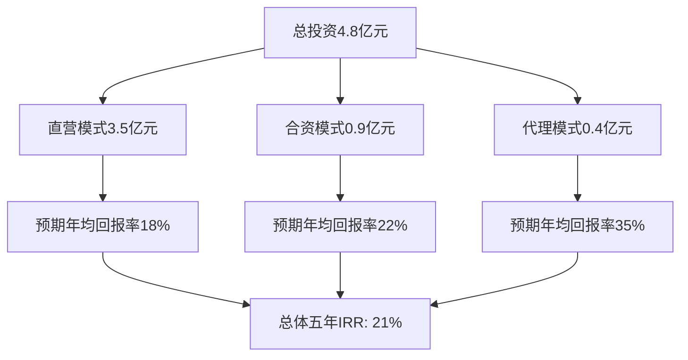
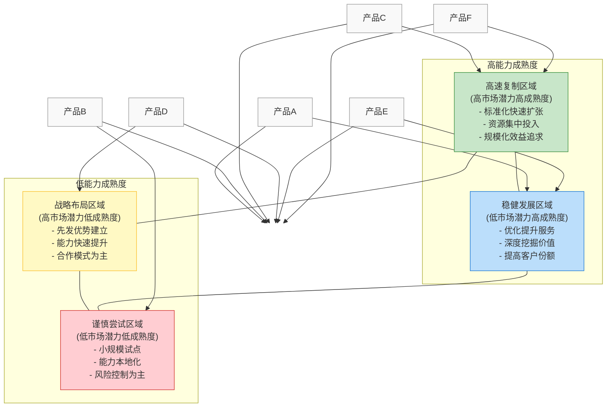

---
{"title":"服务能力与扩张预算","date":"2023-11-25","tags":["财务BP","服务业","能力规划","扩张预算","容量管理","行业应用"],"description":"本文详细分析服务业能力规划、扩张预算的特点、方法及优化策略","dg-publish":true,"permalink":"/知识共享/001_财务/01_财务BP/01_学习内容/04_行业应用/服务业BP特点/服务能力与扩张预算/","dgPassFrontmatter":true}
---

## 引言

服务业的核心竞争力在于为客户提供满足需求的服务能力，这种能力既包括数量维度的服务容量，也包括质量维度的服务水平。与制造业不同，服务业的能力扩张往往具有不可存储、高度依赖人员和设施资源、难以快速调整等特点，这使得服务能力规划和扩张预算成为服务型企业财务BP工作的重要挑战。本文将详细探讨服务业能力扩张特点、规划方法、预算编制以及实施策略，帮助财务BP在服务业扩张决策中发挥更积极的战略支持作用。

## A. 服务能力的基本概念

### 服务能力的定义与维度

服务能力是指企业在特定时间内交付特定数量和质量服务的潜力，主要包括以下维度：

1. **服务容量**：单位时间内可处理的最大服务量
2. **服务覆盖范围**：地理、时间和客户群体的覆盖程度
3. **服务质量水平**：服务的专业性、一致性和客户满意度
4. **服务弹性**：应对需求波动的能力
5. **服务韧性**：在异常情况下维持服务的能力

### 服务能力的关键特性

与制造业产能相比，服务能力具有以下独特特性：

1. **不可存储性**：服务能力无法像产品一样库存，未使用的能力即为浪费
2. **同时性**：服务的生产和消费同时发生，增加了能力配置难度
3. **人员依赖性**：服务能力高度依赖人员素质和数量
4. **设施约束性**：物理空间和设备往往是服务能力的限制因素
5. **质量敏感性**：服务扩张可能对服务质量产生挑战
6. **网络效应**：某些服务存在明显的网络效应，影响扩张策略

## B. 服务业能力规划的关键因素

### 1. 需求预测与分析

精准的需求预测是服务能力规划的基础：

- **基础需求分析**：历史数据分析、市场调研、客户洞察
- **需求模式识别**：季节性、周期性、时段性波动规律
- **需求细分**：按客户群体、地域、服务类型的需求细分
- **需求弹性**：价格、营销等因素对需求的影响程度

### 2. 服务水平目标设定

服务水平目标直接影响所需能力水平：

- **可用性指标**：服务可获取的时间比例
- **响应性指标**：服务响应速度和等待时间
- **可靠性指标**：服务质量稳定性和一致性
- **容量充足率**：高峰期服务能力利用率
- **服务体验指标**：客户满意度和NPS评分

### 3. 现有能力分析

全面评估当前服务能力状况：

- **能力盘点**：人员、设施、系统、流程能力评估
- **瓶颈识别**：识别限制整体服务能力的关键瓶颈
- **利用率分析**：不同时段、区域的能力利用情况
- **能力缺口**：与目标服务水平的差距分析

### 4. 扩张方式选择

根据战略目标选择合适的扩张方式：

- **内部增长**：增加自有资源和能力
- **并购扩张**：收购现有服务提供商
- **战略联盟**：与合作伙伴共同提供服务
- **特许经营**：通过授权模式扩张服务网络
- **数字化扩张**：借助数字技术扩展服务边界

## C. 服务业扩张预算编制方法

### 1. 资本性支出预算

资本性支出是服务扩张中的核心预算项目：

#### 场地与设施投资

- **场地获取成本**：购置、租赁、装修费用
- **设施建设成本**：基础设施和专用设备
- **IT基础设施投资**：硬件、网络、安全系统
- **装修与形象投资**：店面装修、品牌视觉元素
- **资产折旧计划**：折旧方法和年限设定

#### 技术系统投资

- **核心业务系统**：服务交付和管理系统
- **客户关系管理系统**：CRM和会员管理
- **运营支持系统**：ERP、SCM、人力资源系统
- **数据分析平台**：商业智能和决策支持
- **集成与定制开发**：系统整合和功能定制

#### 固定资产与设备投资

- **服务设备**：直接用于服务交付的设备
- **运营设备**：支持日常运营的设备
- **办公设备**：工作环境所需设备
- **备用设备**：确保服务连续性的备份设备
- **设备更新计划**：老化设备的更新周期

### 2. 人员投入预算

人员投入通常是服务扩张预算的最大组成部分：

#### 人员招聘与培训成本

- **招聘成本**：广告、猎头、入职奖金
- **培训成本**：初始培训、持续发展
- **人员认证**：必要的资格认证费用
- **知识管理**：知识库建设和维护
- **企业文化建设**：团队建设与文化融合

#### 人员结构与薪酬体系

- **岗位设计**：岗位结构和职责划分
- **薪酬等级**：不同职位的薪酬标准
- **激励机制**：绩效奖金和长期激励
- **福利计划**：基本福利和特色福利
- **晋升通道**：职业发展路径设计

#### 管理团队建设

- **管理层配置**：各级管理人员配比
- **管理能力发展**：管理技能培训
- **组织架构设计**：扁平化vs层级化选择
- **授权与监督机制**：管理流程与决策权
- **跨区域管理**：多地点协调机制

### 3. 运营准备预算

运营准备是确保扩张顺利实施的关键预算环节：

#### 市场培育与客户获取

- **市场调研**：目标市场深入分析
- **品牌建设**：品牌延伸与本地化
- **宣传推广**：开业宣传与持续营销
- **客户引流**：初始客户获取活动
- **客户转化**：试用与转化机制

#### 服务标准化与流程设计

- **服务标准设计**：服务规范与标准制定
- **流程优化**：服务流程设计与测试
- **质量管理体系**：质量控制与保证机制
- **服务工具开发**：辅助工具与模板
- **标准实施培训**：一线人员培训与考核

#### 供应链与后勤体系

- **供应商网络**：关键供应商建立与管理
- **库存管理**：初始库存与补货机制
- **物流配送**：物流网络建设
- **后勤支持**：基础设施支持系统
- **应急预案**：服务中断应对措施

### 4. 期间费用预算

期间费用预算确保扩张后的可持续运营：

#### 销售费用

- **销售团队成本**：销售人员薪酬与佣金
- **营销推广费用**：持续营销活动支出
- **客户维护成本**：客户关系管理费用
- **销售工具与系统**：销售支持系统费用
- **渠道管理费用**：分销渠道建设与维护

#### 管理费用

- **行政人员成本**：管理与职能部门人员
- **办公经费**：日常办公与行政支出
- **专业服务费**：外部顾问与咨询
- **合规与认证**：法规遵从与行业认证
- **企业管理系统**：管理信息系统费用

#### 研发与创新费用

- **服务创新投入**：新服务开发费用
- **技术研发支出**：技术升级与优化
- **市场研究费用**：客户需求研究
- **试点与测试**：新服务试点项目
- **知识产权保护**：专利与商标费用

## D. 服务业不同扩张模式的预算特点

### 1. 直营扩张模式

企业自主投资和运营的扩张方式：

#### 预算特点

- 资本支出比重大：场地、设备等固定资产投入高
- 前期投入集中：开业前准备期资金需求集中
- 人员成本占比高：直接控制所有服务人员
- 规模经济明显：总部职能部门可支持多个网点
- 控制力强：统一标准和流程，降低管理成本

#### 财务规划重点

- 详细的资本支出规划
- 完整的人员配置与成本预算
- 精确的营运资金需求测算
- 分阶段的投资回收模型
- 网点级别的盈亏平衡分析

### 2. 特许经营模式

通过授权合作伙伴使用品牌、系统和流程进行扩张：

#### 预算特点

- 初始投资较低：加盟商承担大部分资本投入
- 收入结构特殊：加盟费、持续特许费构成主要收入
- 支持成本明显：品牌、系统和培训支持成本
- 扩张速度快：可利用加盟商资源快速扩张
- 管控成本增加：质量监督和品牌保护成本

#### 财务规划重点

- 特许经营体系建设投入
- 加盟商支持系统成本
- 特许费用结构设计
- 品牌保护与质量控制投入
- 加盟商绩效监控系统投入

### 3. 合作伙伴模式

与现有服务提供商建立战略合作关系进行扩张：

#### 预算特点

- 投资分担：合作双方共同承担投资
- 边界明确：各方责任与成本界限清晰
- 资源互补：双方优势互补，降低总体成本
- 复杂度高：协调成本和管理复杂度增加
- 风险共担：业务风险在合作方之间分散

#### 财务规划重点

- 合作协议财务条款设计
- 共同投资项目预算
- 利益分配机制设计
- 协调与管理成本预算
- 退出机制财务安排

### 4. 数字化扩张模式

通过数字技术和平台扩展服务边界：

#### 预算特点

- 技术投入为主：平台和系统开发是主要投入
- 边际成本低：服务用户增加的边际成本低
- 固定成本高：基础设施和核心系统成本高
- 规模经济显著：用户规模增长带来明显成本优势
- 迭代投入持续：需持续技术更新和功能迭代

#### 财务规划重点

- 技术平台开发与维护预算
- 用户获取成本预算
- 数据基础设施投入
- 安全与合规投入
- 持续迭代与创新预算

## E. 服务业扩张的财务评估方法

### 1. 投资回报分析

评估扩张项目的财务价值：

#### 常用评估指标

- **投资回收期**：静态和动态回收期
- **净现值(NPV)**：考虑时间价值的净收益
- **内部收益率(IRR)**：项目实际回报率
- **投资回报率(ROI)**：投入产出比
- **资本回报率(ROCE)**：资本使用效率

#### 分析方法与步骤

1. **现金流预测**：未来5-10年现金流详细预测
2. **折现率确定**：基于资本成本和风险调整
3. **敏感性分析**：关键变量对投资回报的影响
4. **情景分析**：不同假设下的投资结果
5. **阈值分析**：财务指标达标的关键条件

### 2. 风险评估与管理

识别和管理扩张风险：

#### 主要风险类型

- **市场风险**：需求不及预期、竞争加剧
- **运营风险**：服务质量下降、标准执行不力
- **人才风险**：关键人才短缺、文化融合困难
- **合规风险**：不同地区法规差异
- **财务风险**：资金不足、成本超支

#### 风险量化与应对

1. **风险矩阵**：概率与影响评估
2. **压力测试**：极端情况财务影响分析
3. **风险缓解计划**：预防与应对措施
4. **风险监控指标**：早期预警指标设定
5. **财务储备计划**：风险准备金设置

### 3. 战略价值评估

超越财务指标的战略价值考量：

#### 战略维度评估

- **市场占有率提升**：规模与覆盖提升
- **竞争地位强化**：先发优势或防御价值
- **协同效应**：与现有业务的协同价值
- **品牌影响力**：品牌认知度与价值提升
- **创新能力**：新市场学习与能力建设

#### 非财务指标评价

1. **客户获取**：新增客户数量与质量
2. **服务体验**：客户满意度与NPS指标
3. **品牌指标**：品牌知名度与美誉度提升
4. **人才资产**：人才吸引力与发展平台
5. **知识积累**：组织学习与知识沉淀

## F. 服务业扩张预算案例分析

### 案例一：连锁健身中心全国扩张预算

#### 背景
某中高端健身中心品牌计划在3年内从现有的25家门店扩张到100家，覆盖全国30个主要城市。公司采用直营为主、少量合作的模式进行扩张。

#### 扩张规划
- **第一年**：新增20家门店，主要在现有城市扩点
- **第二年**：新增25家门店，进入10个新城市
- **第三年**：新增30家门店，深化全国布局

#### 预算架构与关键假设

1. **投资预算**

主要资本支出项目：
- 场地租赁及装修：平均每店200万元(含租赁押金)
- 健身设备：平均每店350万元
- IT系统及其他设备：平均每店50万元

2. **人员预算**

人员配置与成本：
- 每店标准配置：1名店经理、2名运营主管、8名全职教练、12名兼职教练、4名前台与行政
- 总部扩张团队：区域经理、开发团队、培训团队、IT支持
- 人员成本占运营成本的65%左右

3. **运营准备预算**

- 开业前准备期：平均3个月
- 开业营销活动：每店15万元
- 初始会员获取：前3个月推广费用30万元
- 培训与流程建设：每店10万元

4. **财务假设**

- 平均会员价格：年卡4800元，季卡1500元
- 会员结构：年卡50%，季卡40%，月卡10%
- 私教课程：平均客单价300元/节
- 单店盈亏平衡点：1200名活跃会员
- 成熟门店息税前利润率：25%-30%

#### 单店收入与成本预测

按门店生命周期阶段划分：

| 阶段 | 时间周期 | 会员数 | 月均收入 | 月均成本 | 月均利润 |
|------|---------|--------|---------|---------|---------|
| 筹备期 | 开业前3个月 | 0 | 0 | 30万 | -30万 |
| 导入期 | 1-6个月 | 300-800 | 40-90万 | 70-80万 | -30万至10万 |
| 成长期 | 7-18个月 | 800-1500 | 90-160万 | 80-100万 | 10-60万 |
| 成熟期 | 19个月后 | 1500-2000 | 160-200万 | 100-120万 | 60-80万 |

#### 总体投资与回报预测

3年扩张计划总投资约5.2亿元：
- 第一年：1.2亿元(20家新店)
- 第二年：1.5亿元(25家新店)
- 第三年：1.8亿元(30家新店)
- 总部扩张支持投入：0.7亿元

预期财务回报：
- 项目总体IRR：23%
- 平均单店投资回收期：3年
- 第三年末整体营收预测：9.6亿元
- 第五年末整体净利润预测：2.3亿元

#### 风险管理策略

主要风险与应对：
1. **选址风险**：分步投入，先签短期意向，条件达标再签长约
2. **人才短缺**：建立教练培训学院，提前储备人才
3. **会员获取不达标**：制定阶段性会员目标，未达目标优化营销策略
4. **品牌标准执行难**：强化IT系统监控，建立标准执行检查机制
5. **资金压力**：设立门店扩张专项资金，保持30%储备金

### 案例二：跨国企业服务公司本地化扩张预算

#### 背景
某跨国企业服务公司计划在中国市场加速扩张，从目前的3个城市扩展到10个城市，将服务能力提升3倍，服务范围从大型跨国企业扩展到本土成长型企业。

#### 扩张策略
- **核心城市直营**：北京、上海、广州、深圳设立全资子公司
- **成长型城市合作**：杭州、成都、武汉等通过合资方式扩张
- **新兴城市代理**：其他城市通过授权代理模式覆盖

#### 多元扩张模式预算特点

1. **直营模式投资(4个核心城市)**

- 办公场地：每城市租赁1000-1500平方米，年租金成本600-900万元
- 专业人才：每城市招聘50-80名专业顾问，年薪资成本2500-4000万元
- 本地化系统开发：核心业务系统适应本地需求，投入1200万元
- 营销与品牌建设：本地市场品牌建设与客户获取，每城市年投入500万元

2. **合资模式投资(3个成长型城市)**

- 股权投资：每个合资公司投入1000-1500万元(占股51%)
- 品牌授权：授权本地使用品牌，收取品牌使用费(收入5%)-
- 系统赋能：提供核心服务系统与知识库，培训当地团队
- 质量控制：派驻2-3名核心管理人员，保障服务标准

3. **代理模式投资(3个新兴城市)**

- 代理商选择：遴选标准开发与审核，投入100万元
- 培训体系：代理商培训项目开发，投入300万元
- 支持平台：代理商支持系统开发，投入500万元
- 管控机制：代理商管理与监督体系，年运营成本150万元

#### 服务能力指标与预算关系

服务能力维度与预算投入对应关系：

| 服务能力维度 | 关键指标 | 主要预算投入项 | 投入占比 |
|------------|---------|--------------|---------|
| 专业人才能力 | 顾问数量与专业认证 | 招聘、培训、认证费用 | 45% |
| 方法论与工具 | 本地化方法与工具数 | 研发、本地化、知识管理 | 20% |
| 客户覆盖能力 | 城市覆盖与响应时间 | 网络扩张、IT系统、交通 | 15% |
| 解决方案能力 | 定制化解决方案数量 | 方案开发、专家网络 | 10% |
| 品牌影响力 | 品牌认知度与客户推荐 | 品牌建设、市场活动 | 10% |

#### 扩张预算控制机制

按扩张阶段实施精细预算控制：

1. **进入评估阶段**
   - 市场调研与可行性分析预算：每城市50万元
   - 合作伙伴评估与尽职调查：每合作方30万元
   - 关键决策点：投资委员会评估，通过后进入下阶段

2. **筹备建设阶段**
   - 预算释放方式：分阶段释放，25%-50%-25%
   - 里程碑检查点：场地确认、团队组建、系统部署
   - 预算调整机制：月度审核，偏差超10%需特别审批

3. **运营提升阶段**
   - 业绩挂钩预算：营销与奖励预算与目标达成挂钩
   - 弹性资源配置：根据业务增长动态调整资源
   - 集中采购与资源共享：降低扩张边际成本

#### 财务预测与回报分析

五年期财务预测摘要：

扩张投资回报差异分析：
- 直营模式：初期投入大，回报周期长，但长期价值高
- 合资模式：中等投入，回报相对较快，控制力适中
- 代理模式：投入少，回报快，但品牌风险高，长期价值有限

## G. 服务能力扩张的策略建议

### 1. 分阶段扩张策略

平衡速度、质量与资金压力：

1. **试点验证阶段**
   - 在有限区域试点新模式
   - 验证关键假设和财务模型
   - 完善服务标准和流程
   - 建立初步的扩张团队

2. **重点突破阶段**
   - 集中资源在核心市场扩张
   - 建立区域中心和支持体系
   - 优化运营模式和标准
   - 培养扩张管理人才

3. **全面扩张阶段**
   - 快速复制成熟模式
   - 利用规模效应降低边际成本
   - 多元化扩张模式并行
   - 建立品牌网络效应

### 2. 能力矩阵扩张模型

根据能力成熟度选择扩张策略：

扩张策略选择原则：
- 高能力成熟度+高市场潜力：优先大规模直接投入
- 高能力成熟度+低市场潜力：精细化运营提升效益
- 低能力成熟度+高市场潜力：战略性布局，合作优先
- 低能力成熟度+低市场潜力：谨慎试点，能力建设为先

### 3. 服务标准化与个性化平衡

提高扩张效率同时保持服务质量：

1. **模块化服务设计**
   - 核心服务标准化，保证基础质量
   - 增值服务个性化，满足差异化需求
   - 建立服务组件库，灵活组合定制

2. **知识管理体系**
   - 经验显性化，沉淀最佳实践
   - 知识共享平台，降低对个人依赖
   - 案例库与解决方案库建设

3. **数据驱动服务提升**
   - 服务数据标准化采集
   - 客户画像与需求分析
   - 持续服务优化闭环

### 4. 技术赋能扩张策略

利用技术提升扩张效率和降低成本：

1. **数字化服务平台**
   - 线上线下融合服务模式
   - 客户自助服务比例提升
   - 远程服务能力建设

2. **智能化运营系统**
   - 标准化流程自动化执行
   - 智能排产与资源调配
   - 预测性维护与管理

3. **云端集中化管理**
   - 总部系统云端部署
   - 分支机构轻资产运营
   - 实时业务监控与支持

## 相关链接

- [[知识共享/001_财务/01_财务BP/01_学习内容/04_行业应用/服务业BP特点/服务业成本结构特点\|服务业成本结构特点]]
- [[知识共享/001_财务/01_财务BP/01_学习内容/04_行业应用/服务业BP特点/服务业收入模式特点\|服务业收入模式特点]]
- [[知识共享/001_财务/01_财务BP/01_学习内容/04_行业应用/服务业BP特点/人员成本规划\|人员成本规划]]
- [[知识共享/001_财务/01_财务BP/01_学习内容/05_高级分析方法/投资回报分析/投资回收期分析\|投资回收期分析]]
- [[知识共享/001_财务/01_财务BP/01_学习内容/02_预算编制基础/资本支出预算/资本支出评估方法\|资本支出评估方法]]

## 参考文献

1. 刘建华 (2022). 《服务业扩张战略与实施》. 中国经济出版社.
2. 王志强, 李晓明 (2021). 《服务能力规划与预算管理》. 企业管理出版社.
3. Heskett, J. L., & Sasser, W. E. (2020). *The Service Profit Chain: How Leading Companies Link Profit and Growth to Service, Satisfaction, and Value*. Harvard Business Review Press.
4. 德勤咨询 (2023). 《服务业多元化扩张模式研究》. 德勤研究报告.
5. 中国连锁经营协会 (2023). 《中国服务业连锁扩张报告》.
6. Fitzsimmons, J. A., & Fitzsimmons, M. J. (2019). *Service Management: Operations, Strategy, and Information Technology*. McGraw-Hill. 