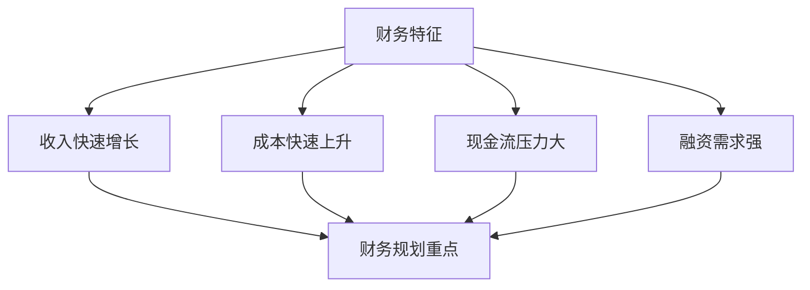

---
{"tags":["财务BP","科技企业","快速增长","战略规划","预算管理"],"aliases":["增长阶段BP策略","快速扩张预算"],"created":"2024-03-20","dg-publish":true,"permalink":"/知识共享/001_财务/01_财务BP/01_学习内容/04_行业应用/科技企业BP特点/快速增长阶段的BP策略/","dgPassFrontmatter":true}
---

> [!abstract] 概述
> 本文档详细分析科技企业在快速增长阶段的BP策略特点、方法和实践。快速增长阶段是科技企业发展的重要阶段，需要科学的财务规划和管理方法。通过合理的BP策略，可以支持企业快速扩张，实现可持续发展。

## 一、快速增长阶段的基本特征

### 1. 增长特征
- **高增长性**：收入快速增长
- **高投入性**：持续大规模投入
- **高不确定性**：市场变化快
- **高竞争性**：竞争激烈

### 2. 财务特征

## 二、快速增长阶段的BP策略

### 1. 收入增长策略
- 市场扩张计划
- 产品线扩展
- 客户群体扩大
- 收入模式创新

### 2. 成本控制策略
- 规模效应优化
- 运营效率提升
- 成本结构优化
- 资源利用效率

### 3. 资金管理策略
- 融资规划
- 现金流管理
- 投资规划
- 风险控制

### 4. 组织发展策略
- 人才储备
- 组织架构优化
- 管理体系完善
- 文化建设

## 三、BP策略实施

### 1. 战略规划流程

### 2. 预算编制重点
- 收入预算
- 成本预算
- 投资预算
- 融资预算
- 现金流预算

### 3. 绩效管理
- KPI设计
- 激励机制
- 监控体系
- 调整机制

## 四、案例分析

### 案例1：SaaS企业快速增长
**背景**：某SaaS企业处于快速增长阶段。

**BP策略**：
1. 市场策略
   - 产品线扩展
   - 市场区域扩张
   - 客户群体扩大
   - 渠道建设

2. 运营策略
   - 规模效应优化
   - 运营效率提升
   - 成本结构优化
   - 服务质量提升

3. 财务策略
   - 融资规划
   - 现金流管理
   - 投资规划
   - 风险控制

**实施效果**：
- 收入快速增长
- 市场份额扩大
- 运营效率提升
- 盈利能力增强

### 案例2：平台型企业扩张
**背景**：某平台型企业需要快速扩张。

**扩张策略**：
1. 平台策略
   - 用户规模扩大
   - 服务范围扩展
   - 生态体系构建
   - 数据价值挖掘

2. 运营策略
   - 运营效率提升
   - 成本结构优化
   - 服务质量提升
   - 用户体验优化

3. 财务策略
   - 融资规划
   - 投资规划
   - 现金流管理
   - 风险控制

**实施效果**：
- 平台规模扩大
- 收入快速增长
- 运营效率提升
- 市场竞争力增强

## 五、快速增长风险与应对

### 1. 常见风险
- 市场风险
- 运营风险
- 财务风险
- 人才风险
- 竞争风险

### 2. 风险应对策略
- 市场风险控制
- 运营风险防范
- 财务风险管控
- 人才风险应对
- 竞争策略调整

## 六、最佳实践建议

1. **战略规划**
   - 明确增长目标
   - 制定增长策略
   - 优化资源配置
   - 完善管理体系

2. **运营管理**
   - 提升运营效率
   - 优化成本结构
   - 加强质量控制
   - 完善服务体系

3. **财务管理**
   - 加强融资规划
   - 优化现金流管理
   - 控制财务风险
   - 完善预算体系

## 相关链接

- [[知识共享/001_财务/01_财务BP/01_学习内容/04_行业应用/科技企业BP特点/科技企业业务模式特点\|科技企业业务模式特点]]
- [[知识共享/001_财务/01_财务BP/01_学习内容/04_行业应用/科技企业BP特点/研发投入预算\|研发投入预算]]
- [[知识共享/001_财务/01_财务BP/01_学习内容/04_行业应用/科技企业BP特点/科技企业BP案例分析\|科技企业BP案例分析]]
- [[预算编制基础\|预算编制基础]]
- [[现金流预测\|现金流预测]]

## 参考文献

1. Ries, E. (2011). *The Lean Startup: How Today's Entrepreneurs Use Continuous Innovation to Create Radically Successful Businesses*. Crown Business.
2. Moore, G. A. (2014). *Crossing the Chasm: Marketing and Selling Disruptive Products to Mainstream Customers*. Harper Business.
3. 《科技企业快速增长策略研究》，张明，管理科学学报，2020.
4. 《科技企业扩张期财务规划》，李强，财务与会计，2021.
5. 《科技企业增长管理最佳实践》，王华，商业经济研究，2019. 