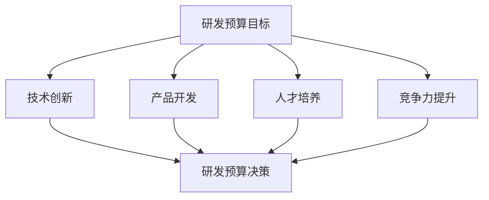

---
{"tags":["财务BP","科技企业","研发预算","研发管理","创新管理"],"aliases":["研发预算管理","研发投入规划"],"created":"2024-03-20","dg-publish":true,"permalink":"/知识共享/001_财务/01_财务BP/01_学习内容/04_行业应用/科技企业BP特点/研发投入预算/","dgPassFrontmatter":true}
---

> [!abstract] 概述
> 本文档详细分析科技企业研发投入预算的特点、方法和实践。研发投入是科技企业的核心竞争力，需要科学的预算管理方法。通过合理的研发预算规划，可以优化资源配置，提高研发效率，实现技术创新目标。

## 一、研发预算的基本特征

### 1. 研发投入特点
- **高投入性**：研发投入占收入比例高
- **长期性**：研发周期长，回报周期长
- **不确定性**：研发成果具有不确定性
- **战略性**：研发投入影响企业长期发展

### 2. 研发预算目标

## 二、研发预算编制方法

### 1. 项目驱动法
- 研发项目评估
- 项目优先级排序
- 项目资源分配
- 项目成本估算

### 2. 战略驱动法
- 技术路线规划
- 产品路线规划
- 人才发展规划
- 创新战略规划

### 3. 资源约束法
- 人力资源约束
- 设备资源约束
- 资金资源约束
- 时间资源约束

### 4. 风险收益法
- 项目风险评估
- 收益预测分析
- 投资回报评估
- 风险控制措施

## 三、研发预算内容构成

### 1. 预算编制流程

### 2. 预算内容构成
- 人员成本预算
- 设备投入预算
- 材料费用预算
- 外部合作预算
- 知识产权预算
- 其他费用预算

### 3. 预算控制方法
- 项目进度监控
- 成本控制措施
- 质量保证措施
- 预算调整机制

## 四、案例分析

### 案例1：软件企业研发预算
**背景**：某软件企业需要规划年度研发预算。

**预算方法**：
1. 项目规划
   - 核心产品研发
   - 新技术预研
   - 产品优化升级
   - 技术平台建设

2. 资源规划
   - 研发团队配置
   - 设备设施配置
   - 外部合作规划
   - 知识产权规划

3. 预算控制
   - 项目进度控制
   - 成本控制措施
   - 质量保证措施
   - 预算调整机制

**实施效果**：
- 研发效率提升
- 成本控制有效
- 产品质量提高
- 创新能力增强

### 案例2：硬件企业研发预算
**背景**：某硬件企业需要优化研发预算管理。

**优化方法**：
1. 研发战略
   - 技术路线规划
   - 产品路线规划
   - 创新战略规划
   - 人才发展规划

2. 预算管理
   - 项目优先级排序
   - 资源优化配置
   - 成本精细管理
   - 风险控制加强

3. 绩效管理
   - 研发KPI设计
   - 激励机制优化
   - 成果评估体系
   - 持续改进机制

**实施效果**：
- 研发投入优化
- 创新效率提升
- 产品质量提高
- 市场竞争力增强

## 五、研发预算风险与应对

### 1. 常见风险
- 技术风险
- 市场风险
- 人才风险
- 成本风险
- 进度风险

### 2. 风险应对策略
- 技术风险评估
- 市场调研分析
- 人才储备计划
- 成本控制措施
- 进度管理优化

## 六、最佳实践建议

1. **战略导向**
   - 明确研发战略
   - 制定技术路线
   - 规划产品路线
   - 优化资源配置

2. **项目管理**
   - 加强项目评估
   - 优化项目排序
   - 强化进度管理
   - 完善质量控制

3. **成本控制**
   - 精细成本管理
   - 优化资源配置
   - 加强风险控制
   - 完善评估体系

## 相关链接

- [[知识共享/001_财务/01_财务BP/01_学习内容/04_行业应用/科技企业BP特点/科技企业业务模式特点\|科技企业业务模式特点]]
- [[知识共享/001_财务/01_财务BP/01_学习内容/04_行业应用/科技企业BP特点/快速增长阶段的BP策略\|快速增长阶段的BP策略]]
- [[知识共享/001_财务/01_财务BP/01_学习内容/04_行业应用/科技企业BP特点/科技企业BP案例分析\|科技企业BP案例分析]]
- [[预算编制基础\|预算编制基础]]
- [[资本支出预算\|资本支出预算]]

## 参考文献

1. Cooper, R. G. (2017). *Winning at New Products: Creating Value Through Innovation*. Basic Books.
2. Chesbrough, H. (2017). *Open Innovation: The New Imperative for Creating and Profiting from Technology*. Harvard Business Press.
3. 《科技企业研发预算管理研究》，张明，管理科学学报，2020.
4. 《科技企业研发投入优化策略》，李强，财务与会计，2021.
5. 《科技企业创新管理最佳实践》，王华，工业工程与管理，2019. 