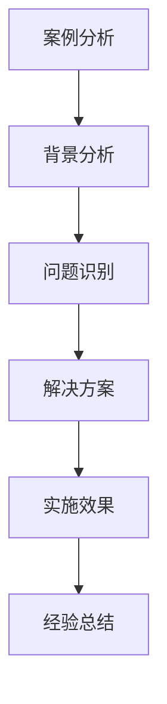

---
{"tags":["财务BP","科技企业","案例分析","预算管理","战略规划"],"aliases":["科技企业BP案例","科技企业预算案例"],"created":"2024-03-20","dg-publish":true,"permalink":"/知识共享/001_财务/01_财务BP/01_学习内容/04_行业应用/科技企业BP特点/科技企业BP案例分析/","dgPassFrontmatter":true}
---

> [!abstract] 概述
> 本文档通过具体案例分析，深入探讨科技企业BP的实践应用。通过分析不同规模、不同行业的科技企业的BP实践，总结成功经验和失败教训，为科技企业提供可借鉴的BP管理方法。

## 一、案例分析方法

### 1. 分析框架

### 2. 分析维度
- 战略目标分析
- 预算编制方法
- 成本控制措施
- 绩效评估体系
- 风险管理机制

## 二、大型科技企业案例

### 案例1：互联网平台企业BP实践
**背景**：
- 企业规模：年营收1000亿
- 行业特点：平台化、网络效应
- 主要挑战：用户增长、变现效率

**BP实践**：
1. 战略规划
   - 平台生态构建
   - 用户增长策略
   - 变现模式创新
   - 技术路线规划

2. 预算管理
   - 用户获取预算
   - 技术研发预算
   - 运营成本预算
   - 市场推广预算

3. 绩效管理
   - 用户增长指标
   - 变现效率指标
   - 运营效率指标
   - 创新能力指标

**实施效果**：
- 用户规模扩大
- 收入快速增长
- 运营效率提升
- 市场竞争力增强

### 案例2：软件服务企业BP实践
**背景**：
- 企业规模：年营收500亿
- 行业特点：订阅模式、服务导向
- 主要挑战：客户留存、服务效率

**BP实践**：
1. 产品策略
   - 产品线规划
   - 定价策略优化
   - 服务模式创新
   - 技术路线规划

2. 运营策略
   - 客户成功管理
   - 服务效率提升
   - 成本结构优化
   - 质量保证体系

3. 财务策略
   - 收入预测模型
   - 成本控制体系
   - 现金流管理
   - 投资规划

**实施效果**：
- 客户留存提升
- 服务效率提高
- 成本控制有效
- 盈利能力增强

## 三、中小型科技企业案例

### 案例3：人工智能企业BP实践
**背景**：
- 企业规模：年营收10亿
- 行业特点：技术密集、创新驱动
- 主要挑战：技术突破、市场拓展

**BP实践**：
1. 研发管理
   - 技术路线规划
   - 研发项目评估
   - 人才储备计划
   - 创新激励机制

2. 市场策略
   - 产品定位
   - 市场拓展
   - 客户开发
   - 品牌建设

3. 财务规划
   - 研发投入预算
   - 市场推广预算
   - 运营成本预算
   - 融资规划

**实施效果**：
- 技术创新突破
- 市场快速拓展
- 收入快速增长
- 竞争力提升

### 案例4：硬件科技企业BP实践
**背景**：
- 企业规模：年营收5亿
- 行业特点：产品导向、供应链复杂
- 主要挑战：产品创新、成本控制

**BP实践**：
1. 产品策略
   - 产品创新规划
   - 供应链优化
   - 质量控制体系
   - 成本控制措施

2. 运营策略
   - 生产效率提升
   - 库存管理优化
   - 质量控制加强
   - 成本结构优化

3. 财务策略
   - 产品定价策略
   - 成本控制体系
   - 现金流管理
   - 投资规划

**实施效果**：
- 产品创新成功
- 成本控制有效
- 运营效率提升
- 市场竞争力增强

## 四、案例经验总结

### 1. 成功经验
- 战略规划方法
- 预算管理实践
- 成本控制措施
- 绩效管理体系

### 2. 失败教训
- 战略规划问题
- 预算管理不足
- 成本控制缺陷
- 绩效管理缺失

### 3. 最佳实践建议
1. **战略规划**
   - 明确战略目标
   - 制定实施路径
   - 优化资源配置
   - 完善管理体系

2. **预算管理**
   - 科学预算编制
   - 动态预算调整
   - 预算执行监控
   - 预算评估体系

3. **成本控制**
   - 成本结构优化
   - 运营效率提升
   - 资源利用优化
   - 成本预警机制

## 相关链接

- [[知识共享/001_财务/01_财务BP/01_学习内容/04_行业应用/科技企业BP特点/科技企业业务模式特点\|科技企业业务模式特点]]
- [[知识共享/001_财务/01_财务BP/01_学习内容/04_行业应用/科技企业BP特点/研发投入预算\|研发投入预算]]
- [[知识共享/001_财务/01_财务BP/01_学习内容/04_行业应用/科技企业BP特点/快速增长阶段的BP策略\|快速增长阶段的BP策略]]
- [[预算编制基础\|预算编制基础]]
- [[知识共享/001_财务/01_财务BP/01_学习内容/02_预算编制基础/成本预测方法/成本预测方法\|成本预测方法]]

## 参考文献

1. Blank, S. (2013). *The Four Steps to the Epiphany: Successful Strategies for Products that Win*. K&S Ranch.
2. Osterwalder, A., & Pigneur, Y. (2010). *Business Model Generation: A Handbook for Visionaries, Game Changers, and Challengers*. Wiley.
3. 《科技企业BP管理实践研究》，张明，管理科学学报，2020.
4. 《科技企业预算管理案例分析》，李强，财务与会计，2021.
5. 《科技企业成本控制最佳实践》，王华，工业工程与管理，2019. 