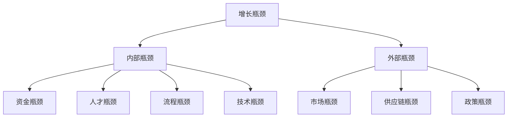
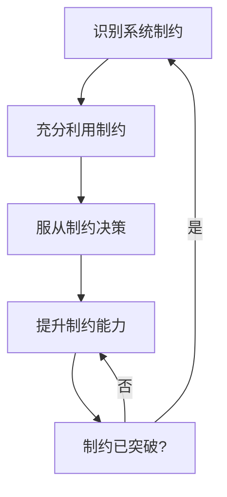
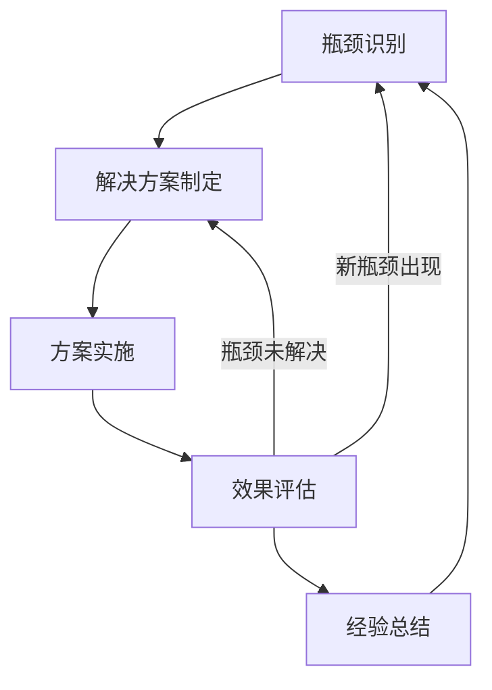

---
{"tags":["财务BP","增长瓶颈","业务限制因素","战略规划","瓶颈分析","制约理论","资源优化"],"aliases":["增长障碍分析","发展瓶颈识别","增长制约因素分析"],"created":"2023-11-17","updated":"2024-06-23","dg-publish":true,"permalink":"/知识共享/001_财务/01_财务BP/01_学习内容/05_高级分析方法/增长模型/增长瓶颈分析/","dgPassFrontmatter":true}
---

# 增长瓶颈分析

## 概述

增长瓶颈分析是财务BP的核心工作之一，旨在识别限制企业发展的关键因素，并通过有针对性的资源配置和流程优化来突破这些限制。本文将系统阐述增长瓶颈的识别方法、分析框架、解决策略及实践案例，帮助财务BP提升对业务发展关键制约因素的诊断能力。

## 增长瓶颈的基本概念

### 定义与特征

增长瓶颈是指在企业发展过程中，限制整体业务增长速度的关键制约因素。这些因素可能存在于业务的任何环节，如资金、人才、供应链、市场渠道等。

增长瓶颈具有以下特征：
- **系统性影响**：一个环节的瓶颈会影响整个业务系统的表现
- **阶段性变化**：随着企业发展阶段变化，主要瓶颈也会转移
- **隐蔽性**：部分瓶颈不易被直接观察，需要通过系统分析识别
- **关联性**：瓶颈之间往往存在相互关联和影响

### 主要类型

1. **财务瓶颈**
   - 现金流限制
   - 融资能力不足
   - 资本结构不合理
   - 投资回报率低

2. **运营瓶颈**
   - 产能限制
   - 流程效率低下
   - 质量控制问题
   - 供应链中断

3. **市场瓶颈**
   - 市场饱和
   - 渠道受限
   - 竞争加剧
   - 客户获取成本高

4. **组织瓶颈**
   - 人才缺口
   - 管理能力不足
   - 组织结构不匹配
   - 企业文化障碍

5. **技术瓶颈**
   - 技术迭代速度慢
   - 研发效率低
   - 技术壁垒高
   - 知识产权限制

## 瓶颈识别方法

### 定量分析方法

1. **财务比率分析**
   - 通过关键财务指标趋势分析识别财务瓶颈
   - 包括现金周转率、资产周转率、边际贡献率等指标

2. **业务数据断点分析**
   - 寻找业务数据中的异常点和断点
   - 追踪数据异常点对应的业务环节

3. **增长分解模型**
   - 将企业增长分解为关键驱动因素
   - 识别增长贡献度低或负增长的因素

4. **过程效率测量**
   - 通过时间、成本、质量等维度测量流程效率
   - 识别效率显著低于标准的环节

### 定性分析方法

1. **价值链分析**
   - 对企业价值链各环节进行系统评估
   - 识别价值创造能力弱的环节

2. **战略差距分析**
   - 比较企业目标与现有能力的差距
   - 识别实现战略目标的主要障碍

3. **利益相关者访谈**
   - 与管理层、员工、客户和供应商进行结构化访谈
   - 获取对业务限制因素的多视角洞察

4. **竞争对标分析**
   - 与行业领先企业进行系统对标
   - 识别关键能力差距

## 瓶颈分析框架

### TOC(制约理论)分析框架

制约理论(Theory of Constraints)是一种系统性分析企业瓶颈的经典方法，包含以下步骤：

1. **识别系统制约**：确定限制系统性能的关键因素
2. **充分利用制约**：确保制约因素得到最大化利用
3. **服从制约决策**：调整其他资源配置以支持制约因素
4. **提升制约能力**：投入资源提升制约因素能力
5. **返回第一步**：解决一个制约后，寻找新的系统制约

### 增长瓶颈诊断矩阵

| 瓶颈领域 | 症状表现 | 潜在原因 | 验证方法 | 影响程度 | 解决难度 |
|---------|---------|---------|---------|---------|---------|
| 财务    | 现金流紧张 | 应收账款周期长 | 账期分析 | 高       | 中      |
| 运营    | 交付延迟 | 生产计划不合理 | 流程审计 | 中       | 低      |
| 市场    | 获客成本高 | 定位不精准 | 客户分析 | 高       | 高      |
| 组织    | 人才流失 | 激励机制不足 | 员工访谈 | 中       | 中      |
| 技术    | 迭代速度慢 | 技术债务多 | 代码审计 | 中       | 高      |

### 系统瓶颈分析流程

## 财务BP在瓶颈分析中的角色

作为财务BP，在增长瓶颈分析中具有以下关键作用：

1. **数据整合者**
   - 整合财务、运营和市场数据
   - 提供跨部门的数据视角

2. **财务瓶颈诊断专家**
   - 识别现金流、融资能力等财务瓶颈
   - 分析财务结构对业务发展的制约

3. **投资回报分析者**
   - 评估各业务单元的资本效率
   - 识别资源错配导致的瓶颈

4. **资源优化决策支持**
   - 提供资源重新配置的量化建议
   - 支持瓶颈突破的投资决策

5. **突破方案财务可行性评估者**
   - 评估瓶颈突破方案的财务可行性
   - 设计财务支持机制

## 突破瓶颈的策略

### 财务瓶颈突破策略

1. **优化现金管理**
   - 改善应收账款管理
   - 优化库存水平
   - 重新协商付款条件

2. **多元化融资**
   - 拓展融资渠道
   - 优化融资结构
   - 设计创新融资工具

3. **资本结构调整**
   - 优化债务股权比例
   - 降低资本成本
   - 提高资本使用效率

### 运营瓶颈突破策略

1. **流程再造**
   - 识别并消除非增值环节
   - 简化流程步骤
   - 提高流程自动化水平

2. **产能优化**
   - 消除生产瓶颈
   - 平衡生产线
   - 实施柔性生产

3. **供应链重构**
   - 供应商优化
   - 库存策略调整
   - 物流网络优化

### 市场瓶颈突破策略

1. **市场细分与聚焦**
   - 重新定义目标客户
   - 聚焦高价值市场
   - 精准营销策略

2. **渠道创新**
   - 发展新渠道
   - 优化渠道结构
   - 提升渠道效率

3. **产品差异化**
   - 强化产品特色
   - 发展增值服务
   - 提升客户体验

### 组织瓶颈突破策略

1. **人才战略**
   - 关键人才引进
   - 人才培养体系建设
   - 优化激励机制

2. **组织结构调整**
   - 扁平化管理
   - 业务单元重组
   - 责权利重新分配

3. **管理能力提升**
   - 管理培训与辅导
   - 引入专业顾问
   - 建立管理标准体系

## 案例分析

### 案例一：电子商务企业突破物流瓶颈

**背景情况**：
一家快速增长的电子商务企业在扩张过程中发现，物流配送能力成为限制销售增长的主要瓶颈。旺季订单高峰时，配送延迟导致客户满意度下降和订单取消率上升。

**瓶颈识别过程**：
- 通过订单履行数据分析，发现配送时间与订单量呈非线性关系
- 客户投诉分析显示，70%的投诉与配送延迟有关
- 通过流程审计发现，仓储拣货和最后一公里配送是主要瓶颈

**突破策略**：
1. 投资智能仓储系统，提高拣货效率
2. 建立分区域仓储网络，缩短配送距离
3. 混合使用自有配送团队和第三方物流，提高旺季弹性
4. 实施需求预测系统，优化库存前置

**实施效果**：
- 订单处理能力提升60%
- 配送时间缩短30%
- 客户满意度提升15%
- 旺季销售额同比增长35%

**财务BP的贡献**：
- 开发了物流成本与容量模型，为投资决策提供支持
- 设计了分仓库存优化模型，降低库存成本
- 建立物流绩效指标体系，实现持续改进

### 案例二：制造企业突破产能瓶颈

**背景情况**：
一家制造企业面临订单增长但无法满足交付需求的问题。传统解决方案是扩建新工厂，但资本投入大且周期长。财务BP与运营团队合作寻找创新解决方案。

**瓶颈识别过程**：
- 通过产线分析确定关键设备利用率低是主要瓶颈
- 班次分析发现设备维护时间占用生产时间过多
- 生产计划审查显示频繁切换产品导致效率损失

**突破策略**：
1. 实施预防性维护计划，减少设备故障
2. 优化生产排期，减少切换次数
3. 引入精益生产方法，消除浪费
4. 建立柔性生产线，提高产能弹性

**实施效果**：
- 设备有效使用时间提升25%
- 产能提升35%，无需大额资本投入
- 交付周期缩短40%
- 生产成本降低15%

**财务BP的贡献**：
- 开发产能投资回报模型，比较不同产能提升方案
- 设计产品组合优化模型，提高生产线效率
- 建立基于活动的成本分析系统，识别优化机会

### 案例三：SaaS企业突破客户获取瓶颈

**背景情况**：
一家B2B SaaS企业在扩张阶段发现，客户获取成本(CAC)持续上升，已经严重影响盈利能力和增长速度。传统营销渠道效果递减，新客户转化率下降。

**瓶颈识别过程**：
- 营销漏斗分析显示，从初步接触到签约的转化率逐月下降
- 客户细分分析发现，原有目标客户群体趋于饱和
- 竞争分析显示，细分市场竞争加剧，差异化不足
- 客户获取成本回收期(CAC Payback)延长至18个月，超过行业健康标准

**突破策略**：
1. 重新定义客户细分策略，识别高价值低竞争的新细分市场
2. 开发针对新细分市场的产品定制功能，提升差异化价值
3. 实施基于客户生命周期价值(CLV)的营销资源分配
4. 建立客户推荐计划，降低获客成本
5. 优化自助式产品体验，降低销售人员介入需求

**实施效果**：
- 客户获取成本降低35%
- 新客户转化率提升50%
- CAC回收期缩短至9个月
- 在新目标细分市场实现了45%的市场份额

**财务BP的贡献**：
- 开发了客户生命周期价值模型
- 设计了营销ROI评估框架
- 建立了客户获取成本优化仪表板
- 提供不同营销策略的财务情景分析

### 案例四：人才密集型企业突破组织瓶颈

**背景情况**：
一家快速增长的咨询公司面临重要人才流失率高、招聘难度大的问题，限制了公司承接新项目的能力，影响收入增长。

**瓶颈识别过程**：
- 员工满意度调查显示，职业发展机会和工作-生活平衡是主要不满因素
- 招聘数据分析发现，关键岗位平均招聘周期超过90天
- 项目分析显示，高级顾问资源过度集中，造成瓶颈
- 财务分析发现，人力成本上升而生产率停滞

**突破策略**：
1. 重构职业发展通道，增加专业技术路线
2. 建立导师制和内部人才培养加速计划
3. 实施弹性工作制和结果导向的绩效评估
4. 优化团队结构和项目分配机制
5. 建立知识管理系统，降低对个人依赖

**实施效果**：
- 关键人才流失率从25%降至8%
- 招聘周期缩短至45天
- 顾问生产率提升30%
- 项目交付能力提升40%

**财务BP的贡献**：
- 开发人力资本ROI模型
- 设计绩效激励与生产率关联模型
- 建立人才结构优化分析框架
- 量化人才流失成本和培养收益

## 常见瓶颈分析误区及规避

1. **仅关注症状而非根本原因**
   - 误区：只解决表面问题，如销售下滑仅通过增加营销投入解决
   - 规避方法：采用"5个为什么"等根因分析方法深入问题本质

2. **单一视角分析**
   - 误区：仅从单一部门视角分析问题，缺乏系统思考
   - 规避方法：组建跨部门分析团队，综合多方视角

3. **忽略瓶颈之间的关联**
   - 误区：孤立地分析和解决瓶颈，忽略瓶颈间相互影响
   - 规避方法：建立瓶颈关联图，评估系统性影响

4. **解决方案过于保守或激进**
   - 误区：要么小修小补不彻底，要么大刀阔斧风险高
   - 规避方法：采用逐步突破策略，设计多阶段解决方案

5. **忽视新瓶颈的产生**
   - 误区：解决一个瓶颈后停止分析，忽视系统重新平衡后的新瓶颈
   - 规避方法：建立持续瓶颈监测机制，动态调整突破策略

## 行业特定瓶颈分析方法

### 科技行业特定瓶颈

1. **研发效率瓶颈**
   - 识别指标：产品迭代周期、代码复杂度、缺陷率
   - 分析工具：研发效能仪表板、技术债务分析
   - 突破策略：敏捷方法优化、DevOps实践、模块化架构

2. **产品市场契合度瓶颈**
   - 识别指标：客户激活率、留存率、特性使用率
   - 分析工具：产品使用数据分析、客户旅程图
   - 突破策略：精益创业方法、快速迭代验证、用户参与设计

### 制造业特定瓶颈

1. **供应链弹性瓶颈**
   - 识别指标：供应商集中度、原材料库存周转、交付准时率
   - 分析工具：供应链风险评估、供应商评级系统
   - 突破策略：供应商多元化、关键材料战略库存、替代方案预案

2. **生产灵活性瓶颈**
   - 识别指标：切换时间、小批量生产成本、定制化响应时间
   - 分析工具：产线柔性评估、生产效率分析
   - 突破策略：精益生产、模块化设计、智能制造技术

### 服务业特定瓶颈

1. **服务交付一致性瓶颈**
   - 识别指标：服务质量波动、客户满意度差异、流程依从度
   - 分析工具：服务流程审计、质量控制图
   - 突破策略：服务标准化、流程自动化、员工培训体系

2. **服务容量扩展瓶颈**
   - 识别指标：高峰期等待时间、人员利用率、服务拒绝率
   - 分析工具：排队模型、容量规划模型
   - 突破策略：需求平滑机制、弹性定价、共享资源模型

## 最佳实践建议

### 方法论应用

1. **建立系统化的瓶颈分析流程**
   - 定期进行瓶颈扫描
   - 标准化分析方法和工具
   - 形成瓶颈分析报告制度

2. **采用多维度分析视角**
   - 结合定量和定性分析
   - 整合财务、运营和市场数据
   - 引入外部对标数据

3. **优先聚焦高影响瓶颈**
   - 建立瓶颈影响评估模型
   - 根据影响程度和解决难度排序
   - 集中资源解决关键瓶颈

### 组织保障

1. **建立跨部门协作机制**
   - 组建瓶颈分析专项小组
   - 明确各部门职责分工
   - 建立协同工作流程

2. **获取高层支持**
   - 向高管层清晰传达瓶颈影响
   - 争取必要资源支持
   - 确保关键决策及时制定

3. **培养瓶颈分析能力**
   - 提升团队分析技能
   - 引入专业工具和方法
   - 建立知识分享机制

### 持续改进循环

## 瓶颈分析工具与模板

### 瓶颈诊断问卷
用于结构化收集瓶颈相关信息的问卷模板：

1. **业务目标与现状差距**
   - 目前业务增长率与目标的差距是多少？
   - 哪些关键绩效指标(KPI)未达成目标？
   - 目标未达成的影响程度如何？

2. **资源利用情况**
   - 哪些资源利用率最高/最低？
   - 资源分配与业务优先级是否匹配？
   - 哪些资源出现供不应求的情况？

3. **流程效率评估**
   - 哪些流程耗时最长？
   - 客户/内部反馈中提及最多的问题是什么？
   - 流程中的等待时间集中在哪些环节？

### 瓶颈突破路线图模板

针对识别出的核心瓶颈，制定结构化突破计划：

1. **瓶颈突破目标**
   - 具体量化指标改善目标
   - 时间表与里程碑
   - 责任人与资源需求

2. **短期行动计划(1-3个月)**
   - 快速见效的优化措施
   - 资源重新分配计划
   - 初步验证机制

3. **中期行动计划(3-12个月)**
   - 流程再造与系统优化
   - 能力建设投资
   - 组织结构调整

4. **长期战略计划(1-3年)**
   - 战略转型举措
   - 关键资源开发
   - 业务模式创新

## 相关链接

- [[知识共享/001_财务/01_财务BP/01_学习内容/01_财务BP基础概念/BP与企业战略/财务BP与企业战略的关系\|财务BP与企业战略的关系]]
- [[知识共享/001_财务/01_财务BP/01_学习内容/05_高级分析方法/投资回报分析/投资决策指标的应用\|投资决策指标的应用]]
- [[知识共享/001_财务/01_财务BP/01_学习内容/05_高级分析方法/风险评估/财务风险识别\|财务风险识别]]
- [[知识共享/001_财务/01_财务BP/01_学习内容/05_高级分析方法/增长模型/可持续增长率分析\|可持续增长率分析]]
- [[知识共享/001_财务/01_财务BP/01_学习内容/05_高级分析方法/资金需求分析/资金缺口计算方法\|资金缺口计算方法]]
- [[知识共享/001_财务/01_财务BP/01_学习内容/06_BP工具与模板/Excel模型构建/财务模型设计原则\|财务模型设计原则]]

## 参考文献

1. Goldratt, E. M., & Cox, J. (2004). *The Goal: A Process of Ongoing Improvement*. North River Press.
2. Kaplan, R. S., & Norton, D. P. (2008). *The Execution Premium: Linking Strategy to Operations for Competitive Advantage*. Harvard Business Press.
3. Sull, D., & Eisenhardt, K. M. (2015). *Simple Rules: How to Thrive in a Complex World*. Houghton Mifflin Harcourt.
4. Dettmer, H. W. (2007). *The Logical Thinking Process: A Systems Approach to Complex Problem Solving*. ASQ Quality Press.
5. 彼得·德鲁克 (2006). *管理的实践*. 机械工业出版社.
6. 科恩, G. (2019). *敏捷估计与规划*. 人民邮电出版社.
7. 吴军 (2017). *格局：如何在复杂世界里做正确的选择*. 中信出版社.
8. 克莱顿·克里斯坦森 (2018). *创新者的窘境*. 中信出版社.
9. 刘润 (2020). *五步商业画布：一页纸重构你的商业模式*. 中信出版社.
10. 瑞克·辛德勒 (2013). *数据化管理：使用大数据改变企业运营模式*. 机械工业出版社. 