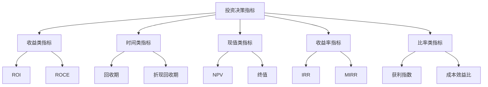

---
{"tags":["财务BP","投资分析","决策指标","投资决策"],"aliases":["投资评估应用","投资指标实践应用"],"created":"2023-11-17","dg-publish":true,"permalink":"/知识共享/001_财务/01_财务BP/01_学习内容/05_高级分析方法/投资回报分析/投资决策指标的应用/","dgPassFrontmatter":true}
---

# 投资决策指标的应用

## 概述
投资决策指标为财务BP中的资本配置和项目筛选提供了重要的量化基础。本文系统介绍如何在实际决策过程中应用各类投资评估指标，包括指标选择、综合运用、行业特性调整、敏感性分析以及典型案例。通过科学运用这些指标，帮助企业降低投资风险，提高资本使用效率。

## 投资决策指标体系

### 主要决策指标概览
投资决策过程中常用的核心指标包括：

| 指标类别 | 核心指标 | 特点 | 适用场景 |
|---------|---------|------|---------|
| 收益类指标 | ROI(投资回报率) | 简单直观，易于理解 | 短期项目，初步筛选 |
| 时间类指标 | 投资回收期 | 关注流动性和风险 | 现金流紧张企业，高风险环境 |
| 现值类指标 | NPV(净现值) | 考虑货币时间价值 | 长期项目，精确评估 |
| 收益率指标 | IRR(内部收益率) | 相对收益能力 | 项目间比较，资本约束环境 |
| 比率类指标 | 获利指数(PI) | 投资效率 | 资本约束条件下项目排序 |

### 指标应用层级
不同指标在决策过程中发挥不同作用：

1. **初步筛选层级**：ROI、简单回收期等直观指标用于快速淘汰明显不可行的项目
2. **详细评估层级**：NPV、IRR等考虑时间价值的指标用于深入评估
3. **优先级排序层级**：获利指数、MIRR等效率指标用于资源约束下的项目排序
4. **风险评估层级**：敏感性分析、情景分析结合多种指标评估风险

## 指标选择原则与应用策略

### 指标选择的影响因素
选择适当的投资决策指标应考虑以下因素：

1. **项目特性**：
   - 项目期限长短
   - 现金流分布模式
   - 投资规模大小
   - 风险程度

2. **企业特征**：
   - 资本约束情况
   - 行业特性
   - 财务目标
   - 风险偏好

3. **经济环境**：
   - 通货膨胀预期
   - 市场利率水平
   - 行业竞争格局
   - 技术变革速度

### 多指标综合运用策略
不同指标有各自优势与局限，实践中应综合运用：

1. **互补组合策略**
   - NPV + IRR：结合绝对收益与相对收益视角
   - 回收期 + NPV：平衡流动性和长期价值
   - ROI + 获利指数：结合简易指标与效率指标

2. **阶段性应用策略**
   - 初筛阶段：简单回收期、ROI
   - 详评阶段：NPV、IRR、MIRR
   - 决策阶段：多指标综合评分和敏感性分析

3. **情景组合策略**
   - 基准情景：标准指标计算
   - 乐观/悲观情景：敏感性分析
   - 极端情景：压力测试重点指标

## 行业特性与指标调整

### 不同行业的指标偏好
各行业因特性不同，对投资指标有不同偏好：

1. **制造业**：
   - 关注回收期和ROI
   - 设备投资重视折旧影响
   - 产能扩张考虑规模经济

2. **科技行业**：
   - 更关注NPV和IRR
   - 重视增长选择权价值
   - 考虑技术快速迭代风险

3. **房地产行业**：
   - 现金流回收期至关重要
   - 杠杆效应显著
   - 考虑资产增值潜力

4. **服务业**：
   - 强调短期ROI
   - 关注投资与收入增长关系
   - 轻资产模式下的效率指标

### 指标参数调整方法
根据行业和企业特性调整指标计算参数：

1. **折现率调整**：
   - 基于WACC(加权平均资本成本)
   - 行业风险溢价
   - 项目特定风险调整
   - 国家/地区风险因素

2. **现金流调整**：
   - 通货膨胀影响
   - 税收因素考虑
   - 营运资金需求
   - 残值估计方法

3. **期限调整**：
   - 行业资产寿命考量
   - 技术更新周期
   - 市场竞争演变
   - 监管环境变化

## 案例分析

### 案例一：制造企业设备更新决策

**背景**：某制造企业面临生产线更新决策，需要在三个方案中选择：
1. 方案A：小规模更新，投资500万元
2. 方案B：中等规模更新，投资1200万元
3. 方案C：全线改造，投资2000万元

**指标应用过程**：

1. **初步筛选**：
   - 简单回收期计算：A为2.5年，B为3.2年，C为4.1年
   - ROI分析：A为28%，B为25%，C为20%

2. **详细评估**：
   - NPV计算(折现率12%)：A为680万元，B为1450万元，C为1680万元
   - IRR分析：A为32%，B为28%，C为22%

3. **资源约束考量**：
   - 获利指数(PI)：A为2.36，B为2.21，C为1.84
   - 资本约束下每100万投资创造的NPV：A最高

4. **风险敏感性**：
   - 产量变化敏感性：C方案敏感度最高
   - 原材料价格敏感性：三个方案相近
   - 技术更新风险：C方案风险最高

**决策结果**：企业选择了方案B作为平衡方案，主要考虑因素：
1. 平衡了短期回报(回收期与ROI)和长期价值(NPV)
2. IRR显著高于资本成本
3. 敏感性分析显示风险可控
4. 保留了未来技术升级的灵活性

**结果追踪**：项目实施两年后，B方案实际回收期为3.4年，略长于预期，但仍在可接受范围内，NPV达到预期的95%。

### 案例二：科技企业产品研发投资组合决策

**背景**：某科技企业需要在有限研发预算内选择多个产品研发项目，候选项目如下：
1. 项目X：移动应用升级，投资200万元
2. 项目Y：新功能开发，投资500万元
3. 项目Z：核心技术平台重构，投资800万元
4. 项目W：全新产品线，投资1200万元

**可用研发预算**：1500万元

**指标应用过程**：

1. **单项目评估**：
   - NPV(折现率15%)：X为250万元，Y为420万元，Z为680万元，W为980万元
   - IRR：X为32%，Y为25%，Z为22%，W为20%
   - 回收期：X为1.8年，Y为2.5年，Z为3.2年，W为4.0年

2. **组合优化**：
   - 获利指数(PI)：X为2.25，Y为1.84，Z为1.85，W为1.82
   - 资源约束下的优先级：按PI排序为X > Z > Y > W
   - 最优组合计算：预算约束下选择X+Z+部分Y投资

3. **战略价值考量**：
   - 未来选择权价值：Z项目虽IRR不是最高，但为后续发展提供更多选择权
   - 项目间依赖性：项目Y的部分功能依赖Z项目的完成

4. **风险多样化**：
   - 技术风险分散
   - 市场接受度风险平衡
   - 时间分布合理性

**决策结果**：企业最终选择了X+Z+部分Y的组合，总投资1500万元，预期NPV合计超过1200万元，同时考虑了：
1. 短期回报(项目X)与长期战略价值(项目Z)的平衡
2. 风险的多元化分散
3. 技术路线的连贯性
4. 阶段性投资的灵活性

**结果追踪**：一年后评估显示，项目X已顺利完成并实现预期收益，项目Z进展符合计划，实际支出控制在预算内，技术平台重构为后续产品开发创造了更大价值空间。

### 案例三：跨国零售企业市场扩张决策

**背景**：某跨国零售企业计划在新兴市场扩张，需要在三种模式中选择：
1. 特许经营模式：投资少，风险低，但控制力弱
2. 合资模式：中等投资，共享风险和资源
3. 全资子公司：投资大，控制力强，风险集中

**指标应用过程**：

1. **财务指标评估**：
   - NPV(考虑国家风险调整折现率)：特许经营800万美元，合资1200万美元，全资1500万美元
   - IRR：特许经营25%，合资20%，全资18%
   - 回收期：特许经营3年，合资4.5年，全资6年

2. **风险调整分析**：
   - 风险调整NPV：特许经营750万美元，合资950万美元，全资850万美元
   - 情景分析：市场增长低于预期时，特许经营模式最稳健

3. **战略选择权价值**：
   - 市场扩张选择权：全资模式提供最大扩张灵活性
   - 退出选择权：特许经营提供最低成本退出方案
   - 转换选择权：合资模式提供逐步增加控制权的机会

4. **非财务因素量化**：
   - 品牌控制价值
   - 本地市场学习价值
   - 供应链协同效应

**决策结果**：企业选择了"阶段性进入策略"：
1. 初期采用特许经营快速进入测试市场
2. 在关键城市采用合资模式建立示范店
3. 市场表现达到触发条件后转为全资模式

**结果追踪**：实施三年后，特许经营区域表现符合预期，两个合资示范店超额完成销售目标，企业已开始在核心城市筹备全资子公司，整体战略执行有效并保持了灵活性。

## 高级应用技术

### 选择权价值分析
传统指标可能忽略投资中的战略选择权价值：

1. **扩张选择权**：后续扩大投资的权利
2. **延迟选择权**：推迟投资决定的权利
3. **退出选择权**：终止项目的权利
4. **转换选择权**：改变项目用途的权利

**应用技术**：
- 实物期权法
- 决策树分析
- 蒙特卡洛模拟

### 多准则决策分析
将财务指标与非财务因素整合：

1. **指标加权评分法**：
   - 确定关键评估维度
   - 分配权重
   - 标准化各指标得分
   - 计算加权总分

2. **层次分析法(AHP)**：
   - 建立决策层次结构
   - 成对比较各因素重要性
   - 计算权重
   - 一致性检验

3. **TOPSIS方法**：
   - 构建规范化决策矩阵
   - 确定理想解和负理想解
   - 计算各方案与理想解的距离
   - 排序方案优先级

### 投资组合优化
在资源约束条件下优化多项目投资组合：

1. **资本预算分析**：
   - 项目排序方法：PI、IRR等
   - 约束条件：预算、人力、技术等
   - 优化目标：最大化NPV总和

2. **风险分散策略**：
   - 相关性分析
   - 高/低风险项目组合
   - 时间分布均衡

3. **组合模拟分析**：
   - 蒙特卡洛模拟
   - 情景分析组合效应
   - 投资组合有效边界

## 常见挑战与应对策略

### 数据质量挑战
投资决策指标高度依赖输入数据质量：

1. **预测不准确**：
   - 采用区间预测代替点估计
   - 使用多方法交叉验证
   - 建立历史预测准确性追踪

2. **参数估计偏差**：
   - 采用数据驱动的参数估计
   - 引入专家评审机制
   - 定期校准参数

### 指标异议与冲突
不同指标可能给出矛盾的结论：

1. **NPV与IRR冲突**：
   - 分析冲突原因(规模、时间分布等)
   - 引入MIRR作为补充
   - 明确决策优先标准

2. **短期与长期指标冲突**：
   - 建立短期/长期平衡框架
   - 分阶段考核
   - 加入战略价值评估

### 软因素整合
将难以量化的因素纳入决策：

1. **战略契合度**：
   - 建立战略契合评分卡
   - 设定最低战略门槛
   - 战略加权调整

2. **学习价值**：
   - 知识资产价值模型
   - 学习曲线效应
   - 未来应用价值估计

## 实施最佳实践

### 审批流程优化
基于指标构建有效的投资审批流程：

1. **分级审批机制**：
   - 基于投资规模和风险等级
   - 指标阈值触发不同审批级别
   - 审批权限与责任明确

2. **标准化评估流程**：
   - 统一指标计算方法
   - 标准化提案模板
   - 决策记录与追踪机制

### 指标应用培训
提升组织对投资指标的理解和应用能力：

1. **管理层培训**：
   - 指标含义及局限性
   - 指标间权衡取舍
   - 情景分析应用

2. **评估专员培训**：
   - 指标计算技术
   - 数据收集与验证
   - 敏感性分析方法

### 指标与战略整合
确保指标应用与企业战略方向一致：

1. **战略一致性检查**：
   - 关键指标与战略目标映射
   - 定期战略回顾与调整
   - 战略价值溢价考量

2. **长期价值创造导向**：
   - 平衡短期指标与长期价值
   - 股东回报与可持续发展平衡
   - 创新投资的特殊评估框架

## 相关链接
- [[知识共享/001_财务/01_财务BP/01_学习内容/05_高级分析方法/投资回报分析/净现值与内部收益率分析\|净现值与内部收益率分析]]
- [[知识共享/001_财务/01_财务BP/01_学习内容/05_高级分析方法/投资回报分析/ROI计算方法\|ROI计算方法]]
- [[知识共享/001_财务/01_财务BP/01_学习内容/05_高级分析方法/投资回报分析/投资回收期分析\|投资回收期分析]]
- [[知识共享/001_财务/01_财务BP/01_学习内容/06_BP工具与模板/高级分析/风险评估模型\|风险评估模型]]
- [[知识共享/001_财务/01_财务BP/01_学习内容/06_BP工具与模板/高级分析/情景分析工具\|情景分析工具]]
- [[知识共享/001_财务/01_财务BP/01_学习内容/06_BP工具与模板/高级分析/蒙特卡洛模拟模型\|蒙特卡洛模拟模型]]

## 参考文献
1. Brealey, R. A., Myers, S. C., & Allen, F. (2020). *Principles of Corporate Finance*. McGraw-Hill Education.
2. Damodaran, A. (2012). *Investment Valuation: Tools and Techniques for Determining the Value of Any Asset*. Wiley Finance.
3. Graham, J. R., & Harvey, C. R. (2001). "The Theory and Practice of Corporate Finance: Evidence from the Field." *Journal of Financial Economics*, 60(2-3), 187-243.
4. Trigeorgis, L. (1996). *Real Options: Managerial Flexibility and Strategy in Resource Allocation*. MIT Press.
5. 《投资决策分析与评价》，王万军，2019年
6. 《公司投资决策：理论与实践》，赵锡军，2022年
7. 《资本项目评价方法与应用》，林毅夫，2020年 