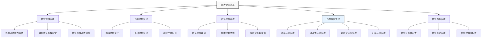

---
{"dg-publish":true,"tags":["财务BP","资金管理","债务管理","负债优化","风险控制"],"创建日期":"2024-07-21","permalink":"/知识共享/001_财务/01_财务BP/01_学习内容/05_高级分析方法/资金需求分析/债务管理策略/","dgPassFrontmatter":true}
---

> [!abstract] 概述
> 债务管理策略是企业财务BP中的关键组成部分，涉及债务规模控制、债务结构优化和风险管理。本文系统介绍企业债务管理的核心理念、评估框架、实施策略和实践案例，旨在帮助财务BP专业人士建立科学合理的债务管理体系，平衡利用财务杠杆与控制财务风险。

## 基础知识

### 债务管理的定义与内涵

债务管理（Debt Management）是指企业对债务融资活动的全面规划、组织、协调和控制，包括债务规模控制、债务结构优化、偿债能力维护和债务风险管理等方面。有效的债务管理能够平衡企业财务杠杆的利用和财务风险的控制，支持企业战略目标实现。

不同学术与实务观点对债务管理的侧重点有所差异：
- **传统财务视角**：强调偿债能力和风险控制，以安全性为主要考量
- **价值管理视角**：强调债务融资的价值创造功能，关注资本成本和股东回报
- **战略管理视角**：将债务管理视为企业战略的重要支撑，注重债务结构与业务战略的匹配

### 债务管理的核心目标

有效的债务管理应实现以下核心目标：

1. **优化资本结构**：通过合理的债务融资提高企业价值
2. **降低融资成本**：获取低成本资金，充分利用税盾效应
3. **控制财务风险**：维持适度的杠杆水平，避免过度负债
4. **保持财务弹性**：保留充足的融资空间应对未来发展需求
5. **匹配业务特性**：债务结构与企业业务特点和发展阶段相适应

### 企业债务的分类

企业债务可从多个维度进行分类，科学的分类有助于精细化管理：

#### 1. 按期限结构分类

- **短期债务**：期限在1年以内，主要用于营运资金需求
- **中期债务**：期限在1-5年，通常用于设备更新和中期项目
- **长期债务**：期限超过5年，主要用于长期资产投资和战略性项目

#### 2. 按债务形式分类

- **银行贷款**：包括各类商业银行信贷
- **债券融资**：包括企业债券、公司债券、中期票据等
- **融资租赁**：通过租赁方式获取资产使用权的债务性融资
- **商业信用**：包括应付账款、应付票据等经营性负债
- **其他融资工具**：包括信托贷款、资产证券化等

#### 3. 按担保方式分类

- **信用贷款**：无担保的纯信用债务
- **抵押贷款**：以不动产作为担保的债务
- **质押贷款**：以动产或权利作为担保的债务
- **保证贷款**：由第三方提供保证的债务

## 理论框架

### 债务管理的整体框架

### 债务管理决策模型

科学的债务管理决策需综合考虑多项因素，主要决策模型包括：

#### 1. 债务承载能力模型

评估企业最大可承受债务规模的模型，通常基于以下指标：
- **偿债能力指标**：利息保障倍数、债务/EBITDA比率
- **财务杠杆指标**：资产负债率、净债务/权益比率
- **现金流覆盖指标**：经营现金流/债务比率

#### 2. 债务结构优化模型

债务结构优化模型主要关注以下方面：
- **期限匹配原则**：资产与负债期限结构匹配
- **融资成本最小化**：不同期限、不同类型债务的综合成本
- **风险分散原则**：避免债务到期过度集中

#### 3. 债务风险量化模型

- **利率敏感性分析**：评估利率变动对债务成本的影响
- **现金流压力测试**：测试极端情况下的偿债能力
- **违约概率模型**：基于财务指标预测违约风险

## 应用指南

### 债务管理策略的实施步骤

#### 1. 债务状况诊断

- **债务规模评估**：分析当前债务总额及其与资产规模、经营规模的匹配度
- **债务结构分析**：评估债务期限结构、币种结构、利率结构是否合理
- **债务成本评估**：计算加权平均债务成本，与行业标准比较
- **债务风险识别**：识别集中到期风险、利率风险、流动性风险等

#### 2. 债务承载能力评估

- **财务指标分析**：计算关键债务指标，如资产负债率、利息保障倍数
- **现金流压力测试**：在不同业务情景下评估偿债能力
- **行业比较分析**：与行业平均水平和最佳实践比较
- **评级标准应用**：参考信用评级标准评估债务状况

#### 3. 债务规模管理

- **最优债务规模确定**：基于资本成本最小化和财务风险可控原则
- **债务规模上限设定**：设置债务规模警戒线和硬性上限
- **债务增长速度控制**：确保债务增长不超过资产和盈利能力增长
- **债务规模动态调整**：根据业务发展阶段和宏观环境调整

#### 4. 债务结构优化

- **期限结构优化**：合理配置短、中、长期债务比例
  - 短期债务：保持在流动资产可覆盖范围内
  - 中长期债务：与固定资产和长期投资项目相匹配
  
- **债务工具多元化**：灵活运用多种债务融资工具
  - 银行贷款、债券、融资租赁等多种工具组合
  - 保持多元化融资渠道，避免过度依赖单一来源
  
- **利率结构管理**：
  - 固定利率与浮动利率债务的合理配比
  - 利率风险对冲工具的适当使用

- **币种结构管理**：
  - 债务币种与收入币种相匹配
  - 外币债务风险控制与对冲

#### 5. 债务成本优化

- **融资方式选择**：选择最具成本效益的融资方式
- **债务定价谈判**：提高融资谈判能力，获取优惠条件
- **再融资机会把握**：适时进行债务置换和再融资
- **融资组合优化**：通过多种融资工具组合降低综合成本

#### 6. 债务风险管理

- **流动性风险管理**：
  - 债务到期分散化
  - 保持充足的现金储备和未使用授信额度
  
- **利率风险管理**：
  - 利率敏感性分析
  - 适当使用利率掉期等衍生工具

- **再融资风险管理**：
  - 提前安排再融资计划
  - 维护多元化融资渠道
  
- **契约风险管理**：
  - 严格监控债务契约条款
  - 预警机制建立和应对预案

#### 7. 债务合规管理

- **债务授权管理**：明确债务融资的审批流程和权限
- **债务信息管理**：建立完整的债务信息档案和监控系统
- **债务合规审查**：定期进行债务合规性审查
- **债务信息披露**：及时、准确的债务信息内外部报告

### 债务管理的关键性指标

| 指标类别 | 具体指标 | 计算公式 | 警戒值(一般行业) |
|---------|---------|---------|----------------|
| 债务规模指标 | 资产负债率 | 总负债/总资产 | 60%-70% |
| | 净债务/EBITDA | (有息负债-现金)/EBITDA | 3.5-4.0 |
| | 净负债率 | (有息负债-现金)/权益 | 100% |
| 偿债能力指标 | 利息保障倍数 | EBIT/利息费用 | 3.0 |
| | EBITDA利息覆盖率 | EBITDA/利息费用 | 5.0 |
| | 债务/经营现金流 | 总有息负债/经营活动现金流量净额 | 5.0 |
| 债务结构指标 | 长期债务比率 | 长期债务/总债务 | 行业相关 |
| | 担保债务比率 | 担保债务/总债务 | 行业相关 |
| | 债务集中度 | 单一债权人债务/总债务 | 30% |
| 债务成本指标 | 加权平均债务成本 | Σ(债务i×成本i)/总债务 | 市场相关 |
| | 债务成本/行业平均 | 企业债务成本/行业平均成本 | 100% |

## 案例分析

### 案例一：制造业企业债务结构优化

某制造企业面临债务结构问题：短期债务占比过高(70%)，导致流动性压力大；多为浮动利率贷款，利率风险显著；债务到期高度集中，再融资压力大。

**初始债务状况**：
- 总资产12亿元，总负债7.2亿元，资产负债率60%
- 有息负债5亿元，其中短期3.5亿元(70%)，长期1.5亿元(30%)
- 主要为银行贷款，浮动利率占比80%
- 未来12个月内到期债务2.5亿元
- 年利息支出2500万元，利息保障倍数3.2倍

**债务管理策略实施**：

1. **债务期限结构调整**
   - 将2亿元短期贷款置换为3-5年期中长期贷款
   - 调整后短期债务比例降至30%，长期债务比例升至70%

2. **融资渠道多元化**
   - 发行3亿元公司债券，期限5年，固定利率4.5%
   - 通过债券融资替换部分银行贷款，降低银行依赖度

3. **利率风险管理**
   - 将浮动利率债务比例降至40%
   - 对1亿元浮动利率贷款进行利率掉期，锁定利率成本

4. **再融资风险管理**
   - 重新安排债务到期分布，避免集中到期
   - 增加银行授信额度，从6亿元提升至8亿元
   - 建立债务到期预警机制，提前3-6个月启动再融资安排

**优化效果**：
- 平均债务期限从1.9年延长至3.7年
- 年债务融资成本从5.0%降至4.7%
- 未来12个月到期债务降至1亿元，流动性压力大幅缓解
- 利率风险敞口减少60%
- 融资渠道从主要依赖3家银行扩展至多元化结构

### 案例二：跨国企业全球债务管理

某跨国贸易企业在多个国家开展业务，面临复杂的全球债务管理挑战，包括多币种负债、国际利率差异和汇率风险。

**初始债务状况**：
- 总债务8亿美元，分布在中国、美国、欧洲和东南亚等地区
- 币种结构：美元债务50%，欧元债务25%，人民币债务15%，其他货币10%
- 各地区利率水平差异较大，债务管理分散，缺乏全球协调
- 汇率波动导致债务成本不稳定，财务报表换算差异大

**债务管理策略实施**：

1. **全球债务管理中心建立**
   - 设立全球债务管理中心，统一规划和协调债务
   - 建立全球债务风险监测系统，实时监控各币种债务状况

2. **币种结构优化**
   - 调整债务币种结构，使之与收入币种结构匹配
   - 应用自然对冲原则：在收入来源地进行债务融资
   - 币种结构调整为：美元40%，欧元20%，人民币30%，其他10%

3. **集中融资与内部资金调配**
   - 由母公司或指定融资中心进行集中融资，降低综合成本
   - 建立内部资金池和集团内部贷款机制，优化全球资金配置

4. **汇率风险管理**
   - 对未能自然对冲的币种风险，采用远期合约和货币掉期
   - 建立汇率风险敞口监控体系，设定风险限额

5. **全球债务组合优化**
   - 利用不同市场利率差异，在低利率市场增加融资比重
   - 探索全球债券发行，降低对银行贷款依赖

**优化效果**：
- 年均债务融资成本降低50个基点，节约财务费用约400万美元
- 汇率风险敞口减少65%，汇兑损益波动大幅降低
- 全球债务管理效率提升，融资决策时间缩短40%
- 债务组合与业务收入结构匹配度提高，财务报表波动减小
- 融资渠道全球化，抵御区域性信贷紧缩风险

## 延伸内容

### 行业特性与债务管理策略

不同行业特性对债务管理策略有重要影响：

| 行业类型 | 业务特点 | 适宜的债务管理策略 |
|---------|---------|------------------|
| 资本密集型 (如能源、制造) | 固定资产投入大 回收周期长 | • 长期债务比例高 • 固定利率债务为主 • 与资产寿命匹配的债务期限 |
| 周期性行业 (如钢铁、化工) | 盈利波动大 受宏观经济影响明显 | • 保持较低的债务水平 • 高财务弹性 • 债务期限多元化 |
| 高成长行业 (如科技、生物) | 研发投入大 成长速度快 | • 灵活的债务结构 • 可转债等混合工具 • 保持较高债务容量备用 |
| 稳定现金流行业 (如公用事业) | 收入稳定 竞争有限 | • 可承受较高杠杆 • 长期固定利率债务 • 稳定的再融资计划 |
| 服务业 (如零售、餐饮) | 固定资产少 营运资金需求大 | • 短期债务为主 • 灵活的信贷额度 • 季节性融资安排 |

### 债务管理的创新趋势

债务管理领域的主要创新趋势包括：

1. **绿色债务融资**
   - 绿色债券、可持续发展挂钩贷款等环保导向融资工具
   - 环境责任与融资成本挂钩，满足ESG投资要求

2. **供应链金融深度整合**
   - 将债务管理与供应链金融紧密结合
   - 应收账款证券化、反向保理等提高整体资金效率

3. **数字化债务管理**
   - 区块链技术在债务合同和信息管理中的应用
   - 大数据和人工智能在债务风险监测中的运用

4. **动态债务管理**
   - 从静态规划转向动态优化
   - 实时监控和情景驱动的债务结构调整

5. **消费者导向的企业债务管理**
   - 将消费者偏好和消费模式纳入债务管理考量
   - 债务结构适应新型商业模式(如订阅制)的需求

### 国际债务管理实践比较

全球领先企业的债务管理实践差异：

- **美国企业**：重视公开市场债务融资，债券发行比例高
- **欧洲企业**：银行关系管理与债券融资并重，注重长期债务稳定性
- **日本企业**：传统上低杠杆经营，近年来负债率有所提高
- **新兴市场企业**：面临币种错配风险，逐步建立系统性债务管理

## 学习资源

### 思考问题

1. 在宏观经济下行期，企业应如何调整债务管理策略？
2. 债务结构与企业生命周期的关系是什么？不同发展阶段应采取什么样的债务策略？
3. 流动性风险和偿债能力风险的区别是什么？如何有效管理这两类风险？
4. 企业债务规模过大和过小各有什么潜在问题？如何确定适度的债务规模？
5. 评估债务承载能力时，哪些财务指标最为关键？为什么？
6. 债务期限结构应如何与资产结构匹配？不匹配会带来哪些风险？
7. 在不同利率环境下，企业应如何调整固定利率债务和浮动利率债务的比例？
8. 如何平衡债务融资成本最小化和风险控制的目标？
9. 数字化转型如何影响企业债务管理实践？举例说明。
10. 债务违约后的重组策略有哪些？各有什么特点？

### 自测题

1. 以下哪项不是有效债务管理的主要目标？
   A. 优化资本结构  B. 最大化债务规模  C. 控制财务风险  D. 降低融资成本

2. 债务承载能力评估最常用的指标是：
   A. 流动比率  B. 资产周转率  C. 利息保障倍数  D. 毛利率

3. 在经济下行期，企业应优先考虑以下哪种债务管理策略？
   A. 增加短期债务比例  B. 提高浮动利率债务比例  C. 延长债务期限结构  D. 提高杠杆率

4. 债务期限结构优化的基本原则是：
   A. 尽可能使用短期债务  B. 资产与负债期限匹配  C. 全部使用长期债务  D. 避免使用混合型债务工具

5. 以下哪项不属于债务合规管理的范畴？
   A. 债务授权管理  B. 债务契约监控  C. 债务营销策略  D. 债务信息披露

### 实践练习

**练习1：债务结构诊断**
分析一家上市公司近三年的债务状况，包括债务规模、债务结构、债务成本和偿债能力指标。识别该公司债务管理中的主要问题和风险点，并提出改进建议。具体步骤：
1. 收集该公司三年财务报表数据
2. 计算关键债务指标并分析变化趋势
3. 与行业平均水平比较
4. 诊断问题并提出优化方案

**练习2：债务应急预案设计**
为一家中型制造企业设计债务风险应急预案，应涵盖：
1. 风险预警机制设计
2. 应急响应流程和责任分工
3. 常见债务危机(如流动性紧张、债务违约风险)的应对策略
4. 与债权人沟通机制
5. 债务重组备选方案
6. 风险解除后的恢复计划

## 相关链接

- [[知识共享/001_财务/01_财务BP/01_学习内容/05_高级分析方法/资金需求分析/资金缺口计算方法\|资金缺口计算方法]]
- [[01_财务BP/01_学习内容/高级分析方法/资金需求分析/融资结构优化\|融资结构优化]]
- [[01_财务BP/01_学习内容/高级分析方法/资金需求分析/融资能力评估\|融资能力评估]]
- [[知识共享/001_财务/01_财务BP/01_学习内容/05_高级分析方法/风险评估/财务风险识别\|财务风险识别]]
- [[知识共享/001_财务/01_财务BP/01_学习内容/03_财务预测与模型/财务指标预测/杠杆率指标预测\|杠杆率指标预测]]

## 参考文献

1. Brealey, R. A., Myers, S. C., & Allen, F. (2020). *Principles of Corporate Finance*. McGraw-Hill Education.
2. Fabozzi, F. J., & Peterson Drake, P. (2019). *Finance: Capital Markets, Financial Management, and Investment Management*. John Wiley & Sons.
3. Tirole, J. (2010). *The Theory of Corporate Finance*. Princeton University Press.
4. Copeland, T. E., Weston, J. F., & Shastri, K. (2014). *Financial Theory and Corporate Policy*. Pearson.
5. 刘纪鹏，《公司财务危机及其重组》，中国金融出版社，2018.
6. 吴晓求，《债券与债务市场》，中国人民大学出版社，2020.
7. 李扬、张晓晶，《中国债务风险评估报告》，社会科学文献出版社，2019. 