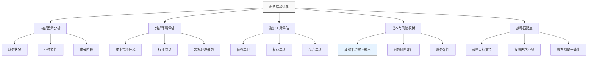

---
{"dg-publish":true,"tags":["财务BP","资金管理","融资结构","资本结构","财务优化"],"创建日期":"2024-07-21","permalink":"/知识共享/001_财务/01_财务BP/01_学习内容/05_高级分析方法/资金需求分析/融资结构优化/","dgPassFrontmatter":true}
---

> [!abstract] 概述
> 融资结构优化是企业财务规划中的核心环节，旨在确定最佳的资金来源组合，平衡融资成本与风险，提高企业价值。本文详细介绍融资结构优化的理论基础、评估方法、实施策略及案例分析，帮助财务BP专业人士设计最优的企业融资方案。

## 基础知识

### 融资结构的定义与内涵

融资结构（Financing Structure）是指企业各种资金来源的构成及其比例关系，包括债务融资、权益融资以及混合融资工具的组合。优化的融资结构能使企业在满足资金需求的同时，实现资本成本最小化和企业价值最大化。

不同学术观点对融资结构的定义存在细微差异：
- **传统观点**：强调债务与权益的比例关系，关注资产负债表中的长期资本结构
- **现代观点**：更全面地考虑各种融资工具的特性和现金流影响，包括表外融资和创新金融工具
- **战略性观点**：将融资结构视为企业战略的组成部分，与业务发展阶段和战略目标密切相关

### 融资结构优化的理论基础

#### 1. MM理论及其发展

莫迪利亚尼-米勒定理（Modigliani-Miller Theorem）是资本结构理论的基础：
- **无税MM理论**：在完美市场假设下，企业价值与融资结构无关
- **有税MM理论**：考虑税盾效应后，负债比例增加可提高企业价值
- **权衡理论**：将税盾效应与财务困境成本纳入考量，提出存在最优资本结构

#### 2. 优序融资理论

优序融资理论（Pecking Order Theory）认为企业融资遵循特定顺序：
1. 内部融资（留存收益）
2. 债务融资
3. 权益融资

这一理论基于信息不对称和发行成本考虑，解释了企业实际融资行为。

#### 3. 代理成本理论

代理成本理论关注股东、债权人和管理层之间的利益冲突：
- 股东与管理层之间的代理问题
- 股东与债权人之间的代理问题
- 融资结构可作为解决代理问题的机制

#### 4. 市场择机理论

市场择机理论（Market Timing Theory）认为企业会利用市场时机进行融资决策：
- 股价高估时倾向于发行股票
- 利率低时倾向于发行债券
- 长期融资结构是过去择机融资决策的累积结果

## 理论框架

### 融资结构优化的整体框架

### 最优融资结构决策模型

最优融资结构不仅考虑成本最小化，还需平衡多种因素：

1. **加权平均资本成本最小化**
   - WACC = Ke × (E/V) + Kd × (1-t) × (D/V)
   - 其中，Ke为权益成本，Kd为债务成本，E为权益总额，D为债务总额，V=E+D，t为企业所得税率

2. **财务风险可控**
   - 偿债能力指标处于安全区间
   - 现金流覆盖债务本息的能力充足

3. **财务弹性保持**
   - 保留未使用的债务融资能力
   - 维持充足的信用额度和融资渠道

4. **战略发展支持**
   - 满足企业长期发展的资金需求
   - 适应不同发展阶段的资金特性

## 应用指南

### 融资结构优化的实施步骤

#### 1. 企业融资需求分析

- **资金规模确定**：基于预测的资金缺口计算所需融资金额
- **资金用途明确**：区分营运资金需求与资本支出需求
- **资金周期规划**：评估短期、中期和长期资金需求

#### 2. 融资能力评估

- **债务承受能力分析**：基于财务指标评估可承受的债务规模
- **权益融资可行性**：考虑股权稀释、估值和股东意愿
- **混合融资工具适用性**：评估可转债等混合工具的适用条件

#### 3. 融资工具组合设计

- **债务融资工具选择**：银行贷款、债券发行、融资租赁等
- **权益融资方案构建**：普通股、优先股、私募等
- **融资期限结构设计**：长短期融资比例确定

#### 4. 融资成本分析

- **各融资工具成本计算**：考虑利息、手续费、发行费用等显性成本
- **隐性成本评估**：控制权影响、战略限制等隐性成本
- **综合成本比较**：不同融资组合的加权平均资本成本对比

#### 5. 融资风险分析

- **流动性风险评估**：短期偿债能力和再融资风险
- **利率风险分析**：利率变动对融资成本的影响
- **财务杠杆风险**：财务杠杆对盈利波动性的放大效应

#### 6. 最优融资方案确定

- **多方案比较**：对比不同融资结构方案的成本、风险和战略适配性
- **情景测试**：在不同业务情景下测试融资方案的稳健性
- **最终方案确定**：确定阶段性的最优融资结构方案

#### 7. 实施与调整

- **融资计划执行**：按计划实施融资活动
- **市场条件适应**：根据市场条件调整融资时机和具体工具
- **融资效果评估**：定期评估融资结构效果并适时调整

### 不同发展阶段的融资结构特点

| 发展阶段 | 典型融资结构 | 优先融资工具 | 关键考量因素 |
|---------|------------|------------|------------|
| 初创期 | 以权益为主 | 创始人投入、天使投资、风险投资 | 高风险、灵活性、控制权 |
| 成长期 | 权益与债务并重 | A/B/C轮融资、银行贷款、可转债 | 增长支持、财务杠杆、估值 |
| 成熟期 | 优化的债务权益比 | 公开发行、公司债券、银团贷款 | 资本成本、税盾效应、股东回报 |
| 调整期 | 债务重组或再融资 | 债务重组、资产证券化、私募股权 | 偿债压力缓解、业务重组支持 |

## 案例分析

### 案例一：制造业企业融资结构优化

某中型制造企业计划扩建生产线，需融资1亿元。公司现有资产负债率45%，年营业利润1.5亿元。

**初始融资方案对比**：

| 融资方案 | 方案内容 | 资本成本 | 优势 | 劣势 |
|---------|--------|---------|-----|------|
| 全债务方案 | 银行贷款1亿元，5年期，年利率5% | 5%×(1-25%)=3.75% | 低成本、税盾效应明显 | 偿债压力大、财务风险增加 |
| 全权益方案 | 引入战略投资者，增资1亿元 | 12% | 无偿债压力、增强资本实力 | 成本高、股权稀释 |
| 混合方案 | 银行贷款6000万元、增资4000万元 | 3.75%×0.6+12%×0.4=7.05% | 平衡风险与成本 | 融资复杂度增加 |

**方案优化分析**：
- 财务指标预测：不同方案下资产负债率、利息保障倍数、ROE对比
- 风险承受能力：全债务方案使资产负债率升至53%，接近行业警戒线
- 成长性考量：企业处于扩张期，需保持一定财务弹性

**最终优化方案**：
- 长期银行贷款5000万元（5年期，年利率5%）
- 发行可转换债券3000万元（3年期，票息3.5%，转股溢价率20%）
- 引入战略投资者增资2000万元
- 综合融资成本：约5.8%
- 方案优势：降低综合融资成本，平衡短期成本和长期弹性，预留未来发展空间

### 案例二：科技企业成长期融资结构调整

某软件服务企业处于快速成长期，前期主要依靠风险投资融资。随着业务扩张，公司计划优化融资结构，支持持续研发投入和市场拓展。

**公司现状**：
- 资产规模：2亿元
- 负债：5000万元（主要为经营性负债）
- 资产负债率：25%
- 年营收：1.5亿元，增长率30%
- 净利润：3000万元
- 现金消耗率：每月1000万元

**融资需求**：未来18个月预计资金缺口1.8亿元

**融资结构优化方案**：

1. **第一阶段（0-6个月）**
   - 银行信用贷款3000万元（年利率4.5%）
   - 应收账款保理2000万元（年利率5.5%）
   - 政府研发补助1000万元
   
2. **第二阶段（7-12个月）**
   - C轮融资8000万元（估值稀释约15%）
   - 科技专项贷款2000万元（优惠利率3.8%）
   
3. **第三阶段（13-18个月）**
   - 可转换债券发行2000万元
   - 供应链金融方案优化，释放资金约2000万元

**优化效果分析**：
- 综合融资成本降低约2个百分点
- 资产负债率控制在35%以内
- 现金流缺口有效覆盖
- 股权结构相对稳定，创始团队控制力保持
- 为未来IPO预留融资空间

## 延伸内容

### 融资结构与企业价值的关系

实证研究表明，融资结构对企业价值的影响因行业、规模、成长阶段而异：
- 资本密集型行业：适度提高负债比例有助于提升ROE
- 高科技行业：低负债策略通常更有利于企业发展
- 周期性行业：保守融资结构有助于度过行业低谷

### 融资结构的国际比较

不同国家和地区的企业融资结构呈现显著差异：
- 美国企业：以资本市场融资为主，债券市场发达
- 欧洲企业：银行贷款和债券融资并重
- 日本企业：传统上依赖银行融资，形成主银行体系
- 中国企业：以银行贷款为主，资本市场融资日益重要

### 新型融资工具与融资结构创新

近年来，新型融资工具不断丰富企业融资结构选择：
- 夹层融资（Mezzanine Financing）
- 资产证券化（Asset-backed Securities）
- 供应链金融（Supply Chain Finance）
- 绿色债券（Green Bonds）
- 众筹融资（Crowdfunding）

## 学习资源

### 思考问题

1. 在什么情况下，企业应优先考虑债务融资而非权益融资？
2. MM理论的现实局限性有哪些？如何在实际融资决策中应用这一理论？
3. 企业在不同成长阶段，融资结构应如何相应调整？为什么？
4. 如何评估融资结构对企业财务弹性和战略灵活性的影响？
5. 高负债企业如何通过融资结构优化降低财务风险？
6. 市场利率变动时，企业应如何调整融资结构以适应新环境？
7. 从股东价值最大化角度，如何确定最优资本结构？
8. 企业并购重组过程中，融资结构应考虑哪些特殊因素？
9. 新型融资工具如何帮助企业优化融资结构？举例说明。
10. 不同行业企业的最优融资结构存在哪些差异？为什么？

### 自测题

1. 根据MM理论，在完美资本市场假设下，以下哪项因素不会影响企业价值？
   A. 融资结构  B. 投资决策  C. 股利政策  D. 营业利润

2. 以下哪种融资理论认为企业融资有明确的优先顺序？
   A. MM理论  B. 优序融资理论  C. 市场择机理论  D. 代理成本理论

3. 计算WACC时，债务资本成本应该：
   A. 使用税前成本  B. 使用税后成本  C. 不考虑税盾效应  D. 等同于银行贷款利率

4. 以下哪项不是评估融资结构优化效果的关键指标？
   A. 资产负债率  B. 利息保障倍数  C. 存货周转率  D. 加权平均资本成本

5. 根据权衡理论，最优资本结构是在以下哪两个因素间取得平衡？
   A. 债务与权益  B. 短期融资与长期融资  C. 税盾收益与财务困境成本  D. 股东回报与债权人回报

### 实践练习

**练习1：融资结构方案设计**
假设你是某零售企业的财务经理，公司计划在未来3年内开设50家新店，估计资金需求为5亿元。公司目前资产负债率为40%，年营业利润2亿元，所得税率25%。
请设计3种不同的融资方案（全债务、全权益、混合融资），并分析各方案的优缺点。计算每种方案下的加权平均资本成本、财务杠杆相关指标，并推荐最优方案。

**练习2：融资结构优化分析**
某制造企业现有资产10亿元，负债6亿元，年EBIT为1.5亿元。该企业资本结构被认为过于保守，计划通过融资结构优化提高ROE。
请分析：
1. 该企业当前的资本结构状况及存在的问题
2. 设计一个融资结构优化方案，使ROE提高而财务风险仍在可控范围
3. 计算优化前后的关键财务指标变化，并评估优化效果

## 相关链接

- [[知识共享/001_财务/01_财务BP/01_学习内容/05_高级分析方法/资金需求分析/资金缺口计算方法\|资金缺口计算方法]]
- [[01_财务BP/01_学习内容/高级分析方法/资金需求分析/债务管理策略\|债务管理策略]]
- [[01_财务BP/01_学习内容/高级分析方法/资金需求分析/融资能力评估\|融资能力评估]]
- [[知识共享/001_财务/01_财务BP/01_学习内容/05_高级分析方法/投资回报分析/净现值与内部收益率分析\|净现值与内部收益率分析]]
- [[知识共享/001_财务/01_财务BP/01_学习内容/05_高级分析方法/风险评估/风险量化方法\|风险量化方法]]

## 参考文献

1. Brealey, R. A., Myers, S. C., & Allen, F. (2020). *Principles of Corporate Finance*. McGraw-Hill Education.
2. Baker, H. K., & Martin, G. S. (2011). *Capital Structure and Corporate Financing Decisions: Theory, Evidence, and Practice*. John Wiley & Sons.
3. Graham, J. R., & Leary, M. T. (2011). A Review of Empirical Capital Structure Research and Directions for the Future. *Annual Review of Financial Economics, 3(1)*, 309-345.
4. Damodaran, A. (2015). *Applied Corporate Finance*. John Wiley & Sons.
5. 吴国忠，《公司财务与融资策略》，中国人民大学出版社，2019.
6. 刘志远，《资本结构理论与实践》，中信出版社，2018.
7. 陈志武，《金融的逻辑》，中信出版社，2017. 