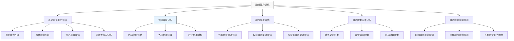

---
{"dg-publish":true,"tags":["财务BP","资金管理","融资能力","信用分析","财务评估"],"创建日期":"2024-07-21","permalink":"/知识共享/001_财务/01_财务BP/01_学习内容/05_高级分析方法/资金需求分析/融资能力评估/","dgPassFrontmatter":true}
---

> [!abstract] 概述
> 融资能力评估是资金需求分析的重要环节，用于判断企业获取外部资金的潜力和限制。本文系统介绍融资能力评估的理论基础、分析框架、评估方法及实际应用，帮助财务BP专业人士全面评估企业的融资空间，为资金规划提供支撑。

## 基础知识

### 融资能力的定义与内涵

融资能力（Financing Capacity）是指企业通过各种融资渠道获取外部资金的能力，反映了企业在特定时期内可以从外部筹集资金的最大规模和能力边界。融资能力是企业财务弹性的重要组成部分，对企业应对资金缺口、把握发展机会和应对风险至关重要。

融资能力的内涵包括以下几个方面：
- **融资规模能力**：企业在保持财务健康的前提下可获取外部资金的最大数量
- **融资渠道能力**：企业可利用的融资工具和渠道的多样性和可靠性
- **融资成本控制能力**：企业获取资金的成本水平及其控制能力
- **融资速度能力**：企业在需要时快速筹集资金的能力
- **融资可持续性**：企业长期持续获取外部资金的能力

### 融资能力的影响因素

企业融资能力受到多种内外部因素的综合影响：

#### 1. 内部因素

- **财务状况**：包括盈利能力、资产质量、现金流状况和现有资本结构
- **业务特性**：行业属性、业务模式、增长阶段和竞争地位
- **管理能力**：财务管理水平、风险管理能力和信息透明度
- **资产结构**：可用于抵押或质押的资产规模和质量
- **股东支持**：股东背景、实力和追加投资的意愿

#### 2. 外部因素

- **宏观经济环境**：经济周期、通胀水平和货币政策
- **行业发展趋势**：行业景气度、增长前景和投资吸引力
- **资本市场状况**：股票和债券市场的流动性和估值水平
- **信贷政策导向**：金融监管政策和产业政策
- **同行业融资标准**：同行业企业的融资条件和市场认可度

### 融资能力与企业战略的关系

融资能力与企业战略之间存在密切的相互影响关系：

- **战略对融资能力的要求**：不同发展战略对融资能力的要求不同
  - 快速扩张战略需要强大的融资能力支持
  - 稳健发展战略对融资能力的依赖相对较低
  - 转型战略对融资能力的灵活性要求更高

- **融资能力对战略的约束**：融资能力是战略制定和实施的重要约束条件
  - 融资能力不足可能导致战略调整或降低战略目标
  - 融资能力强大可以支持更具进取性的战略选择
  - 融资能力的可持续性影响长期战略规划

- **战略融资能力的建设**：将融资能力建设纳入战略规划
  - 通过业务发展提升基础融资能力
  - 战略性培育多元化融资渠道
  - 前瞻性维护战略融资关系

## 理论框架

### 融资能力评估的整体框架

### 融资能力评估的核心模型

#### 1. 债务融资能力模型

债务融资能力主要基于以下方面评估：

- **财务杠杆空间模型**：
  - 目标资产负债率 = 行业平均值 ± 调整系数
  - 债务融资空间 = (目标资产负债率 × 资产总额) - 现有负债总额

- **偿债能力约束模型**：
  - 基于利息保障倍数：最大债务规模 = EBIT ÷ 最低可接受利息保障倍数 × 平均利率
  - 基于现金流覆盖：最大债务规模 = 经营现金流 ÷ 最低现金流覆盖率 × 偿债比例

- **信用评级约束模型**：
  - 基于目标信用评级对应的关键财务指标确定最大可承受债务规模

#### 2. 权益融资能力模型

权益融资能力主要考虑以下因素：

- **股权融资吸引力模型**：
  - 基于企业价值评估和增长前景
  - 考虑行业估值水平和投资者偏好

- **股权稀释容忍度模型**：
  - 控股股东持股比例与控制权稀释空间
  - 治理结构对股权融资的影响

- **资本市场接受度模型**：
  - 上市可行性评估
  - 资本市场对行业和企业类型的偏好

#### 3. 综合融资能力评估模型

将债务融资能力和权益融资能力结合，考虑融资渠道多元化程度：

- **综合融资能力指数** = α × 债务融资能力得分 + β × 权益融资能力得分 + γ × 多元化融资能力得分

其中，α、β、γ 为权重系数，根据企业战略和行业特点确定。

## 应用指南

### 融资能力评估的具体步骤

#### 1. 企业基础财务能力分析

- **盈利能力评估**
  - 计算并分析ROE、ROA、EBITDA利润率等指标
  - 评估盈利能力的稳定性和增长趋势
  - 与行业标准对比分析

- **资产负债结构分析**
  - 计算并分析资产负债率、流动比率、速动比率
  - 评估资产质量和结构合理性
  - 分析负债结构和期限匹配情况

- **现金流分析**
  - 评估经营活动现金流量及其稳定性
  - 分析自由现金流和现金流波动性
  - 计算现金流对投资和债务的覆盖比率

- **增长与效率分析**
  - 分析收入和利润增长率
  - 评估资产周转效率
  - 分析资本支出效率和回报

#### 2. 债务融资能力评估

- **最大债务容量测算**
  - 基于资产负债率上限的债务空间测算
  - 基于偿债能力指标约束的债务容量评估
  - 基于现金流覆盖的债务容量计算

- **债务融资渠道评估**
  - 银行授信情况及使用率分析
  - 债券市场融资可行性评估
  - 其他债务融资工具可行性分析

- **债务融资成本分析**
  - 现有债务的加权平均成本计算
  - 新增债务的可能融资成本估计
  - 债务成本与同行业对比分析

- **债务融资限制因素识别**
  - 现有债务契约中的限制条款分析
  - 监管政策对行业融资的限制评估
  - 内部治理对债务融资的审批和控制要求

#### 3. 权益融资能力评估

- **企业价值评估**
  - 基于市盈率、市净率等相对估值方法
  - 基于DCF等绝对估值方法
  - 结合行业特点和企业情况综合评估

- **股权融资可行性分析**
  - 上市条件符合度评估(如适用)
  - 私募股权融资可行性分析
  - 战略投资者引入可能性评估

- **股权融资限制因素分析**
  - 控股股东意愿和持股比例要求
  - 股权结构对融资的影响
  - 治理结构对股权融资的影响

- **股权融资成本估算**
  - 权益资本成本估算（CAPM或其他方法）
  - 股权稀释影响分析
  - 交易成本估计

#### 4. 多元化融资渠道评估

- **混合融资工具评估**
  - 可转债、优先股等混合工具的适用性
  - 混合融资成本和限制条件分析

- **非传统融资渠道评估**
  - 融资租赁、保理等融资方式可行性
  - 供应链金融机会评估
  - 资产证券化可行性分析

- **政策性融资机会评估**
  - 产业基金、政府引导基金合作可能性
  - 政策性贷款和补贴获取能力
  - 科技金融、绿色金融等专项支持评估

#### 5. 融资能力动态预测

- **短期融资能力预测**（1年内）
  - 基于现有财务状况和已获授信的短期融资能力
  - 考虑季节性波动和短期业务变化的影响

- **中期融资能力预测**（1-3年）
  - 结合业务发展规划和财务预测
  - 评估资本结构优化空间
  - 考虑行业和市场环境变化

- **长期融资能力趋势分析**（3年以上）
  - 战略性融资能力建设路径规划
  - 长期融资环境变化趋势分析
  - 融资能力与战略目标匹配度评估

### 融资能力评估的关键指标体系

| 能力维度 | 指标类别 | 具体指标 | 计算方法 | 评估标准 |
|---------|---------|---------|---------|---------|
| 基础财务能力 | 盈利能力 | 净资产收益率(ROE) | 净利润/平均股东权益 | 行业对标+增长趋势 |
| | | 资产收益率(ROA) | 息税前利润/平均总资产 | 行业对标+稳定性 |
| | | EBITDA利润率 | EBITDA/营业收入 | 行业对标+现金流质量 |
| | 偿债能力 | 利息保障倍数 | EBIT/利息费用 | >3为基本标准 |
| | | 债务/EBITDA比率 | 总债务/EBITDA | <4为一般标准 |
| | | 经营现金流债务比 | 经营活动现金流/总债务 | >20%为基本标准 |
| 债务融资能力 | 杠杆水平 | 资产负债率 | 总负债/总资产 | 行业标准+安全边际 |
| | | 净负债比率 | (有息负债-现金)/权益 | <100%为基本标准 |
| | 债务结构 | 短期债务占比 | 短期有息负债/总有息负债 | 与资产结构匹配 |
| | | 担保债务比例 | 有担保债务/总债务 | 担保能力评估 |
| | 融资渠道 | 银行授信使用率 | 已用授信/总授信额度 | <70%为宜 |
| | | 融资渠道多样性 | 主要融资渠道数量 | 至少3个以上渠道 |
| 权益融资能力 | 市场表现 | 市盈率(PE)* | 市值/净利润 | 与行业平均比较 |
| | | 市净率(PB)* | 市值/净资产 | 与行业平均比较 |
| | 股权结构 | 控股比例 | 第一大股东持股比例 | 控制权稳定性评估 |
| | | 可融资股权空间 | 控股要求下可稀释空间 | 与融资需求匹配 |
| 综合融资能力 | 融资成本 | 加权平均资本成本 | WACC计算模型 | 与行业平均比较 |
| | | 增量融资成本预估 | 基于信用状况和市场情况 | 成本可接受度评估 |
| | 融资弹性 | 融资应对速度 | 获取融资的时间评估 | 与应急需求匹配 |
| | | 融资限制条件 | 现有融资契约限制 | 对新增融资的影响 |

*注：未上市企业可采用可比公司或行业平均值进行估算

## 案例分析

### 案例一：制造业企业融资能力评估

某装备制造企业计划进行产能扩张，需评估其融资能力以支持投资计划。

**企业基本情况**：
- 总资产12亿元，净资产6.5亿元，资产负债率45.8%
- 年营业收入10亿元，净利润8000万元，ROE 12.3%
- 现有有息负债3亿元，其中长期贷款2亿元，短期贷款1亿元
- 年EBITDA 1.5亿元，经营活动现金流1.2亿元
- 信用评级AA-，主要银行授信总额5亿元，已使用2.5亿元

**融资能力评估过程**：

1. **基础财务能力评估**
   - 盈利能力：ROE 12.3%，高于行业平均10.5%；近三年复合增长率8%
   - 偿债能力：利息保障倍数6.7倍，高于行业平均5.2倍；债务/EBITDA比率2.0，优于行业平均2.8
   - 现金流状况：经营现金流/债务比率40%，优于行业平均32%；现金流质量良好

2. **债务融资能力评估**
   - 基于行业标准（资产负债率60%上限）计算的债务空间：
     潜在债务规模 = 12亿 × 60% - 5.5亿 = 1.7亿元
   - 基于利息保障倍数约束（最低接受倍数3倍）计算的债务空间：
     最大债务增量 = (1.2亿 - 3亿 × 5%) ÷ 5% × 3 - 3亿 = 2.2亿元
   - 银行授信剩余额度2.5亿元，可进一步拓展融资渠道

3. **权益融资能力评估**
   - 公司为非上市企业，近期融资轮估值约10亿元（PE 12.5倍）
   - 控股股东持股65%，表示愿意稀释至不低于51%
   - 可融股权空间约14%，按当前估值可融资约1.4亿元
   - 已有投资机构表达初步投资意向，但要求投后估值不超过12亿元

4. **多元化融资渠道评估**
   - 设备融资租赁可行性高，潜在融资规模约1亿元
   - 供应链金融可释放资金约5000万元
   - 地方产业引导基金有合作可能，潜在支持约3000万元

5. **融资能力综合评估**
   - 债务融资能力：保守估计可新增债务1.7亿元
   - 权益融资能力：可融资约1.4亿元
   - 多元化融资能力：可获取资金约1.8亿元
   - 综合融资能力：最大可获得资金约4.9亿元
   - 最佳融资组合建议：银行贷款1亿元、融资租赁1亿元、股权融资1亿元，保留融资空间

### 案例二：科技创业企业融资能力评估

某人工智能科技企业处于快速成长期，需要评估其融资能力以支持研发投入和市场扩张。

**企业基本情况**：
- 成立4年，已完成A+轮融资，估值2亿元
- 年营收5000万元，亏损1000万元（持续投入研发）
- 总资产8000万元，净资产5000万元，资产负债率37.5%
- 有息负债1000万元（全部为短期贷款）
- 月均现金消耗800万元，现金余额3000万元
- 股权结构：创始团队持股60%，投资机构持股40%

**融资能力评估过程**：

1. **基础财务能力评估**
   - 盈利能力：尚未盈利，但收入增长迅速，同比增长120%
   - 现金流状况：经营现金流为负，研发投入大，客户付款周期长
   - 资产质量：主要为现金、应收账款和无形资产（专利和软件著作权）

2. **债务融资能力评估**
   - 传统债务融资能力有限：银行贷款主要依靠担保获取
   - 科技专项贷款潜力：基于知识产权质押，可能获得1500万元
   - 债务成本较高：目前贷款平均利率7.5%，高于传统行业

3. **权益融资能力评估**
   - 行业估值水平：同行业平均PS倍数约8-10倍
   - 基于当前营收和增长率，企业合理估值范围4亿-5亿元
   - B轮融资潜力：按20%稀释率，可融资约1亿元
   - 投资机构关注度高：已有多家机构表达投资意向

4. **多元化融资渠道评估**
   - 政府科技补贴：预计可申请500万元
   - 产业基金合作：某人工智能产业基金有合作意向，可投资2000万元
   - 客户预付款模式：关键客户愿意提供部分预付款，约800万元

5. **融资能力综合评估**
   - 债务融资能力：保守估计可获得1500万元
   - 权益融资能力：有望获得B轮融资1亿元
   - 多元化融资能力：可获取约3300万元
   - 综合融资能力：短期内可获得资金约1.5亿元
   - 融资建议：
     * 短期：推进科技专项贷款申请（1500万）和产业基金合作（2000万）
     * 中期（6个月内）：启动B轮融资，目标1亿元
     * 融资节奏控制：分阶段落实，避免现金断裂风险

## 延伸内容

### 不同行业企业融资能力特点

不同行业由于业务特性、资产结构和风险特征的差异，融资能力呈现显著不同：

| 行业类型 | 融资能力特点 | 优势融资渠道 | 融资能力提升要点 |
|---------|------------|------------|---------------|
| 重资产制造业 | 抵押物充足 现金流相对稳定 杠杆率容忍度高 | 银行贷款 债券融资 融资租赁 | 资产效率提升 专业化资产管理 现金流稳定性提高 |
| 轻资产科技业 | 有形资产少 增长潜力大 财务状况波动 | 风险投资 知识产权质押贷款 可转债 | 知识产权体系建设 商业模式变现 融资多元化布局 |
| 零售服务业 | 周转速度快 季节性需求 经营地域分散 | 供应链金融 循环贷款 特许经营融资 | 供应链整合优化 会员体系经济 数字化投入回报 |
| 房地产业 | 项目周期长 监管限制多 资金需求集中 | 开发贷款 信托融资 REITS | 土地储备质量 资金周转效率 融资合规管理 |
| 公用事业 | 收入高度稳定 资本支出大 政策敏感性高 | 长期债券 银团贷款 PPP模式 | 政府关系管理 特许经营权增值 产业协同发展 |

### 不同发展阶段的融资能力演进

企业在不同发展阶段的融资能力呈现规律性变化：

1. **初创期融资能力特点**
   - 主要依赖创始人资金和天使投资
   - 债务融资能力极其有限，主要依靠担保或抵押
   - 融资决策快速但选择有限，成本较高
   - 关键提升点：产品验证和商业模式清晰化

2. **成长期融资能力特点**
   - 风险投资成为主要融资来源
   - 开始具备有限的银行贷款能力
   - 可利用政府支持计划和产业基金
   - 关键提升点：增长数据质量和规模化能力验证

3. **扩张期融资能力特点**
   - 债权与股权融资并重
   - 银行授信规模扩大，可探索债券市场
   - 并购融资和项目融资可行性增强
   - 关键提升点：财务规范化和信用评级建设

4. **成熟期融资能力特点**
   - 全方位融资渠道，资本市场充分利用
   - 低成本债务融资比例提高
   - 国际融资能力提升
   - 关键提升点：资本结构优化和财务战略深化

### 融资能力评估的新趋势

1. **ESG因素与融资能力**
   - 环境、社会和治理(ESG)表现越来越影响融资能力
   - 绿色金融、可持续发展债券等新型融资工具兴起
   - ESG评级与传统信用评级的结合趋势明显

2. **金融科技对融资能力的影响**
   - 大数据信用评估模型改变传统融资评估方法
   - 区块链供应链金融提升中小企业融资能力
   - 智能合约和自动化融资提高融资效率

3. **产业生态融资能力整合**
   - 产业链核心企业带动上下游融资能力提升
   - 产业平台+金融服务模式兴起
   - 产业基金成为连接产业与资本的重要桥梁

## 学习资源

### 思考问题

1. 企业应如何平衡融资能力的提升和财务风险的控制？
2. 在评估企业融资能力时，哪些非财务因素需要重点考虑？为什么？
3. 传统财务指标在评估新经济企业融资能力时有哪些局限性？如何弥补？
4. 企业生命周期不同阶段的融资能力建设应有哪些差异化策略？
5. 资本市场环境变化（如加息周期）对企业融资能力的影响及应对策略是什么？
6. 如何判断企业的债务融资已达到合理上限？有哪些预警信号？
7. 企业应如何根据战略发展需求前瞻性地规划融资能力建设？
8. 产业政策和金融监管政策对企业融资能力的影响机制是什么？
9. 不同股权结构（如国企、民企、外资企业）对融资能力的影响有哪些差异？
10. 融资能力评估结果应如何转化为具体的融资策略和行动计划？

### 自测题

1. 以下哪项因素对初创科技企业的融资能力影响最大？
   A. 资产负债率水平  B. 商业模式清晰度和市场验证  C. 历史盈利记录  D. 固定资产规模

2. 企业融资能力评估中，下列哪项指标最能反映债务偿还能力？
   A. 毛利率  B. 资产周转率  C. 利息保障倍数  D. 流动比率

3. 在进行融资能力评估时，"财务弹性"主要指：
   A. 财务报表调整空间  B. 应对突发融资需求的能力  C. 财务部门人员配置灵活性  D. 会计政策选择多样性

4. 对于处于成长期的企业，下列哪种融资能力建设最为关键？
   A. 优化债务结构  B. 建立多元化融资渠道  C. 提高资产负债率  D. 减少研发投入控制风险

5. 以下哪项不属于影响企业权益融资能力的关键因素？
   A. 行业估值水平  B. 现金股利支付比例  C. 控股股东持股比例  D. 增长前景

### 实践练习

**练习1：全面融资能力评估**
选择一家上市公司，收集其最近三年的财务报表和市场表现数据，进行全面的融资能力评估。具体要求：
1. 计算并分析关键财务指标，评估其基础财务能力
2. 分析其债务融资能力，包括潜在债务空间和融资成本
3. 评估其权益融资能力，包括市场表现和投资者接受度
4. 研究其实际融资活动，并与你的评估结果对比
5. 提出提升该企业融资能力的建议

**练习2：融资能力前瞻性规划**
为一家扩张期企业设计未来三年的融资能力建设路径。假设该企业目前年收入5亿元，计划三年内达到15亿元，需要融资支持。具体要求：
1. 设计关键财务指标提升目标，包括盈利能力、偿债能力指标
2. 规划债务融资和权益融资能力建设路径
3. 设计多元化融资渠道发展计划
4. 提出融资能力与业务战略协同发展的具体措施
5. 设计融资能力建设的关键里程碑和评估方法

## 相关链接

- [[知识共享/001_财务/01_财务BP/01_学习内容/05_高级分析方法/资金需求分析/资金缺口计算方法\|资金缺口计算方法]]
- [[01_财务BP/01_学习内容/高级分析方法/资金需求分析/融资结构优化\|融资结构优化]]
- [[01_财务BP/01_学习内容/高级分析方法/资金需求分析/债务管理策略\|债务管理策略]]
- [[知识共享/001_财务/01_财务BP/01_学习内容/05_高级分析方法/风险评估/财务风险识别\|财务风险识别]]
- [[投资回报分析\|投资回报分析]]

## 参考文献

1. Damodaran, A. (2019). *Applied Corporate Finance*. John Wiley & Sons.
2. Berk, J., & DeMarzo, P. (2020). *Corporate Finance*. Pearson.
3. Brigham, E. F., & Ehrhardt, M. C. (2017). *Financial Management: Theory & Practice*. Cengage Learning.
4. Graham, J. R., & Harvey, C. R. (2001). The theory and practice of corporate finance: Evidence from the field. *Journal of Financial Economics, 60(2-3)*, 187-243.
5. 朱宁，《投资的逻辑》，中信出版社，2017.
6. 肖星，《公司金融》，北京大学出版社，2019.
7. 吴晓求，《现代公司金融》，中国人民大学出版社，2018. 