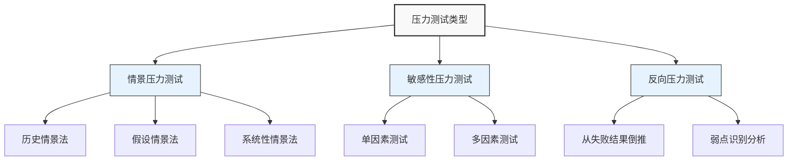

---
{"dg-publish":true,"tags":["财务BP","风险管理","压力测试","财务规划","极端情景"],"创建日期":"2024-05-15","aliases":["财务压力测试","压力情景分析"],"permalink":"/知识共享/001_财务/01_财务BP/01_学习内容/05_高级分析方法/风险评估/压力测试应用/","dgPassFrontmatter":true}
---

> [!abstract] 概述
> 压力测试是财务BP中评估企业在极端但合理情景下财务韧性的系统方法，通过模拟严重不利条件，检验企业财务结构的承受能力并识别潜在脆弱点。本文介绍压力测试的原理、方法、实施流程及应用案例，帮助财务BP专业人士构建更具韧性的财务规划，提前应对极端风险事件。

## 基本概念

压力测试(Stress Testing)是一种通过设定极端但合理的不利情景，评估企业财务韧性和脆弱性的前瞻性风险管理工具。与普通情景分析不同，压力测试聚焦于低概率高影响事件，帮助企业为"黑天鹅"事件做好准备。

### 压力测试的类型

1. **情景压力测试(Scenario Stress Testing)**：
   - 历史情景法：基于历史极端事件构建情景
   - 假设情景法：基于假设的极端条件构建情景
   - 系统性情景法：模拟整体经济或行业冲击

2. **敏感性压力测试(Sensitivity Stress Testing)**：
   - 单因素测试：分析单一风险因素极端变化的影响
   - 多因素测试：分析多个风险因素同时恶化的影响

3. **反向压力测试(Reverse Stress Testing)**：
   - 从特定失败结果出发，倒推导致失败的情景
   - 识别企业最脆弱的领域和容忍极限

### 压力测试与其他风险工具的关系

压力测试是风险管理工具箱中的重要组成部分，与其他工具相互补充：

| 分析方法 | 关注点 | 主要优势 | 与压力测试的关系 |
|---------|-------|---------|----------------|
| 敏感性分析 | 关键变量变动的边际影响 | 识别敏感因素 | 为压力测试提供关键变量 |
| 情景分析 | 多种可能的未来情景 | 涵盖多种可能性 | 压力测试聚焦极端情景 |
| 蒙特卡洛模拟 | 概率分布和风险定量 | 全概率分析 | 压力测试关注尾部风险 |
| 风险价值(VaR) | 正常市场下的潜在损失 | 统计学基础 | 压力测试补充VaR的局限性 |

### 压力测试在财务BP中的价值

1. **韧性评估**：评估企业财务结构在极端条件下的承受能力
2. **脆弱点识别**：发现财务规划中的薄弱环节和关键风险暴露
3. **应急规划支持**：为制定应急计划提供分析基础
4. **资本结构优化**：帮助优化资本结构和流动性储备
5. **风险意识提升**：提高管理层对极端风险的认识
6. **监管合规**：满足越来越严格的风险管理监管要求

## 核心内容

### 压力测试的关键要素

有效的财务压力测试应包含以下核心要素：

#### 1. 压力情景设计

情景设计是压力测试的基础，应满足以下特征：
- **极端但合理**：情景应足够严峻，但仍在合理范围内
- **相关性**：与企业业务模式和风险暴露相关
- **多维度**：考虑多种风险因素的相互作用
- **时间动态**：考虑风险事件的持续时间和演变过程

**典型压力情景类型**：
- **宏观经济冲击**：经济衰退、通货膨胀、流动性危机
- **行业特定冲击**：行业需求崩溃、监管变革、技术颠覆
- **企业特定冲击**：核心客户流失、供应链中断、重大产品故障
- **运营冲击**：系统故障、欺诈事件、关键人员流失
- **复合冲击**：多种不利事件同时发生

#### 2. 影响传导路径分析

压力测试需要明确压力情景如何通过不同渠道影响企业财务：

- **收入传导路径**：
  - 销量下降：需求减少、客户流失
  - 价格下跌：价格战、行业产能过剩
  - 产品结构劣化：高利润产品需求减少

- **成本传导路径**：
  - 原材料成本上升：供应紧张、通货膨胀
  - 融资成本增加：利率上升、信用紧缩
  - 固定成本负担加重：产能利用率下降

- **资产负债表传导路径**：
  - 资产减值：应收账款坏账、库存贬值
  - 流动性压力：应收账款周期延长、信贷条件收紧
  - 债务压力：再融资困难、契约条款违约风险

#### 3. 量化影响评估

压力测试需要量化评估极端情景对关键财务指标的影响：

- **盈利能力指标**：
  - 营业收入变动
  - 毛利率和营业利润率变化
  - EBITDA变动及覆盖率影响

- **流动性指标**：
  - 现金储备耗尽时间
  - 流动比率和速动比率变化
  - 营运资金需求变动

- **偿债能力指标**：
  - 债务/EBITDA比率变化
  - 利息覆盖率下降
  - 债务契约条款违约风险

- **资本充足性指标**：
  - 资本消耗程度
  - 资本补充需求
  - 信用评级变动风险

#### 4. 承受能力阈值设定

压力测试需要明确企业财务指标的警戒线和容忍极限：

- **生存阈值**：低于此水平企业生存受威胁
  - 最低现金余额
  - 最低权益比率
  - 最低信用评级

- **警戒阈值**：需要启动应对措施的触发点
  - 流动性警戒线
  - 盈利能力警戒线
  - 负债率上限

### 压力测试方法学

#### 1. 历史情景法

基于历史上实际发生的极端事件构建压力情景：

**步骤**：
1. 选择相关历史事件（如2008金融危机、疫情冲击）
2. 收集该事件对关键经济和行业指标的影响数据
3. 调整历史数据以适应当前企业情况
4. 模拟企业在类似事件下的财务表现

**优势**：真实性高，有数据支持，容易获得管理层认同
**局限性**：历史可能不会完全重演，新风险模式可能被忽视

#### 2. 假设情景法

基于对可能发生的极端事件的假设构建压力情景：

**步骤**：
1. 通过头脑风暴识别潜在极端事件
2. 定义事件的严重程度和持续时间
3. 估计事件对关键财务驱动因素的影响
4. 模拟企业在此情景下的财务表现

**优势**：灵活性高，可针对企业特定风险定制
**局限性**：假设的合理性和一致性难以保证

#### 3. 敏感性压力测试

分析关键财务变量极端变化对财务状况的影响：

**步骤**：
1. 识别对财务表现影响最大的关键变量
2. 设定这些变量的极端变化幅度
3. 分析单因素极端变化的影响
4. 分析多因素同时变化的复合影响

**优势**：实施简单，直观明了
**局限性**：可能忽略变量间的相互作用

#### 4. 反向压力测试

从定义的"失败"状态出发，识别可能导致该状态的情景：

**步骤**：
1. 定义"失败"状态（如流动性枯竭、违反债务契约）
2. 识别可能导致该状态的关键变量组合
3. 分析导致失败的临界值
4. 评估这些临界情况发生的可能性

**优势**：直接关注企业脆弱点，揭示风险极限
**局限性**：计算复杂，需要反复迭代

### 压力测试在财务BP各环节的应用

#### 1. 收入预测的压力测试

**关键压力因素**：
- 需求急剧下降
- 价格战导致价格崩溃
- 大客户流失
- 渠道中断

**测试方法**：
- 模拟销量下降20-50%的情景
- 分析产品结构变化的影响
- 评估渠道中断导致的市场准入风险

#### 2. 成本结构的压力测试

**关键压力因素**：
- 原材料价格暴涨
- 能源成本剧增
- 劳动力成本上升
- 产能利用率大幅下降

**测试方法**：
- 分析成本弹性与固定成本占比
- 评估规模经济损失影响
- 测算关键成本上升对盈亏平衡的影响

#### 3. 现金流的压力测试

**关键压力因素**：
- 收款周期延长
- 信贷条件收紧
- 资本市场冻结
- 战略投资延迟回报

**测试方法**：
- 现金耗尽分析(cash burn analysis)
- 流动性缺口分析
- 融资渠道中断影响评估

#### 4. 资本结构的压力测试

**关键压力因素**：
- 利率大幅上升
- 再融资渠道受阻
- 资产减值损失
- 外汇汇率剧烈波动

**测试方法**：
- 债务契约违约风险分析
- 再融资风险评估
- 评级下调影响分析

## 应用方法

### 压力测试的实施流程

完整的压力测试实施应遵循以下流程：

1. **准备阶段**
   - 确定测试目标和范围
   - 组建跨职能测试团队
   - 梳理现有财务模型和数据
   - 识别关键风险因素和财务指标

2. **情景设计阶段**
   - 选择压力测试方法
   - 设计相关压力情景
   - 确定情景参数和假设
   - 定义压力事件的时间线

3. **影响分析阶段**
   - 将情景参数输入财务模型
   - 计算压力情景对各财务指标的影响
   - 分析财务影响的传导路径
   - 评估压力情景的复合效应

4. **结果评估阶段**
   - 与承受能力阈值比较
   - 识别风险暴露和财务脆弱点
   - 评估现有应急措施的有效性
   - 确定需要加强的薄弱环节

5. **应对规划阶段**
   - 制定针对性的风险缓解策略
   - 设计应急响应计划
   - 调整财务结构和资源配置
   - 设定预警指标和触发机制

6. **报告与沟通阶段**
   - 编制压力测试报告
   - 向管理层汇报关键发现
   - 与相关部门沟通应对计划
   - 更新财务BP和战略规划

### 压力测试结果的解读与应用

压力测试结果应得到系统性解读和应用：

1. **脆弱点诊断**
   - 识别财务结构中最先达到临界点的环节
   - 分析不同压力情景下的共同脆弱点
   - 确定最严重的风险传导路径

2. **缓冲资源评估**
   - 评估现有流动性储备的充足性
   - 检验资本缓冲能力
   - 分析现有风险缓解措施的有效性

3. **早期预警指标设计**
   - 基于压力测试结果设计预警指标
   - 确定各指标的临界阈值
   - 建立梯度预警机制

4. **应急计划制定**
   - 设计分阶段响应策略
   - 准备应急资源和措施
   - 明确决策责任和流程
   - 制定沟通预案

5. **财务结构优化**
   - 调整资本结构增强韧性
   - 优化融资策略和期限结构
   - 改善业务组合降低风险集中度

### 财务BP中压力测试的工具与模板

#### 1. 压力测试模型框架

基本的压力测试模型应包含以下组成部分：

- **假设模块**：记录压力情景的关键参数
- **驱动因素模块**：将情景参数转化为财务驱动因素
- **财务报表模块**：生成压力情景下的预测财务报表
- **指标计算模块**：计算关键财务指标的变化
- **阈值比较模块**：与预设阈值比较，评估严重程度
- **可视化模块**：直观展示压力测试结果

#### 2. 压力测试数据需求

有效的压力测试需要以下关键数据：

- **历史财务数据**：3-5年的财务报表和关键指标
- **市场与行业数据**：行业周期、竞争格局、价格趋势
- **宏观经济数据**：GDP增长、通胀率、利率走势
- **企业特定数据**：成本结构、客户集中度、融资结构
- **历史风险事件数据**：过往极端事件的影响和应对

#### 3. 压力测试报告模板

标准压力测试报告应包含以下内容：

- **执行摘要**：关键发现和建议
- **测试目标与范围**：明确测试边界
- **方法论说明**：测试方法和流程
- **情景描述**：详述压力情景的参数和假设
- **定量影响分析**：各财务指标的压力影响
- **脆弱点识别**：最先达到临界的财务维度
- **承受能力评估**：企业抵御压力的能力评价
- **应对策略建议**：风险缓解和应急计划建议
- **附录**：详细数据和分析

## 案例分析

### 案例一：制造企业的综合压力测试

某中型制造企业进行压力测试，评估极端经济衰退对其财务韧性的影响。

**背景信息**：
- 年营收5亿元，EBITDA利润率12%
- 债务/EBITDA比率为2.5倍
- 60%成本为可变成本，40%为固定成本
- 主要客户为汽车和建筑行业

**压力情景设计**：
- 情景基础：类似2008-2009金融危机的严重衰退
- 假设条件：
  - 销量下降30%，持续4个季度
  - 产品价格下降10%
  - 原材料成本上升5%
  - 应收账款周期延长30天
  - 银行信贷收紧，新增贷款利率上升200基点

**测试结果**：

| 财务指标 | 基准情景 | 压力情景 | 变化 | 预警阈值 | 状态 |
|---------|---------|---------|------|---------|------|
| EBITDA利润率 | 12% | 3% | -9% | 5% | 超阈值 |
| 现金流量 | +5000万/年 | -2000万/年 | -7000万 | 0 | 超阈值 |
| 债务/EBITDA | 2.5x | 8.3x | +5.8x | 4.0x | 超阈值 |
| 利息覆盖率 | 5.0x | 1.2x | -3.8x | 2.0x | 超阈值 |
| 流动比率 | 1.8 | 1.2 | -0.6 | 1.0 | 接近阈值 |
| 现金储备耗尽时间 | - | 6个季度 | - | 4季度 | 尚可接受 |

**关键发现**：
1. 盈利能力显著恶化，EBITDA利润率低于维持健康运营的阈值
2. 债务杠杆大幅上升，违反贷款契约条款的风险高
3. 现金流转为负，6个季度后现金储备耗尽
4. 固定成本占比高导致盈利下降幅度超过收入下降幅度

**应对策略建议**：
1. **短期流动性管理**：
   - 扩大信贷额度，增加1亿元备用信贷
   - 应收账款管理优化，缩短收款周期
   - 准备应急资产变现计划

2. **成本结构调整**：
   - 制定固定成本削减计划，降低30%可控固定成本
   - 建立产能利用率与成本控制的联动机制
   - 准备分阶段人员优化方案

3. **债务结构优化**：
   - 重新谈判债务契约条款，增加危机期间的灵活性
   - 延长债务期限，降低短期再融资风险
   - 准备可转债或其他替代融资工具

4. **客户与产品策略**：
   - 减少对周期性行业客户的依赖
   - 增加产品多样性，提高非周期性产品比例
   - 建立客户信用风险监控系统

**实施时间表**：
- 立即：启动信贷额度扩大谈判和应收账款管理优化
- 1个月内：完成成本削减和债务重组计划
- 3个月内：实施客户与产品组合调整
- 持续：建立每月压力指标监控机制

### 案例二：科技企业的现金流压力测试

某快速增长的软件服务企业进行现金流压力测试，评估融资环境恶化时的生存能力。

**背景信息**：
- 月均消耗现金(Burn Rate)500万元
- 当前现金储备1.2亿元
- 正计划18个月后完成新一轮融资
- 核心业务为SaaS订阅模式，增长率50%/年

**压力情景设计**：
- 情景假设：科技行业融资窗口关闭
  - 新客户获取率下降50%
  - 客户流失率上升一倍
  - 应收账款周期延长45天
  - 下一轮融资推迟12个月
  - 融资估值下降40%

**测试结果**：

| 指标 | 基准情景 | 压力情景 | 变化 |
|------|----------|---------|------|
| 现金耗尽时间 | 24个月 | 15个月 | -9个月 |
| 融资前现金余额 | 3000万元 | -9000万元 | -1.2亿元 |
| 12个月内流动性缺口 | 0 | 3000万元 | +3000万元 |
| 估值稀释影响 | 20% | 42% | +22% |

**关键发现**：
1. 在压力情景下，现金将在15个月内耗尽，无法支撑到下一轮融资
2. 核心问题是获客成本投入与延迟回收的时间错配
3. 客户流失对长期价值影响显著
4. 现有业务模式对持续融资依赖性强

**应对策略建议**：
1. **现金保护策略**：
   - 设计可激活的紧急现金保护计划，降低50%获客支出
   - 优化定价策略，提高前期收款比例
   - 建立现金余额与增长投资的联动机制

2. **融资多元化**：
   - 提前启动融资计划，留出充分缓冲期
   - 开发多元融资渠道，包括战略投资和债务
   - 准备分阶段、小规模融资方案

3. **业务模式调整**：
   - 增加前期收费比例，改善现金流模式
   - 加强客户留存措施，降低流失风险
   - 提高产品上线速度，缩短投资回收周期

4. **分阶段扩张战略**：
   - 设计按结果付费的市场推广模式
   - 建立基于现金流的业务扩张触发机制
   - 准备业务聚焦计划，确定核心保留业务

**预警机制设计**：
- 设定现金储备警戒线：12个月运营所需
- 客户获取成本回收周期预警：超过12个月触发审查
- 客户流失率预警：超过历史平均20%触发干预
- 每周现金流预测与实际对比分析

## 延伸内容

### 压力测试的挑战与局限性

尽管压力测试是强大的风险管理工具，但在实践中面临诸多挑战：

1. **情景设计挑战**
   - 难以确定"足够极端但仍合理"的边界
   - 主观判断难以避免
   - 新兴风险缺乏历史参考

2. **模型局限性**
   - 模型简化可能忽略重要传导路径
   - 线性假设在极端情况下可能失效
   - 二阶效应和反馈循环难以全面捕捉

3. **组织挑战**
   - 结果接受度问题，尤其是负面结果
   - 跨部门协调的复杂性
   - 压力测试结果转化为行动的执行障碍

4. **数据挑战**
   - 极端情况下的数据缺乏
   - 新业务或新市场的历史数据不足
   - 数据质量和一致性问题

### 压力测试的最佳实践

为克服上述挑战，压力测试实践中应采纳以下原则：

1. **整合性原则**
   - 将压力测试融入日常财务规划过程
   - 压力测试结果直接链接决策制定
   - 跨职能协作开展压力测试

2. **多层次原则**
   - 结合自上而下和自下而上的测试方法
   - 平衡定性和定量分析
   - 考虑短期和长期影响

3. **动态更新原则**
   - 定期更新压力情景和假设
   - 根据内外部环境变化调整测试重点
   - 建立持续学习和改进机制

4. **透明沟通原则**
   - 清晰沟通测试假设和局限性
   - 避免过度精确，强调范围和趋势
   - 确保决策者理解结果含义和不确定性

### 新兴压力测试方法

随着技术和理念发展，压力测试方法不断创新：

1. **机器学习增强的压力测试**
   - 利用AI识别非线性关系和隐藏模式
   - 自动生成多样化的压力情景
   - 智能分析结果和提出应对建议

2. **动态压力测试**
   - 实时更新的压力测试模型
   - 基于触发事件自动调整情景
   - 动态调整应对策略的持续过程

3. **系统性风险压力测试**
   - 考虑企业与更广泛经济和行业的互动
   - 分析连锁反应和传染效应
   - 识别系统性脆弱点和集体行为风险

4. **气候变化压力测试**
   - 评估物理气候风险对企业的影响
   - 分析低碳转型过程中的财务挑战
   - 长期气候情景下的业务模式韧性测试

## 学习资源

### 思考问题

1. 压力测试与常规情景分析有何本质区别？各自在财务BP中扮演什么角色？
2. 如何确定压力情景的"极端但合理"边界？过度极端和过于温和的情景各有什么问题？
3. 企业应如何平衡压力测试的复杂性和实用性？过于复杂的模型会带来哪些问题？
4. 不同行业(如制造业、科技业、零售业)的压力测试应关注哪些不同的关键风险因素？
5. 反向压力测试相比传统压力测试有何独特价值？在哪些情况下特别适用？
6. 压力测试结果应如何影响企业的资本配置和融资决策？
7. 如何处理压力测试中发现的多重风险之间的相互作用和放大效应？
8. 快速增长企业与成熟稳定企业的压力测试重点有何不同？
9. 压力测试发现的问题如何转化为具体可行的管理行动？
10. 如何评估压力测试本身的有效性？什么标志表明压力测试程序需要改进？

### 实践练习

**练习一：企业现金流压力测试**

目标：评估企业在极端情景下的现金流韧性
步骤：
1. 建立现金流预测模型，包含主要现金流入和流出项目
2. 设计极端但合理的压力情景(如销售下降30%，应收账款延长60天)
3. 计算压力情景下的现金流变化和现金耗尽时间
4. 分析企业面临的关键现金流风险点
5. 设计分阶段的现金流保护计划，包括触发条件和具体措施
6. 评估不同缓解策略的有效性和实施可行性

**练习二：融资压力与债务契约测试**

目标：评估融资环境恶化时企业的债务风险
步骤：
1. 收集企业现有债务结构和契约条款信息
2. 设计信贷收紧情景(如利率上升300基点，再融资渠道受限)
3. 分析压力情景对关键债务指标的影响
4. 评估违反契约条款的风险和时间点
5. 设计债务结构优化和应急融资方案
6. 制定与债权人沟通的预案

### 推荐阅读

1. Taleb, N.N. (2012). *Antifragile: Things That Gain from Disorder*. Random House.
2. Brealey, R.A., Myers, S.C., & Allen, F. (2019). *Principles of Corporate Finance*. McGraw-Hill Education.
3. Jorion, P. (2011). *Financial Risk Manager Handbook*. Wiley Finance.
4. Bessis, J. (2015). *Risk Management in Banking*. Wiley.
5. Stein, J.C. (2010). *Stochastic Optimal Control and the U.S. Financial Crisis*. Springer.
6. Rebonato, R. (2010). *Coherent Stress Testing: A Bayesian Approach*. Wiley.
7. Illmanen, A. (2011). *Expected Returns: An Investor's Guide to Harvesting Market Rewards*. Wiley.
8. 范文涛, *企业财务韧性构建*, 中国财政经济出版社, 2020.
9. 李维强, *金融机构压力测试方法与实践*, 中国金融出版社, 2018.
10. 朱宁, *风险管理:我们怎样做出更好的决策*, 中信出版社, 2021.

## 相关链接

- [[知识共享/001_财务/01_财务BP/01_学习内容/05_高级分析方法/风险评估/财务风险识别\|财务风险识别]]
- [[知识共享/001_财务/01_财务BP/01_学习内容/05_高级分析方法/风险评估/风险量化方法\|风险量化方法]]
- [[知识共享/001_财务/01_财务BP/01_学习内容/05_高级分析方法/风险评估/风险缓解策略\|风险缓解策略]]
- [[知识共享/001_财务/01_财务BP/01_学习内容/03_财务预测与模型/敏感性分析/敏感性分析的目的与方法\|敏感性分析的目的与方法]]
- [[知识共享/001_财务/01_财务BP/01_学习内容/03_财务预测与模型/情景分析/情景构建方法\|情景构建方法]] 