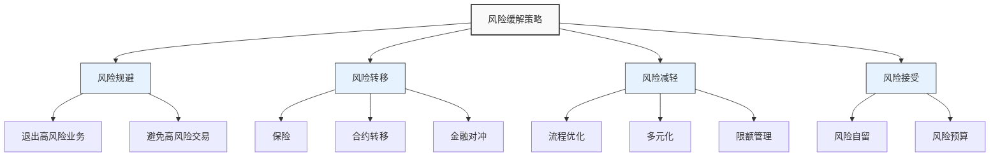

---
{"dg-publish":true,"tags":["财务BP","风险管理","缓解策略","财务规划","风险应对"],"创建日期":"2024-05-15","aliases":["风险应对策略","财务风险缓解"],"permalink":"/知识共享/001_财务/01_财务BP/01_学习内容/05_高级分析方法/风险评估/风险缓解策略/","dgPassFrontmatter":true}
---

> [!abstract] 概述
> 风险缓解策略是财务BP中对已识别风险进行管理和控制的系统方法，旨在降低风险发生的可能性或减轻风险影响。本文介绍主要的风险缓解策略类型、制定原则和实施方法，帮助财务BP专业人士在财务规划中有效应对各类风险，保障企业财务目标的实现。

## 基本概念

风险缓解是风险管理周期中的关键环节，是企业主动响应已识别和量化的风险的过程。合理的风险缓解策略能够在保持业务发展的同时，控制风险在可接受范围内。

### 风险缓解的策略类型

1. **风险规避(Risk Avoidance)**：完全避开风险源
   - 退出高风险业务或市场
   - 放弃高风险项目或产品
   - 不与高风险方交易

2. **风险转移(Risk Transfer)**：将风险责任转移给第三方
   - 保险：通过购买保险转移风险
   - 合约转移：通过合同条款将风险转移给交易对手
   - 金融对冲：使用金融衍生品对冲市场风险

3. **风险减轻(Risk Mitigation)**：降低风险的可能性或影响
   - 流程优化：改善内部流程和控制
   - 多元化：分散投资或业务组合
   - 限额管理：设置风险暴露限制
   - 资源预留：配置缓冲资源应对风险

4. **风险接受(Risk Acceptance)**：承担风险并做好准备
   - 自留风险：接受并自行应对风险
   - 风险预算：为已接受的风险分配资源
   - 应急计划：制定风险发生时的应对措施

### 风险缓解策略选择原则

选择合适的风险缓解策略应考虑以下原则：

1. **风险回报平衡**：缓解成本不应超过风险带来的潜在损失
2. **核心能力匹配**：策略应与企业核心能力和资源匹配
3. **整体性考虑**：考虑策略对其他风险和业务目标的影响
4. **动态调整**：根据内外部环境变化调整策略
5. **成本效益分析**：评估缓解措施的成本与风险减少量
6. **可行性分析**：确保策略可在实际环境中实施

## 核心内容

### 主要财务风险的缓解策略

#### 1. 市场风险缓解

**利率风险缓解**
- 利率互换：固定利率转换为浮动利率，或反之
- 利率期货/期权：锁定未来融资成本
- 债务结构优化：调整固定与浮动利率债务比例
- 债务期限管理：根据利率预期调整长短期债务结构

**汇率风险缓解**
- 自然对冲：匹配外币收入与支出
- 金融对冲：使用远期合约、期权或互换
- 运营策略：采购与销售市场的货币匹配
- 定价策略：汇率波动条款或本币定价

**价格风险缓解**
- 长期供应合同：锁定原材料价格
- 商品衍生品：期货、期权合约对冲
- 供应商多元化：减少对单一供应源的依赖
- 替代材料研发：降低对特定材料的依赖

#### 2. 信用风险缓解

**客户信用风险缓解**
- 信用评估系统：建立客户信用评级机制
- 信用额度管理：根据客户信用状况设置额度
- 付款条件优化：预付款、分期付款、信用证等
- 应收账款保险：转移大客户违约风险
- 债务证券化：将应收账款转化为可交易证券

**交易对手风险缓解**
- 交易对手筛选：建立严格的交易对手准入标准
- 担保与抵押：要求提供担保或抵押
- 净额结算协议：减少结算风险
- 第三方担保：引入信用更高的第三方担保

#### 3. 流动性风险缓解

**融资流动性风险缓解**
- 多元化融资渠道：银行贷款、债券、股权等
- 资金来源分散：避免依赖单一资金提供者
- 融资期限错配管理：长期资产匹配长期资金
- 备用信贷额度：保持未使用的备用信贷
- 现金储备策略：维持适当现金缓冲

**市场流动性风险缓解**
- 资产流动性评估：评估各类资产的变现能力
- 资产组合多元化：持有不同流动性等级的资产
- 变现计划：制定资产有序变现的优先序列
- 压力测试：评估极端市场条件下的流动性状况

#### 4. 运营风险缓解

**内部流程风险缓解**
- 流程再造与标准化：优化关键业务流程
- 内部控制体系：建立多层次控制机制
- 自动化与系统支持：减少人工操作错误
- 绩效监控：建立关键风险指标监控体系

**人员风险缓解**
- 培训与意识提升：加强风险意识培训
- 权责分离：关键职能分离，互相制衡
- 激励机制优化：将风险管理纳入绩效考核
- 关键岗位备份：建立岗位继任计划

**系统风险缓解**
- 系统冗余与备份：关键系统双重备份
- 灾难恢复计划：确保系统快速恢复
- IT安全控制：防范网络攻击和数据泄露
- 渐进式系统更新：降低大规模升级风险

#### 5. 战略风险缓解

**业务模式风险缓解**
- 业务模式弹性设计：提高适应市场变化的能力
- 情景规划：提前应对多种可能的未来情景
- 战略选项保留：保持战略灵活性
- 小规模试验：新模式先小规模测试

**竞争风险缓解**
- 竞争情报系统：持续监控竞争态势
- 差异化战略：提高竞争壁垒
- 创新投资：保持技术和产品领先
- 战略联盟：与互补企业合作应对竞争

**监管风险缓解**
- 合规体系建设：确保业务符合法规要求
- 监管关系管理：主动沟通和咨询
- 政策影响分析：评估政策变化对业务的影响
- 行业标准参与：参与标准制定，降低不确定性

### 财务BP中的风险缓解整合

有效的风险缓解应整合到财务BP的各个环节：

1. **收入规划中的风险缓解**
   - 预测区间设定：使用概率区间代替单点预测
   - 敏感性分析整合：基于风险量化结果调整预测
   - 早期预警指标：设置销售表现的预警阈值
   - 弹性营销预算：预留资源应对市场变化

2. **成本规划中的风险缓解**
   - 弹性成本结构：提高可变成本比例
   - 成本控制机制：设置成本超支触发审查机制
   - 替代方案准备：关键成本项目的备选方案
   - 供应商风险管理：识别并缓解供应链风险

3. **资本支出规划中的风险缓解**
   - 分阶段投资：根据阶段成果决定继续投资
   - 投资组合平衡：平衡高低风险项目
   - 投资标准调整：根据风险水平调整收益要求
   - 退出机制设计：设定清晰的项目终止条件

4. **资金规划中的风险缓解**
   - 现金缓冲策略：保持充足的流动性储备
   - 债务结构优化：平衡短期与长期、固定与浮动
   - 融资来源多元化：降低对单一资金来源的依赖
   - 外汇风险管理：制定全面的外汇风险策略

### 风险缓解的经济性评估

有效的风险缓解需要平衡风险减少与成本增加：

1. **成本效益分析**
   - 缓解成本：实施风险缓解策略的直接和间接成本
   - 风险减少：风险暴露减少的预期价值
   - 净效益：风险减少价值减去缓解成本

2. **风险调整回报分析**
   - 风险调整后的期望净现值
   - 风险缓解对资本收益率的影响
   - 缓解策略对股东价值的贡献

3. **最优风险缓解组合**
   - 多种缓解策略的组合优化
   - 缓解资源的最佳配置
   - 策略之间的协同效应分析

## 应用方法

### 风险缓解策略的制定流程

1. **风险评估回顾**
   - 审视风险识别和量化结果
   - 确认优先处理的关键风险
   - 理解风险间的关联性

2. **策略选项评估**
   - 确定可行的缓解策略选项
   - 评估各选项的可行性和有效性
   - 分析策略对业务的潜在影响

3. **缓解策略选择**
   - 根据成本效益分析选择策略
   - 确保策略与企业风险偏好一致
   - 平衡短期与长期风险考量

4. **实施计划制定**
   - 分配责任与资源
   - 设定实施时间表和里程碑
   - 建立实施监控机制

5. **效果评估与调整**
   - 设定评估指标
   - 定期审查缓解效果
   - 根据环境变化调整策略

### 风险缓解在具体财务领域的应用

#### 1. 销售预测与收入风险缓解

**方法示例**：多元化客户策略与弹性定价

**应用步骤**：
1. 分析客户集中度风险
2. 制定客户多元化目标
3. 设计弹性定价模型应对市场波动
4. 建立销售预警系统和应急响应机制
5. 将收入风险缓解纳入销售激励机制

#### 2. 资本投资风险缓解

**方法示例**：分阶段投资法与实物期权策略

**应用步骤**：
1. 将大型投资项目分解为多个阶段
2. 为每个阶段设定明确的评估标准
3. 识别和保留战略选项(如扩展、缩减、放弃)
4. 设计阶段间决策机制
5. 准备多种资金来源，应对资金需求变化

#### 3. 供应链成本风险缓解

**方法示例**：关键材料套期保值与供应商多元化

**应用步骤**：
1. 识别成本结构中的高风险项目
2. 设计适当的套期保值策略
3. 发展备选供应商网络
4. 建立材料替代可能性评估
5. 设计灵活的生产计划，应对供应中断

### 风险缓解计划模板

风险缓解计划应包含以下核心要素：

| 要素 | 说明 | 示例 |
|------|------|------|
| 风险描述 | 风险的详细说明 | 原材料价格大幅上涨导致毛利率下降 |
| 风险评级 | 风险概率和影响的综合评级 | 高风险(概率:中等，影响:高) |
| 风险所有者 | 负责管理此风险的责任人 | 采购总监 |
| 缓解策略 | 选定的风险应对方法 | 组合策略:套期保值+供应商多元化 |
| 具体措施 | 实施缓解策略的具体行动 | 1.对50%用量实施滚动套期保值 2.发展3个备选供应商 3.修订销售合同加入价格调整条款 |
| 资源需求 | 实施策略所需的资源 | 套期保值保证金:100万元 供应商开发成本:20万元 |
| 时间表 | 实施的时间安排 | 第1季度:完成套期保值策略设计 第2季度:完成首批套期保值操作 第3-4季度:完成备选供应商认证 |
| 监控指标 | 评估缓解效果的指标 | 材料成本波动率、毛利率稳定性、供应商绩效评分 |
| 预期成果 | 实施后的预期效果 | 将原材料价格波动对毛利率的影响降低50% |
| 应急方案 | 缓解策略失效时的备选方案 | 启动极端成本控制计划，暂停非核心项目支出 |

## 案例分析

### 案例一：制造企业原材料价格风险缓解

某机械制造企业面临钢材和铜价格大幅波动的风险，需要制定有效的缓解策略。

**背景信息**：
- 钢材和铜占产品成本的40%
- 产品销售通常为固定价格合同
- 利润率对原材料价格非常敏感

**风险评估结果**：
- 原材料价格上涨20%将导致利润下降50%
- 价格波动主要受全球需求和贸易政策影响
- 供应链中断风险与价格风险并存

**缓解策略**：

1. **组合对冲策略**
   - 核心用量(50%)采用滚动套期保值
   - 远期合约与期权组合，平衡确定性和灵活性
   - 设定价格区间触发策略调整

2. **供应策略优化**
   - 发展多地区供应商网络，降低区域集中风险
   - 与核心供应商建立战略合作关系
   - 设计原材料规格，允许一定替代性

3. **产品与定价调整**
   - 重新设计部分产品，降低原材料用量
   - 在新合同中加入原材料价格调整条款
   - 对大客户实施成本加成定价模式

4. **财务缓冲策略**
   - 设立原材料价格波动储备金
   - 保持额外信贷额度，应对价格上涨期的现金需求
   - 制定成本超支时的支出控制计划

**实施结果**：
- 材料成本波动从±15%降至±7%
- 利润预测准确度提高40%
- 供应链韧性评分从65提升至85
- 对冲成本占总材料成本的1.2%

**经验教训**：
- 多元化对冲工具比单一工具更有效
- 将风险缓解与业务战略整合，创造协同效应
- 缓解策略应保留足够灵活性，适应市场变化
- 供应商合作比单纯价格博弈更能降低长期风险

### 案例二：跨国企业汇率风险缓解

某跨国技术企业在多个国家经营，面临复杂的汇率风险，需要系统性缓解策略。

**背景信息**：
- 60%收入来自海外市场
- 成本主要以母国货币和美元计价
- 业务遍及20多个国家，汇率环境各异

**风险评估结果**：
- 汇率波动每年影响利润±8%
- 新兴市场货币波动性特别高
- 外汇管制和结算时滞增加了管理复杂性

**缓解策略**：

1. **自然对冲策略**
   - 调整全球业务结构，提高收支货币匹配度
   - 在主要市场建立本地运营能力
   - 调整内部转移定价，优化货币敞口

2. **金融对冲组合**
   - 主要货币采用远期合约对冲90天滚动敞口
   - 波动性高的货币使用期权策略
   - 长期结构性敞口通过货币互换管理

3. **运营策略调整**
   - 引入币种多样化的定价策略
   - 在高风险国家采用更短的付款期限
   - 建立汇率变动快速响应机制

4. **风险治理增强**
   - 成立专门的外汇风险管理委员会
   - 建立分层级的汇率风险授权体系
   - 实施全球统一的汇率风险报告和监控系统

**实施结果**：
- 汇率对利润的影响降至±3%
- 对冲成本减少25%
- 现金流预测准确度提升40%
- 资金全球调配效率提高30%

**经验教训**：
- 汇率风险缓解需要财务与业务协同
- 不同市场需要差异化的缓解策略
- 长期战略调整比短期金融对冲更具可持续性
- 集中化与本地化管理需要平衡

## 延伸内容

### 风险缓解与企业战略整合

有效的风险缓解不应仅是财务功能，而应与企业整体战略紧密结合：

1. **风险缓解与价值创造**
   - 风险管理从纯粹防御转向价值创造
   - 风险缓解能力作为竞争优势
   - 将风险视角融入战略决策过程

2. **韧性战略构建**
   - 业务模式韧性设计
   - 价值链重构，提高应对冲击能力
   - 组织能力建设，提升快速恢复和适应能力

3. **战略机遇识别**
   - 从风险中发现战略机会
   - 将风险转化为差异化优势
   - 在竞争对手风险规避时积极进入

### 新兴风险缓解趋势

风险环境不断变化，风险缓解策略也相应演化：

1. **数字化风险缓解**
   - 利用大数据预测风险趋势
   - 实时风险监控与动态调整
   - 智能合约自动执行风险缓解

2. **气候与可持续发展风险缓解**
   - 气候风险财务影响量化与缓解
   - 低碳转型策略与风险管理
   - ESG风险整合与响应

3. **供应链韧性构建**
   - 全球供应网络重构
   - 关键商品和服务的主权保障
   - 技术赋能的供应链透明度和灵活性

### 风险文化与能力建设

持续有效的风险缓解需要适当的组织基础：

1. **风险意识与文化**
   - 全员风险管理意识培养
   - 从合规型向主动型风险文化转变
   - 风险沟通机制优化

2. **风险管理能力建设**
   - 风险管理专业能力培养计划
   - 风险思维融入领导力发展
   - 跨职能风险协同机制

3. **风险绩效管理**
   - 将风险管理纳入绩效评估
   - 平衡短期业绩与长期风险考量
   - 风险调整后的薪酬与激励

## 学习资源

### 思考问题

1. 在制定风险缓解策略时，如何平衡风险管理与业务发展的关系？
2. 不同行业(如制造业、金融业、科技业)在风险缓解策略上有何特点和差异？
3. 如何评估风险缓解策略的有效性？哪些指标最能反映缓解成效？
4. 风险转移和风险减轻策略各有什么优缺点？在什么情况下选择一种而非另一种？
5. 如何处理风险缓解策略之间可能存在的冲突或权衡？
6. 中小企业与大型企业在风险缓解策略上应有哪些不同考量？
7. 在高不确定性环境中，如何设计更具韧性的风险缓解策略？
8. 风险缓解策略如何随企业生命周期不同阶段而调整？
9. 数字化转型如何改变传统的风险缓解方法？
10. 如何将对新兴风险(如气候风险、网络风险)的缓解整合到现有财务BP中？

### 实践练习

**练习一：风险缓解策略制定**

目标：为特定风险制定全面的缓解策略
步骤：
1. 选择一个关键财务风险(如汇率风险、信用风险)
2. 分析风险的特征、影响范围和触发因素
3. 探索可能的缓解策略(规避、转移、减轻、接受)
4. 评估各策略的成本、效益和可行性
5. 设计综合缓解方案，包括具体措施、资源需求和时间表
6. 制定效果评估计划和调整机制

**练习二：风险缓解情景模拟**

目标：通过模拟练习测试风险缓解策略的有效性
步骤：
1. 设置现实商业情景(如市场突变、供应中断)
2. 明确企业面临的主要风险暴露
3. 设计应对情景的风险缓解策略
4. 模拟策略实施过程和结果
5. 分析策略效果和不足
6. 优化和调整缓解方案

### 推荐阅读

1. Lam, J. (2014). *Enterprise Risk Management: From Incentives to Controls*. Wiley.
2. Hopkin, P. (2018). *Fundamentals of Risk Management: Understanding, Evaluating and Implementing Effective Risk Management*. Kogan Page.
3. Culp, C.L. (2011). *Risk Transfer: Derivatives in Theory and Practice*. Wiley.
4. Fraser, J., & Simkins, B. (2016). *The Handbook of Financial Risk Management*. Wiley.
5. Hubbard, D.W. (2009). *The Failure of Risk Management: Why It's Broken and How to Fix It*. Wiley.
6. Taleb, N.N. (2018). *Skin in the Game: Hidden Asymmetries in Daily Life*. Random House.
7. Damodaran, A. (2008). *Strategic Risk Taking: A Framework for Risk Management*. Wharton School Publishing.
8. 马丁·希泼，《企业韧性：如何在危机中生存和发展》，中信出版社，2021.
9. 刘晓蕾，《企业风险应对策略》，经济管理出版社，2019.
10. 赵贵波，《金融风险管理实务》，中国金融出版社，2020.

## 相关链接

- [[知识共享/001_财务/01_财务BP/01_学习内容/05_高级分析方法/风险评估/财务风险识别\|财务风险识别]]
- [[知识共享/001_财务/01_财务BP/01_学习内容/05_高级分析方法/风险评估/风险量化方法\|风险量化方法]]
- [[知识共享/001_财务/01_财务BP/01_学习内容/05_高级分析方法/风险评估/压力测试应用\|压力测试应用]]
- [[知识共享/001_财务/01_财务BP/01_学习内容/03_财务预测与模型/敏感性分析/敏感性分析的目的与方法\|敏感性分析的目的与方法]]
- [[知识共享/001_财务/01_财务BP/01_学习内容/03_财务预测与模型/情景分析/情景构建方法\|情景构建方法]] 