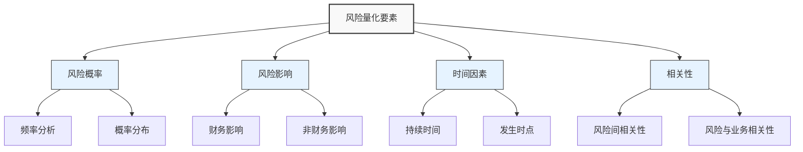

---
{"dg-publish":true,"tags":["财务BP","风险管理","量化分析","财务分析","决策支持"],"创建日期":"2024-05-15","aliases":["风险量化技术","财务风险量化"],"permalink":"/知识共享/001_财务/01_财务BP/01_学习内容/05_高级分析方法/风险评估/风险量化方法/","dgPassFrontmatter":true}
---

> [!abstract] 概述
> 风险量化方法是将识别的财务风险转化为可测量、可比较的数值指标的系统化方法，为财务BP中的风险评估和决策提供客观依据。本文介绍主要的风险量化技术，包括概率分析、价值风险、情景分析等方法的原理和应用，帮助财务BP专业人士在财务规划中更精准地评估和管理风险。

## 基本概念

风险量化是风险管理过程中的关键环节，通过数学和统计方法将风险的不确定性转化为可比较的数值表示，使风险可测量、可管理。

### 风险量化的意义

1. **决策依据**：为风险响应提供客观数据支持
2. **资源优化**：帮助合理分配风险管理资源
3. **沟通工具**：便于不同部门和利益相关者理解风险
4. **预警机制**：建立风险阈值和触发点
5. **绩效衡量**：评估风险管理策略的有效性

### 风险量化的基本要素

1. **风险概率(Probability)**：事件发生的可能性
   - 主观概率：基于专家判断和经验
   - 客观概率：基于历史数据和统计分析
   - 概率分布：描述事件发生的概率特征

2. **风险影响(Impact)**：风险事件导致的损失或收益偏差
   - 财务影响：直接影响财务指标的货币损失
   - 时间影响：导致的进度延迟或时间损失
   - 质量影响：对产品、服务质量的影响
   - 声誉影响：对企业品牌和声誉的损害

3. **时间因素(Time Dimension)**：
   - 风险发生时点：短期、中期、长期风险
   - 影响持续时间：临时性影响还是永久性影响
   - 风险演变速度：突发风险还是渐进风险

4. **相关性(Correlation)**：
   - 风险事件间的相互影响和关联程度
   - 单一风险与总体风险的关系
   - 系统性风险与非系统性风险的区分

## 核心内容

### 风险量化的主要方法

#### 1. 确定性风险量化方法

**风险暴露值(Risk Exposure)**
风险暴露值 = 风险概率 × 风险影响

简单直观的风险量化基础公式，适用于初步风险评估和优先级排序。

**敏感性分析(Sensitivity Analysis)**
通过改变单一变量，观察其对目标变量的影响程度。
- 单因素敏感性分析：一次改变一个变量
- 多因素敏感性分析：同时改变多个变量
- 临界值分析：确定导致结果发生重大变化的临界点

**情景分析(Scenario Analysis)**
构建多种可能的情景，计算在每种情景下的财务结果。
- 基准情景：最可能发生的情况
- 乐观情景：有利因素占主导的情况
- 悲观情景：不利因素占主导的情况
- 灾难情景：极端不利的情况

#### 2. 概率性风险量化方法

**决策树分析(Decision Tree Analysis)**
通过树状图形展示决策选项、不确定事件及其概率和结果。
- 优点：直观展示决策路径和概率
- 适用：具有明确决策点和有限可能结果的情况

**蒙特卡洛模拟(Monte Carlo Simulation)**
通过大量随机抽样，模拟各种可能的结果及其概率分布。
- 原理：使用随机数生成器模拟不确定变量
- 过程：定义输入变量分布→随机抽样→计算结果→统计分析
- 输出：完整的结果概率分布，如平均值、标准差、分位数等

**贝叶斯网络(Bayesian Networks)**
表示变量间概率依赖关系的图形模型，基于条件概率计算风险。
- 优势：能处理条件依赖关系
- 应用：复杂系统的风险建模和推理

#### 3. 市场风险量化方法

**风险价值(Value at Risk, VaR)**
在给定置信水平下，在特定时间段内可能遭受的最大损失。
- 历史模拟法：基于历史数据
- 参数法：假设收益率服从特定分布
- 蒙特卡洛模拟法：通过模拟生成
- 解读：95% VaR = 100万意味着有95%的把握损失不超过100万

**条件风险价值(Conditional Value at Risk, CVaR)**
也称为期望短缺(Expected Shortfall)，表示超过VaR时的平均损失。
- 优势：考虑了极端情况下的风险，克服VaR的部分局限性
- 解读：95% CVaR = 150万意味着在最糟糕的5%情况下，平均损失为150万

**压力测试(Stress Testing)**
评估极端但合理情景下企业的财务承受能力。
- 历史情景：基于历史极端事件
- 假设情景：基于可能的未来极端情况
- 反向压力测试：从不可接受结果倒推触发条件

### 风险量化的计量指标

在财务BP中，通常使用以下指标量化风险：

1. **波动性指标**
   - 标准差：衡量数据分散程度
   - 变异系数：标准差除以平均值，便于比较不同量级的波动
   - Beta系数：衡量相对于基准的系统性风险

2. **下行风险指标**
   - 下行标准差：只考虑低于目标的波动
   - 最大回撤：资产价值从高点到低点的最大下跌幅度
   - 风险价值(VaR)：特定置信水平下的潜在损失

3. **情景指标**
   - 盈亏平衡点分析：销量/价格变动对盈亏的影响
   - 临界值分析：特定财务指标的临界点
   - 情景间差异：不同情景下财务结果的差异

4. **综合风险指标**
   - 风险调整回报率(RAROC)：调整风险后的收益率
   - 经济资本：覆盖意外损失所需的资本
   - 夏普比率：超额收益与风险的比率

### 风险量化中的数据处理

有效的风险量化依赖于合理的数据准备和处理：

1. **数据类型与来源**
   - 内部历史数据：企业自身历史记录
   - 外部市场数据：行业基准和市场信息
   - 专家判断数据：基于经验的主观评估
   - 模拟数据：基于模型生成的数据

2. **数据处理技术**
   - 归一化：将不同量纲数据转为可比较的标准
   - 缺失值处理：插值、均值替代或其他方法
   - 异常值处理：识别和处理极端值
   - 分布拟合：选择适当的概率分布模型

3. **数据质量保证**
   - 完整性：数据覆盖范围是否充分
   - 准确性：数据是否准确反映实际
   - 一致性：数据定义和收集是否一致
   - 时效性：数据是否具有时效性

## 应用方法

### 风险量化的实施流程

1. **风险识别与定义**
   - 明确需要量化的风险类型
   - 定义风险的具体表现形式
   - 确定风险的影响范围和对象

2. **数据收集与准备**
   - 收集相关历史数据
   - 组织专家评估会议
   - 准备外部基准数据
   - 评估数据质量并进行必要处理

3. **方法选择与模型构建**
   - 根据风险特性选择适当的量化方法
   - 确定模型参数和假设
   - 构建风险量化模型
   - 验证模型有效性

4. **风险计算与分析**
   - 执行选定的量化方法
   - 计算关键风险指标
   - 分析结果并解释含义
   - 评估结果的可靠性和限制

5. **结果应用与沟通**
   - 将量化结果整合到决策过程
   - 制定风险应对策略
   - 向利益相关者清晰沟通风险
   - 建立监控机制跟踪风险变化

### 风险量化在财务BP中的应用

#### 1. 收入预测风险量化

**方法示例**：使用蒙特卡洛模拟量化销售预测的不确定性

**应用步骤**：
1. 识别关键不确定因素：市场增长率、市场份额、产品价格等
2. 定义每个因素的概率分布和参数
3. 建立收入模型：收入 = 市场规模 × 市场份额 × 价格
4. 执行蒙特卡洛模拟（如1000次）
5. 分析结果：收入的期望值、标准差、置信区间等

**输出示例**：
- 收入预测的95%置信区间：8000万-1.2亿元
- 达到目标收入1亿元的概率：65%
- 收入分布的偏态系数：表明偏向低收入或高收入的风险

#### 2. 投资项目风险量化

**方法示例**：使用决策树和敏感性分析评估资本投资风险

**应用步骤**：
1. 构建决策树：确定关键决策点和不确定事件
2. 估计各节点的概率和财务结果
3. 计算期望净现值(ENPV)和风险调整后回报
4. 进行敏感性分析，识别关键风险变量
5. 制定分阶段投资策略，降低前期风险暴露

**输出示例**：
- 项目期望净现值：1500万元
- 净现值为负的概率：20%
- 最敏感变量：市场接受度（敏感度系数1.8）

#### 3. 汇率风险量化

**方法示例**：使用风险价值(VaR)评估汇率波动风险

**应用步骤**：
1. 收集历史汇率数据和企业外币敞口
2. 分析汇率变动的概率分布特征
3. 选择VaR计算方法和参数（如置信水平、时间范围）
4. 计算不同情景下的潜在汇兑损失
5. 评估对整体财务的影响程度

**输出示例**：
- 95% 10天VaR：200万元（95%的把握在10天内汇兑损失不超过200万元）
- 汇率波动对净利润的最大影响：5%
- 建议对冲比例：70%的外币敞口

### 风险量化工具与软件

1. **通用统计分析工具**
   - Excel与@Risk插件：适合一般风险模拟
   - R和Python：适合复杂统计分析和模拟
   - SPSS/SAS：专业统计分析软件

2. **专业风险量化软件**
   - Crystal Ball：蒙特卡洛模拟专业工具
   - RiskAMP：Excel风险分析插件
   - Palisade DecisionTools：决策分析套件
   - ModelRisk：可视化风险建模工具

3. **企业风险管理系统**
   - SAP风险管理模块
   - Oracle Hyperion：财务规划和风险分析
   - IBM OpenPages：企业风险管理平台

## 案例分析

### 案例一：制造企业原材料价格风险量化

某电子制造企业需要量化评估关键原材料(铜)价格波动对利润的影响，以制定合理的采购和定价策略。

**背景信息**：
- 铜占产品成本的25%
- 年度铜用量约1000吨
- 产品销售合同通常为固定价格，期限6个月
- 历史铜价年波动率约20%

**量化方法**：蒙特卡洛模拟

**实施步骤**：

1. **数据准备**：
   - 收集过去5年月度铜价数据
   - 分析铜价的概率分布特征
   - 铜价呈对数正态分布，均值8000美元/吨，标准差1600美元/吨

2. **模型构建**：
   - 建立成本模型：总成本 = 铜成本 + 其他成本
   - 建立利润模型：利润 = 收入 - 总成本
   - 设定模拟参数：10000次模拟，12个月时间范围

3. **模拟执行与分析**：
   - 生成10000个可能的铜价路径
   - 计算每个路径下的财务影响
   - 分析结果概率分布

**量化结果**：

| 风险指标 | 数值 | 解释 |
|---------|------|------|
| 预期铜价波动影响 | -200万元 | 铜价波动平均将减少年利润200万元 |
| 5%分位数(95% VaR) | -620万元 | 95%把握不超过620万元的损失 |
| 铜价上涨20%概率 | 35% | 铜价上涨20%以上的概率为35% |
| 利润降低10%以上概率 | 28% | 因铜价波动导致利润下降10%以上的概率 |

**应用决策**：
- 建议对50%的铜需求采用套期保值
- 重要客户合同增加价格调整条款
- 设置200万元的风险准备金
- 铜价超过9500美元/吨时触发应急采购计划

### 案例二：零售企业销售季节性风险量化

某服装零售企业需要量化季节性商品销售的不确定性，以优化库存和现金流管理。

**背景信息**：
- 秋冬季产品占年销售额的60%
- 季节性产品必须提前6个月订货
- 库存积压会导致高额折扣，影响毛利率

**量化方法**：情景分析与压力测试

**实施步骤**：

1. **情景定义**：
   - 基准情景：销售实现预算目标
   - 乐观情景：销售超出预算10%
   - 悲观情景：销售低于预算15%
   - 极端情景：销售低于预算30%（如极端天气或突发公共卫生事件）

2. **财务影响分析**：
   - 计算每种情景下的收入、毛利和库存水平
   - 评估现金流和融资需求
   - 模拟不同促销策略对库存清理的影响

3. **概率评估**：
   - 基于历史数据和专家判断，评估各情景概率
   - 计算风险加权财务结果

**量化结果**：

| 情景 | 概率 | 销售额(万元) | 毛利率 | 期末库存(万元) | 现金流影响(万元) |
|------|------|------------|-------|--------------|---------------|
| 基准 | 50% | 5000 | 45% | 800 | 0 |
| 乐观 | 20% | 5500 | 47% | 600 | +300 |
| 悲观 | 25% | 4250 | 40% | 1200 | -250 |
| 极端 | 5% | 3500 | 32% | 1800 | -600 |
| 风险加权 | 100% | 4775 | 43% | 915 | -65 |

**压力测试结果**：
- 悲观情景下额外促销费用：150万元
- 极端情景下紧急融资需求：400万元
- 最大现金流缺口发生时间：次年1-2月

**应用决策**：
- 初始订单量减少10%，增加快速补货选项
- 设立200万元应急信贷额度
- 制定分阶段促销计划，触发条件为销售低于预期10%
- 开发全季节产品线，降低季节性风险

### 案例三：高科技企业研发项目风险量化

某软件公司需要量化评估新产品研发项目的风险，以合理分配研发资源。

**背景信息**：
- 研发投入预计1200万元，分18个月完成
- 项目成功后预计5年内创造6000万元收入
- 市场接受度是主要不确定因素

**量化方法**：决策树分析与蒙特卡洛模拟结合

**实施步骤**：

1. **决策树构建**：
   - 确定关键决策点：初始投资、中期评估、上市策略
   - 定义不确定事件：技术成功率、市场接受度
   - 估计各节点概率和结果

2. **蒙特卡洛模拟**：
   - 对关键不确定变量建立概率分布
   - 执行5000次模拟
   - 计算NPV分布和其他风险指标

**量化结果**：

决策树分析结果：
- 项目期望净现值(ENPV)：850万元
- 项目成功概率：60%
- 最佳决策路径：分阶段投资，中期评审后决定是否继续

蒙特卡洛模拟结果：
- NPV均值：850万元
- NPV标准差：1200万元
- NPV为负的概率：32%
- IRR中位数：22%，90%置信区间：8%-35%

风险因素敏感度分析：
1. 市场接受度（贡献45%的不确定性）
2. 技术实现时间（贡献30%的不确定性）
3. 竞争进入速度（贡献15%的不确定性）
4. 开发成本（贡献10%的不确定性）

**应用决策**：
- 采用分阶段投资策略，首阶段投入400万元
- 6个月后进行关键技术可行性评估
- 12个月后进行市场接受度测试
- 成功概率低于40%时终止项目
- 预留15%的预算作为应急资金

## 延伸内容

### 风险量化的挑战与局限性

尽管风险量化为财务决策提供了客观依据，但在实际应用中仍面临诸多挑战：

1. **数据限制**
   - 历史数据缺乏或不具代表性：新业务或快速变化环境
   - 极端事件数据稀缺：低频高影响事件难以用历史数据表示
   - 数据质量问题：不完整、不准确或有偏差的数据

2. **方法局限**
   - 模型风险：模型本身的假设和简化可能导致误差
   - 分布假设问题：实际风险分布可能与假设不符
   - 相关性动态变化：危机时期相关性往往显著增强
   - 主观判断难以避免：参数设定中的主观成分

3. **解释与沟通挑战**
   - 复杂结果难以解释：概率与统计概念理解难度
   - 过度依赖定量结果：忽视定性因素的重要性
   - 错误安全感：精确的数字可能带来虚假的确定性

### 风险量化方法的整合与发展

为了克服单一风险量化方法的局限性，实践中往往采用多方法整合策略：

1. **定性与定量结合**
   - 在定量分析前进行定性筛选
   - 使用定性信息调整定量模型参数
   - 定量结果通过定性判断进行验证

2. **多种量化方法互补**
   - 蒙特卡洛模拟与压力测试结合
   - VaR与情景分析互补
   - 敏感性分析与概率分析相结合

3. **前沿方法探索**
   - 机器学习在风险识别和量化中的应用
   - 大数据技术提升风险数据处理能力
   - 复杂网络理论分析风险传导与系统性风险

### 行业特定风险量化方法

不同行业面临的主要风险类型各异，其量化方法也相应有所差异：

1. **制造业**
   - 供应链风险量化：通过网络模型和多层级风险传导分析
   - 产能利用率风险：弹性分析与盈亏平衡分析结合
   - 质量风险量化：基于失效模式分析(FMEA)的定量评分

2. **零售业**
   - 库存风险量化：基于销售周期和需求波动性分析
   - 消费趋势风险：时间序列分析与趋势预测
   - 多渠道运营风险：渠道组合优化模型

3. **金融服务业**
   - 信用风险量化：评分卡模型与违约概率分析
   - 市场风险量化：VaR与压力测试结合
   - 操作风险量化：损失分布法与情景分析

4. **科技行业**
   - 研发项目风险：实物期权定价与决策树分析
   - 技术迭代风险：技术生命周期模型
   - 知识产权风险：基于诉讼概率和影响的量化模型

## 学习资源

### 思考问题

1. 在财务BP中，风险量化与风险识别有什么关系？两者如何相互支持？
2. 蒙特卡洛模拟相比传统敏感性分析有哪些优势和局限性？
3. 为什么风险价值(VaR)被广泛应用？它有哪些局限性？条件风险价值(CVaR)如何弥补这些不足？
4. 如何选择合适的置信水平进行风险量化？不同行业或决策类型是否需要不同的置信水平？
5. 在数据有限的情况下，如何进行有效的风险量化？
6. 风险量化结果应如何解释给非财务背景的管理者？
7. 如何评估风险量化模型本身的准确性和可靠性？
8. 在高度不确定的环境中（如新兴市场或创新业务），传统风险量化方法的适用性如何？
9. 财务BP中的风险量化与企业风险管理(ERM)框架如何整合？
10. 近年来，风险量化方法有哪些重要发展？大数据和人工智能如何改变风险量化实践？
11. 如何平衡风险量化的复杂性与实用性？
12. 如何有效沟通风险量化结果，避免误解或过度简化？
13. 不同规模企业的风险量化方法应如何调整？
14. 风险量化如何帮助优化资本配置和投资决策？
15. 如何将定性风险因素（如声誉风险、监管风险）纳入量化框架？

### 实践练习

**练习一：销售预测风险量化**

目标：使用蒙特卡洛模拟量化销售预测的不确定性
工具：Excel + @Risk插件（或其他模拟工具）
步骤：
1. 建立销售预测模型，识别关键不确定变量（如市场增长率、市场份额、价格）
2. 为每个变量定义合适的概率分布和参数
3. 设置输出变量（如总销售额、毛利）和相关公式
4. 运行5000次模拟，生成结果分布
5. 分析和解释结果：平均值、标准差、分位数、敏感度
6. 根据分析结果，提出销售策略建议

**练习二：投资项目风险分析**

目标：使用决策树分析评估分阶段投资项目的风险
工具：决策树软件或Excel
步骤：
1. 确定项目的主要决策点和不确定事件
2. 构建决策树结构，包括所有可能路径
3. 估计每个不确定事件的概率
4. 计算每条路径的财务结果（NPV或IRR）
5. 计算期望值和风险指标
6. 确定最优决策策略，包括触发条件和退出点
7. 进行决策树灵敏度分析，测试关键假设

### 推荐阅读

1. Jorion, P. (2011). *Financial Risk Manager Handbook*. Wiley Finance.
2. Vose, D. (2008). *Risk Analysis: A Quantitative Guide*. Wiley.
3. Mun, J. (2010). *Modeling Risk: Applying Monte Carlo Risk Simulation, Strategic Real Options, Stochastic Forecasting, and Portfolio Optimization*. Wiley.
4. McNeil, A.J., Frey, R., & Embrechts, P. (2015). *Quantitative Risk Management: Concepts, Techniques and Tools*. Princeton University Press.
5. Coleman, T.S. (2011). *A Practical Guide to Risk Management*. Research Foundation of CFA Institute.
6. Hubbard, D. (2009). *The Failure of Risk Management: Why It's Broken and How to Fix It*. Wiley.
7. Taleb, N.N. (2012). *Antifragile: Things That Gain from Disorder*. Random House.
8. Hull, J.C. (2018). *Risk Management and Financial Institutions*. Wiley.
9. Damodaran, A. (2008). *Strategic Risk Taking: A Framework for Risk Management*. Wharton School Publishing.
10. 张维，《金融风险度量》，中国人民大学出版社，2018.

## 相关链接

- [[知识共享/001_财务/01_财务BP/01_学习内容/05_高级分析方法/风险评估/财务风险识别\|财务风险识别]]
- [[01_财务BP/01_学习内容/05_高级分析方法/风险评估/风险缓解策略\|风险缓解策略]]
- [[01_财务BP/01_学习内容/05_高级分析方法/风险评估/压力测试应用\|压力测试应用]]
- [[知识共享/001_财务/01_财务BP/01_学习内容/03_财务预测与模型/敏感性分析/敏感性分析的目的与方法\|敏感性分析的目的与方法]]
- [[知识共享/001_财务/01_财务BP/01_学习内容/03_财务预测与模型/情景分析/情景构建方法\|情景构建方法]] 