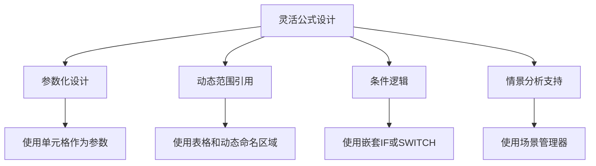
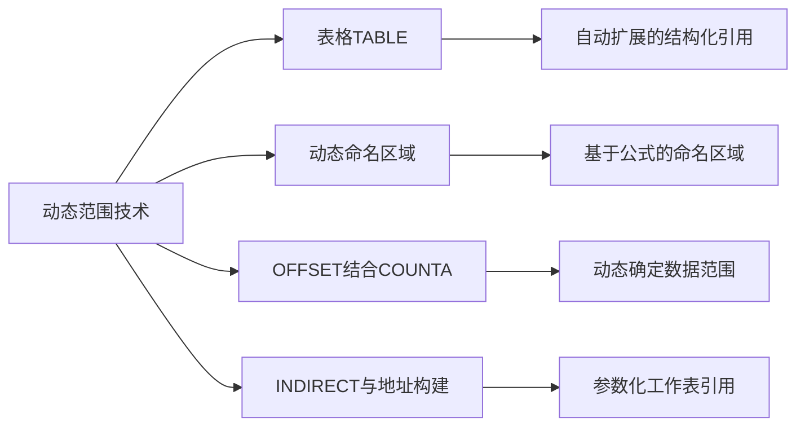
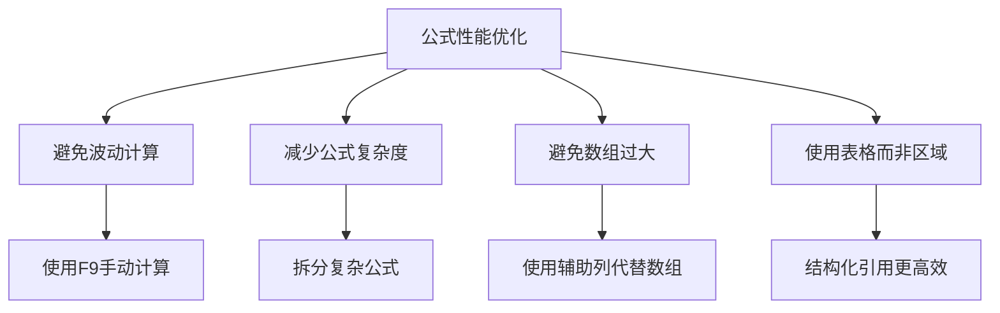

---
{"tags":["财务BP","Excel函数","公式应用","财务建模","模型构建"],"aliases":["Excel函数应用","财务公式技巧","高级公式应用"],"created":"2024-03-21","publish":false,"dg-publish":true,"permalink":"/知识共享/001_财务/01_财务BP/01_学习内容/06_BP工具与模板/Excel模型构建/公式与函数应用/","dgPassFrontmatter":true}
---


# 公式与函数应用

## 摘要

本文档详细介绍了财务BP工作中常用的Excel公式与函数应用技巧。掌握高效的公式和函数应用是构建可靠财务模型的核心能力，直接影响到模型的准确性、灵活性和维护效率。本文系统讲解了从基础到高级的Excel函数组合应用，以及在财务建模中的最佳实践和实用案例。

## 一、财务建模中的公式应用原则

### 1. 清晰性原则
- **公式简洁性**：尽量使用简单清晰的公式结构
- **分步计算**：将复杂计算拆分为多个简单步骤
- **命名单元格/区域**：使用有意义的名称增强可读性
- **注释说明**：为复杂公式添加注释解释

### 2. 准确性原则
- **精度控制**：适当设置计算精度，避免舍入误差
- **单位一致性**：确保输入数据单位统一
- **异常处理**：添加错误检测和异常值处理
- **公式审计**：使用追踪功能验证公式逻辑

### 3. 灵活性原则


- **参数化设计**：使用变量单元格而非硬编码数值
- **可扩展性**：设计能轻松扩展的公式结构
- **动态引用**：使用动态范围而非固定引用
- **场景支持**：设计支持多场景分析的公式

### 4. 效率原则
- **计算优化**：避免过度复杂的公式结构
- **减少波动性**：减少触发重新计算的频率
- **大数据处理**：使用适合大数据集的函数和方法
- **公式复用**：设计可重复使用的公式结构

## 二、核心财务函数应用

### 1. 时间价值函数
- **NPV和XNPV函数**：计算净现值
  ```
  =NPV(贴现率, 现金流范围) + 初始投资
  =XNPV(贴现率, 现金流范围, 日期范围)
  ```
  
- **IRR和XIRR函数**：计算内部收益率
  ```
  =IRR(现金流范围, [估计值])
  =XIRR(现金流范围, 日期范围, [估计值])
  ```
  
- **PMT函数**：计算贷款分期付款
  ```
  =PMT(利率, 期数, 现值, [终值], [类型])
  ```
  
- **FV函数**：计算未来值
  ```
  =FV(利率, 期数, 定期付款, [现值], [类型])
  ```

### 2. 查询与引用函数
- **VLOOKUP和HLOOKUP**：垂直和水平查找
  ```
  =VLOOKUP(查找值, 表数组, 列索引, [近似匹配])
  =HLOOKUP(查找值, 表数组, 行索引, [近似匹配])
  ```
  
- **INDEX和MATCH组合**：强大的灵活查找
  ```
  =INDEX(数组, MATCH(查找值, 查找数组, [匹配类型]))
  ```
  
- **OFFSET函数**：动态范围引用
  ```
  =OFFSET(起始引用, 行偏移量, 列偏移量, [高度], [宽度])
  ```
  
- **INDIRECT函数**：间接引用单元格
  ```
  =INDIRECT(引用文本)
  ```

### 3. 逻辑与条件函数
- **IF嵌套和IFS函数**：条件判断
  ```
  =IF(条件, 值为真, 值为假)
  =IFS(条件1, 值1, 条件2, 值2, ..., TRUE, 默认值)
  ```
  
- **SWITCH函数**：多条件选择
  ```
  =SWITCH(表达式, 值1, 结果1, 值2, 结果2, ..., [默认值])
  ```
  
- **AND和OR组合**：复合条件
  ```
  =IF(AND(条件1, 条件2), 值为真, 值为假)
  =IF(OR(条件1, 条件2), 值为真, 值为假)
  ```
  
- **条件统计函数**：COUNTIF, SUMIF, AVERAGEIF等
  ```
  =SUMIFS(求和范围, 条件范围1, 条件1, 条件范围2, 条件2, ...)
  ```

### 4. 日期与时间函数
- **DATE函数**：创建日期
  ```
  =DATE(年, 月, 日)
  ```
  
- **EOMONTH函数**：计算月末日期
  ```
  =EOMONTH(起始日期, 月数)
  ```
  
- **NETWORKDAYS函数**：计算工作日
  ```
  =NETWORKDAYS(开始日期, 结束日期, [节假日])
  ```
  
- **YEARFRAC函数**：计算年份分数
  ```
  =YEARFRAC(开始日期, 结束日期, [基准])
  ```

## 三、高级函数与组合应用

### 1. 数组公式应用
- **基本数组概念**：理解数组公式的工作原理
- **使用场景**：何时选择数组公式而非普通公式
- **构建方法**：如何构建和编辑数组公式
- **常用数组公式组合**：解决复杂财务计算

**数组公式示例**：计算加权平均资本成本(WACC)
```
=SUMPRODUCT(资本权重数组, 资本成本数组)
```

### 2. 动态范围处理


- **表格(TABLE)结构**：自动扩展的数据范围
  ```
  =SUM(表格名[列名])
  ```
  
- **动态命名区域**：基于OFFSET和COUNTA创建
  ```
  =OFFSET(起始单元格, 0, 0, COUNTA(列数据), 1)
  ```
  
- **INDIRECT结合ADDRESS**：动态引用构建
  ```
  =INDIRECT(ADDRESS(行, 列))
  ```
  
- **区域交叉引用**：使用单元格交叉引用技术

### 3. 财务数据分析函数
- **TREND和GROWTH函数**：线性和指数预测
  ```
  =TREND(已知y值, [已知x值], [新x值], [常量])
  =GROWTH(已知y值, [已知x值], [新x值], [常量])
  ```
  
- **LINEST和LOGEST函数**：回归分析
  ```
  =LINEST(已知y值, [已知x值], [常量], [统计量])
  ```
  
- **FREQUENCY函数**：频率分布分析
  ```
  =FREQUENCY(数据数组, 分组数组)
  ```
  
- **PERCENTILE和QUARTILE函数**：分位数计算
  ```
  =PERCENTILE.INC(数组, k)
  =QUARTILE.INC(数组, 四分位数)
  ```

### 4. 数据表与场景分析
- **单变量数据表**：分析单一变量的影响
  ```
  创建方法：数据 > 假设分析 > 数据表
  ```
  
- **双变量数据表**：分析两个变量的交互影响
  ```
  创建方法：数据 > 假设分析 > 数据表
  ```
  
- **情景管理器**：保存和切换多个情景
  ```
  设置方法：数据 > 假设分析 > 方案管理器
  ```
  
- **目标寻求**：反向分析所需输入值
  ```
  使用方法：数据 > 假设分析 > 目标寻求
  ```

## 四、高级财务建模公式技巧

### 1. 动态日期处理
- **滚动时间窗口**：创建动态的时间周期引用

  **示例**：最近12个月的滚动总和
  ```
  =SUM(OFFSET(起始单元格, MATCH(TODAY(), 日期列, 0) - 12, 0, 12, 1))
  ```
  
- **财务日历计算**：处理财年、季度和期间

  **示例**：确定财务季度
  ```
  =CEILING(MONTH(日期)/3, 1)
  ```
  
- **周期性数据比较**：同比和环比计算

  **示例**：同比增长率
  ```
  =(当期值-VLOOKUP(EDATE(当期日期, -12), 历史数据表, 2, FALSE))/VLOOKUP(EDATE(当期日期, -12), 历史数据表, 2, FALSE)
  ```

### 2. 动态图表范围控制
- **动态图表数据源**：基于用户选择调整图表范围
- **可调整时间跨度**：允许用户选择图表显示时间范围
- **情景比较图表**：显示多个情景的对比数据
- **阈值和目标显示**：添加动态阈值和目标线

**示例**：使用OFFSET创建动态图表范围
```
图表数据范围 = OFFSET(起始单元格, 0, 0, COUNTA(数据列), 1)
```

### 3. 敏感性分析公式
- **单因素敏感性**：分析单一变量变化的影响
- **多因素敏感性**：分析多个变量组合变化的影响
- **蒙特卡洛模拟基础**：使用随机函数进行简单模拟
- **门限值计算**：确定关键变量的临界点

**示例**：使用RAND()函数进行简单模拟
```
=NPV(贴现率, NORM.INV(RAND(), 平均值, 标准差))
```

### 4. 错误检测与数据验证公式
- **检查不一致性**：验证跨表一致性
  ```
  =IF(ABS(A1-B1)<0.01, "一致", "不一致")
  ```
  
- **业务规则验证**：使用公式验证业务规则
  ```
  =IF(AND(收入增长>0, 利润增长<0), "需调查", "正常")
  ```
  
- **差异分析公式**：对比计划与实际
  ```
  =IF(ABS((实际值-计划值)/计划值)>0.1, "显著偏差", "正常范围")
  ```
  
- **完整性检查**：确保数据集的完整性
  ```
  =COUNTBLANK(数据范围)/COUNTA(数据范围)
  ```

## 五、公式应用案例分析

### 案例一：动态财务报表模型

**背景**：某公司需要构建一个灵活的财务报表模型，能够根据用户选择的时间范围、部门和场景自动生成报表。

**技术挑战**：
- 处理不同长度的历史数据
- 支持按月、季度、年度的灵活汇总
- 允许跨部门合并数据
- 实现多场景对比

**核心公式解决方案**：

1. **动态时间范围选择**：
   ```
   =OFFSET(数据起始单元格, MATCH(开始日期, 日期列, 0) - 1, 0, 
           MATCH(结束日期, 日期列, 0) - MATCH(开始日期, 日期列, 0) + 1, 1)
   ```

2. **智能时间汇总**：
   ```
   =SUMPRODUCT(--([日期列]>=开始日期), --([日期列]<=结束日期), [值列])
   ```

3. **条件部门选择**：
   ```
   =SUMIFS(值列, 日期列, ">="&开始日期, 日期列, "<="&结束日期, 
           部门列, IF(选择部门="所有", 部门列, 选择部门))
   ```

4. **场景切换机制**：
   ```
   =CHOOSE(场景选择, 基准值列, 乐观值列, 悲观值列)
   ```

5. **动态同比环比计算**：
   ```
   =IF(比较类型=1, 
       (当期值-INDIRECT("场景"&场景&"!R"&MATCH(EDATE(当期日期,-12),日期列,0)&"C"&数值列))/
       INDIRECT("场景"&场景&"!R"&MATCH(EDATE(当期日期,-12),日期列,0)&"C"&数值列),
       (当期值-INDIRECT("场景"&场景&"!R"&MATCH(EDATE(当期日期,-1),日期列,0)&"C"&数值列))/
       INDIRECT("场景"&场景&"!R"&MATCH(EDATE(当期日期,-1),日期列,0)&"C"&数值列))
   ```

**实施效果**：
- 用户可通过下拉菜单选择任意日期范围、部门组合和分析场景
- 报表自动更新所有计算和图表
- 同一模型支持月度、季度和年度报告
- 分析时间从数小时缩短至数分钟
- 减少了90%的手动调整和错误

**关键成功因素**：
- 参数化设计的彻底应用
- 命名区域的广泛使用增强了公式可读性
- 集中式控制面板统一管理所有报表参数
- 模块化公式设计便于维护和扩展
- 全面的错误处理和数据验证

### 案例二：多产品线投资回报分析模型

**背景**：某制造企业需要评估多个产品线的投资回报，并进行敏感性分析，以支持资源分配决策。

**技术挑战**：
- 处理不同产品的多种投资情景
- 计算多种财务指标(NPV, IRR, MIRR, 回收期)
- 建立敏感性分析框架
- 生成决策支持的比较视图

**核心公式解决方案**：

1. **统一的现金流计算框架**：
   ```
   =IF(年份=0, -初始投资, 
       IF(年份>项目年限, 0,
          产量*价格*(1+价格增长率)^年份 - 
          (固定成本*(1+通胀率)^年份 + 产量*单位变动成本*(1+成本增长率)^年份)))
   ```

2. **自动NPV和IRR计算**：
   ```
   =XNPV(VLOOKUP(风险等级, 贴现率表, 2, FALSE), 现金流范围, 日期范围)
   =XIRR(现金流范围, 日期范围)
   ```

3. **动态回收期计算**：
   ```
   =MATCH(TRUE, INDEX(累计现金流>=0, 0), 0)/
    (INDEX(累计现金流, MATCH(TRUE, INDEX(累计现金流>=0, 0), 0))/
     INDEX(现金流, MATCH(TRUE, INDEX(累计现金流>=0, 0), 0)))
   ```

4. **情景矩阵生成器**：
   ```
   =INDIRECT("情景"&情景选择&"!R"&行索引&"C"&列索引)
   ```

5. **产品线比较排名**：
   ```
   =RANK(IF(排序指标=1, NPV数组, IF(排序指标=2, IRR数组, 回收期数组)), 
         IF(排序指标=1, NPV数组, IF(排序指标=2, IRR数组, 回收期数组)), 
         IF(排序指标=3, 1, 0))
   ```

**实施效果**：
- 统一评估了12个产品线的投资回报
- 精确识别了对关键假设最敏感的产品线
- 为管理层提供了基于多种指标的排名比较
- 实现了产品组合的优化配置
- 节省了80%的分析准备时间

**关键成功因素**：
- 模块化的现金流计算结构
- 灵活的情景切换机制
- 高度自动化的敏感性分析框架
- 丰富的可视化和比较功能
- 用户友好的参数调整界面

## 六、常见公式问题与解决方案

### 1. 公式错误处理
- **#DIV/0! 错误**：当除数为零时发生
  ```
  =IF(除数=0, 0, 数值/除数)
  =IFERROR(数值/除数, 0)
  ```
  
- **#N/A 错误**：找不到查找值
  ```
  =IFNA(VLOOKUP(查找值, 查找表, 2, FALSE), "未找到")
  ```
  
- **#VALUE! 错误**：公式参数类型错误
  ```
  =IF(ISTEXT(A1), VALUE(A1), A1)
  ```
  
- **#REF! 错误**：无效的单元格引用
  ```
  =IFERROR(原公式, "引用错误")
  ```

### 2. 公式性能优化


- **减少波动计算**：控制公式依赖链
- **避免多重嵌套**：拆分复杂公式为多个简单步骤
- **减少INDIRECT使用**：尽量使用直接引用
- **限制数组公式范围**：控制数组大小和复杂度
- **使用表格而非普通区域**：提高引用效率

### 3. 公式维护与更新
- **公式文档化**：记录复杂公式的逻辑和用途
- **版本控制**：跟踪公式变更和改进
- **集中式公式库**：创建可重用公式的集中库
- **自动化测试**：建立公式自动验证机制
- **定期审计**：使用Excel内置审计工具检查公式

### 4. 公式安全与保护
- **锁定公式单元格**：防止意外修改
- **隐藏计算过程**：保护关键计算逻辑
- **输入验证**：限制输入值的范围和类型
- **冗余检查**：添加交叉验证检查点
- **公式加密**：保护关键知识产权

## 七、新趋势与高级技术

### 1. 动态数组函数
- **FILTER函数**：基于条件筛选数组
  ```
  =FILTER(数组, 条件数组)
  ```
  
- **SORT函数**：动态排序数组
  ```
  =SORT(数组, 列索引, 排序顺序)
  ```
  
- **UNIQUE函数**：提取唯一值
  ```
  =UNIQUE(数组)
  ```
  
- **SEQUENCE和RANDARRAY**：生成序列和随机数

### 2. LAMBDA函数应用
- **自定义函数**：创建不使用VBA的自定义函数
- **递归计算**：实现复杂的递归算法
- **函数组合**：组合多个LAMBDA创建复杂功能
- **函数库构建**：建立企业级自定义函数库

### 3. Power Query整合
- **数据准备与公式结合**：优化数据流程
- **参数化查询**：创建动态数据源
- **复杂转换替代**：使用Power Query取代复杂公式
- **定期刷新机制**：自动更新数据和计算

### 4. 财务分析新功能
- **FORECAST.ETS**：时间序列预测
- **STOCKHISTORY**：股票历史数据提取
- **RRI函数**：等效回报率计算
- **LET函数**：变量定义和公式优化

## 相关链接
- [[知识共享/001_财务/01_财务BP/01_学习内容/06_BP工具与模板/Excel模型构建/财务模型设计原则\|知识共享/001_财务/01_财务BP/01_学习内容/06_BP工具与模板/Excel模型构建/财务模型设计原则]]
- [[知识共享/001_财务/01_财务BP/01_学习内容/06_BP工具与模板/Excel模型构建/模型结构与布局\|模型结构与布局]]
- [[知识共享/001_财务/01_财务BP/01_学习内容/06_BP工具与模板/Excel模型构建/数据验证与检查\|数据验证与检查]]
- [[财务报表预测\|财务报表预测]]
- [[Excel模型构建案例\|Excel模型构建案例]]

## 参考文献
1. Benninga, S. (2014). *Financial Modeling*. MIT Press.
2. Jelen, B., & Alexander, M. (2021). *Excel 2022 Formulas*. Que Publishing.
3. Walkenbach, J. (2018). *Excel Formulas and Functions For Dummies*. John Wiley & Sons.
4. Sengupta, C. (2009). *Financial Modeling Using Excel and VBA*. Wiley Finance.
5. Tjia, J. S. (2009). *Building Financial Models*. McGraw-Hill.
6. Fairhurst, D. S. (2019). *Financial Modeling in Excel For Dummies*. John Wiley & Sons.
7. 《Excel高级函数与财务应用》，张明，中国财政经济出版社，2022年
8. 《财务建模中的公式技巧》，李强，机械工业出版社，2021年 