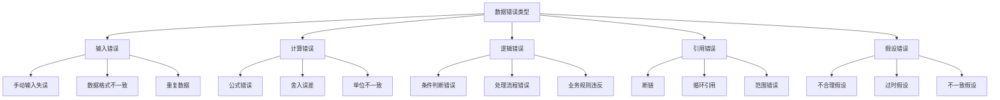
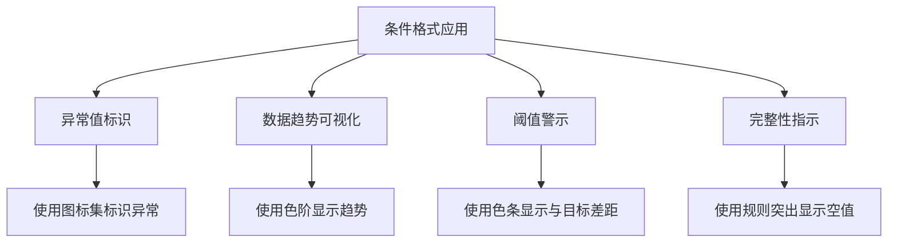
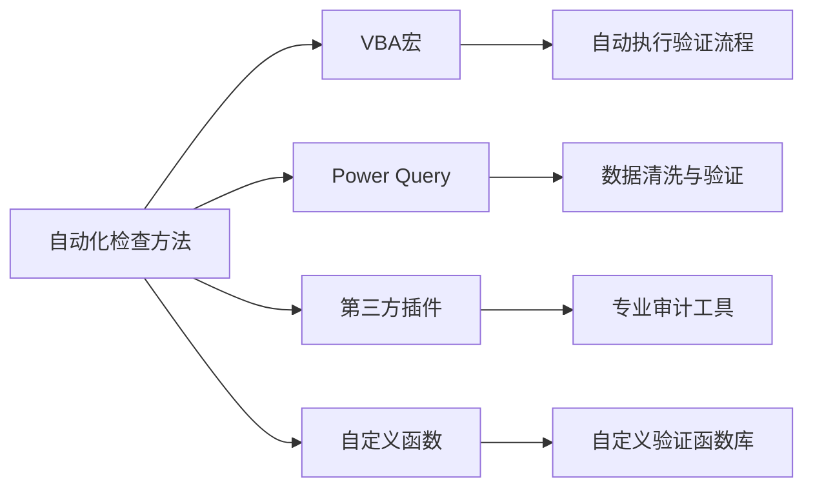
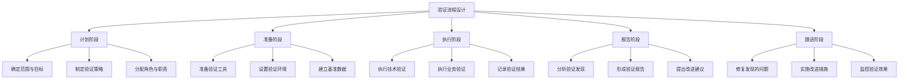
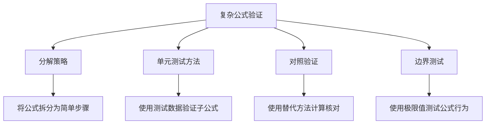

---
{"tags":["财务BP","数据验证","数据检查","Excel模型","模型质量","数据完整性"],"aliases":["数据质量检查","财务模型验证","Excel错误检查"],"created":"2024-03-21","publish":false,"dg-publish":true,"permalink":"/知识共享/001_财务/01_财务BP/01_学习内容/06_BP工具与模板/Excel模型构建/数据验证与检查/","dgPassFrontmatter":true}
---


# 数据验证与检查

## 摘要

本文档详细介绍了财务BP工作中Excel模型的数据验证与检查方法。数据验证与检查是确保财务模型准确性、完整性和可靠性的关键流程，影响决策质量和分析可信度。本文系统讲解了数据验证的原则、方法、工具和最佳实践，以及在财务BP工作中的实际应用案例。

## 一、数据验证与检查的重要性

### 1. 对决策质量的影响
- **错误决策成本**：基于错误数据的决策可能导致重大损失
- **信任度影响**：数据质量直接影响财务BP工作的可信度
- **风险管理**：识别和控制数据错误带来的业务风险
- **合规要求**：满足审计和合规要求的必要流程

### 2. 常见数据错误类型


### 3. 数据验证的收益
- **提高工作效率**：减少错误检查和修复的时间
- **增强决策信心**：提供可靠依据支持决策
- **降低业务风险**：减少因数据错误引发的风险
- **优化资源分配**：基于准确数据进行资源优化
- **提升专业形象**：展现财务BP的专业能力和严谨性

### 4. 建立验证文化
- **团队意识培养**：数据质量是团队共同责任
- **预防为主**：从源头预防错误优于事后检测
- **持续改进**：不断完善验证流程和方法
- **工具支持**：利用技术工具提高验证效率
- **知识共享**：分享验证经验和最佳实践

## 二、数据验证的基本原则

### 1. 完整性原则
- **数据集完整性**：确保所有必需数据都已收集
- **时间序列完整性**：检查时间序列数据无缺失
- **关系完整性**：验证相关数据间的关系完整
- **属性完整性**：确保所有必要属性信息齐全

### 2. 准确性原则
- **值域检查**：数据是否在合理范围内
- **精度控制**：适当的数值精度和舍入规则
- **一致性检查**：跨系统数据的一致性验证
- **适时性**：数据是否反映最新状态

### 3. 逻辑一致性原则
- **内部一致性**：模型内部数据逻辑关系一致
- **外部一致性**：与外部参考数据的一致性
- **历史一致性**：与历史数据的逻辑一致性
- **业务规则一致性**：符合业务规则和约束

### 4. 可追溯性原则
- **数据来源记录**：记录并标注数据来源
- **变更历史**：记录数据变更的历史
- **验证记录**：记录数据验证过程和结果
- **责任明确**：数据输入和验证责任明确

## 三、Excel数据验证技术

### 1. 内置数据验证功能
- **基本验证规则**：
  - 数值范围限制 (如：成本必须为正数)
  - 日期范围限制 (如：日期必须在财年内)
  - 列表选择 (如：限定成本类型必须来自预定义列表)
  - 文本长度限制 (如：项目代码限定字符数)

- **设置方法**：
  ```
  数据 > 数据验证 > 验证条件
  ```

- **错误提示设计**：
  - 自定义错误消息
  - 设置错误类型 (停止、警告、信息)
  - 明确指出问题和解决方法

- **常见应用场景**：
  - 预算输入表单
  - 假设参数输入
  - 财务模型输入区域
  - 数据收集模板

### 2. 条件格式显示


- **异常值标识**：
  - 高亮显示超出正常范围的数值
  - 使用图标集标记异常情况
  - 使用数据条直观显示差异

- **差异分析标识**：
  - 计划vs实际差异标识
  - 预警阈值标识
  - 同比环比异常标识

- **完整性指示**：
  - 标识缺失数据
  - 标识需审核数据
  - 标识过期数据

- **设置方法**：
  ```
  开始 > 条件格式 > 新建规则
  ```

### 3. 公式验证技术
- **简单检查公式**：
  ```
  =IF(A1>上限 OR A1<下限, "超出范围", "正常")
  =IF(ISBLANK(A1), "数据缺失", "")
  =IF(MOD(A1,1)>0, "需为整数", "")
  ```

- **复杂验证公式**：
  ```
  =IF(AND(类型="收入", 值<0), "收入应为正值", "")
  =IF(SUM(部门成本)>总成本, "部门成本总和超过总成本", "")
  ```

- **交叉验证公式**：
  ```
  =IF(ABS(资产负债表净利润-利润表净利润)>0.01, "利润不一致", "")
  =IF(期初余额+本期变动<>期末余额, "余额不平", "")
  ```

- **公式审计技巧**：
  - 使用追踪功能检查公式依赖
  - 使用求值功能检查公式计算过程
  - 通过观察模式检查异常单元格

### 4. 错误检查工具
- **Excel错误检查功能**：
  - 公式 > 错误检查 > 错误检查选项
  - 公式 > 公式审核 > 错误检查
  - 设置自定义错误检查规则

- **追踪箭头技术**：
  - 公式 > 公式审核 > 追踪前趋/后继单元格
  - 识别公式依赖关系
  - 查找循环引用

- **监视窗口**：
  - 公式 > 公式审核 > 监视窗口
  - 同时监控多个单元格的值

- **评估公式工具**：
  - 公式 > 公式审核 > 求值
  - 分步检查复杂公式计算过程

## 四、高级数据验证方法

### 1. 数据一致性检查
- **总分核对**：
  - 明细数据汇总与总计数一致
  - 多维度汇总结果一致
  - 使用交叉表验证不同维度汇总

- **关键财务等式验证**：
  - 资产 = 负债 + 所有者权益
  - 期初余额 + 变动 = 期末余额
  - 现金流量表净增加 = 期末现金 - 期初现金

- **系统间一致性**：
  - 与会计系统数据核对
  - 与预算系统数据核对
  - 与其他管理报表核对

- **时间序列一致性**：
  - 当前期间与历史数据的合理连续性
  - 季度数据与月度数据汇总一致
  - 年度数据与季度数据汇总一致

### 2. 合理性检查
- **趋势分析**：
  - 历史趋势延续性检查
  - 异常波动识别与解释
  - 季节性模式验证

- **比率分析**：
  - 财务比率在合理范围内
  - 比率的时间变化合理性
  - 与行业基准的比较

- **业务相关性检查**：
  - 收入与业务量指标相关性
  - 成本与驱动因素相关性
  - 财务指标与业务发展阶段匹配

- **敏感性测试**：
  - 关键假设变动影响测试
  - 极端情况下的模型反应
  - 结果稳健性评估

### 3. 自动化检查工具


- **VBA自动化验证**：
  - 编写验证宏程序
  - 设置自动运行验证
  - 生成验证报告

- **Power Query数据验证**：
  - 数据加载过程中的验证规则
  - 异常数据标记与处理
  - 数据转换过程验证

- **第三方验证工具**：
  - 专业Excel审计工具
  - 财务模型验证插件
  - 数据质量管理工具

- **自定义验证仪表板**：
  - 集中展示验证结果
  - 实时监控关键指标
  - 异常情况预警机制

### 4. 文档与记录方法
- **验证规则文档**：
  - 记录所有验证规则及其目的
  - 规则的维护与更新记录
  - 规则的优先级和严重程度

- **验证过程记录**：
  - 验证执行时间和负责人
  - 验证结果和处理措施
  - 遗留问题和后续计划

- **异常处理记录**：
  - 发现的异常情况描述
  - 异常原因分析
  - 解决方案和预防措施

- **审批与签认**：
  - 数据验证的审批流程
  - 关键数据的签认机制
  - 变更控制流程

## 五、实施数据验证的最佳实践

### 1. 分层验证策略
- **输入层验证**：
  - 数据录入时的即时验证
  - 数据源质量控制
  - 输入界面的引导与限制

- **处理层验证**：
  - 计算过程的逻辑检查
  - 中间结果的合理性检查
  - 异常处理机制

- **输出层验证**：
  - 最终结果的综合验证
  - 报表间的交叉检查
  - 输出形式的一致性检查

- **外部层验证**：
  - 与外部系统的数据核对
  - 与历史数据的对比
  - 与行业标准的比较

### 2. 风险导向验证方法
- **关键数据识别**：
  - 识别高风险数据点
  - 确定关键业务指标
  - 评估数据影响范围

- **风险评估矩阵**：
  - 数据错误可能性评估
  - 错误影响严重度评估
  - 根据风险等级设定验证策略

- **验证资源分配**：
  - 高风险区域重点验证
  - 合理分配验证时间和精力
  - 验证深度与风险级别匹配

- **动态调整机制**：
  - 根据验证结果调整策略
  - 响应业务变化更新验证重点
  - 持续优化验证效率

### 3. 验证流程设计


- **验证计划制定**：
  - 确定验证范围和目标
  - 设计验证流程和方法
  - 制定验证时间表
  - 分配验证责任人

- **验证执行规范**：
  - 验证步骤的标准操作程序
  - 验证证据的收集方法
  - 问题记录的标准格式
  - 处理异常的流程

- **验证报告方法**：
  - 验证结果的分类汇总
  - 问题的优先级划分
  - 清晰的改进建议
  - 可追踪的问题状态

- **持续验证机制**：
  - 定期验证计划
  - 变更触发的验证
  - 自动化持续验证
  - 验证方法的不断优化

### 4. 团队协作与责任划分
- **角色定义**：
  - 数据提供者职责
  - 数据验证者职责
  - 管理者职责
  - 技术支持职责

- **协作机制**：
  - 验证流程中的沟通路径
  - 问题升级机制
  - 团队合作验证方法
  - 跨部门协调机制

- **能力建设**：
  - 团队验证技能培养
  - 验证工具使用培训
  - 经验分享与学习
  - 验证最佳实践推广

- **激励机制**：
  - 数据质量责任制
  - 验证成果的认可
  - 持续改进的激励
  - 数据质量文化建设

## 六、案例分析

### 案例一：年度预算模型的全面验证

**背景**：某制造企业需要对其年度预算模型进行全面验证，该模型涉及多个部门的输入、复杂的计算逻辑和多种报表输出。

**挑战**：
- 数据来源分散，涉及20个不同部门
- 包含大量假设和驱动因素
- 复杂的计算逻辑和公式嵌套
- 多个相互关联的报表需保持一致性
- 短时间内完成验证以满足预算审批时间要求

**验证方案**：

1. **分层验证策略**：
   - **输入层**：为每个部门创建标准化输入模板，包含完整的数据验证规则
     - 使用Excel数据验证限制输入范围
     - 条件格式标识异常值和变化率
     - 部门内部平衡检查公式
   
   - **处理层**：设计核心计算模块的验证检查点
     - 创建计算审计跟踪工作表
     - 关键假设变更的影响分析
     - 中间结果的合理性检查
   
   - **输出层**：实施综合报表验证机制
     - 报表间交叉核对公式
     - 总分核对自动验证
     - 与历史数据的趋势比较

2. **自动化验证工具**：
   - 开发验证控制面板，集中显示所有验证结果
   - 创建VBA宏自动执行验证流程
   - 设计验证报告自动生成功能
   - 实现一键式全面验证功能

3. **协作验证流程**：
   - 部门负责人进行初步验证
   - 财务BP执行技术和业务验证
   - 财务总监进行最终审核
   - 建立问题跟踪和解决机制

4. **风险导向验证重点**：
   - 重点验证高风险假设（如销售增长率、原材料价格）
   - 详细检查历史上容易出错的计算环节
   - 对敏感性分析结果进行深入验证
   - 特别关注跨部门依赖的数据和计算

**实施效果**：
- 验证过程发现了31个数据错误和15个公式问题
- 识别并修正了5个重大假设不一致的情况
- 预算准确性显著提升，减少了后期调整需求
- 验证时间从原来的2周缩短到3天
- 建立了可重用的验证框架，用于后续预算循环

**关键成功因素**：
- 系统性的验证方法和明确的职责分工
- 自动化工具的有效应用
- 风险导向的重点验证策略
- 标准化的验证流程和文档
- 管理层对数据质量的高度重视

### 案例二：并购财务模型的数据验证

**背景**：某企业需要对一个重要并购交易的财务模型进行严格验证，该模型将用于决定最终报价和交易结构。

**挑战**：
- 模型涉及目标公司的财务预测、协同效应和估值计算
- 基于有限的尽职调查信息，数据存在不确定性
- 高度敏感的决策依赖，错误成本极高
- 时间紧迫，需要在短时间内完成全面验证
- 多种估值方法和情景需要一致的验证标准

**验证方案**：

1. **建立多层次验证框架**：
   - **假设验证层**：
     - 与行业基准比较验证关键假设合理性
     - 与目标公司历史数据对比验证
     - 关键假设间的逻辑一致性检查
   
   - **计算验证层**：
     - 建立独立的验证计算以交叉核对
     - 关键计算步骤的审计标记
     - 敏感性和情景分析的一致性检查
   
   - **结果验证层**：
     - 不同估值方法结果的合理性比较
     - 与可比交易的基准比较
     - 极端情况测试的结果验证

2. **特定验证工具和技术**：
   - 创建专用的假设依赖图，追踪关键假设影响
   - 开发敏感性分析矩阵，验证价值驱动因素
   - 设计自动化的模型一致性检查器
   - 建立分步验证清单和验证证据收集系统

3. **外部专家验证**：
   - 行业专家对业务假设的验证
   - 会计师对财务处理和税务影响的验证
   - 估值专家对估值方法的独立评审
   - 法律顾问对模型合规性的审查

4. **文档和报告机制**：
   - 详细记录所有验证步骤和结果
   - 建立假设来源和验证证据的完整档案
   - 设计为决策者准备的验证摘要
   - 制定后续监控计划，评估实际结果与模型预测的差异

**实施效果**：
- 验证过程发现了3个关键假设不合理的情况
- 纠正了2个影响估值结果10%以上的计算错误
- 明确了7个关键风险领域，并制定了相应的风险缓解策略
- 增强了并购委员会对模型的信心，加速了决策过程
- 验证结果成为并购谈判的有力支持

**关键成功因素**：
- 全面而系统的验证方法
- 验证过程的独立性和客观性
- 多角度、多层次的交叉验证
- 关注价值驱动因素的重点验证
- 验证过程与决策流程的紧密结合

## 七、常见问题与解决方案

### 1. 数据量大导致验证困难
- **问题**：大量数据使手动验证不切实际
- **解决方案**：
  - 实施抽样验证策略
  - 自动化验证脚本开发
  - 使用数据分析工具快速识别异常
  - 分布式验证任务分配
  - 重点验证高风险数据区域

### 2. 复杂公式验证挑战


- **问题**：高度复杂的公式难以验证和理解
- **解决方案**：
  - 将复杂公式分解为简单步骤
  - 创建公式说明文档
  - 使用实例数据演示计算过程
  - 设置中间检查点
  - 使用替代方法交叉验证结果

### 3. 跨系统数据一致性
- **问题**：来自不同系统的数据难以保持一致
- **解决方案**：
  - 建立明确的数据源优先级
  - 设计自动化核对流程
  - 标准化数据定义和格式
  - 建立核心数据字典
  - 实施定期数据核对机制

### 4. 验证责任分散
- **问题**：多人参与的模型验证责任不清
- **解决方案**：
  - 明确定义角色和责任
  - 建立验证责任矩阵
  - 设计清晰的验证流程和检查点
  - 实施验证签认机制
  - 建立问题升级和解决程序

## 相关链接
- [[知识共享/001_财务/01_财务BP/01_学习内容/06_BP工具与模板/Excel模型构建/财务模型设计原则\|知识共享/001_财务/01_财务BP/01_学习内容/06_BP工具与模板/Excel模型构建/财务模型设计原则]]
- [[知识共享/001_财务/01_财务BP/01_学习内容/06_BP工具与模板/Excel模型构建/模型结构与布局\|模型结构与布局]]
- [[知识共享/001_财务/01_财务BP/01_学习内容/06_BP工具与模板/Excel模型构建/公式与函数应用\|公式与函数应用]]
- [[财务报表预测\|财务报表预测]]
- [[Excel模型构建案例\|Excel模型构建案例]]

## 参考文献
1. Benninga, S. (2014). *Financial Modeling*. MIT Press.
2. Fairhurst, D. S. (2019). *Financial Modeling in Excel For Dummies*. John Wiley & Sons.
3. Swan, J. (2018). *Practical Financial Modelling: A Guide to Current Practice*. Elsevier.
4. Tjia, J. S. (2009). *Building Financial Models*. McGraw-Hill.
5. Lynch, P. (2020). *Financial Model Verification and Validation Techniques*. Wiley Finance.
6. Spreadsheetsoftware.com. (2021). *Best Practices for Spreadsheet Verification*.
7. 《财务数据验证与审核》，张明，中国财政经济出版社，2022年
8. 《Excel模型审计与风险控制》，李强，机械工业出版社，2021年 