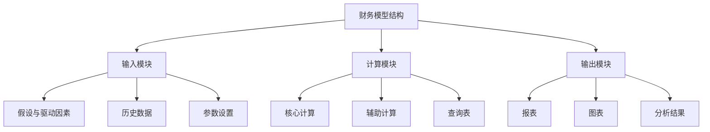
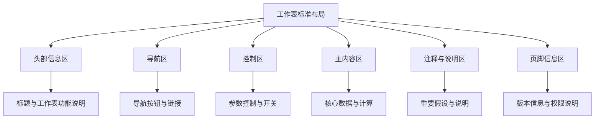
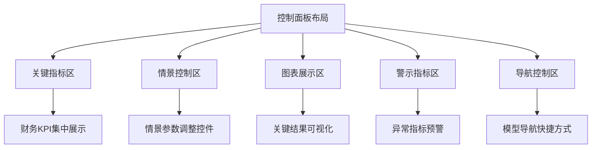

---
{"tags":["财务BP","Excel模型","模型结构","模型布局","财务建模"],"aliases":["财务模型结构","Excel布局设计","财务模型架构"],"created":"2024-03-21","publish":true,"dg-publish":true,"permalink":"/知识共享/001_财务/01_财务BP/01_学习内容/06_BP工具与模板/Excel模型构建/模型结构与布局/","dgPassFrontmatter":true}
---

# 模型结构与布局

## 摘要

本文档详细介绍了财务BP工作中Excel模型的结构设计与布局优化方法。良好的模型结构和布局是构建高效、可靠、易用财务模型的基础，能够显著提升模型的可读性、可维护性和扩展性。本文将系统讲解模型结构的设计原则、布局标准化方法、模块化设计思路以及实际应用案例。

## 一、模型结构的基本原则

### 1. 清晰的逻辑流程
- **从输入到输出的单向流**：信息流向应明确、单向
- **逻辑顺序排列**：工作表按照分析逻辑顺序排列
- **计算过程可追踪**：确保每个计算步骤清晰可见
- **避免循环引用**：保持数据流的线性结构

### 2. 模块化设计

- **功能分离**：不同功能通过独立工作表实现
- **标准接口**：模块间通过明确的链接方式连接
- **封装性**：内部计算对用户透明，只需关注输入输出
- **可复用性**：标准化模块可在不同模型中重复使用

### 3. 一致性原则
- **统一设计风格**：保持整个模型的设计风格统一
- **标准命名约定**：对工作表、区域、公式使用一致命名
- **统一格式设置**：对相同类型数据使用一致的格式
- **统一颜色编码**：建立一套统一的颜色系统

### 4. 用户体验导向
- **直观操作流程**：用户操作路径清晰直观
- **适当的信息密度**：避免信息过载或过于稀疏
- **关注点突出**：重要信息和控制区域突出显示
- **错误预防**：设计防止用户错误的机制

## 二、标准化的模型结构

### 1. 工作簿结构
- **封面页(Cover)**：模型概述、版本信息、使用说明
- **目录页(TOC)**：工作表清单、导航和模型地图
- **输入区(Inputs)**：所有假设和输入参数
- **计算区(Calc)**：核心计算和处理逻辑
- **输出区(Outputs)**：财务报表和分析结果
- **支持区(Support)**：参考数据、查询表、辅助计算
- **控制面板(Dashboard)**：主要结果和交互控制

### 2. 工作表命名与排序
- **命名规范**：
  - 使用简短、描述性的名称
  - 前缀标识工作表类型（如I-输入、C-计算、O-输出）
  - 避免空格，使用下划线或驼峰命名法
  
- **排序逻辑**：
  - 按照数据流顺序排列工作表
  - 相关工作表分组排列
  - 重要工作表靠前放置
  - 辅助工作表放置末尾

### 3. 标准化工作表布局
- **头部信息区**：工作表名称、模型名称、版本、日期
- **导航区**：返回目录、相关工作表链接
- **控制区**：此工作表特定的控制参数
- **主内容区**：工作表的核心内容
- **注释区**：对工作表的说明和注释
- **版权区**：版权信息、使用限制

### 4. 数据流向设计
- **从左到右流动**：数据在工作表内从左向右流动
- **从上到下流动**：数据在工作表内从上向下流动
- **工作表间单向流动**：避免工作表间的循环引用
- **直接引用**：尽量使用直接引用而非间接引用
- **可视化数据流**：使用颜色或线条标识数据流动路径

## 三、工作表内部布局优化

### 1. 输入工作表设计
- **区域划分**：根据输入类型明确划分区域
- **参数分组**：相关参数放在一起，便于理解和修改
- **默认值设置**：为关键参数提供合理默认值
- **输入验证**：添加数据验证规则防止错误输入
- **敏感参数标识**：突出显示对结果影响较大的参数

**典型布局示例**：
- 宏观经济假设区
- 收入驱动因素区
- 成本假设区
- 资本支出假设区
- 运营参数区
- 财务参数区

### 2. 计算工作表设计
- **计算流程可见性**：中间计算步骤清晰可见
- **模块化布局**：相关计算分组，便于理解和调试
- **一致的计算方向**：保持一致的计算流向（通常从上到下、从左到右）
- **避免复杂公式**：将复杂计算拆分为简单步骤
- **命名单元格/区域**：对重要计算单元格命名

**典型布局示例**：
- 收入计算区
- 成本计算区
- 税费计算区
- 折旧摊销计算区
- 现金流计算区

### 3. 输出工作表设计
- **标准报表格式**：遵循财务报表标准格式
- **数据呈现层次**：主要数据突出，次要数据可折叠
- **比较视图**：提供当期与历史、预测与实际的比较
- **敏感信息标记**：标注敏感或需特别关注的结果
- **打印布局优化**：考虑打印效果，设置适当的打印区域

**典型布局示例**：
- 管理层摘要
- 利润表
- 资产负债表
- 现金流量表
- 关键比率分析

### 4. 控制面板设计

- **关键信息聚焦**：最重要的结果和指标集中展示
- **交互控制元素**：包含影响整个模型的核心控制
- **视觉层次分明**：通过布局和视觉设计强调信息重要性
- **图表与数据结合**：有效结合图表和数值展示关键结果
- **直观导航设计**：提供到模型各部分的便捷导航

## 四、布局技巧与最佳实践

### 1. 空间管理技巧
- **利用冻结窗格**：固定标题行和关键列
- **分组与大纲**：使用Excel分组功能管理细节数据
- **视图设置**：为不同用户场景预设视图
- **窗口拆分**：需要时拆分窗口以同时查看不同区域
- **滚动区域控制**：限制滚动区域，防止用户迷失

### 2. 视觉设计技巧
- **颜色编码系统**：
  - 输入单元格：浅黄或浅蓝
  - 计算单元格：白色或浅灰
  - 结果单元格：浅绿或强调色
  - 错误或警告：浅红或橙色

- **格式化一致性**：
  - 货币格式统一
  - 小数位数一致
  - 日期格式标准化
  - 百分比格式统一

- **视觉引导**：
  - 使用边框区分不同功能区域
  - 使用底纹突出重要区域
  - 字体样式区分标题和内容
  - 使用条件格式突出异常值

### 3. 模型导航优化
- **超链接导航系统**：在工作表间建立超链接网络
- **目录式导航**：创建交互式目录页
- **标签式导航**：模拟标签式界面的导航体验
- **返回按钮**：在每个工作表添加返回主页的按钮
- **面包屑导航**：显示当前位置和层级路径

### 4. 提升可维护性的布局技巧
- **文档化标准**：直接在模型中嵌入文档说明
- **一致的区域布局**：不同工作表中相同类型区域保持一致布局
- **版本控制区域**：专门的版本控制和变更记录区
- **集中管理样式**：使用样式表集中管理格式
- **模块化扩展空间**：为将来扩展预留足够空间

## 五、案例分析

### 案例一：销售预测模型的结构与布局优化

**背景**：某消费品公司需要一个销售预测模型，之前的模型结构混乱，难以维护和使用。

**初始问题**：
- 输入和计算混杂在同一工作表
- 工作表之间没有明确的数据流向
- 缺乏导航系统，用户经常迷失
- 没有数据验证，容易输入错误
- 核心假设分散在模型各处

**结构重新设计**：
1. **工作簿结构改造**：
   - 创建封面和目录页
   - 将工作表按功能分为输入、计算和输出三大类
   - 添加单独的控制面板工作表

2. **工作表命名与排序**：
   - 采用前缀命名法：I-假设，C-计算，O-报表，D-控制面板
   - 按照数据流顺序重新排列工作表
   - 将相关工作表分组排列

3. **输入区设计**：
   - 集中所有假设到"I-假设"工作表
   - 按类别分组：市场假设、产品假设、价格假设、成本假设
   - 添加数据验证和默认值
   - 使用条件格式标识关键驱动因素

4. **计算区设计**：
   - 将计算逻辑分解为多个工作表：C-销量计算、C-收入计算、C-成本计算等
   - 确保从上到下、从左到右的计算流
   - 添加中间计算步骤和解释说明
   - 使用颜色编码标识不同类型的计算单元格

5. **输出区设计**：
   - 创建标准化报表：O-销售摘要、O-产品分析、O-区域分析
   - 提供多种视图：表格式、图表式
   - 突出显示关键业绩指标
   - 优化打印设置

**实施效果**：
- 模型维护时间减少65%
- 新用户学习时间从3天缩短为半天
- 错误率下降90%
- 分析周期从5天缩短为2天
- 用户满意度显著提升

**关键成功因素**：
- 严格的输入、计算和输出分离
- 一致的命名和布局标准
- 强大的导航和控制系统
- 清晰的视觉引导设计
- 全面的内嵌文档说明

### 案例二：财务规划模型的模块化布局

**背景**：某科技公司需要一个综合财务规划模型，既要满足常规规划需求，又要适应快速变化的业务情况。

**初始需求**：
- 支持多个业务部门的规划
- 需要定期更新和扩展
- 多人协作使用和维护
- 需要处理不同情景分析
- 要与其他系统集成

**模块化布局设计**：
1. **主控制模块**：
   - 创建核心控制面板，集中所有全局参数
   - 设计情景管理系统，允许保存和切换多个情景
   - 添加导航中心，提供整个模型的地图视图
   - 包含版本控制和用户访问管理

2. **业务单元模块**：
   - 为每个业务单元创建标准化的子模块
   - 统一输入和输出接口，确保模块间兼容
   - 允许独立更新各业务单元模块
   - 使用颜色编码区分不同业务单元

3. **核心计算模块**：
   - 设计中央处理引擎，整合各业务单元数据
   - 建立标准化计算流程，确保一致性
   - 分离敏感性分析模块，避免影响核心计算
   - 添加审计跟踪功能，记录关键计算步骤

4. **报告输出模块**：
   - 创建多层级报告系统：概述、详细、钻取
   - 设计标准报表模板，适用于所有业务单元
   - 添加图形仪表板，实时反映业务状况
   - 包含导出接口，连接到其他系统

5. **支持功能模块**：
   - 数据导入导出接口
   - 辅助计算工具集
   - 文档和帮助系统
   - 诊断和错误检查工具

**布局优化细节**：
- 统一每个模块的内部布局，确保一致性
- 创建标准化的模块间链接方式
- 使用条件格式和数据验证确保数据完整性
- 设计一致的色彩和格式系统
- 添加视觉指示器，显示数据流向和依赖关系

**实施效果**：
- 成功整合了5个业务部门的财务规划
- 模型扩展和维护变得简单高效
- 实现了不同部门间的一致性和可比性
- 情景分析速度提升300%
- 用户可以专注于自己负责的模块，无需了解整个模型

**关键成功因素**：
- 强大的模块化设计理念
- 标准化的接口和数据流
- 灵活的控制和配置系统
- 视觉上有效的导航和指引
- 全面的文档和用户支持

## 六、常见问题与解决方案

### 1. 复杂模型的导航问题
- **问题**：用户在大型模型中迷失方向
- **解决方案**：
  - 创建交互式目录和模型地图
  - 添加一致的返回导航按钮
  - 使用颜色编码标识不同类型的工作表
  - 添加工作表分组和层次结构
  - 实现电子书式的面包屑导航

### 2. 计算透明度vs简洁性平衡
- **问题**：过于详细的计算步骤导致模型臃肿
- **解决方案**：
  - 使用折叠/展开功能控制细节显示
  - 设置不同级别的详细程度选项
  - 关键计算提供中间步骤，次要计算可以简化
  - 利用命名区域提高公式可读性
  - 为复杂计算添加文字说明

### 3. 多用户协作问题
- **问题**：不同用户需要不同视图和权限
- **解决方案**：
  - 设计基于角色的视图系统
  - 保护核心计算工作表，只允许修改输入
  - 使用颜色明确标识可编辑和只读区域
  - 添加变更跟踪和审计功能
  - 建立标准化的协作规则和流程

### 4. 长期维护与版本控制问题
- **问题**：模型随时间演变难以维护一致性
- **解决方案**：
  - 在模型中内置版本控制系统
  - 集中管理所有样式和格式设置
  - 保持规范的文档更新习惯
  - 建立明确的变更管理流程
  - 定期对模型进行结构审查和优化

## 相关链接
- [[知识共享/001_财务/01_财务BP/01_学习内容/06_BP工具与模板/Excel模型构建/财务模型设计原则\|知识共享/001_财务/01_财务BP/01_学习内容/06_BP工具与模板/Excel模型构建/财务模型设计原则]]
- [[知识共享/001_财务/01_财务BP/01_学习内容/06_BP工具与模板/Excel模型构建/公式与函数应用\|公式与函数应用]]
- [[知识共享/001_财务/01_财务BP/01_学习内容/06_BP工具与模板/Excel模型构建/数据验证与检查\|数据验证与检查]]
- [[财务报表预测\|财务报表预测]]
- [[Excel模型构建案例\|Excel模型构建案例]]

## 参考文献
1. Benninga, S. (2014). *Financial Modeling*. MIT Press.
2. Sengupta, C. (2009). *Financial Modeling Using Excel and VBA*. Wiley Finance.
3. Fairhurst, D. S. (2019). *Financial Modeling in Excel For Dummies*. John Wiley & Sons.
4. Tjia, J. S. (2009). *Building Financial Models*. McGraw-Hill.
5. Day, A. (2020). *Excel Modeling in Corporate Finance*. Pearson.
6. Swan, J. (2018). *Practical Financial Modelling: A Guide to Current Practice*. Elsevier.
7. 《Excel财务建模最佳实践》，张明，中国财政经济出版社，2022年
8. 《财务模型结构设计指南》，李强，机械工业出版社，2021年 