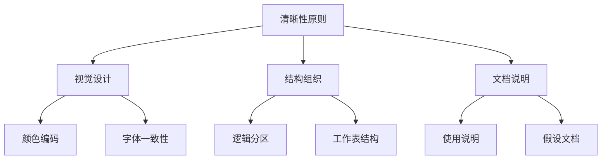
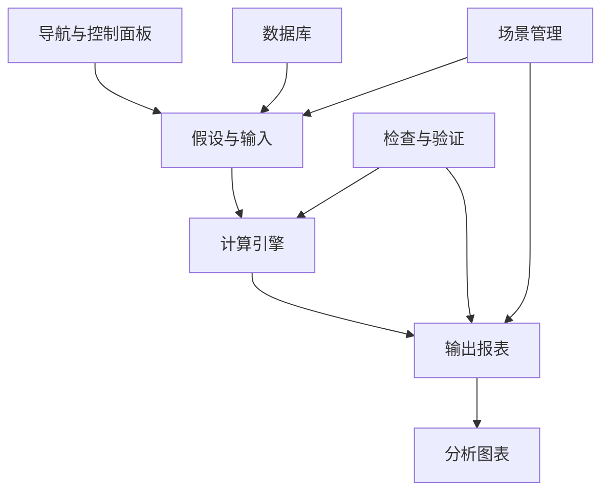
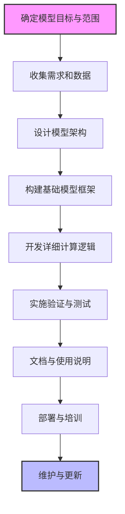

---
{"tags":["财务BP","工具应用","Excel模型","模型构建","设计原则"],"aliases":"财务模型设计指南,模型构建最佳实践","created":"2024-01-15","dg-publish":true,"permalink":"/知识共享/001_财务/01_财务BP/01_学习内容/06_BP工具与模板/Excel模型构建/财务模型设计原则/","dgPassFrontmatter":true}
---


# 财务模型设计原则

> [!abstract] 概述
> 财务模型是财务BP工作的核心工具，良好的模型设计对提高工作效率和决策质量至关重要。本文详细阐述财务模型设计的核心原则、结构框架、逻辑关系以及最佳实践，帮助财务BP专业人士构建高质量、可维护且实用的财务模型。

## 基本概念

财务模型是通过数学关系和财务逻辑，将假设、历史数据和预测连接起来的计算工具，旨在模拟企业财务状况、预测未来表现或评估不同决策方案的影响。在财务BP工作中，精心设计的财务模型是提升工作质量的基础。

### 财务模型的类型与应用

按照用途和复杂度，财务模型可分为以下几类：

1. **运营预算模型**：用于日常经营预算编制与管理
2. **财务预测模型**：用于中长期财务表现预测
3. **项目评估模型**：用于特定投资项目的可行性分析
4. **估值模型**：用于企业或业务单元价值评估
5. **综合规划模型**：整合上述功能的全面财务规划工具

## 核心内容

### 财务模型设计的关键原则

#### 1. 清晰性原则

财务模型应当清晰易懂，使其他使用者能迅速理解模型结构和逻辑。

**实践要点**：
- 采用一致的格式和颜色编码（如输入单元格使用蓝色，计算单元格使用黑色）
- 为主要区域和工作表添加清晰标题
- 包含模型导航和使用说明
- 避免过度复杂的公式，必要时分解为多个步骤



#### 2. 灵活性原则

模型应具备足够的灵活性，能适应假设变化和不同场景分析。

**实践要点**：
- 建立清晰的假设区域，便于调整
- 使用参数化设计，避免硬编码
- 设计场景分析功能，支持多种情景比较
- 为关键变量增加敏感性分析功能

#### 3. 可追溯性原则

模型中的每个计算和结果都应当可以轻松追溯其来源和计算逻辑。

**实践要点**：
- 避免复杂的嵌套函数，分解为简单步骤
- 对关键计算添加注释说明
- 保持公式的一致性和透明度
- 建立清晰的数据流向图表或说明

#### 4. 完整性原则

模型应涵盖所有必要的财务要素和业务逻辑，确保分析的全面性。

**实践要点**：
- 包含完整的三大财务报表及其联系
- 确保资产负债表能够自动平衡
- 纳入现金流循环的完整逻辑
- 考虑税务影响和其他重要财务因素

#### 5. 准确性原则

模型的计算必须准确，逻辑必须严密，避免错误。

**实践要点**：
- 实施多重交叉检查（如资产负债表平衡检查）
- 使用单位和比率检查验证计算合理性
- 与历史数据和行业标准进行比较
- 对模型进行独立审核

#### 6. 可维护性原则

模型应当易于更新和维护，能够持续使用。

**实践要点**：
- 模块化设计，将不同功能分隔为独立部分
- 避免过度复杂的宏和自动化功能
- 建立版本控制和变更记录
- 编写详细的模型维护文档

### 财务模型的结构框架

一个完整的财务模型通常包含以下核心组件：



#### 1. 模型架构设计

**工作表结构安排**：
- **控制面板**：模型导航、主要参数控制和结果摘要
- **假设输入**：集中管理所有假设变量
- **历史数据**：存储和处理历史财务数据
- **计算工作表**：进行核心计算和逻辑处理
- **财务报表**：生成标准财务报表
- **分析工作表**：展示关键分析和图表
- **文档说明**：记录模型逻辑和使用指南

**数据流设计**：
- 明确单向数据流，避免循环引用
- 区分输入、计算和输出区域
- 建立清晰的数据传递路径

#### 2. 输入设计

**假设区设计**：
- 集中管理所有关键假设
- 为假设提供合理默认值和允许范围
- 添加假设说明和来源
- 分类组织（如运营假设、资本结构假设等）

**输入验证**：
- 设置数据验证规则，限制无效输入
- 使用条件格式标记异常值
- 提供输入参考范围（如行业基准）

#### 3. 计算逻辑设计

**公式构建原则**：
- 保持公式简洁明了
- 避免过度复杂的嵌套函数
- 使用命名范围增强可读性
- 优先使用表格引用而非绝对引用

**逻辑分层**：
- 驱动因素（如销量、单价）
- 中间计算（如收入、成本结构）
- 汇总结果（如报表项目）

#### 4. 输出设计

**报表设计**：
- 遵循标准财务报表格式
- 提供多种时间维度（月度、季度、年度）
- 包含同比和环比分析
- 添加关键比率和指标

**可视化设计**：
- 为关键指标创建图表
- 使用仪表板展示整体情况
- 包含趋势分析和比较分析
- 设计直观的数据展示方式

### 财务模型的常见功能模块

#### 1. 收入预测模块

**核心功能**：
- 产品/服务分类
- 数量和价格双维度预测
- 季节性和增长因素调整
- 多场景收入预测

**设计要点**：
- 分解为价格和数量两个驱动因素
- 考虑季节性波动和长期趋势
- 包含市场份额和渗透率分析
- 与宏观经济指标建立关联

#### 2. 成本结构模块

**核心功能**：
- 固定成本与变动成本区分
- 直接成本与间接成本分类
- 成本弹性和规模效应模拟
- 成本优化情景分析

**设计要点**：
- 明确区分固定和变动成本
- 建立成本与业务量的关系函数
- 考虑通货膨胀和效率提升因素
- 包含边际成本分析功能

#### 3. 资本支出模块

**核心功能**：
- 长期资产投资规划
- 折旧和摊销计算
- 资产处置和更新规划
- 产能与资本支出关系模拟

**设计要点**：
- 分类管理不同类型资产
- 支持多种折旧方法
- 链接产能规划与资本需求
- 包含维护性和扩张性支出分析

#### 4. 营运资金模块

**核心功能**：
- 应收账款和库存周转预测
- 应付账款管理模拟
- 营运资金需求计算
- 现金转换周期分析

**设计要点**：
- 基于历史周转天数预测未来需求
- 考虑业务增长对营运资金的影响
- 模拟不同信用政策的影响
- 包含季节性波动分析

#### 5. 融资结构模块

**核心功能**：
- 债务融资规划
- 偿债计划和利息测算
- 股权融资方案
- 资本结构优化分析

**设计要点**：
- 详细模拟各类债务工具
- 建立灵活的偿债机制
- 考虑利率波动和信用等级变化
- 计算关键财务杠杆指标

#### 6. 税务影响模块

**核心功能**：
- 所得税计算
- 税收抵免和优惠分析
- 递延税款处理
- 国际税务规划（如适用）

**设计要点**：
- 考虑税法变化的影响
- 正确处理亏损结转
- 模拟不同税务筹划方案
- 区分会计利润和应税所得

### 财务模型的高级设计技巧

#### 1. 敏感性分析设计

**实现方法**：
- 使用数据表功能进行单因素和双因素分析
- 建立参数控制器，动态改变假设
- 创建敏感性分析图表，直观展示影响
- 计算敏感度系数，量化影响程度

#### 2. 情景分析设计

**实现方法**：
- 创建情景管理器，存储多套假设
- 使用下拉菜单或按钮切换情景
- 提供情景比较分析
- 计算加权平均结果

#### 3. 蒙特卡洛模拟

**实现方法**：
- 定义关键变量的概率分布
- 使用随机数生成器或专用插件
- 运行多次迭代，收集结果
- 分析结果分布和概率

#### 4. 数据验证与错误检查

**实现方法**：
- 建立平衡验证（如资产=负债+所有者权益）
- 创建逻辑验证（如毛利率在合理范围）
- 设置公式一致性检查
- 使用条件格式标记异常值

## 应用方法

### 财务模型设计流程



#### 1. 规划阶段

- **确定模型目标**
  - 明确模型用途（如预算编制、财务预测、项目评估）
  - 确定时间范围和粒度（月度、季度、年度）
  - 定义输出要求和关键指标

- **需求收集**
  - 与利益相关者访谈，了解期望和需求
  - 收集历史数据和行业基准
  - 整理业务逻辑和财务规则

#### 2. 设计阶段

- **架构设计**
  - 规划工作表结构和数据流
  - 设计用户界面和交互方式
  - 确定假设分类和组织方法

- **基础框架搭建**
  - 创建工作表结构
  - 构建导航系统
  - 设置格式和样式标准

#### 3. 开发阶段

- **假设区构建**
  - 创建集中式假设区
  - 设置默认值和合理范围
  - 添加说明和来源

- **计算逻辑开发**
  - 按模块逐步构建计算逻辑
  - 实现三大报表间的联动
  - 建立关键指标计算

- **分析功能实现**
  - 开发敏感性分析功能
  - 实现情景管理系统
  - 创建图表和可视化分析

#### 4. 测试与优化阶段

- **验证与检查**
  - 检查计算准确性
  - 验证模型内部一致性
  - 测试极端情况下的稳定性

- **性能优化**
  - 简化复杂公式
  - 减少工作表间的引用
  - 优化大型数据处理方法

#### 5. 部署阶段

- **文档编写**
  - 创建用户指南
  - 编写技术文档
  - 记录假设来源和逻辑

- **用户培训**
  - 培训主要使用者
  - 解释模型逻辑和限制
  - 提供故障排除指南

### 财务模型开发的最佳实践

#### 1. 输入区设计

- 使用单独工作表集中管理所有假设
- 对每个假设提供充分的解释和来源
- 采用一致的颜色编码标识输入单元格
- 设置数据验证规则，防止无效输入

| 假设类别 | 变量名称 | 值 | 单位 | 来源/说明 | 允许范围 |
|---------|---------|---|-----|----------|---------|
| 宏观经济 | GDP增长率 | 5.5% | % | 国家统计局预测 | 3%-8% |
| 销售预测 | 销量增长率 | 12% | % | 战略规划目标 | 5%-20% |
| 成本结构 | 原材料成本占比 | 35% | % | 历史平均水平 | 30%-40% |
| 运营效率 | 应收账款周转天数 | 45 | 天 | 信用政策规定 | 30-60天 |

#### 2. 计算区设计

- 以逻辑流程组织计算步骤
- 避免复杂嵌套函数，分解为简单步骤
- 使用命名范围提高公式可读性
- 添加公式说明和单位标识

**优良计算设计示例**：
```
// 不推荐的复杂公式
总成本 = SUM(B10:B20) * (1 + C5) * IF(D8>100, 0.9, 1) - MAX(0, E7-1000) * 0.05

// 推荐的分步计算
基础成本 = SUM(原材料成本, 人工成本, 制造费用)  // 命名范围引用
通胀调整 = 基础成本 * 通胀率                  // 分步计算
规模折扣 = IF(产量 > 规模阈值, 折扣率, 0)      // 逻辑清晰
超额优惠 = MAX(0, 采购量 - 优惠起点) * 优惠比例 // 单独计算
总成本 = 基础成本 * (1 + 通胀调整) * (1 - 规模折扣) - 超额优惠
```

#### 3. 报表设计

- 遵循标准财务报表格式
- 包含同比和环比分析
- 添加关键比率分析
- 使用条件格式突出显示重要变化

**标准报表设计示例**：

利润表设计：
- 分类展示收入（主营业务收入、其他收入）
- 清晰区分成本类型（直接成本、间接成本）
- 展示多层利润指标（毛利、营业利润、税前利润、净利润）
- 计算关键利润率（毛利率、营业利润率、净利率）
- 提供同比增长分析和预算对比

#### 4. 仪表板设计

- 突出显示关键绩效指标
- 使用适当的图表类型展示趋势
- 添加警示信号，标记异常值
- 提供交互式控件调整假设

**仪表板设计要素**：
- 收入与利润趋势图
- 关键财务比率仪表盘
- 现金流与流动性指标
- 预算执行情况跟踪
- 敏感性分析控制面板

## 案例分析

### 案例一：制造企业年度预算模型设计

某机械制造企业需要建立综合财务预算模型，用于年度规划和季度滚动预测。

**模型目标**：
- 提供产品线级别的详细预算
- 支持按月度、季度和年度展示结果
- 集成产能规划与资本支出
- 实现多情景分析功能

**模型结构设计**：

| 工作表名称 | 用途 | 主要内容 |
|-----------|-----|---------|
| 控制面板 | 模型导航与摘要 | 关键指标摘要、情景选择器、导航按钮 |
| 假设 | 集中管理假设 | 宏观假设、销售假设、成本假设、运营假设 |
| 历史数据 | 存储历史数据 | 过去3年的月度财务和运营数据 |
| 销售预测 | 收入预测计算 | 按产品线的价格、数量和收入预测 |
| 成本规划 | 成本结构计算 | 直接材料、直接人工、制造费用预测 |
| 费用规划 | 期间费用计算 | 销售费用、管理费用、研发费用预测 |
| 产能规划 | 产能与利用率 | 产能需求、利用率和瓶颈分析 |
| 资本支出 | 固定资产投资 | 资本支出规划、折旧计算 |
| 融资规划 | 债务与权益 | 借款、还款和利息计算 |
| 利润表 | 财务报表 | 月度、季度、年度利润表 |
| 资产负债表 | 财务报表 | 月度、季度、年度资产负债表 |
| 现金流量表 | 财务报表 | 月度、季度、年度现金流量表 |
| 比率分析 | 财务指标 | 盈利能力、流动性、运营效率指标 |
| 敏感性分析 | 风险评估 | 关键变量敏感性和情景比较 |
| 图表 | 可视化分析 | 关键趋势和比较图表 |
| 说明文档 | 使用指南 | 模型逻辑说明和使用方法 |

**技术设计要点**：

1. **动态销售预测模块**
   - 按产品线分类，包含数量和价格两个维度
   - 考虑季节性因素和长期增长趋势
   - 支持不同情景下的预测切换

```
// 销售数量计算逻辑
月度销量 = 基础月销量 × (1 + 年增长率) × 季节性因子 × 情景调整因子
```

2. **集成产能规划**
   - 将产能限制与销售预测关联
   - 计算产能利用率和瓶颈分析
   - 自动触发资本支出建议

3. **灵活的成本结构模型**
   - 区分固定成本和变动成本
   - 考虑规模效应和通胀因素
   - 支持效率提升情景模拟

```
// 成本计算逻辑
变动成本 = 单位变动成本 × 生产数量 × (1 + 原材料通胀率) × (1 - 效率提升率)
固定成本 = 基础固定成本 × (1 + 固定成本增长率)
```

4. **现金流管理功能**
   - 详细的营运资金预测
   - 季节性现金流波动分析
   - 最低现金余额预警系统

**使用效果**：
- 将预算编制时间从4周缩短至2周
- 提供了95%准确度的季度预测
- 帮助识别产能瓶颈，优化资本支出计划
- 支持灵活的情景规划，应对市场变化

### 案例二：科技初创公司融资规划模型

某SaaS初创公司需要建立财务模型，规划未来3-5年发展，并支持B轮融资决策。

**模型目标**：
- 展示公司业务增长轨迹
- 计算资金需求和融资时点
- 评估不同增长策略的财务影响
- 支持投资人沟通和决策

**模型结构设计**：

核心工作表包括：
- 控制面板与摘要
- 用户增长预测
- 收入模型（含定价策略、转化率）
- 客户获取成本与营销预算
- 人员规划与薪酬
- 技术与基础设施成本
- 三大财务报表
- 资金消耗与融资规划
- 估值与投资回报分析
- 情景比较与敏感性分析

**技术设计要点**：

1. **用户增长与转化漏斗**
   - 建立完整用户获取漏斗模型
   - 考虑获客渠道组合与效率
   - 模拟转化率与留存率变化

```
// 用户增长计算逻辑
新注册用户 = Σ(各渠道获客量)
活跃用户 = 上期活跃用户 × 留存率 + 新注册用户 × 激活率
付费用户 = 活跃用户 × 付费转化率
```

2. **单位经济学模型**
   - 计算客户获取成本(CAC)
   - 分析客户生命周期价值(LTV)
   - 评估收回期和LTV/CAC比率

3. **资金消耗预测**
   - 月度现金流预测
   - 资金消耗率(Burn Rate)分析
   - 资金跑道(Runway)计算

```
// 资金跑道计算
月度资金消耗 = 月度支出 - 月度收入
资金跑道 = 当前现金余额 ÷ 月度资金消耗
```

4. **敏感性与情景分析**
   - 用户增长率敏感性分析
   - 定价策略情景比较
   - 融资规模与时点评估

**使用效果**：
- 成功预测了18个月内的现金需求
- 帮助确定最佳融资时点和规模
- 支持多种增长策略的比较分析
- 提供了令投资者信服的财务规划

## 相关链接

- [[财务BP/学习内容/BP工具与模板/Excel模型构建/模型结构与布局\|模型结构与布局]]
- [[财务BP/学习内容/BP工具与模板/Excel模型构建/公式与函数应用\|公式与函数应用]]
- [[财务BP/学习内容/BP工具与模板/Excel模型构建/数据验证与检查\|数据验证与检查]]
- [[财务BP/学习内容/财务预测与模型/财务报表预测/利润表预测方法\|利润表预测方法]]
- [[财务BP/学习内容/财务预测与模型/敏感性分析/敏感性分析的展示方法\|敏感性分析的展示方法]]

## 参考文献

1. Benninga, S. (2014). *Financial Modeling*. MIT Press.
2. Pignataro, P. (2018). *Financial Modeling and Valuation: A Practical Guide to Investment Banking and Private Equity*. Wiley.
3. Sengupta, C. (2009). *Financial Modeling Using Excel and VBA*. Wiley Finance.
4. Tjia, J. S. (2009). *Building Financial Models: The Complete Guide to Designing, Building, and Applying Projection Models*. McGraw-Hill.
5. 李曜，《财务模型设计实务》，中国财政经济出版社，2019.
6. 张志强，《Excel在财务分析中的高级应用》，机械工业出版社，2020.
7. 刘志宏，《财务建模：原理与实践》，清华大学出版社，2021. 