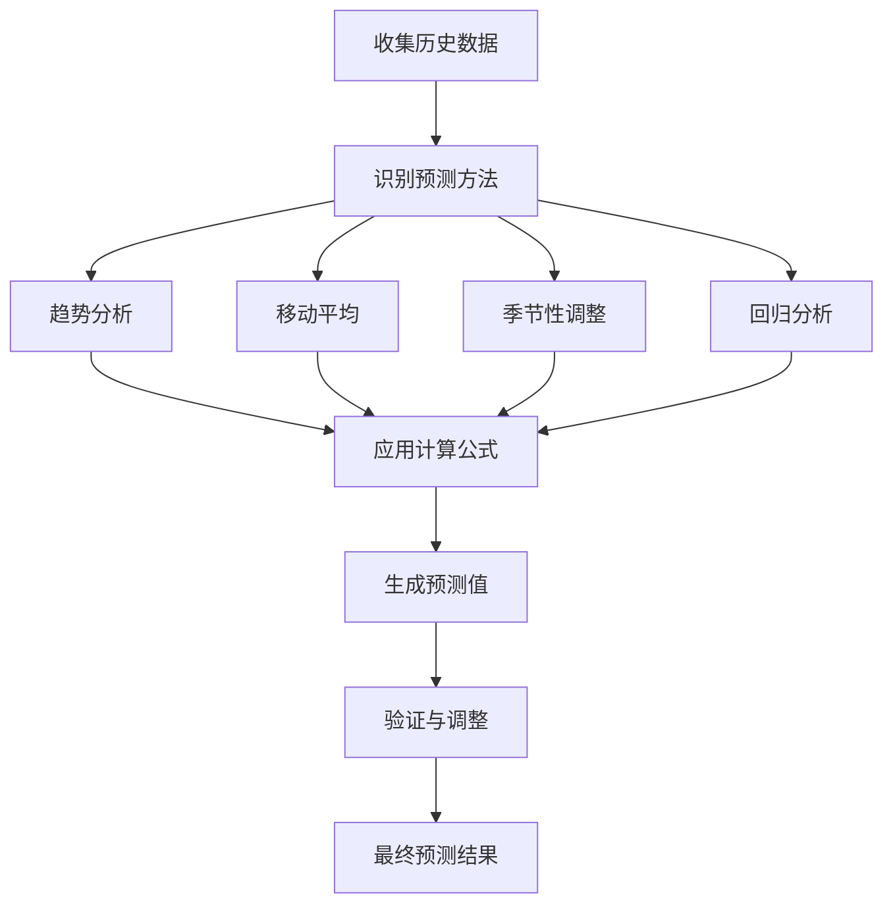
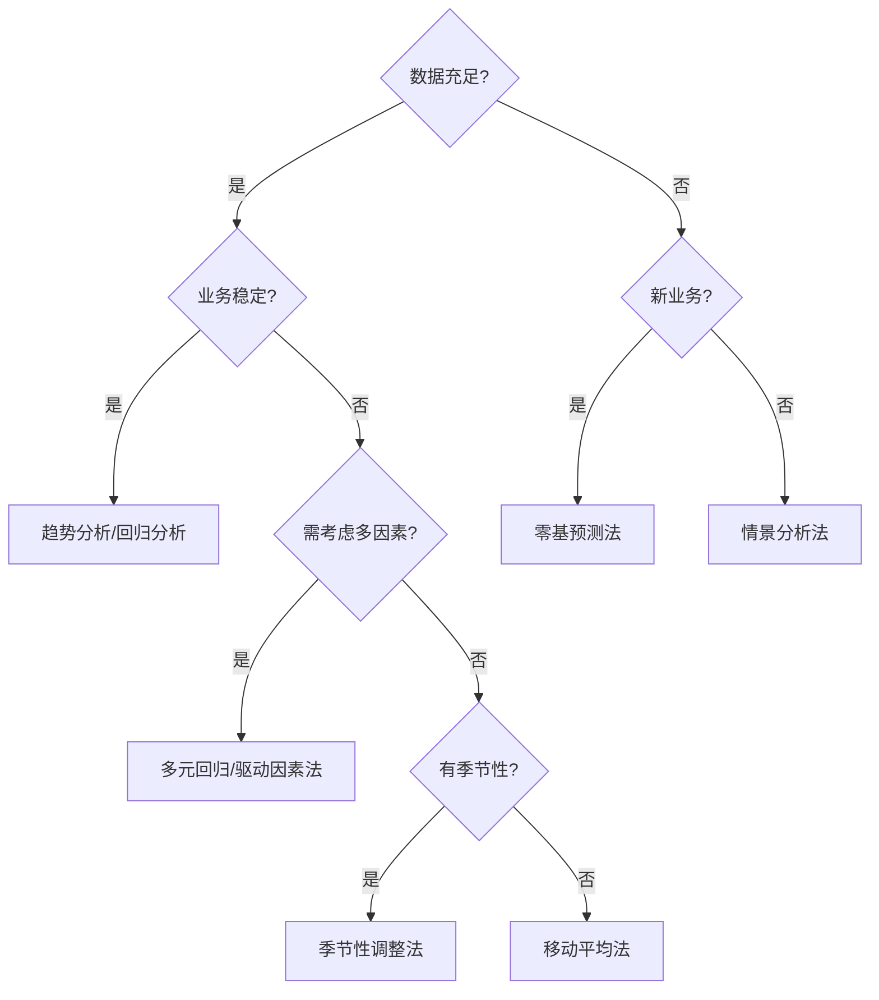

---
{"tags":["财务BP","预测方法","财务模型"],"aliases":["财务预测技术","预测工具"],"created":"2023-11-16","dg-publish":true,"permalink":"/知识共享/001_财务/01_财务BP/01_学习内容/06_BP工具与模板/基础方法/BP财务预测方法/","dgPassFrontmatter":true}
---

# BP财务预测方法

## 概述

财务预测是财务BP工作的核心能力之一，通过科学的预测方法为企业决策提供依据。本文详细介绍各类财务预测方法的原理、适用场景、操作步骤及案例应用，帮助财务BP掌握必要的预测工具和技术。

## 基础预测方法

### 趋势分析法

**原理与特点**：
- 基于历史数据识别增长或下降趋势
- 通过数学模型延伸趋势预测未来

**适用场景**：
- 相对稳定的业务环境
- 有足够历史数据的业务线
- 季节性影响较小的指标

**操作步骤**：
1. 收集至少8-12个周期的历史数据
2. 去除异常值和特殊事件影响
3. 识别基本趋势（线性、指数、对数等）
4. 建立数学模型并验证拟合度
5. 推算未来期间数值

**使用案例**：
某制造企业使用趋势分析法预测原材料成本，通过对过去24个月数据分析，识别出线性增长趋势，准确预测了接下来季度的成本增长。

### 移动平均法

**原理与特点**：
- 通过计算一定周期内的平均值预测未来
- 能够平滑短期波动，保留中长期趋势

**适用场景**：
- 存在波动但有基本趋势的数据
- 季节性不明显的业务指标
- 需要过滤随机干扰的分析

**操作步骤**：
1. 确定移动平均周期(如3个月、12个月)
2. 计算每个移动窗口的平均值
3. 以最新窗口平均值作为预测值
4. 针对不同周期可尝试加权移动平均

**使用案例**：
某零售企业使用3个月移动平均法预测月度运营费用，消除了单月波动对预测的干扰，提高了预算准确性。

### 季节性调整法

**原理与特点**：
- 识别并量化季节性模式
- 消除季节因素后分析基础趋势
- 预测时重新加入季节性因素

**适用场景**：
- 明显受季节影响的业务
- 需要预测不同季节表现的指标
- 零售、旅游、食品等行业

**操作步骤**：
1. 计算季节性指数（月度/季度数据与年均值比）
2. 用历史数据去除季节性因素
3. 预测去季节化数据的未来值
4. 将季节因素重新应用于预测值

**使用案例**：
某餐饮企业分析了过去3年各月销售数据，计算出季节指数，使得全年预算能够准确反映淡旺季差异，优化了人力和采购安排。

## 高级预测方法

### 回归分析法

**原理与特点**：
- 识别变量间的因果关系
- 建立自变量与因变量的数学模型
- 通过已知自变量预测因变量

**适用场景**：
- 需要考虑多因素影响的预测
- 有明确驱动因素的业务指标
- 需要量化关系强度的分析

**操作步骤**：
1. 确定关键自变量（如广告支出、市场规模等）
2. 收集历史数据并建立回归模型
3. 检验统计显著性和模型适配度
4. 使用预期自变量值进行预测
5. 定期更新模型参数确保精度

**使用案例**：
某科技公司使用多元回归分析预测产品销量，将价格、促销力度、竞品价格作为自变量，模型解释度达85%，为定价决策提供了可靠依据。

### 情景分析法

**原理与特点**：
- 设定多种可能的未来情景
- 为每种情景制定相应预测
- 分析多种可能性的结果和影响

**适用场景**：
- 高度不确定的业务环境
- 需要制定应急计划的领域
- 战略层面的长期预测

**操作步骤**：
1. 确定关键不确定因素
2. 设定基准、乐观、悲观三种情景
3. 为每种情景确定关键假设
4. 分别进行预测计算
5. 评估各情景概率和影响

**使用案例**：
某能源企业针对原材料价格波动设置了三种情景预测，为每种情景制定不同的采购和定价策略，有效应对了市场剧烈波动。

### 驱动因素法

**原理与特点**：
- 识别业务关键驱动因素
- 建立驱动因素与目标指标的量化关系
- 通过驱动因素变化预测目标变化

**适用场景**：
- 业务模型相对成熟的企业
- 有清晰业务逻辑的预测需求
- 需要理解根本驱动力的分析

**操作步骤**：
1. 梳理业务流程，确定关键驱动因素
2. 量化驱动因素与目标指标的关系
3. 预测驱动因素的变化
4. 计算对目标指标的影响
5. 持续验证驱动关系有效性

**使用案例**：
某SaaS企业通过分析发现客户数量、单客户收入和续约率是收入的三大驱动因素，建立预测模型后，通过销售漏斗数据预测收入波动，准确度提高40%。

## 特殊场景预测方法

### 零基预测法

**原理与特点**：
- 不参考历史数据，从零开始预测
- 基于业务活动和计划进行预测
- 每次预测重新评估所有假设

**适用场景**：
- 业务模式发生重大变化
- 新产品或新市场预测
- 历史参考价值不大的情况

**操作步骤**：
1. 确定业务活动和相关成本/收入单位
2. 细化活动量计划和预期价格
3. 从底层活动累计计算总额
4. 确认计划的可行性和资源约束
5. 调整直至合理可行

**使用案例**：
某跨国企业进入全新市场时，不参考现有市场数据，而是基于目标客户群体规模、预期渗透率、获客成本等要素从零构建预测模型，避免了历史数据带来的偏差。

### 蒙特卡洛模拟法

**原理与特点**：
- 基于概率分布随机抽样模拟
- 考虑多种不确定性因素
- 生成结果分布而非单一数值

**适用场景**：
- 高度不确定环境下的预测
- 需要了解风险范围的决策
- 复杂系统影响的财务指标

**操作步骤**：
1. 确定关键变量及其可能的分布
2. 设置变量间的相关关系
3. 执行大量随机抽样计算(通常1000次以上)
4. 分析结果分布，如期望值、概率区间等
5. 评估不同风险水平下的结果

**使用案例**：
某投资项目使用蒙特卡洛模拟分析了市场需求、价格、成本等多个不确定因素，生成ROI的概率分布，帮助管理层理解了项目90%可能实现15%-25%的回报率。

### 人工智能预测法

**原理与特点**：
- 应用机器学习算法处理大量数据
- 能够识别复杂非线性关系
- 持续学习改进预测准确性

**适用场景**：
- 拥有大量历史数据的业务
- 存在复杂模式难以用传统方法捕捉
- 需要高频率更新预测的场景

**操作步骤**：
1. 准备高质量历史数据集
2. 选择适合的算法(如神经网络、决策树等)
3. 训练模型并优化参数
4. 验证模型在测试集上的表现
5. 部署应用并持续监控调整

**使用案例**：
某电商平台利用神经网络算法分析过去5年的销售数据、促销活动、社交媒体指标等多维数据，建立需求预测模型，预测准确率比传统方法提高30%，显著降低了库存成本。

## 预测方法选择框架

### 选择因素

1. **数据可用性**
   - 历史数据充足度
   - 数据质量和一致性
   - 外部数据获取难度

2. **业务稳定性**
   - 历史参考价值
   - 业务模式变化程度
   - 市场环境稳定性

3. **预测时限**
   - 短期预测(1-3个月)
   - 中期预测(3-12个月)
   - 长期预测(1-5年)

4. **复杂度接受度**
   - 利益相关者理解需求
   - 可解释性要求
   - 可用资源和技术限制

### 方法选择矩阵

### 多方法组合应用

- **分层预测法**：先宏观预测总体，再细分各业务单元
- **多模型平均法**：综合多种方法预测结果取平均值
- **优选+校验法**：主模型预测后用次模型验证合理性

## 案例分析

### 案例一：制造业企业产能与需求预测

**背景**：
某制造企业需要预测未来一年的产品需求和产能规划，以合理安排生产和采购。

**预测方法选择**：
- 季节性调整+趋势分析（基础预测）
- 多元回归分析（考虑外部因素）
- 情景分析（应对不确定性）

**实施过程**：
1. 分析过去36个月销售数据，计算季节指数
2. 去除季节性因素后进行趋势分析
3. 建立包含GDP增长、行业景气度等因素的回归模型
4. 设定乐观、基准、悲观三种市场情景
5. 综合多种方法结果，形成最终预测

**效果评估**：
- 预测准确度从±15%提升至±7%
- 库存周转率提高20%
- 产能利用率提升15%
- 采购成本降低8%

**关键经验**：
- 单一方法难以应对复杂业务环境
- 多方法交叉验证能显著提高可靠性
- 持续跟踪预测偏差源头并调整参数至关重要

### 案例二：互联网企业用户增长与收入预测

**背景**：
某互联网企业需要预测用户增长和收入变化，以制定市场策略和资源配置计划。

**预测方法选择**：
- 驱动因素法（识别核心增长驱动）
- 蒙特卡洛模拟（评估不确定性）
- 人工智能预测（处理复杂数据模式）

**实施过程**：
1. 梳理用户获取漏斗，确定关键驱动指标
2. 建立用户增长、活跃度、付费率等关键指标模型
3. 设定各驱动因素的可能分布范围
4. 执行5000次蒙特卡洛模拟，生成结果分布
5. 应用机器学习算法预测用户行为变化

**效果评估**：
- 月度收入预测误差从±25%降至±12%
- 用户获取成本降低18%
- 营销投入ROI提高35%
- 现金流预测准确度显著提高

**关键经验**：
- 互联网业务需重视非线性关系和突发性增长
- 预测应关注用户行为变化而非简单数字外推
- 持续A/B测试是验证预测假设的有效手段

## 预测精度提升策略

### 数据质量改进

- **数据清洗技术**：异常值检测与处理
- **数据标准化**：统一数据格式和口径
- **数据充实方法**：小样本数据增强技术

### 预测过程优化

- **预测频率选择**：匹配业务波动周期
- **滚动预测机制**：定期更新预测并分析偏差
- **前瞻性指标**：识别领先指标提前捕捉变化

### 组织协同

- **跨部门协作**：整合销售、市场、供应链数据
- **专家判断整合**：结合定量分析与专家经验
- **预测评审机制**：多角度挑战假设提高稳健性

## 最佳实践建议

### 预测文化建设

- 重视预测过程而非单一结果数字
- 建立透明的假设管理机制
- 鼓励持续学习与方法优化

### 工具与技术应用

- 选择适合企业规模与需求的工具平台
- 重视自动化与模型复用
- 综合应用多种预测技术

### 成果应用与沟通

- 以决策支持为导向呈现预测结果
- 清晰沟通预测局限性与可信区间
- 建立预测-实际偏差分析与反馈机制

## 相关链接

- [[知识共享/001_财务/01_财务BP/01_学习内容/06_BP工具与模板/基础模板/BP预测工具表格库\|BP预测工具表格库]]
- [[数据分析基础方法\|数据分析基础方法]]
- [[知识共享/001_财务/01_财务BP/01_学习内容/06_BP工具与模板/财务建模/财务模型设计原则\|知识共享/001_财务/01_财务BP/01_学习内容/06_BP工具与模板/财务建模/财务模型设计原则]]

## 参考文献

1. 威廉姆斯, J. (2020). 《财务预测与分析实践指南》. 财务管理出版社.
2. 陈明. (2021). 《预算与预测：财务BP核心技能》. 企业管理出版社.
3. Stevenson, R. (2019). "Advanced Forecasting Techniques for FP&A". Journal of Financial Planning, 45(3), 112-128.
4. 王丽华. (2022). 《不确定环境下的财务预测新方法》. 会计研究, 15(2), 78-92.
5. Armstrong, J.S. (2018). "Principles of Forecasting: A Handbook for Researchers and Practitioners". Kluwer Academic Publishers. 