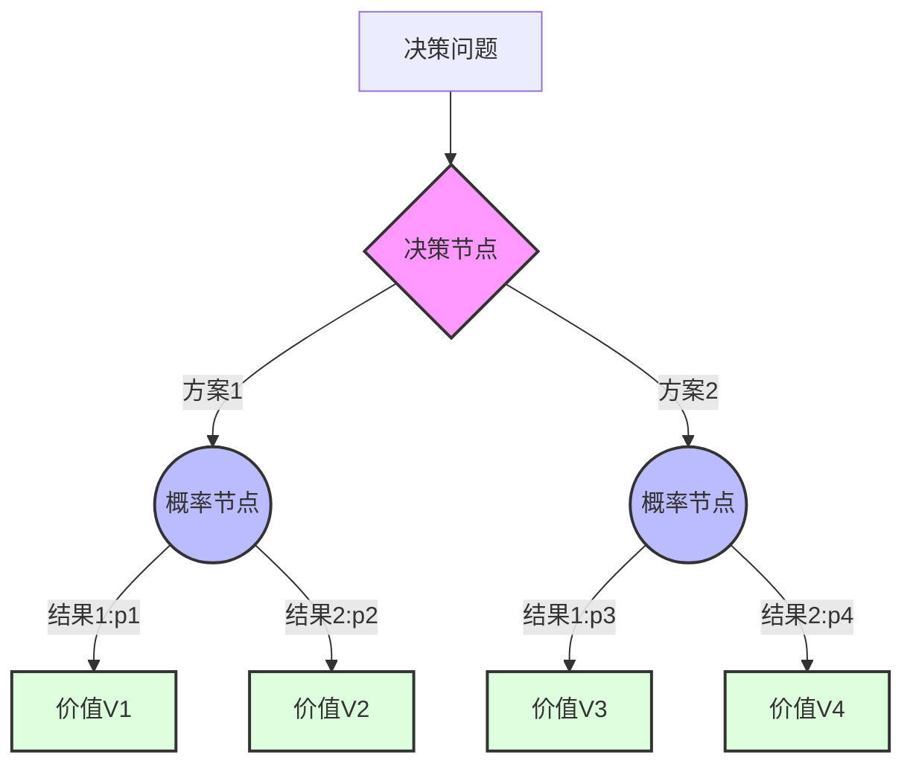
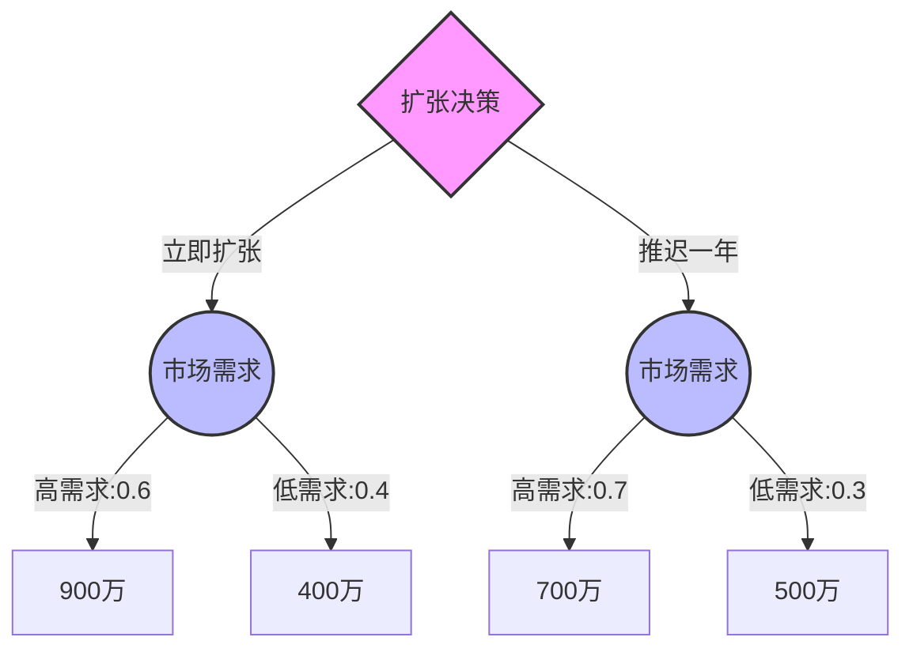

---
{"tags":["财务BP","决策树分析","决策方法","风险评估"],"aliases":["决策树模型","决策分支分析"],"created":"2023-11-16","dg-publish":true,"permalink":"/知识共享/001_财务/01_财务BP/01_学习内容/06_BP工具与模板/基础方法/决策树分析方法/","dgPassFrontmatter":true}
---


# 决策树分析方法

## 概述

决策树分析是财务BP工作中进行多阶段决策评估的重要工具，通过树状图形化表示决策过程、不确定事件及其后果，帮助决策者系统性地识别、分析和选择最优方案。本文详细介绍决策树分析的基本概念、构建方法、应用场景及典型案例，并提供实用工具模板和最佳实践指南，帮助财务BP更有效地支持企业在不确定环境下的决策制定。

## 基本概念

### 决策树定义

决策树是一种图形化的决策支持工具，以树状结构展示决策问题中的决策点、不确定事件、概率和结果。其主要组成要素包括：

- **决策节点**：表示决策者可以选择的不同方案（通常用方形表示）
- **概率节点**：表示不确定事件及其可能的结果（通常用圆形表示）
- **结果节点**：表示最终结果或收益（通常用三角形表示）
- **分支**：连接各节点，表示决策路径或事件发生
- **概率值**：标注在概率分支上，表示该事件发生的可能性
- **结果值**：标注在结果节点上，表示最终的价值或收益

### 决策树的目的与优势

**目的：**
- 系统化思考多阶段决策问题
- 量化不确定性对决策的影响
- 识别和评估不同决策路径
- 计算期望价值支持最优决策

**优势：**
- 结构化展示复杂决策
- 直观可视化决策逻辑
- 整合概率评估与价值判断
- 支持敏感性分析和情景规划
- 提供清晰的决策依据和沟通工具

### 决策树基本框架



## 决策树构建方法

### 构建步骤

1. **明确决策问题**
   - 界定决策目标和评估标准
   - 确定决策时间跨度和范围
   - 明确决策的约束条件

2. **识别决策方案**
   - 列出所有可行的决策选项
   - 确保方案互斥且完备
   - 评估每个方案的可行性

3. **确定不确定事件**
   - 识别影响决策结果的关键不确定因素
   - 为每个不确定事件定义可能的结果集
   - 确保事件结果互斥且完备

4. **估计概率**
   - 基于历史数据、专家判断或模型分析估计概率
   - 确保每组概率分支和为1
   - 必要时进行概率校准

5. **计算结果值**
   - 确定每条路径的最终结果
   - 基于决策目标量化结果（如NPV、利润等）
   - 考虑时间价值和风险调整

6. **分析与求解**
   - 从右向左计算期望值
   - 在每个决策节点选择期望值最高的方案
   - 确定最优决策路径

### 构建技巧

- **适当精简**：控制决策树规模，避免过度复杂
- **分层处理**：对复杂问题可采用分层决策树
- **注重结构**：确保逻辑结构清晰，节点层次分明
- **关注关键点**：聚焦影响决策的关键不确定因素
- **迭代优化**：基于反馈和新信息不断优化决策树

### 核心计算公式

**期望值计算**：
- 概率节点的期望值 = Σ(各结果的值 × 对应的概率)
- 决策节点的值 = 各方案期望值中的最大值

**风险调整**：
- 风险调整后的期望值 = 原期望值 - 风险调整项
- 风险调整项可通过效用函数或风险溢价方法确定

## 决策树应用方法

### 基础应用：单阶段决策

**适用场景**：
- 投资项目Go/No-Go决策
- 新产品开发决策
- 资源配置决策

**实施要点**：
- 明确备选方案
- 识别关键不确定因素
- 评估各种结果的价值
- 计算期望收益

**示例**：
某企业面临市场扩张决策，可选择立即扩张或推迟一年，关键不确定因素是市场需求（高/低）。



### 高级应用：多阶段决策

**适用场景**：
- 分阶段投资决策
- 研发项目里程碑决策
- 战略调整决策

**实施要点**：
- 识别关键决策时点
- 考虑决策间的依赖关系
- 评估中间信息的价值
- 规划条件性决策路径

**示例**：
药品研发项目，包含临床前、临床I期、临床II期、临床III期和上市阶段，每个阶段结束后可决定继续或放弃。

### 信息价值分析

**概念**：
评估获取额外信息对改进决策的价值，判断是否值得投资于信息收集。

**计算方法**：
- 完美信息价值(EVPI) = 完美信息下的期望收益 - 当前信息下的期望收益
- 样本信息价值(EVSI) = 样本信息下的期望收益 - 当前信息下的期望收益

**应用场景**：
- 市场调研决策
- 试点项目设计
- 专家咨询投入评估

## 决策树工具与模板

### Excel决策树模板

**基础模板功能**：
- 决策树结构定义
- 概率和价值输入
- 期望值自动计算
- 最优路径标识
- 敏感性分析支持

**使用步骤**：
1. 在"结构定义"工作表中设置决策树结构
2. 在"概率输入"工作表中填入各事件概率
3. 在"价值设定"工作表中输入各结果节点价值
4. 查看"计算结果"工作表获取期望值和最优路径
5. 使用"敏感性分析"工作表测试参数变化影响

**下载链接**：[Excel决策树基础模板](链接到模板库)

### 专业决策树软件

**推荐工具**：
1. **TreePlan**：Excel插件，简单实用
2. **Precision Tree**：专业决策分析软件，功能全面
3. **TreeAge Pro**：医疗和健康经济学常用工具
4. **SmartDraw**：图形化决策树设计工具
5. **yEd Graph Editor**：免费图形编辑器，支持决策树

**选择考虑因素**：
- 分析复杂度
- 可视化需求
- 与现有工具集成
- 用户技术水平
- 预算限制

### 决策树可视化最佳实践

**排版原则**：
- 从左到右展示决策流程
- 保持层次清晰
- 使用一致的符号和颜色
- 标注关键信息

**信息展示**：
- 在分支上清晰标注决策选项或事件结果
- 在概率分支上标注概率值
- 在结果节点上标注最终价值
- 在关键节点上标注期望值

**设计技巧**：
- 使用颜色区分不同类型节点
- 粗体标注最优路径
- 添加注释说明关键假设
- 适当简化复杂结构

## 行业应用案例

### 案例一：制药企业研发投资决策

**企业背景**：
某中型制药企业拟投资一款新药研发项目，需要系统评估投资风险和回报。

**决策树应用**：
1. **问题结构化**
   - 分阶段投资决策：前期研究、临床试验、生产上市
   - 关键不确定因素：技术可行性、临床效果、市场接受度
   - 决策选项：立即全额投资、分阶段投资、放弃投资

2. **决策树构建**
   ```mermaid
   graph TD
      A{投资决策} -->|全额投资| B((技术成功))
      A -->|分阶段投资| E{第一阶段}
      A -->|放弃| Z[0]
      B -->|成功:0.6| C((临床结果))
      B -->|失败:0.4| D[-8000万]
      C -->|理想:0.3| I[+3亿]
      C -->|一般:0.5| J[+1.2亿]
      C -->|差:0.2| K[-1亿]
      E -->|投资| F((早期结果))
      E -->|放弃| Y[0]
      F -->|积极:0.7| G{继续投资}
      F -->|消极:0.3| H[-2000万]
      G -->|继续| AA((后期结果))
      G -->|放弃| BB[-2000万]
      AA -->|成功:0.8| CC[+2亿]
      AA -->|失败:0.2| DD[-9000万]
   ```

3. **概率估计**
   - 基于历史研发数据和专家评估
   - 根据类似药物开发经验调整
   - 考虑项目特定风险因素

4. **价值计算**
   - 使用风险调整后的NPV
   - 考虑各阶段的投资需求和时间价值
   - 包含战略价值和选择权价值

5. **分析结果**
   - 分阶段投资期望值最高(+5430万)
   - 全额投资次之(+4200万)
   - 确定了关键决策点和触发条件

**决策支持**：
- 建议采用分阶段投资策略
- 设计基于早期试验结果的决策标准
- 建立监控关键不确定因素的机制
- 制定风险缓解计划

### 案例二：零售企业市场扩张决策

**企业背景**：
某零售连锁企业考虑将业务扩展到新地区，面临市场选择和扩张方式决策。

**决策树应用**：
1. **问题结构化**
   - 市场选择：A市、B市或两市同时
   - 扩张方式：自建、收购或合作
   - 关键不确定因素：消费者接受度、竞争反应、政策环境

2. **决策树构建**
   - 第一层：市场选择决策
   - 第二层：各市场的扩张方式决策
   - 不确定节点：市场反应情况
   - 结果计算：5年累计利润现值

3. **分析结果**
   - 先进入A市，采用合作方式期望值最高
   - 成功后再考虑B市扩张
   - 识别了市场测试的关键价值

**决策支持**：
- 制定了分阶段市场进入策略
- 设计了基于市场反馈的扩张调整机制
- 建立了与当地合作伙伴的风险共担机制
- 设定了扩张暂停或加速的触发指标

## 在财务BP工作中的应用

### 预算规划与资源分配

**应用场景**：
- 年度预算规划中的资源优先分配
- 各部门投资预算决策
- 成本控制策略选择

**实施方法**：
1. 构建资源分配决策树
2. 评估不同分配方案的财务影响
3. 考虑业务不确定性对预算执行的影响
4. 设计基于业绩达成的预算调整机制

**效益**：
- 提高资源分配合理性
- 增强预算对环境变化的适应性
- 明确预算调整的决策标准
- 提升跨部门资源协调效率

### 风险分析与管理

**应用场景**：
- 识别和量化关键业务风险
- 评估不同风险缓解策略的成本效益
- 设计风险监控指标和应对方案

**实施方法**：
1. 构建风险事件决策树
2. 预估各风险事件概率和影响
3. 评估不同应对策略的期望收益
4. 确定最优风险管理组合

**关注要点**：
- 风险相关性分析
- 低概率高影响事件特别关注
- 风险缓解成本效益评估
- 风险预警指标设计

### 战略财务规划

**应用场景**：
- 长期投资组合决策
- 业务转型路径规划
- 并购与剥离决策

**实施方法**：
1. 构建多阶段战略决策树
2. 评估各战略路径财务影响
3. 识别关键战略决策点
4. 设计战略实施里程碑

**效益**：
- 提高战略规划结构化程度
- 增强战略执行的灵活性
- 明确战略调整的触发条件
- 提升战略沟通有效性

## 决策树分析最佳实践

### 构建高质量决策树

**问题定义**：
- 清晰界定决策目标和范围
- 确保决策问题的结构完整
- 明确评估标准和决策约束

**概率估计**：
- 结合定量分析和专家判断
- 避免常见概率偏差
- 使用概率校准技术
- 必要时采用贝叶斯方法更新概率

**价值评估**：
- 使用一致的价值度量标准
- 考虑时间价值和风险调整
- 纳入非财务因素的影响
- 透明记录价值计算假设

### 决策树分析陷阱与应对

| 陷阱 | 表现 | 应对策略 |
|------|------|---------|
| 过度复杂化 | 决策树分支过多，难以管理 | 聚焦关键不确定因素，适当简化结构 |
| 概率偏差 | 主观概率估计不准确 | 采用结构化概率评估方法，交叉验证 |
| 分支不完整 | 忽略重要选项或结果 | 系统性检查，确保互斥且完备 |
| 时间依赖忽视 | 未考虑决策时序对结果的影响 | 明确标注时间点，考虑时间价值 |
| 价值评估不一致 | 不同分支使用不同评估标准 | 建立统一的价值评估框架 |

### 与其他决策工具的整合

**与敏感性分析整合**：
- 识别关键概率和价值参数
- 测试参数变化对最优决策的影响
- 确定决策稳健性和临界参数值

**与实物期权分析整合**：
- 显式建模管理灵活性价值
- 评估推迟、扩展或放弃选项价值
- 设计最优期权执行标准

**与Monte Carlo模拟整合**：
- 处理连续变量和复杂概率分布
- 生成更丰富的结果分布信息
- 提供更全面的风险评估

## 总结与展望

### 关键成功因素

- **结构化思维**：系统化拆解决策问题
- **数据支持**：以数据和分析支持概率和价值评估
- **团队协作**：跨职能团队共同构建决策模型
- **持续优化**：基于新信息不断更新决策树
- **工具支持**：选择适当工具提高分析效率

### 决策树分析趋势

- 与人工智能和机器学习的结合
- 更复杂决策环境下的应用拓展
- 动态决策树与实时数据更新
- 集成不确定性和模糊性的高级方法
- 交互式可视化决策支持系统

## 相关链接

- [[知识共享/001_财务/01_财务BP/01_学习内容/06_BP工具与模板/基础方法/敏感性分析工具\|知识共享/001_财务/01_财务BP/01_学习内容/06_BP工具与模板/基础方法/敏感性分析工具]]
- [[知识共享/001_财务/01_财务BP/01_学习内容/06_BP工具与模板/基础方法/Monte Carlo模拟工具\|知识共享/001_财务/01_财务BP/01_学习内容/06_BP工具与模板/基础方法/Monte Carlo模拟工具]]
- [[知识共享/001_财务/01_财务BP/01_学习内容/06_BP工具与模板/财务建模/财务建模最佳实践\|财务建模最佳实践]]
- [[风险评估指南\|风险评估指南]]

## 参考文献

1. Clemen, R.T., & Reilly, T. (2018). 《Making Hard Decisions with DecisionTools》, 3rd Edition. Cengage Learning.
2. Raiffa, H. (2015). 《决策分析：实用决策理论与思维》. 机械工业出版社.
3. Howard, R.A., & Abbas, A.E. (2019). 《Foundations of Decision Analysis》. Pearson.
4. 刘志华. (2020). 《企业投资决策中决策树方法的应用》. 经济管理研究, 15(4), 112-125.
5. 王静. (2021). 《不确定环境下的分阶段投资决策模型研究》. 管理科学学报, 24(6), 79-93.
6. Goodwin, P., & Wright, G. (2019). 《Decision Analysis for Management Judgment》, 5th Edition. Wiley. 