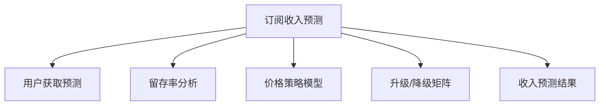
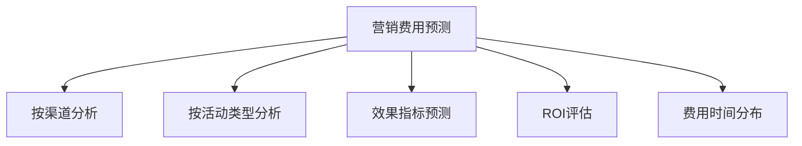
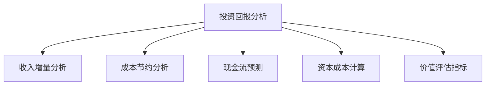
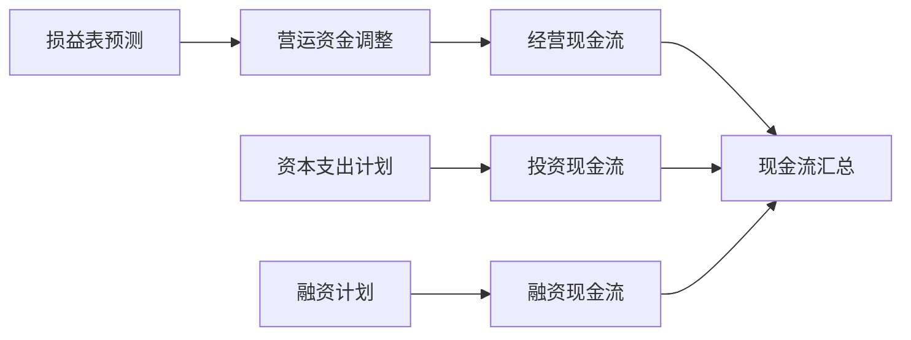
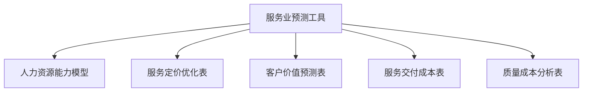
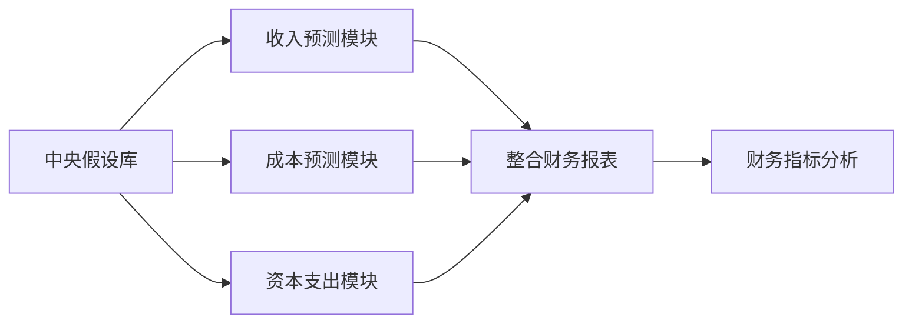
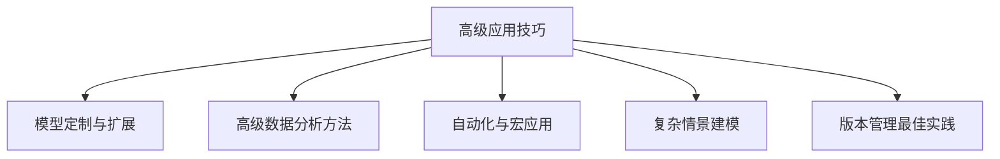
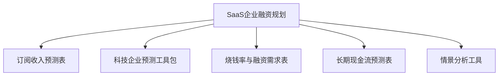

---
{"tags":["财务BP","预测工具","表格库","财务模板","Excel模型"],"aliases":["财务预测表格","BP工作表格","预算模板集"],"created":"2024-03-20","dg-publish":true,"permalink":"/知识共享/001_财务/01_财务BP/01_学习内容/06_BP工具与模板/基础模板/BP预测工具表格库/","dgPassFrontmatter":true}
---

# BP预测工具表格库

> [!abstract] 概述
> 本文档提供财务BP工作中常用的预测工具表格库，包括收入预测、成本预测、现金流预测等多种标准化模板，以及各行业定制模板。这些工具表格经过精心设计，既可作为独立工具使用，也可整合为完整的预测系统，帮助财务BP提高工作效率和预测准确性。

## 一、收入预测工具

### 1. 销售收入预测表

**适用场景**：适用于销售型企业的收入预测，可按产品线、地区、客户等多维度进行预测。

**表格结构**：
- **销售历史数据**：按月/季度展示过去12-24个月的销售数据
- **趋势分析区**：自动计算同比/环比增长率和季节性指数
- **假设参数区**：设置增长率、促销影响、价格变动等关键假设
- **预测结果区**：按月/季度展示未来12-24个月的销售预测
- **情景分析**：包含乐观、中性、保守三种情景的预测结果

**核心功能**：
- 多维度销售分解（产品、渠道、区域）
- 季节性因素自动计算和应用
- 价格与数量分别预测
- 趋势线预测与人工调整相结合
- 同比/环比增长率自动计算

**使用方法**：
1. 导入历史销售数据
2. 设置关键假设参数
3. 审核自动生成的初步预测
4. 根据业务理解进行手动调整
5. 查看不同情景下的预测结果

### 2. 订阅收入预测表

**适用场景**：适用于采用订阅模式的企业，如SaaS、会员服务等。

**表格结构**：

**核心功能**：
- 用户获取预测（按渠道、类型）
- 月度/年度留存率计算
- 用户生命周期价值(LTV)计算
- 升级/降级路径分析
- 按计费周期（月度/年度/多年）分析
- 延迟确认收入计算

**使用方法**：
1. 导入用户获取和留存历史数据
2. 设置获客预测和留存率假设
3. 配置产品价格和升级路径
4. 生成订阅收入预测
5. 调整关键假设进行敏感性分析

### 3. 项目收入预测表

**适用场景**：适用于项目制企业，如咨询、工程、定制开发等。

**表格结构**：
- **项目库**：包含已签约和潜在项目清单
- **概率加权区**：根据签约概率计算收入
- **项目时间线**：展示各项目的执行周期和收入确认时间
- **人力资源分配**：项目所需资源与收入的匹配
- **预测汇总**：按月/季度汇总项目收入预测

**核心功能**：
- 项目赢率分析和收入概率加权
- 项目执行周期与收入确认匹配
- 人力资源能力与收入上限匹配
- 新项目获取预测
- 项目延期/提前完成场景分析

**使用方法**：
1. 维护项目库信息（状态、金额、概率）
2. 设置项目执行与收入确认时间表
3. 审核资源分配与收入匹配
4. 生成加权收入预测
5. 分析项目组合风险与机会

## 二、成本预测工具

### 1. 人力成本预测表

**适用场景**：适用于预测企业人力资源成本，包括工资、奖金、福利、社保等。

**表格结构**：
- **人员编制表**：按部门/职级展示现有和计划人员配置
- **薪酬结构表**：展示各类薪酬组成和比例
- **调薪计划**：按时间和类别设置调薪计划
- **招聘计划**：新增人员的时间和成本估算
- **人力成本汇总**：按月/季度展示人力成本预测

**核心功能**：
- 基本工资、奖金、福利、社保等全成本计算
- 调薪时间和比例的灵活设置
- 新增人员的入职时间和成本预测
- 员工离职率假设和影响计算
- 部门和整体人力成本汇总

**使用方法**：
1. 导入现有人员和薪酬数据
2. 设置招聘计划和调薪假设
3. 配置奖金和福利计算规则
4. 生成人力成本预测
5. 调整不同增长场景下的人员编制

### 2. 营销费用预测表

**适用场景**：适用于预测企业的营销和广告支出。

**表格结构**：

**核心功能**：
- 按营销渠道分配预算
- 营销活动日历和费用分布
- 营销效果指标预测（CAC、转化率等）
- 营销ROI计算和优化
- 固定费用与弹性费用分离
- 与收入关联的营销费率设定

**使用方法**：
1. 设置营销预算总额或销售收入比例
2. 按渠道和活动类型分配预算
3. 设置效果指标目标和假设
4. 优化ROI和预算分配
5. 确定最终的营销费用预测

### 3. 运营成本预测表

**适用场景**：适用于预测企业日常运营支出，如办公、差旅、IT等费用。

**表格结构**：
- **费用分类表**：按成本类型和部门划分的费用结构
- **增长模型**：各类费用的增长驱动因素和模型
- **季节性分布**：费用在年内的分配模式
- **一次性费用**：非经常性支出的计划和预测
- **成本汇总表**：按月/季度展示各类运营成本

**核心功能**：
- 固定成本与变动成本分离
- 基于员工人数的成本自动计算
- 基于业务量的成本弹性计算
- 一次性费用和周期性费用区分
- 成本控制目标与实际对比

**使用方法**：
1. 设置各类成本的基准金额
2. 配置成本驱动因素和增长模型
3. 设置季节性分布模式
4. 添加计划中的一次性支出
5. 生成综合运营成本预测

## 三、资本支出与投资预测

### 1. 资本支出规划表

**适用场景**：适用于预测企业的固定资产投资和其他资本性支出。

**表格结构**：
- **资产分类表**：按资产类型和用途分类
- **项目清单**：资本项目明细和时间表
- **折旧计算表**：自动计算新增资产折旧
- **维护支出**：现有资产的维护和更新计划
- **资本支出汇总**：按月/季度显示资本支出计划

**核心功能**：
- 详细的资本项目规划和跟踪
- 多种折旧方法选择和计算
- 资产报废和处置计划
- 维护和更新周期管理
- 资本支出的审批状态跟踪

**使用方法**：
1. 录入资本项目计划和预算
2. 设置资产折旧参数和方法
3. 规划维护和更新时间表
4. 生成资本支出和折旧预测
5. 评估不同投资组合的财务影响

### 2. 投资回报分析表

**适用场景**：适用于评估重大投资项目的财务回报和价值。

**表格结构**：

**核心功能**：
- 项目收入和成本的增量分析
- 详细的现金流预测（5-10年）
- 多种投资回报指标计算（ROI、IRR、NPV）
- 投资回收期计算
- 敏感性分析和蒙特卡洛模拟
- 不同融资方案的影响比较

**使用方法**：
1. 定义项目范围和预期收益
2. 设置投资额和时间安排
3. 预测项目现金流
4. 计算回报指标和投资价值
5. 进行敏感性分析和情景评估

## 四、现金流预测工具

### 1. 短期现金流预测表

**适用场景**：适用于预测企业3-6个月的详细现金流，用于流动性管理。

**表格结构**：
- **每日/每周现金结余**：详细的短期现金流预测
- **应收账款明细**：客户付款计划和历史模式
- **应付账款明细**：供应商付款计划和优先级
- **其他收付款项**：税费、工资、租金等固定支出
- **资金缺口分析**：识别现金短缺时间和金额

**核心功能**：
- 应收账款账龄和预期收款模式
- 应付账款支付计划和优先级设置
- 薪资、税费等周期性支出安排
- 信贷额度和短期融资方案
- 现金余额日/周预测和预警

**使用方法**：
1. 导入当前现金余额和未结应收应付
2. 设置收付款周期和模式
3. 安排固定支出时间表
4. 生成滚动现金流预测
5. 识别并解决潜在的资金缺口

### 2. 长期现金流预测表

**适用场景**：适用于预测企业1-3年的现金流，用于战略决策和融资规划。

**表格结构**：
- **经营现金流预测**：基于损益表和营运资金变动
- **投资现金流预测**：资本支出和投资计划
- **融资现金流预测**：借款、还款和股权融资计划
- **现金流缺口分析**：长期资金需求评估
- **自由现金流预测**：股东可分配现金流计算

**核心功能**：

**使用方法**：
1. 导入损益表预测和资产负债表预测
2. 设置营运资金周转率假设
3. 输入资本支出和投资计划
4. 规划融资和还款安排
5. 生成长期现金流预测和敏感性分析

### 3. 资金需求预测表

**适用场景**：适用于预测企业未来的资金需求和融资时机。

**表格结构**：
- **业务增长资金需求**：因业务增长产生的资金需求
- **资本支出资金需求**：因固定资产投资产生的资金需求
- **债务偿还需求**：现有债务的偿还计划
- **资金来源分析**：内部现金流和外部融资来源
- **融资方案比较**：不同融资方案的成本和影响

**核心功能**：
- 预测不同增长率下的资金需求
- 计算资金缺口出现的时间和规模
- 分析不同融资方案的成本和风险
- 优化融资时机和金额
- 债务结构和偿付能力分析

**使用方法**：
1. 输入业务增长和资本支出计划
2. 设置营运资金比率和资金周转效率
3. 加入现有债务偿还计划
4. 分析内部资金生成能力
5. 确定外部融资需求和最佳方案

## 五、财务报表预测工具

### 1. 综合损益表预测工具

**适用场景**：适用于预测企业未来的损益表，包括收入、成本、费用和利润。

**表格结构**：
- **收入预测区**：集成销售收入预测结果
- **成本预测区**：集成各类成本预测结果
- **费用预测区**：集成各类费用预测结果
- **税费计算区**：根据适用税率自动计算税费
- **利润预测区**：显示毛利、营业利润和净利润预测

**核心功能**：
- 集成收入和成本子模块的预测结果
- 固定成本和变动成本分离分析
- 不同利润层级的预测和分析
- 利润率趋势和同比分析
- 情景分析和敏感性测试

**使用方法**：
1. 关联各收入和成本子表的数据
2. 设置费用率和增长假设
3. 配置税率和其他财务参数
4. 生成综合损益表预测
5. 分析不同情景对利润的影响

### 2. 资产负债表预测工具

**适用场景**：适用于预测企业未来的资产负债表，展示财务状况变化。

**表格结构**：

**核心功能**：
- 基于损益表和业务驱动因素预测资产负债项目
- 应收账款、存货等营运资金项目的周转率分析
- 固定资产增减变动和折旧累计计算
- 债务结构和偿还计划模拟
- 股东权益变动预测
- 自动平衡和检查机制

**使用方法**：
1. 导入损益表预测和期初资产负债表
2. 设置营运资金周转率假设
3. 关联资本支出和折旧计划
4. 配置融资计划和股利政策
5. 生成预测资产负债表并分析结构变化

### 3. 财务指标预测工具

**适用场景**：适用于预测和分析企业的关键财务指标和比率。

**表格结构**：
- **盈利能力指标**：毛利率、净利率、ROE、ROA等
- **营运效率指标**：资产周转率、存货周转率等
- **偿债能力指标**：流动比率、资产负债率等
- **增长指标**：收入增长率、利润增长率等
- **估值相关指标**：EPS、P/E倍数、企业价值等

**核心功能**：
- 自动计算关键财务指标和比率
- 历史趋势对比和同业基准比较
- 杜邦分析和价值驱动因素分解
- 指标预警和目标跟踪
- 图表可视化和报告生成

**使用方法**：
1. 关联预测的损益表和资产负债表
2. 选择需要监控的关键指标
3. 设置指标目标值和警戒线
4. 分析指标趋势和驱动因素
5. 生成财务指标分析报告

## 六、行业专用预测工具

### 1. 制造业预测工具包

**适用场景**：适用于制造业企业的财务预测和分析。

**核心工具表格**：
- **产能利用率与收入模型**：基于产能利用率预测收入
- **原材料成本预测表**：材料价格和用量的预测模型
- **存货优化模型**：平衡库存成本和服务水平的预测
- **生产成本分析表**：单位产品成本构成和变动分析
- **供应链财务影响模型**：供应链变动对财务的影响预测

**特色功能**：
- 产能约束下的收入上限计算
- 原材料价格波动的敏感性分析
- BOM成本结构分析和优化
- 库存水平与现金流的平衡分析
- 制造效率提升的财务影响模拟

### 2. 服务业预测工具包

**适用场景**：适用于服务型企业的财务预测和分析。

**核心工具表格**：

**特色功能**：
- 基于人力配置的服务能力上限计算
- 服务组合优化和定价策略分析
- 客户获取成本和生命周期价值计算
- 服务效率与质量的财务影响分析
- 固定与可变服务成本分离和优化

### 3. 科技企业预测工具包

**适用场景**：适用于科技型企业的财务预测和分析。

**核心工具表格**：
- **用户增长模型**：用户获取、活跃度和留存的预测
- **研发投入回报模型**：研发支出与产品收入的关联预测
- **SaaS指标预测表**：MRR、CAC、LTV等SaaS关键指标预测
- **烧钱率与融资需求表**：资金消耗率和融资时点预测
- **快速增长情景模型**：高增长环境下的财务预测

**特色功能**：
- 非线性增长模式建模和预测
- 用户经济学指标计算和优化
- 研发资本化与费用化的财务影响
- 烧钱率与现金跑道计算
- 融资轮次和稀释效应模拟

### 4. 零售企业预测工具包

**适用场景**：适用于零售企业的财务预测和分析。

**核心工具表格**：
- **商品组合规划表**：SKU级别的销售和毛利预测
- **门店绩效预测表**：按门店和区域的销售预测
- **促销效果预测表**：促销活动的销售提升和毛利影响
- **季节性库存计划**：季节性需求波动下的库存规划
- **全渠道销售预测**：线上线下各渠道的销售整合预测

**特色功能**：
- 按产品类别和SKU的精细化预测
- 促销活动的财务影响模拟
- 新店开业和成熟期分析
- 季节性销售模式的库存优化
- 渠道组合和渠道转换的财务分析

## 七、预测模型整合与优化

### 1. 预测模型集成框架

**功能描述**：将各单项预测工具整合为完整的预测系统，保持数据一致性和逻辑关联。

**关键组件**：
- **中央假设库**：统一管理所有预测模型的关键假设
- **模型关联图**：展示各预测模型间的数据流和依赖关系
- **数据一致性检查**：自动检查各模型间的数据一致性
- **整合报表生成器**：基于各模块输出生成完整财务预测
- **版本控制系统**：管理预测模型的不同版本和情景

**使用方法**：

### 2. 预测准确性优化工具

**功能描述**：通过历史数据分析和方法比较提高预测准确性。

**关键组件**：
- **预测误差分析**：计算和分析历史预测与实际的偏差
- **预测方法比较**：不同预测方法的准确性对比
- **预测偏差校正**：基于历史偏差模式自动校正预测
- **混合预测引擎**：组合多种预测方法提高准确性
- **预测准确性跟踪**：跟踪记录预测准确性的改进情况

**使用方法**：
1. 导入历史预测数据和实际结果
2. 分析不同预测方法的误差模式
3. 调整预测方法和参数
4. 应用偏差校正系数
5. 持续跟踪和改进预测准确性

### 3. 敏感性与情景分析工具

**功能描述**：评估关键假设变化对预测结果的影响，进行全面的情景分析。

**关键组件**：
- **关键变量识别**：确定对结果影响最大的变量
- **单变量敏感性分析**：单一变量变动的影响计算
- **多变量情景分析**：预定义组合情景的影响分析
- **蒙特卡洛模拟**：基于变量分布的随机模拟分析
- **破产点分析**：识别导致财务困境的临界变量值

**使用方法**：
1. 选择需要分析的关键变量
2. 设置变量变动范围和步长
3. 运行单变量和多变量敏感性分析
4. 定义和分析典型情景
5. 识别风险点和关键变量的影响程度

## 八、预测工具使用指南

### 1. 快速入门指南

**目标用户**：初次使用预测工具的财务BP

**内容概要**：
- 预测工具库整体结构和逻辑关系
- 常用预测表格的基本使用流程
- 数据导入和参数设置指引
- 结果查看和解释方法
- 常见问题排查和解决方案

**应用步骤**：
1. 确定预测目的和范围
2. 选择适合的预测工具模板
3. 收集必要的历史数据和假设
4. 按步骤完成预测流程
5. 解读结果并进行基本分析

### 2. 高级应用技巧

**目标用户**：有经验的财务BP，需要进行复杂预测和分析

**内容概要**：

**应用技巧**：
- 针对特定业务需求定制预测模型
- 利用高级数据分析增强预测能力
- 使用宏和自动化提高工作效率
- 构建跨模型的复杂情景分析
- 有效管理多版本预测和假设集

### 3. 预测工具维护指南

**目标用户**：负责维护和更新预测工具的财务BP

**内容概要**：
- 预测模型的定期更新和校准流程
- 模型结构和公式的维护注意事项
- 版本控制和变更管理最佳实践
- 模型文档和用户培训建议
- 模型质量检查和性能优化方法

**维护步骤**：
1. 定期验证预测准确性和模型有效性
2. 根据业务变化更新模型结构和假设
3. 优化公式和计算以提高性能
4. 完善模型文档和使用指南
5. 培训用户并收集反馈持续改进

## 九、案例应用

### 案例1：制造企业年度预算预测

**企业背景**：某中型制造企业，年收入5亿元，产品线覆盖三大类别，销售渠道包括直销和经销。

**应用工具**：
- 产品线销售收入预测表
- 原材料成本预测表
- 产能利用率模型
- 人力成本预测表
- 综合财务报表预测工具

**应用过程**：
1. 根据产品线和渠道结构设置销售预测模型
2. 基于产能约束和市场需求预测产量和销量
3. 结合原材料价格趋势预测生产成本
4. 根据生产和销售计划制定人力资源预算
5. 整合各模块预测生成完整财务预测

**成效与启示**：
- 预测准确度较传统方法提高25%
- 识别出产能瓶颈对销售增长的限制
- 发现材料价格波动对利润的显著影响
- 优化产品组合增加整体毛利率3%
- 为设备更新投资决策提供可靠依据

### 案例2：SaaS企业融资规划

**企业背景**：一家成长期SaaS企业，ARR(年度经常性收入)2000万元，年增长率80%，计划新一轮融资。

**应用工具**：

**应用过程**：
1. 使用订阅收入预测表建立用户增长和收入模型
2. 应用烧钱率模型分析资金消耗速度
3. 预测不同增长情景下的资金需求
4. 测算最佳融资规模和时机
5. 准备融资路演所需的财务预测

**成效与启示**：
- 精确预测了18个月的现金跑道
- 确定最佳融资时点提前3个月
- 通过情景分析优化融资规模
- 为投资者提供了具说服力的增长路径
- 建立起规律性的财务预测和监控机制

## 十、持续更新计划

### 最新更新内容

**最近更新**：2024年3月20日

**更新内容**：
- 新增跨国企业汇率影响预测模型
- 优化SaaS企业订阅收入预测精确度
- 增强资本支出规划表的审批流程跟踪
- 改进敏感性分析工具的可视化展示
- 更新制造业工具包适应供应链新特点

### 技术改进方向

**近期计划改进**：
- 增加数据可视化仪表板元素
- 提高大数据量下的计算性能
- 加强模型间的自动数据同步
- 增添基于历史数据的自动预测功能
- 优化移动设备使用体验

**中长期发展方向**：
- 整合机器学习算法提高预测准确性
- 开发云端协作版本支持团队远程工作
- 构建API接口便于与其他系统集成
- 增加自然语言处理实现智能报告生成
- 发展基于数字孪生的高级模拟能力

### 使用反馈与改进建议

**收集反馈渠道**：
- BP工具使用调查问卷
- 使用过程问题和建议记录表
- 季度工具评估会议
- 实际应用效果跟踪报告
- 行业最佳实践对标分析

**如何提交改进建议**：
1. 填写《BP工具改进建议表》
2. 发送至BP工具维护小组邮箱
3. 在季度评估会议中提出
4. 通过内部知识管理平台提交
5. 参与BP工具创新工作坊

## 相关链接

- [[知识共享/001_财务/01_财务BP/01_学习内容/06_BP工具与模板/财务建模/财务建模最佳实践\|财务建模最佳实践]]
- [[知识共享/001_财务/01_财务BP/01_学习内容/06_BP工具与模板/基础模板/BP财务预测方法\|知识共享/001_财务/01_财务BP/01_学习内容/06_BP工具与模板/基础模板/BP财务预测方法]]
- [[财务BP沟通技巧\|财务BP沟通技巧]]
- [[知识共享/001_财务/01_财务BP/01_学习内容/06_BP工具与模板/财务建模/常见预测错误及规避\|知识共享/001_财务/01_财务BP/01_学习内容/06_BP工具与模板/财务建模/常见预测错误及规避]]
- [[数据可视化最佳实践\|数据可视化最佳实践]]

## 参考文献

1. Jelen, B., & Alexander, M. (2019). *Excel 2019 Pivot Table Data Crunching*. Que Publishing.
2. Beninga, S. (2014). *Financial Modeling*. MIT Press.
3. Tjia, J. S. (2009). *Building Financial Models*. McGraw-Hill.
4. Proctor, K. S. (2016). *Building Financial Models with Microsoft Excel: A Guide for Business Professionals*. Wiley.
5. 《高效财务建模与预测》，李明，中国财政经济出版社，2020.
6. 《Excel在企业预算中的应用》，张勇，机械工业出版社，2018.
7. 《SaaS企业财务规划全指南》，王健，电子工业出版社，2021. 