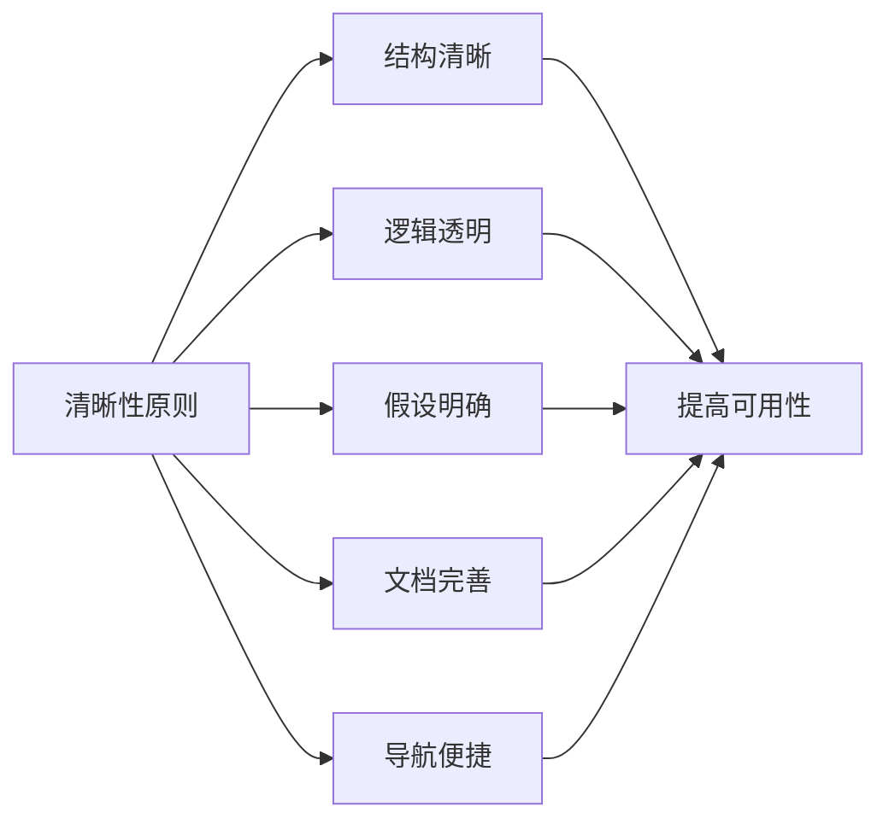
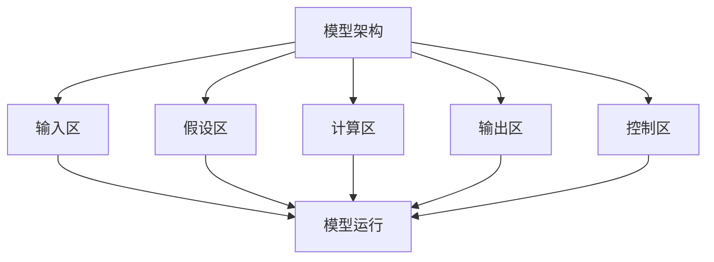
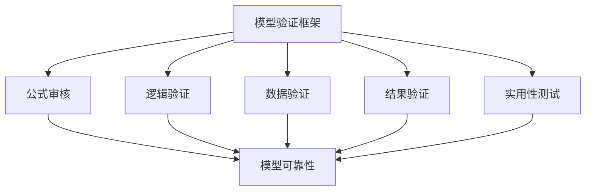
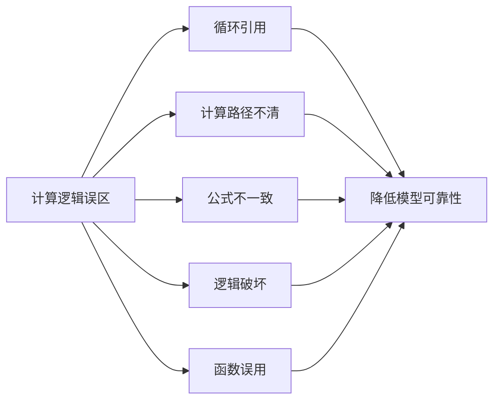
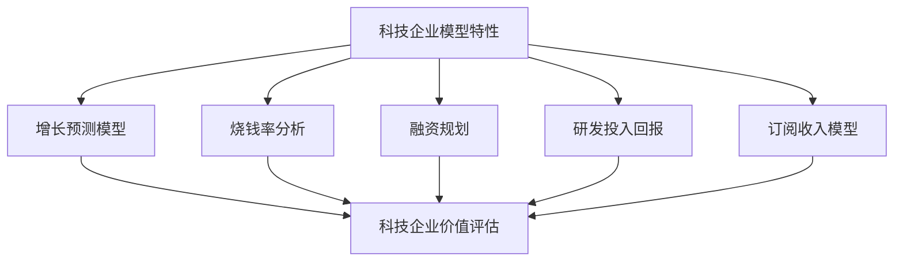

---
{"tags":["财务BP","财务建模","模型设计","最佳实践","财务分析"],"aliases":["财务模型原则","模型设计指南"],"created":"2024-03-20","dg-publish":true,"permalink":"/知识共享/001_财务/01_财务BP/01_学习内容/06_BP工具与模板/财务建模/财务模型设计原则/","dgPassFrontmatter":true}
---

# 财务模型设计原则

> [!abstract] 概述
> 本文档详细介绍财务模型设计的核心原则、最佳实践和指导方针。财务模型是财务BP工作的基础工具，其设计质量直接影响决策的准确性和效率。本文讨论了财务模型设计的基本原则、结构化方法、验证技术以及常见误区，旨在帮助财务专业人员创建高质量、可靠的财务模型。

## 一、财务模型设计的基本原则

### 1. 目的导向原则
- **明确模型目标**：模型设计应始终服务于特定业务目标
- **用户需求为中心**：根据用户需求和决策场景设计模型
- **适度复杂度**：模型复杂度应与决策重要性相匹配
- **可扩展性**：预留未来扩展的可能性
- **时间敏感性**：考虑决策时间窗口和数据更新频率

### 2. 清晰性原则

### 3. 一致性原则
- **术语一致**：使用统一的命名和术语体系
- **格式一致**：保持单位、小数位、颜色等格式统一
- **公式一致**：同类计算采用一致的公式结构
- **时间一致**：保持时间维度的一致处理
- **数据来源一致**：相同数据来自同一来源

### 4. 模块化原则
- **功能模块化**：将不同功能拆分为独立模块
- **输入输出分离**：明确分离输入数据和输出结果
- **计算逻辑独立**：核心计算逻辑保持独立
- **假设集中管理**：集中管理关键假设
- **公用函数复用**：复杂计算封装为可复用函数

### 5. 稳健性原则
- **错误检测机制**：内置数据验证和错误检测
- **边界条件测试**：考虑极端情况和边界条件
- **敏感性分析**：内置关键变量敏感性分析
- **版本控制**：实施严格的版本管理
- **压力测试**：模型能够承受压力测试检验

## 二、财务模型结构化设计方法

### 1. 模型架构设计

### 2. 输入区设计原则
- **数据分类组织**：按来源和性质分类组织输入数据
- **数据验证**：实施输入数据验证机制
- **数据来源标注**：明确标注数据来源和日期
- **输入界面友好**：设计直观的数据输入界面
- **默认值设置**：提供合理的默认值

### 3. 计算区设计原则
- **逻辑流清晰**：计算逻辑按自然流程组织
- **中间计算结果**：保留关键中间计算结果便于检查
- **公式标准化**：使用标准化公式结构
- **避免硬编码**：避免在公式中使用硬编码数值
- **注释关键计算**：为复杂计算提供必要注释

### 4. 输出区设计原则
- **目标导向设计**：输出区直接服务于决策目标
- **多层次呈现**：提供摘要与详细层次的输出
- **可视化增强**：使用图表增强关键结果呈现
- **报表标准化**：符合企业报表标准
- **导出便捷性**：便于导出和分享结果

### 5. 控制区设计原则
- **场景管理**：提供场景定义和切换机制
- **敏感性分析控制**：便捷的敏感性分析参数调整
- **导航控制**：模型各部分快速导航功能
- **计算控制**：提供全部或部分计算的控制
- **显示控制**：细节显示程度的控制

## 三、财务模型验证与测试

### 1. 财务模型验证框架

### 2. 公式审核技术
- **公式一致性检查**：检查公式结构一致性
- **公式跟踪审计**：使用电子表格审计功能跟踪公式
- **错误检测**：使用内置错误检测功能
- **复杂公式分解**：分解并验证复杂公式
- **硬编码检测**：识别并消除硬编码值

### 3. 逻辑验证方法
- **正向逻辑测试**：从输入追踪至输出验证逻辑
- **反向逻辑测试**：从输出追溯至输入验证逻辑
- **边界条件测试**：测试极端值和特殊条件
- **场景对比测试**：比较不同场景下的逻辑一致性
- **单元测试**：对关键计算模块进行单元测试

### 4. 敏感性和场景测试
- **单因素敏感性**：测试单一因素变动对结果的影响
- **多因素敏感性**：测试多因素联动对结果的影响
- **蒙特卡洛模拟**：进行随机变量模拟测试
- **标准场景测试**：测试预设的标准场景
- **压力测试场景**：测试极端条件下的模型表现

### 5. 同行评审与专家验证
- **结构评审**：评审模型整体结构
- **假设评审**：评审关键假设的合理性
- **计算逻辑评审**：评审核心计算逻辑
- **结果合理性评审**：评审结果的商业合理性
- **持续反馈改进**：根据评审反馈持续改进

## 四、财务模型设计常见误区与对策

### 1. 结构设计误区
- **过度复杂化**：模型过于复杂难以维护和理解
  - **对策**：遵循必要复杂性原则，避免不必要的复杂设计
- **结构混乱**：输入、计算、输出混杂在一起
  - **对策**：严格实施模块化分离设计
- **缺乏文档**：缺少必要的说明文档和注释
  - **对策**：建立文档标准，确保充分注释
- **硬编码滥用**：大量使用硬编码常数
  - **对策**：集中管理假设和参数
- **缺乏导航**：大型模型缺乏导航功能
  - **对策**：实施清晰的导航系统和目录

### 2. 计算逻辑误区

### 3. 数据处理误区
- **忽视数据验证**：未对输入数据进行充分验证
  - **对策**：实施全面的数据验证机制
- **混合数据单位**：在计算中混用不同单位
  - **对策**：统一数据单位，或明确标注转换
- **时间处理不一致**：时间维度处理不一致
  - **对策**：建立统一的时间处理标准
- **四舍五入问题**：不当的四舍五入导致精度误差
  - **对策**：明确四舍五入规则和位置
- **链接依赖过多**：过度依赖外部数据链接
  - **对策**：合理平衡链接与复制，减少依赖风险

### 4. 可用性误区
- **用户视角缺失**：未考虑最终用户的使用体验
  - **对策**：以用户为中心设计模型界面
- **过度保护**：过度保护导致基本操作困难
  - **对策**：平衡保护与易用性
- **使用门槛高**：使用要求专业知识过高
  - **对策**：提供使用指南和默认选项
- **维护困难**：设计导致维护成本过高
  - **对策**：考虑长期维护需求进行设计
- **扩展受限**：难以扩展和适应新需求
  - **对策**：预留扩展接口和空间

## 五、行业财务模型设计特例

### 1. 制造业财务模型特性
- **产能规划模型**：关注产能利用率和扩产规划
- **成本结构模型**：详细的固定成本与变动成本分解
- **库存优化模型**：兼顾库存水平与生产效率
- **产品组合分析**：产品线贡献度和优化分析
- **设备投资回报**：设备投资的ROI详细分析

### 2. 科技企业财务模型特性

### 3. 服务业财务模型特性
- **人力资源驱动**：人力资源成本和效率为核心
- **项目盈利能力**：项目级别的盈利能力分析
- **客户价值分析**：客户终身价值和获客成本平衡
- **服务能力规划**：服务能力与需求匹配分析
- **资源利用优化**：关键资源利用率优化

### 4. 初创企业财务模型特性
- **现金流预测重点**：详细的现金流预测和管理
- **融资规划集成**：不同融资轮次的资金规划
- **市场验证指标**：市场验证和增长指标跟踪
- **高不确定性处理**：多情景分析和风险评估
- **快速迭代适应**：模型设计支持快速业务调整

## 六、案例分析

### 案例1：制造企业产能扩张财务模型
**背景**：某制造企业计划进行产能扩张，需要一个财务模型评估不同扩张方案的财务影响和回报。

**模型设计关键点**：
1. **模块化架构**
   - 输入区：市场需求预测、产能数据、成本结构、价格假设
   - 假设区：宏观经济参数、行业趋势、技术参数
   - 计算区：产能利用分析、收入预测、成本结构、资本支出
   - 输出区：财务报表、KPI仪表盘、回报分析、风险评估

2. **核心设计特点**
   - 分阶段扩张场景比较
   - 产能利用率与固定成本摊销关联
   - 细分产品线贡献分析
   - 融资方案与资本结构优化
   - 敏感性分析：需求变化、成本波动、竞争定价

3. **创新点**
   - 集成产能规划与财务分析
   - 动态调整能力与扩张速度关联
   - 经济周期影响模拟
   - 供应链约束整合
   - 可视化决策支持工具

**实施效果**：
- 识别最优扩张路径，提高ROI 23%
- 资本支出优化，节省投资15%
- 风险敞口量化，增强决策信心
- 管理层达成扩张共识，实施清晰路线图
- 投资者展示效果显著，成功获取融资

### 案例2：SaaS企业多元定价模型财务分析
**背景**：某SaaS企业需要评估从单一订阅模式转向多元定价架构的财务影响，包括免费增值、分层定价和使用量计费。

**模型设计关键点**：
1. **客户行为模型**
   - 客户获取渠道分析
   - 转化率预测模型
   - 升级路径模拟
   - 客户生命周期价值计算
   - 流失风险评估

2. **收入预测架构**
   - 分层客户群细分
   - 收入识别时间线
   - 递延收入模型
   - 各价格层级交叉销售
   - 同期群分析框架

3. **成本分配创新**
   - 直接成本与客户类型关联
   - 服务器成本动态分配
   - 客户支持成本建模
   - 销售成本效率曲线
   - 研发投入分摊逻辑

**实施效果**：
- 识别最佳定价结构，ARR提升18%
- 客户获取成本降低25%
- 免费用户转化价值量化
- 资源分配优化，毛利提升7%
- 为产品路线图提供财务依据

## 七、最佳实践建议

1. **设计阶段建议**
   - 从需求分析开始，明确模型目标和用户
   - 先设计整体架构，再详细各模块
   - 建立统一的命名和格式规范
   - 设计时考虑长期维护和扩展需求
   - 征求最终用户的早期反馈

2. **开发阶段建议**
   - 采用增量开发方法，先实现核心功能
   - 频繁测试，及早发现问题
   - 保持一致的开发风格和标准
   - 详细记录开发过程和关键决策
   - 使用版本控制管理开发过程

3. **验证阶段建议**
   - 建立全面的验证测试计划
   - 使用已知结果验证计算准确性
   - 进行敏感性测试和压力测试
   - 安排独立的同行评审
   - 与业务专家一起验证结果合理性

4. **维护与演进建议**
   - 建立变更管理流程
   - 定期审核和更新假设
   - 记录使用过程中发现的问题
   - 计划定期优化和改进
   - 收集用户反馈持续改进

## 相关链接

- [[知识共享/001_财务/01_财务BP/01_学习内容/06_BP工具与模板/财务建模/BP财务预测方法\|知识共享/001_财务/01_财务BP/01_学习内容/06_BP工具与模板/财务建模/BP财务预测方法]]
- [[知识共享/001_财务/01_财务BP/01_学习内容/06_BP工具与模板/财务建模/常见预测错误及规避\|知识共享/001_财务/01_财务BP/01_学习内容/06_BP工具与模板/财务建模/常见预测错误及规避]]
- [[知识共享/001_财务/01_财务BP/01_学习内容/02_预算编制基础/收入预测方法/历史数据分析法\|历史数据分析法]]
- [[知识共享/001_财务/01_财务BP/01_学习内容/06_BP工具与模板/财务软件应用/自动化报告生成\|自动化报告生成]]
- [[知识共享/001_财务/01_财务BP/01_学习内容/06_BP工具与模板/财务软件应用/常用财务规划软件比较\|常用财务规划软件比较]]

## 参考文献

1. Benninga, S. (2014). *Financial Modeling*. MIT Press.
2. Day, A. (2019). *Mastering Financial Modelling in Microsoft Excel*. Financial Times Publishing.
3. Swan, J. (2018). *Practical Financial Modelling*. Routledge.
4. 《财务建模最佳实践》，李明，中国财政经济出版社，2022.
5. 《企业财务决策模型设计》，张华，经济管理出版社，2021.
6. 《财务模型设计与应用》，王刚，清华大学出版社，2020. 