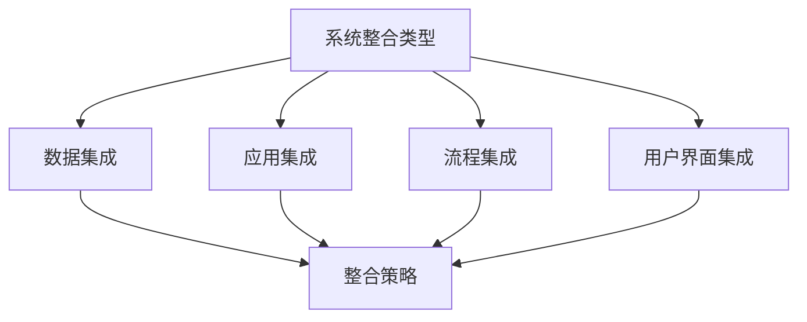
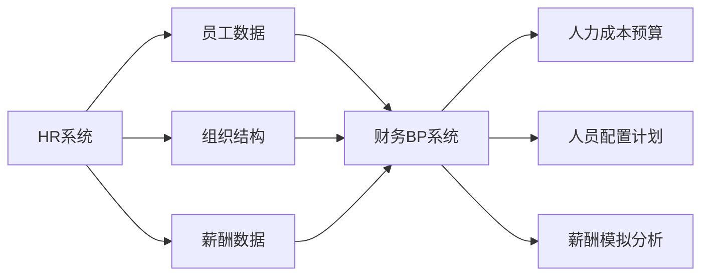
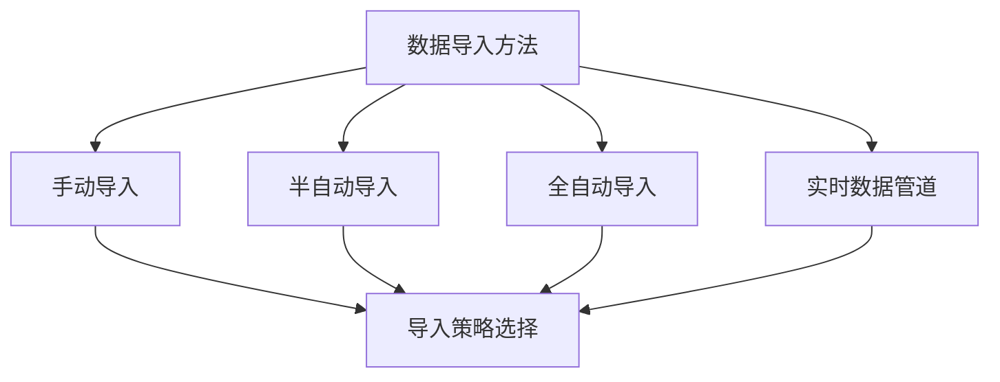
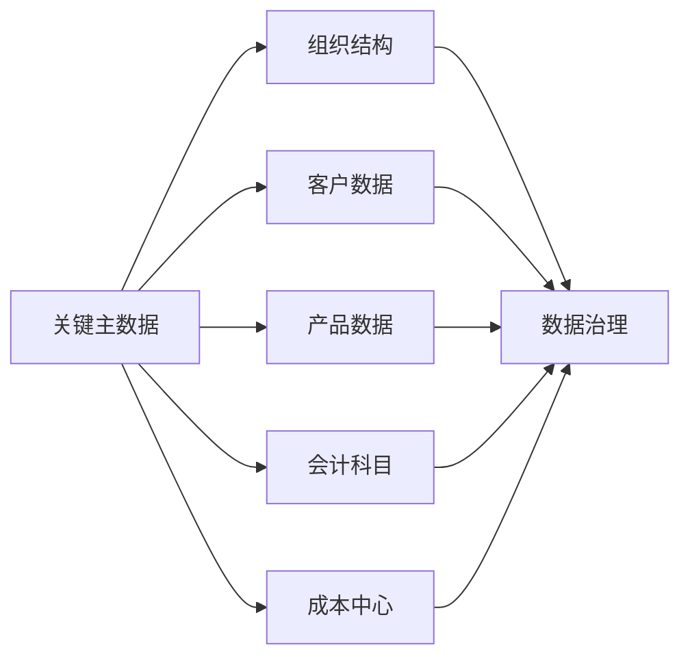
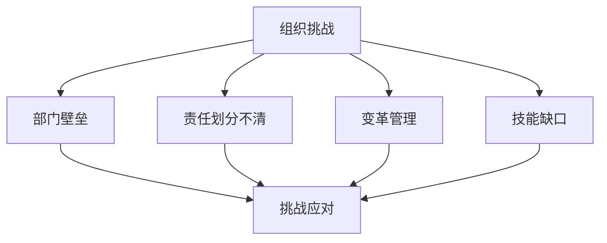

---
{"tags":["财务BP","软件工具","系统集成","数据导入","数据集成"],"aliases":["财务系统集成","数据整合策略"],"created":"2024-03-20","dg-publish":true,"permalink":"/知识共享/001_财务/01_财务BP/01_学习内容/06_BP工具与模板/财务软件应用/系统整合与数据导入/","dgPassFrontmatter":true}
---

# 系统整合与数据导入

> [!abstract] 概述
> 本文档详细介绍财务BP系统与企业其他系统的整合方法以及数据导入技术。随着企业数字化转型的深入，财务BP系统需要与ERP、CRM、HR等系统实现无缝集成，并能高效导入和处理来自不同来源的数据。本文将探讨系统整合架构设计、数据导入策略、主数据管理、常见挑战及解决方案，帮助企业建立高效、准确的财务BP数据生态系统。

## 一、系统整合的基础概念

### 1. 整合的目的与价值
- **数据一致性**：确保跨系统数据的一致性和准确性
- **流程优化**：简化跨系统的业务流程
- **实时决策**：提供更及时的信息支持决策
- **资源节约**：减少手动数据处理和重复工作
- **全局视图**：提供企业运营的整体视图

### 2. 整合类型

### 3. 整合架构模式
- **点对点集成**：系统直接相互连接
- **集线器模式**：通过中央集线器连接系统
- **数据总线模式**：通过企业服务总线连接
- **API网关模式**：通过API网关管理连接
- **混合模式**：结合多种模式的整合方案

### 4. 数据交换方式
- **批处理**：定期处理大量数据
- **实时同步**：即时数据更新和传输
- **消息队列**：通过消息中间件异步传输
- **事件驱动**：基于事件触发的数据交换
- **Web服务**：通过标准化Web服务交换数据

## 二、财务BP系统与其他系统的整合

### 1. 与ERP系统整合
- **数据需求**：总账数据、成本数据、销售数据
- **整合挑战**：数据结构差异、数据粒度不一致
- **常见方法**：API集成、数据仓库、中间件
- **整合收益**：减少数据重复输入、提高数据准确性
- **实施建议**：明确数据映射关系、建立数据变更控制

### 2. 与CRM系统整合
- **数据需求**：客户数据、销售机会、销售漏斗
- **整合挑战**：客户数据结构不一致、历史数据不完整
- **常见方法**：API集成、ETL工具、数据湖
- **整合收益**：更准确的收入预测、更全面的客户视图
- **实施建议**：统一客户编码、建立数据质量检验

### 3. 与HR系统整合

### 4. 与生产管理系统整合
- **数据需求**：产能数据、物料需求、产量计划
- **整合挑战**：生产术语与财务术语差异、时间维度不一致
- **常见方法**：中间数据转换层、定制连接器
- **整合收益**：更准确的生产成本预测、更合理的资源规划
- **实施建议**：建立生产与财务的映射词典、定义共同的KPI

### 5. 与BI系统整合
- **数据需求**：预算与实际数据、预测数据
- **整合挑战**：数据更新频率差异、维度定义不一致
- **常见方法**：共享数据仓库、OLAP多维数据集
- **整合收益**：更强大的分析能力、更直观的可视化
- **实施建议**：统一维度定义、建立统一的指标体系

## 三、数据导入策略与方法

### 1. 数据导入需求分析
- **数据种类识别**：确定需要导入的数据类型
- **数据来源分析**：识别数据的来源系统
- **数据格式分析**：了解数据的格式和结构
- **数据频率确定**：确定数据导入的频率
- **数据量评估**：估计数据导入的数据量

### 2. 数据导入方法

### 3. ETL流程设计
- **数据提取**：从源系统获取数据
- **数据转换**：清洗、标准化和转换数据
- **数据加载**：将数据加载到目标系统
- **数据验证**：验证数据的完整性和准确性
- **错误处理**：处理导入过程中的错误

### 4. 数据导入工具
- **专业ETL工具**：Informatica、Talend、SSIS
- **数据库工具**：数据库内置的导入导出工具
- **脚本工具**：Python、R、Shell脚本
- **专用连接器**：系统专用数据连接器
- **集成平台**：iPaaS、API管理平台

## 四、主数据管理与数据治理

### 1. 主数据管理原则
- **数据唯一性**：确保主数据的唯一定义
- **数据权威性**：建立主数据的权威来源
- **数据标准化**：统一主数据的格式和规范
- **数据生命周期**：管理主数据的完整生命周期
- **数据所有权**：明确主数据的所有者和责任

### 2. 关键主数据类型

### 3. 数据质量管理
- **数据质量标准**：定义数据质量的标准和指标
- **数据质量检测**：实施数据质量监控机制
- **数据清洗**：清理和修复数据质量问题
- **数据质量报告**：定期报告数据质量状况
- **持续改进**：持续优化数据质量管理流程

### 4. 数据治理框架
- **政策和标准**：建立数据管理政策和标准
- **角色和责任**：明确数据管理的角色和责任
- **流程和程序**：建立数据管理的流程和程序
- **工具和技术**：选择适当的数据管理工具
- **考核和改进**：评估和改进数据治理效果

## 五、常见挑战及解决方案

### 1. 技术挑战
- **系统互兼容性**：不同系统架构的兼容问题
- **性能瓶颈**：大量数据处理的性能问题
- **安全控制**：跨系统数据安全管理
- **版本升级**：系统升级导致的集成中断
- **技术债务**：历史集成方案的维护困难

### 2. 组织挑战

### 3. 数据挑战
- **数据质量问题**：不完整、不准确的数据
- **数据格式不一致**：不同系统数据格式差异
- **历史数据处理**：处理和迁移历史数据
- **元数据管理**：跨系统元数据的统一管理
- **数据隐私合规**：满足数据隐私法规要求

### 4. 解决方案与最佳实践
- **技术解决方案**：采用先进集成技术、标准化接口
- **组织解决方案**：建立跨部门合作机制、明确职责
- **数据解决方案**：实施数据质量管理、建立数据标准
- **流程解决方案**：优化业务流程、建立变更管理
- **管理解决方案**：建立治理机制、加强项目管理

## 六、案例分析

### 案例1：制造企业ERP与BP系统整合
**背景**：某制造企业需要将其SAP ERP系统与Anaplan预算规划系统整合，以提高预算的准确性和效率。

**挑战**：
1. **数据差异**
   - ERP中的产品结构与BP系统维度不一致
   - 成本中心定义差异
   - 历史数据格式不兼容

2. **流程差异**
   - ERP月度关账与BP预算周期不同步
   - 部门审批流程不一致
   - 数据责任人定义不明确

3. **技术限制**
   - 系统间直接接口有限
   - 数据量大导致性能问题
   - 安全访问控制复杂

**解决方案**：
1. **整合架构设计**
   - 建立中间数据仓库作为数据集成枢纽
   - 设计ETL流程转换和映射数据
   - 实施数据质量检查规则

2. **流程优化**
   - 调整预算周期与ERP关账周期同步
   - 明确各部门数据责任人
   - 建立数据变更通知机制

3. **技术实施**
   - 使用Informatica ETL工具实现数据转换
   - 建立增量数据同步机制
   - 实施数据更新监控和告警

**实施效果**：
- 预算编制周期缩短50%
- 数据准确性提高90%
- 手动数据处理减少80%
- 预算与实际对比分析时间减少75%
- 决策支持能力显著提升

### 案例2：金融服务企业多系统整合
**背景**：某金融服务企业需要整合财务系统、CRM系统、HR系统和业务交易系统，构建统一的预算和规划平台。

**挑战**：
1. **复杂的系统环境**
   - 10多个不同系统需要整合
   - 核心系统为老旧的遗留系统
   - 系统间缺乏标准化接口

2. **严格的数据要求**
   - 高度敏感的客户和财务数据
   - 严格的监管合规要求
   - 数据准确性要求极高

3. **组织挑战**
   - 多部门数据所有权不明确
   - IT与业务部门协作不足
   - 变革管理难度大

**解决方案**：
1. **整合战略**
   - 采用企业服务总线(ESB)架构
   - 建立API管理平台统一接口
   - 实施主数据管理(MDM)系统

2. **数据治理**
   - 建立数据治理委员会
   - 实施主数据管理流程
   - 建立数据质量监控体系

3. **技术实施**
   - 开发标准化API接口
   - 建立安全的数据交换机制
   - 实施数据加密和访问控制

**实施效果**：
- 建立了统一的客户视图
- 预算准确性提高85%
- 合规报告生成时间减少70%
- 跨部门数据共享效率提高60%
- 系统维护成本降低40%

## 七、最佳实践建议

1. **整合规划与设计**
   - 从业务需求出发，而非技术驱动
   - 优先整合关键系统和核心数据
   - 设计灵活的整合架构，适应未来变化
   - 建立清晰的数据映射和转换规则

2. **数据管理原则**
   - 建立"单一数据真实来源"
   - 实施强有力的数据治理机制
   - 优先关注数据质量
   - 建立数据导入的验证机制

3. **实施方法**
   - 采用增量方法，分阶段实施
   - 建立试点项目验证方案
   - 确保关键用户参与整个过程
   - 建立变更管理和沟通计划

4. **长期维护策略**
   - 建立整合监控机制
   - 定期审查和优化整合方案
   - 建立文档和知识管理
   - 培养内部专业技能

## 相关链接

- [[知识共享/001_财务/01_财务BP/01_学习内容/06_BP工具与模板/财务软件应用/常用财务规划软件比较\|常用财务规划软件比较]]
- [[知识共享/001_财务/01_财务BP/01_学习内容/06_BP工具与模板/财务软件应用/软件选择考虑因素\|软件选择考虑因素]]
- [[知识共享/001_财务/01_财务BP/01_学习内容/06_BP工具与模板/财务软件应用/自动化报告生成\|自动化报告生成]]
- [[知识共享/001_财务/01_财务BP/01_学习内容/06_BP工具与模板/财务建模/财务模型设计原则\|知识共享/001_财务/01_财务BP/01_学习内容/06_BP工具与模板/财务建模/财务模型设计原则]]
- [[Excel模型构建\|Excel模型构建]]

## 参考文献

1. Davenport, T. H. (2019). *Enterprise Systems and Data Integration*. Harvard Business Review Press.
2. Loshin, D. (2017). *Master Data Management*. Morgan Kaufmann.
3. Kimball, R., & Ross, M. (2018). *The Data Warehouse Toolkit*. Wiley.
4. 《企业数据集成最佳实践》，张明，中国财政经济出版社，2022.
5. 《财务系统集成实施指南》，李强，财务与会计，2021.
6. 《主数据管理与企业数据治理》，王华，数据管理与应用，2020. 