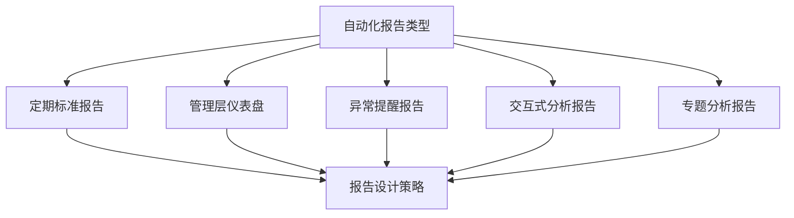
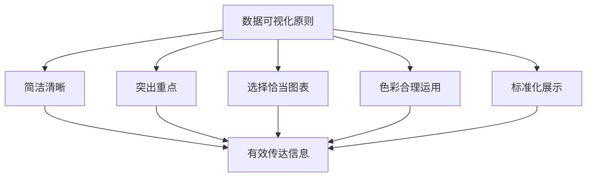
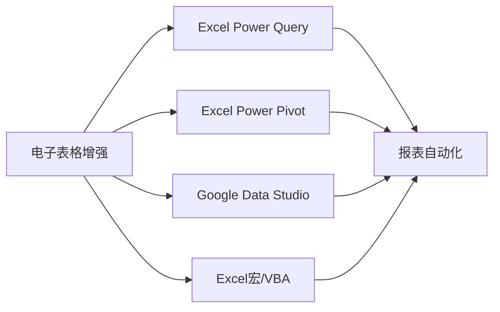
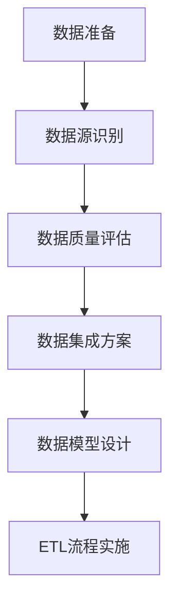

---
{"tags":["财务BP","软件工具","自动化报告","数据可视化","效率提升"],"aliases":["报告自动化","财务报告自动生成"],"created":"2024-03-20","dg-publish":true,"permalink":"/知识共享/001_财务/01_财务BP/01_学习内容/06_BP工具与模板/财务软件应用/自动化报告生成/","dgPassFrontmatter":true}
---

# 自动化报告生成

> [!abstract] 概述
> 本文档详细介绍财务BP自动化报告生成的方法、技术和最佳实践。自动化报告生成是现代财务BP工作的重要效率工具，能够大幅减少手动报告编制时间，提高报告的准确性、一致性和及时性。本文将探讨自动化报告的基本概念、实现技术、设计原则、常用工具以及实施步骤，帮助财务专业人员有效实施报告自动化。

## 一、自动化报告基础概念

### 1. 自动化报告的定义与价值
- **定义**：利用软件工具自动收集、处理数据并生成标准化报告的过程
- **核心价值**：节省时间、减少错误、提高一致性、增强分析能力
- **适用场景**：定期报告、标准化报告、多维度分析报告、仪表盘
- **关键特性**：数据自动更新、格式统一、交互性、分发便捷

### 2. 自动化报告类型

### 3. 自动化报告的组成部分
- **数据源连接**：与企业各系统的数据连接
- **数据处理逻辑**：数据转换、计算和汇总规则
- **报告模板**：预定义的报告结构和样式
- **可视化元素**：图表、表格和关键绩效指标展示
- **分发机制**：报告的自动发送和共享方式

### 4. 自动化与人工分析的平衡
- **自动化适用场景**：重复性工作、标准化分析、大量数据处理
- **人工分析价值**：深度洞察、异常解释、战略建议
- **最佳结合点**：自动化基础数据处理，人工进行高价值分析
- **持续优化平衡**：根据需求变化调整自动化程度
- **跨职能协作**：IT与财务部门的紧密合作

## 二、自动化报告实现技术

### 1. 数据获取技术
- **直接数据库连接**：通过数据库连接直接获取源数据
- **API集成**：通过应用程序接口获取系统数据
- **数据仓库/湖**：从集中式数据仓库获取整合数据
- **文件导入**：导入Excel、CSV等格式文件
- **网页抓取**：从内部或外部网页获取数据

### 2. 数据处理技术

### 3. 报告生成技术
- **静态报告**：预定义格式的固定报告
- **参数化报告**：可根据参数动态生成的报告
- **交互式报告**：用户可自行钻取和筛选的报告
- **实时报告**：数据实时更新的动态报告
- **智能报告**：带有预测和异常提示的高级报告

### 4. 报告分发技术
- **电子邮件分发**：通过邮件自动发送报告
- **门户共享**：在企业门户上发布报告
- **移动推送**：推送到移动设备的报告提醒
- **文档存储**：自动保存到文档管理系统
- **打印输出**：自动打印纸质报告

## 三、自动化报告设计原则

### 1. 用户体验设计
- **清晰的信息层次**：重要信息突出显示
- **直观的导航结构**：易于浏览和定位信息
- **一致的视觉风格**：保持企业视觉标识一致
- **适当的交互设计**：提供必要的交互功能
- **响应式布局**：适应不同设备和屏幕尺寸

### 2. 数据可视化原则

### 3. 性能优化原则
- **数据预处理**：预先计算常用指标
- **增量更新**：只处理变化的数据
- **适当缓存**：缓存中间结果和频繁访问数据
- **异步处理**：大型报告后台处理
- **资源控制**：控制查询复杂度和数据量

### 4. 安全与合规原则
- **访问控制**：基于角色的报告访问权限
- **数据隐私**：敏感数据脱敏和保护
- **审计跟踪**：记录报告访问和操作日志
- **数据准确性**：确保数据来源可靠和准确
- **合规性**：满足行业和法规要求

## 四、自动化报告常用工具

### 1. BI工具
- **Power BI**：Microsoft的商业智能工具
  - 优势：与Office集成、易用性高、可视化强大
  - 适用场景：中小型企业、Office环境
- **Tableau**：专业数据可视化工具
  - 优势：强大的可视化能力、直观操作、广泛连接器
  - 适用场景：数据分析密集型企业、需要高度可视化
- **Qlik Sense**：自助式商业智能平台
  - 优势：联想分析引擎、内存处理、灵活查询
  - 适用场景：复杂分析需求、大数据环境

### 2. 电子表格增强工具

### 3. 财务软件内置报告工具
- **ERP报告模块**：SAP BO、Oracle OBIEE
- **预算软件报告**：Anaplan、Workday Adaptive
- **财务分析软件**：OneStream、Board
- **会计软件报告**：Xero、QuickBooks报告
- **云财务平台**：NetSuite、FinancialForce报告

### 4. 定制开发工具
- **Python生态系统**：Pandas、Matplotlib、Jupyter
- **R语言工具集**：R Markdown、Shiny、ggplot2
- **JavaScript库**：D3.js、Chart.js、Highcharts
- **报表服务器**：SSRS、Jasper Reports、Crystal Reports
- **Web框架**：Django、Flask、Angular与报表集成

## 五、自动化报告实施步骤

### 1. 需求分析与规划
- **报告需求调研**：了解用户需求和期望
- **报告清单整理**：梳理需要自动化的报告清单
- **优先级划分**：确定报告自动化的优先顺序
- **技术可行性评估**：评估技术和数据可行性
- **实施路线规划**：制定分阶段实施计划

### 2. 数据准备与集成

### 3. 报告设计与开发
- **报告模板设计**：设计标准化报告模板
- **可视化元素选择**：选择合适的图表和展示方式
- **计算逻辑实现**：实现数据计算和处理逻辑
- **交互功能开发**：开发必要的交互功能
- **测试与优化**：测试报告并优化性能

### 4. 部署与推广
- **用户培训**：培训用户使用自动化报告
- **试点运行**：选择部分用户进行试点
- **反馈收集**：收集用户反馈并改进
- **全面推广**：向全部目标用户推广
- **持续支持**：提供持续的技术支持

## 六、案例分析

### 案例1：制造企业财务月报自动化
**背景**：某制造企业需要每月生成详细的财务月报，包括P&L、资产负债表、现金流量表及各种财务分析，传统手工编制耗时7-10天。

**挑战**：
1. **数据来源复杂**
   - 数据分散在ERP、MES、CRM等多个系统
   - 部分数据需要手工收集
   - 历史比较数据存储在不同位置

2. **报告要求严格**
   - 多维度分析（产品线、区域、客户）
   - 严格的公司报表格式
   - 需要同时提供详细数据和高层摘要

3. **资源限制**
   - IT支持有限
   - 预算约束
   - 用户技术能力参差不齐

**解决方案**：
1. **技术选择**
   - 核心工具：Power BI + SQL Server
   - 数据集成：SSIS ETL流程
   - 报告分发：SharePoint + 邮件

2. **实施步骤**
   - 建立中央数据仓库整合各系统数据
   - 设计标准化数据模型支持多维分析
   - 创建分层报告（摘要-详细-原始数据）
   - 实现自动调度和分发机制

3. **变更管理**
   - 提供分阶段培训
   - 并行运行新旧系统一个季度
   - 建立超级用户网络提供支持

**实施效果**：
- 报告生成时间从10天减少到1天
- 数据准确性提高95%
- 分析维度增加300%
- 财务团队分析时间占比从20%提升到60%
- 管理层决策反应时间缩短70%

### 案例2：服务企业客户盈利能力自动报告
**背景**：某专业服务企业需要分析数百个客户的盈利能力，传统Excel分析费时费力且容易出错。

**挑战**：
1. **数据复杂性**
   - 项目时间记录分散在多个系统
   - 成本分配规则复杂
   - 收费模式多样（固定费用、时间费用、混合模式）

2. **分析需求**
   - 客户盈利能力多角度分析
   - 人员利用率与盈利关系
   - 项目类型盈利对比
   - 趋势分析和预警

3. **用户期望**
   - 直观易用的界面
   - 自助式分析能力
   - 移动设备访问
   - 自动提醒功能

**解决方案**：
1. **技术选择**
   - 核心工具：Tableau
   - 数据处理：Alteryx
   - 分发平台：Tableau Server

2. **实施步骤**
   - 构建客户盈利能力数据模型
   - 设计多层次盈利能力仪表盘
   - 实现异常提醒机制
   - 建立自动更新和分发流程

3. **用户赋能**
   - 分角色培训计划
   - 创建常见分析场景指南
   - 建立内部用户社区

**实施效果**：
- 分析时间减少85%
- 识别出20%低盈利客户并采取改进措施
- 人员利用率提高15%
- 项目盈利能力提升18%
- 客户定价策略优化，整体毛利提升8%

## 七、最佳实践建议

1. **战略性规划**
   - 从企业战略和决策需求出发设计报告
   - 优先自动化高价值、高频次报告
   - 建立报告标准化体系
   - 规划报告演进路线图

2. **用户中心设计**
   - 深入了解用户实际需求和使用场景
   - 注重报告的可用性和易用性
   - 提供适当的交互和定制能力
   - 持续收集用户反馈并改进

3. **数据质量管理**
   - 建立数据质量监控机制
   - 实施自动化数据验证
   - 提供数据来源和处理逻辑说明
   - 建立数据问题快速响应机制

4. **持续优化与创新**
   - 定期评估报告使用情况和价值
   - 跟踪技术发展，引入新的可视化和分析方法
   - 推动报告从描述性向预测性和指导性发展
   - 探索人工智能和机器学习在报告中的应用

## 相关链接

- [[知识共享/001_财务/01_财务BP/01_学习内容/06_BP工具与模板/财务软件应用/常用财务规划软件比较\|常用财务规划软件比较]]
- [[知识共享/001_财务/01_财务BP/01_学习内容/06_BP工具与模板/财务软件应用/软件选择考虑因素\|软件选择考虑因素]]
- [[知识共享/001_财务/01_财务BP/01_学习内容/06_BP工具与模板/财务软件应用/系统整合与数据导入\|系统整合与数据导入]]
- [[知识共享/001_财务/01_财务BP/01_学习内容/06_BP工具与模板/财务建模/财务模型设计原则\|知识共享/001_财务/01_财务BP/01_学习内容/06_BP工具与模板/财务建模/财务模型设计原则]]
- [[知识共享/001_财务/01_财务BP/01_学习内容/06_BP工具与模板/BP展示技巧/数据可视化技巧\|数据可视化技巧]]

## 参考文献

1. Few, S. (2020). *Information Dashboard Design: Displaying Data for At-a-Glance Monitoring*. Analytics Press.
2. Knaflic, C. N. (2019). *Storytelling with Data: A Data Visualization Guide for Business Professionals*. Wiley.
3. Alexander, M., & Kusleika, D. (2021). *Excel 2019 Power Programming with VBA*. Wiley.
4. 《企业报表自动化最佳实践》，张明，中国财政经济出版社，2022.
5. 《财务数据可视化与报告》，李强，财务与会计，2021.
6. 《商业智能与自动化报告实践指南》，王华，信息管理与系统，2020. 