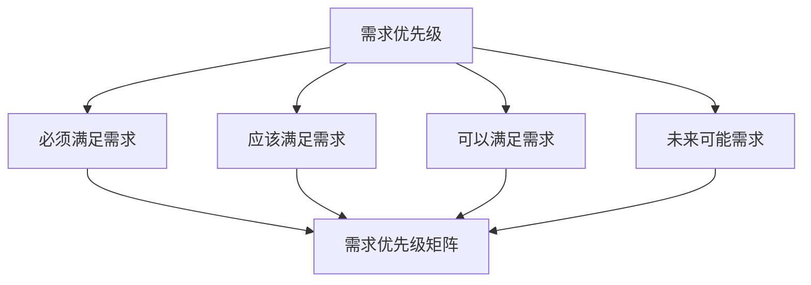
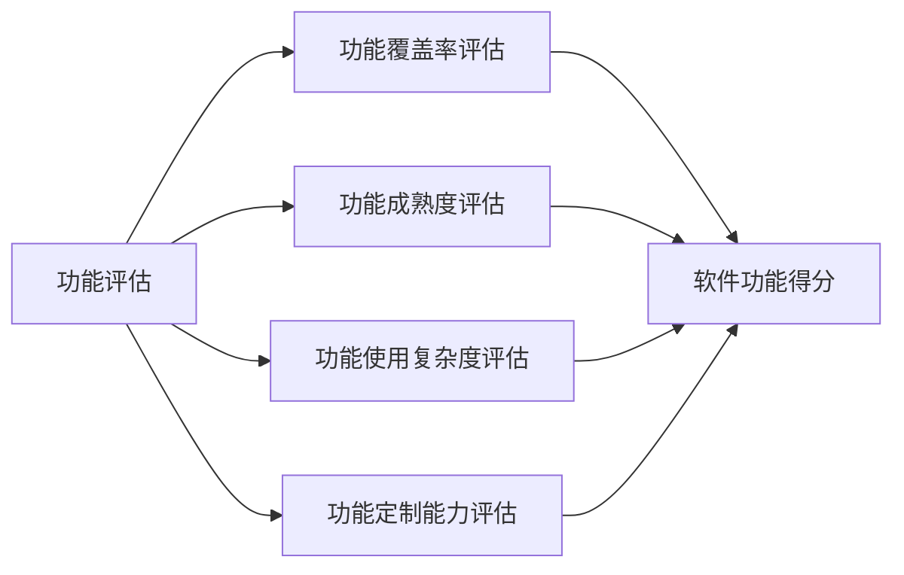
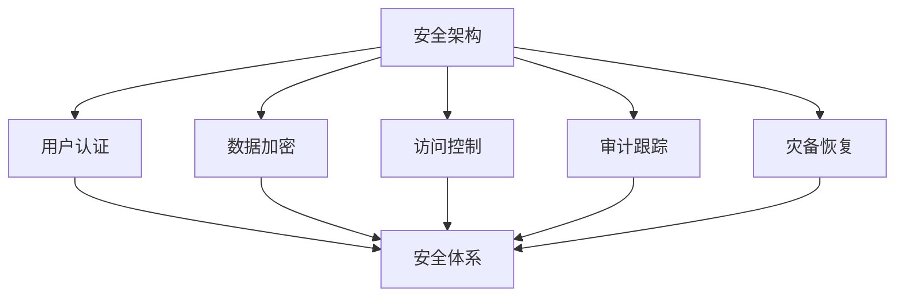
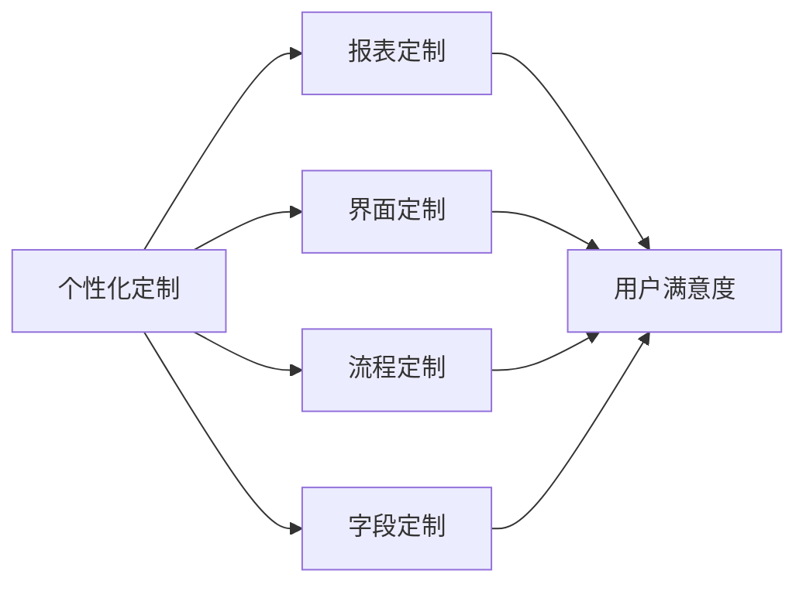
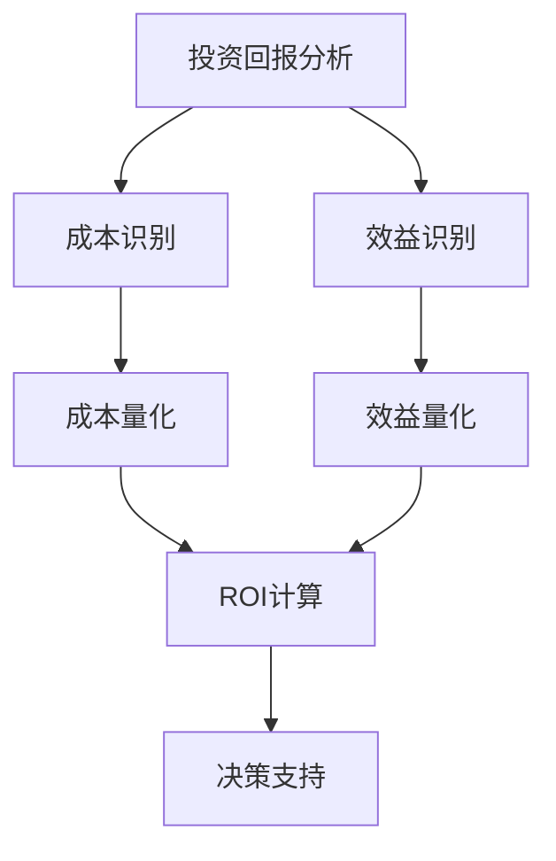
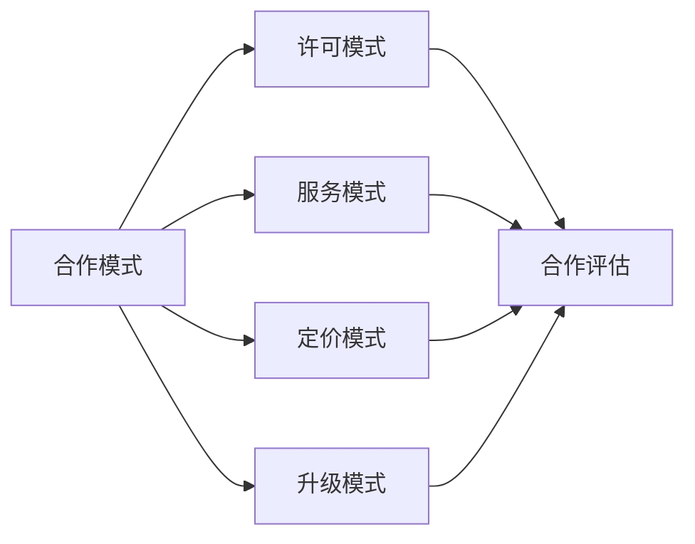
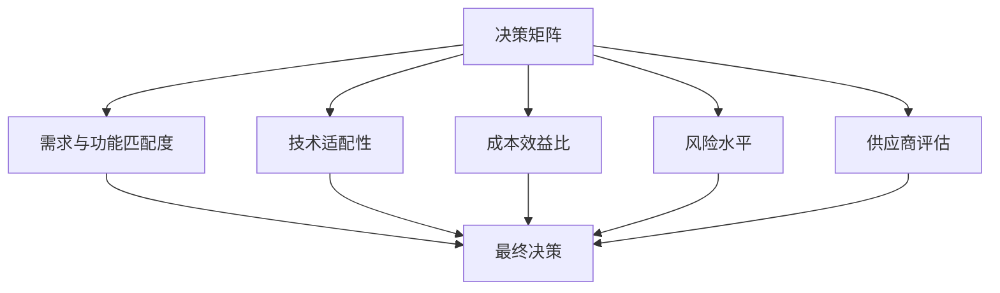

---
{"tags":["财务BP","软件工具","软件选型","技术评估","需求分析"],"aliases":["财务软件选型","技术选型考虑因素"],"created":"2024-03-20","dg-publish":true,"permalink":"/知识共享/001_财务/01_财务BP/01_学习内容/06_BP工具与模板/财务软件应用/软件选择考虑因素/","dgPassFrontmatter":true}
---

# 软件选择考虑因素

> [!abstract] 概述
> 本文档详细分析财务BP软件选择过程中应考虑的关键因素。选择合适的财务规划软件是实施有效BP管理的重要基础，需要从功能需求、技术架构、用户体验、成本效益、供应商评估等多个维度进行全面考量。本文将提供系统化的选型框架和评估方法，帮助财务团队做出明智的软件选择决策。

## 一、需求分析框架

### 1. 业务需求分类
- **核心业务需求**：与企业主营业务直接相关的需求
- **支持性业务需求**：辅助核心业务的需求
- **战略性业务需求**：支持企业长期发展的需求
- **合规性需求**：满足法律法规要求的需求
- **改进性需求**：提高效率和效果的需求

### 2. 需求优先级划分

### 3. 需求收集方法
- **用户访谈**：直接与最终用户交流
- **流程分析**：分析当前业务流程的痛点
- **标杆比较**：了解行业最佳实践
- **系统审计**：评估现有系统的不足
- **未来场景规划**：预测未来业务需求

### 4. 需求文档化
- **需求列表**：详细列出所有功能需求
- **用例描述**：描述系统如何被使用
- **流程图**：展示业务流程
- **界面原型**：展示用户界面期望
- **评估标准**：明确需求验收标准

## 二、功能需求考量

### 1. 基础功能
- **预算编制功能**：支持多维度预算编制
- **预测功能**：支持滚动预测和场景规划
- **报告功能**：满足内部和外部报告需求
- **分析功能**：提供多角度分析能力
- **工作流管理**：支持审批和协作流程

### 2. 特殊功能
- **行业特定功能**：满足特定行业需求
- **企业特有功能**：满足企业特殊业务模式需求
- **高级分析功能**：预测分析、敏感性分析等
- **集成功能**：与其他系统的集成能力
- **定制化能力**：满足非标准化需求的能力

### 3. 功能评估方法

### 4. 功能验证方法
- **系统演示**：供应商演示系统功能
- **概念验证**：针对关键功能的小规模测试
- **用户测试**：让最终用户测试关键功能
- **参考客户反馈**：了解其他客户的使用体验
- **文档审查**：审查详细的功能文档

## 三、技术架构考量

### 1. 部署模式
- **云端部署**：SaaS模式，无需本地基础设施
- **本地部署**：在企业内部服务器上部署
- **混合部署**：部分功能云端，部分功能本地
- **私有云部署**：在私有云环境中部署
- **移动部署**：支持移动设备访问的部署模式

### 2. 系统性能
- **处理能力**：处理大量数据的能力
- **响应时间**：用户操作的响应速度
- **并发能力**：同时支持多用户操作的能力
- **可扩展性**：随业务增长扩展的能力
- **稳定性**：长期运行的稳定程度

### 3. 安全架构

### 4. 集成架构
- **API接口**：应用程序接口的完备性
- **数据导入导出**：数据交换能力
- **预置连接器**：与主流系统的连接器
- **第三方集成**：与第三方服务的集成能力
- **集成中间件**：数据集成平台支持

## 四、用户体验考量

### 1. 界面易用性
- **直观性**：界面是否直观易懂
- **一致性**：界面设计的一致性
- **响应性**：界面响应速度
- **美观性**：界面设计的美观程度
- **兼容性**：在不同设备上的表现

### 2. 学习曲线
- **入门难度**：初次使用的学习难度
- **培训资源**：可获得的培训材料
- **在线帮助**：系统内置的帮助功能
- **用户社区**：用户交流和互助社区
- **技术支持**：供应商提供的技术支持

### 3. 个性化与定制

### 4. 多语言多币种
- **语言支持**：支持的语言种类
- **本地化程度**：本地化的完整性
- **货币处理**：多币种处理能力
- **汇率管理**：汇率更新和转换功能
- **国际会计准则**：不同国家会计准则支持

## 五、成本效益分析

### 1. 总拥有成本分析
- **初始许可成本**：软件许可费用
- **实施成本**：安装、配置、定制、数据迁移成本
- **培训成本**：用户和管理员培训费用
- **维护成本**：年度维护费、升级费
- **基础设施成本**：需要的硬件和系统软件成本

### 2. 效益评估
- **直接效益**：节省时间、降低错误率
- **间接效益**：提高决策质量、增强控制
- **定量效益**：可以量化计算的效益
- **定性效益**：难以量化的效益
- **战略效益**：支持企业战略的效益

### 3. 投资回报分析

### 4. 风险评估
- **实施风险**：实施过程中的风险
- **技术风险**：技术相关的风险
- **供应商风险**：供应商相关的风险
- **组织变革风险**：组织变革带来的风险
- **财务风险**：投资和回报相关的风险

## 六、供应商评估

### 1. 供应商实力
- **市场地位**：供应商在市场的地位和声誉
- **财务状况**：供应商的财务稳健性
- **研发投入**：对产品研发的投入程度
- **客户基础**：现有客户规模和质量
- **行业经验**：在特定行业的经验

### 2. 服务能力
- **实施服务**：供应商的实施能力
- **培训服务**：提供的培训质量
- **技术支持**：技术支持的响应速度和质量
- **咨询服务**：提供的业务咨询质量
- **升级服务**：系统升级的支持服务

### 3. 合作模式

### 4. 长期关系
- **战略契合**：与供应商战略方向的一致性
- **创新能力**：供应商的创新历史和潜力
- **沟通机制**：与供应商的沟通渠道和机制
- **客户影响力**：对供应商产品路线图的影响力
- **退出策略**：必要时的转换或退出计划

## 七、决策方法论

### 1. 评分卡方法
- **评估标准确定**：确定关键评估标准
- **权重分配**：为不同标准分配权重
- **评分规则**：建立统一的评分规则
- **综合评分**：计算加权综合得分
- **结果分析**：分析评分结果和差距

### 2. 多轮筛选
- **初步筛选**：根据基本要求进行初筛
- **详细评估**：对入围产品进行详细评估
- **产品演示**：观看产品演示并提问
- **参考检查**：联系现有客户了解使用体验
- **最终决策**：基于综合信息做出决策

### 3. 决策矩阵

### 4. 共识决策
- **跨部门评估**：多部门共同参与评估
- **多角度视角**：考虑不同利益相关者视角
- **透明流程**：保持决策过程透明
- **充分讨论**：允许不同意见充分表达
- **共识达成**：寻求广泛认可的决策

## 八、案例分析

### 案例1：制造企业软件选型
**背景**：某制造企业需要选择一款财务BP软件，用于优化生产计划与财务预算的协调。

**需求分析**：
1. **核心功能需求**
   - 多维度预算编制
   - 生产计划与财务预算集成
   - 滚动预测能力
   - 场景分析
   - 报告与分析

2. **技术需求**
   - 与现有ERP系统集成
   - 中等数据量处理
   - 适中的安全要求
   - 本地部署优先

3. **成本考虑**
   - 中等预算水平
   - 3年投资回报期望
   - 内部IT资源有限

**评估过程**：
1. **初步筛选**：基于核心需求筛选出5个候选产品
2. **详细评估**：使用评分卡方法对5个产品进行详细评估
3. **供应商演示**：邀请3个得分最高的供应商进行演示
4. **参考客户访谈**：与每个供应商的2个参考客户交流
5. **成本效益分析**：对最终2个候选产品进行详细的ROI分析

**最终决策**：
- 选择了与ERP系统集成度高的解决方案
- 虽然初始成本略高，但长期TCO更优
- 供应商在制造业有丰富经验
- 实施计划分阶段进行，降低风险

**实施效果**：
- 预算编制时间缩短40%
- 预测准确率提高25%
- 生产计划与财务预算协调性显著提升
- 决策支持能力大幅增强

### 案例2：服务企业云端解决方案选择
**背景**：某服务型企业需要选择一款云端财务BP软件，支持分布在不同地区的团队协作。

**需求分析**：
1. **核心需求**
   - 云端访问
   - 强大的协作功能
   - 灵活的报告生成
   - 用户友好的界面
   - 移动设备支持

2. **技术考虑**
   - 数据安全性高
   - 系统可用性要求高
   - 与现有CRM系统集成
   - 数据量较小但增长快

3. **组织因素**
   - 用户IT技能水平中等
   - 变革接受度高
   - 预算有限
   - 快速实施需求

**评估过程**：
1. **市场调研**：识别主要云端财务BP解决方案
2. **功能比较**：创建详细功能对比表
3. **免费试用**：测试三款领先解决方案
4. **用户反馈**：收集试用用户的反馈
5. **安全评估**：对最终两款解决方案进行安全评估

**最终决策**：
- 选择了用户体验最佳的云端解决方案
- 该解决方案提供了最佳的移动支持
- 具有良好的CRM集成能力
- 按用户付费模式符合预算要求

**实施效果**：
- 两周内完成实施
- 用户采纳率达到95%
- 协作效率提升60%
- 报告生成时间减少80%
- 决策周期缩短50%

## 九、最佳实践建议

1. **需求优先**
   - 需求驱动选型，而非功能驱动
   - 区分"必须有"和"最好有"的需求
   - 关注未来3-5年的需求变化
   - 考虑企业战略对系统的要求

2. **全面评估**
   - 功能、技术、成本多维度评估
   - 定量与定性因素结合考虑
   - 短期需求与长期价值平衡
   - 考虑实施和使用的全生命周期

3. **利益相关者参与**
   - 确保关键用户参与评估过程
   - IT和业务部门共同决策
   - 高层管理支持
   - 明确决策责任和流程

4. **风险管理**
   - 识别并应对选型风险
   - 制定风险缓解计划
   - 分阶段实施降低风险
   - 准备应急方案

## 相关链接

- [[知识共享/001_财务/01_财务BP/01_学习内容/06_BP工具与模板/财务软件应用/常用财务规划软件比较\|常用财务规划软件比较]]
- [[知识共享/001_财务/01_财务BP/01_学习内容/06_BP工具与模板/财务软件应用/系统整合与数据导入\|系统整合与数据导入]]
- [[知识共享/001_财务/01_财务BP/01_学习内容/06_BP工具与模板/财务软件应用/自动化报告生成\|自动化报告生成]]
- [[知识共享/001_财务/01_财务BP/01_学习内容/06_BP工具与模板/财务建模/财务模型设计原则\|知识共享/001_财务/01_财务BP/01_学习内容/06_BP工具与模板/财务建模/财务模型设计原则]]
- [[Excel模型构建\|Excel模型构建]]

## 参考文献

1. Gartner. (2023). *How to Select the Right Financial Planning Software*.
2. Deloitte. (2022). *Technology Selection Framework for Finance Transformation*.
3. KPMG. (2021). *Financial Systems Selection: A Strategic Approach*.
4. 《企业软件选型方法论》，张明，中国财政经济出版社，2022.
5. 《财务系统选型最佳实践》，李强，财务与会计，2021.
6. 《企业应用系统选型决策模型研究》，王华，信息系统工程，2020. 