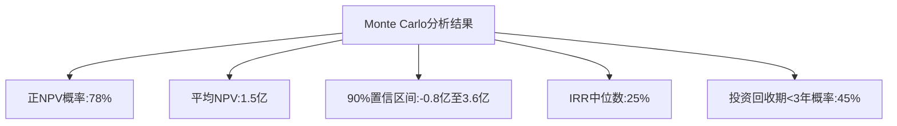
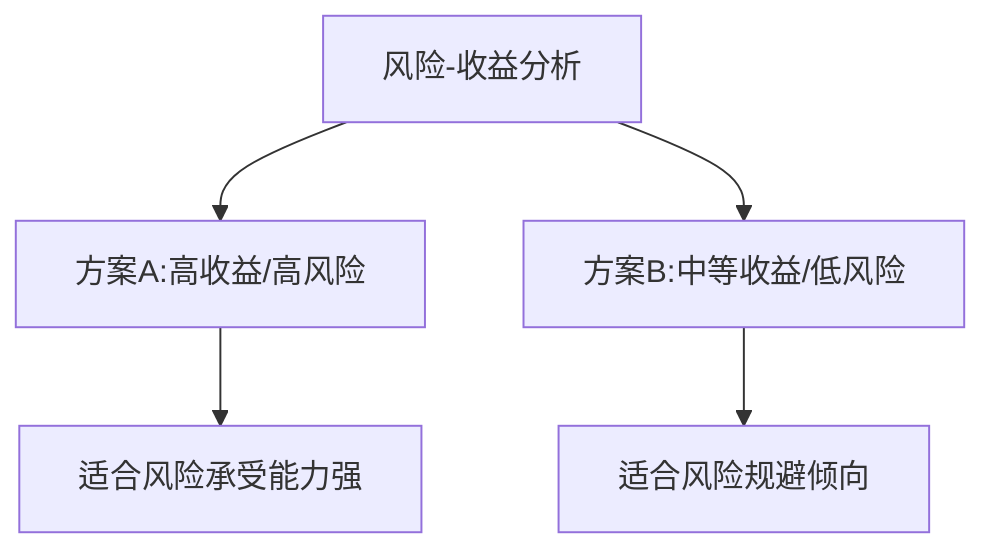

---
{"tags":["财务BP","Monte","Carlo模拟","概率分析","风险评估"],"aliases":"蒙特卡洛模拟,概率模拟","created":"2023-11-16","dg-publish":true,"permalink":"/知识共享/001_财务/01_财务BP/01_学习内容/06_BP工具与模板/高级分析/Monte Carlo模拟工具/","dgPassFrontmatter":true}
---

# Monte Carlo模拟工具

## 概述

Monte Carlo（蒙特卡洛）模拟是财务BP工作中的高级分析工具，通过引入随机变量和概率分布，对复杂问题进行大量模拟计算，从而得出结果的概率分布和风险特征。本文详细介绍Monte Carlo模拟的基本原理、应用方法、工具选择、案例分析及最佳实践，帮助财务BP提升决策支持能力和风险分析水平。

## 基本概念与原理

### 定义与原理
Monte Carlo模拟是一种基于随机抽样的统计学方法，通过从已知的概率分布中随机抽取大量样本值进行重复计算，来模拟系统的可能行为并分析其不确定性。

**核心特点**：
- 基于概率分布而非单一估计值
- 考虑多个变量的同时变化
- 提供结果的概率分布而非单一值
- 能处理复杂的非线性关系
- 支持变量间的相关性分析

### 与传统分析方法的区别

| 特性 | 传统敏感性分析 | Monte Carlo模拟 |
|------|--------------|----------------|
| 输入变量 | 固定值或离散取值 | 概率分布 |
| 同时变量 | 通常1-2个 | 可同时处理多个 |
| 结果形式 | 离散值 | 概率分布 |
| 风险表达 | 定性或范围 | 定量概率 |
| 相关性处理 | 简单或忽略 | 明确定义 |
| 复杂度 | 相对简单 | 较高 |
| 计算量 | 少 | 大 |

### 适用场景
Monte Carlo模拟特别适合以下场景：
- 多重不确定性共存的投资决策
- 需要量化风险概率的财务规划
- 复杂系统中影响因素相互作用的场合
- 需要考虑极端事件影响的风险管理
- 长期规划中包含高度不确定性的情况

## 模拟实施方法

### 基本实施步骤

#### 1. 定义问题和目标
- 明确分析的关键问题
- 确定评估的核心指标
- 设定分析的时间范围
- 界定模拟的边界条件

#### 2. 构建确定性模型
- 建立输入变量与输出结果的数学关系
- 确定模型的计算逻辑和结构
- 验证基础模型在确定性条件下的正确性
- 明确关键假设和限制条件

#### 3. 识别关键不确定变量
- 列出所有可能的不确定变量
- 评估各变量的不确定性程度
- 分析变量对结果的潜在影响大小
- 筛选最关键的不确定变量纳入模拟

#### 4. 指定变量概率分布
- 根据历史数据、专家判断或理论选择适当的概率分布
- 确定分布参数（均值、标准差、最小值、最大值等）
- 验证分布的合理性和适用性
- 必要时调整分布以反映实际情况

#### 5. 定义变量相关性
- 识别变量间可能存在的相关关系
- 量化相关性系数或结构
- 确保相关性设置合理有效
- 避免不切实际的相关关系假设

#### 6. 执行大量模拟
- 设定模拟次数（通常500-10,000次）
- 从各变量分布随机抽取样本
- 按照模型计算每次模拟的结果
- 收集所有模拟结果形成样本集

#### 7. 分析结果分布
- 计算结果的统计特征（均值、中位数、标准差等）
- 生成概率分布图表（直方图、累积分布曲线）
- 计算特定情景的概率（如负值概率、超过阈值概率）
- 确定结果的置信区间或预测区间

#### 8. 解释与决策支持
- 提取关键风险和机会信息
- 进行敏感性和情景分析
- 形成决策建议和风险缓解策略
- 设计监控和响应机制

### 变量分布选择指南
选择合适的概率分布是Monte Carlo模拟的关键步骤：

1. **正态分布**
   - 适用：自然现象、市场参数、多因素综合影响的指标
   - 参数：均值、标准差
   - 特点：对称、无边界、均值=中位数=众数

2. **三角分布**
   - 适用：基于专家判断的估计、有明确上下限的变量
   - 参数：最小值、最可能值、最大值
   - 特点：简单直观、易于解释、适合有限数据情景

3. **对数正态分布**
   - 适用：只有正值、右偏分布的指标，如资产价格、项目持续时间
   - 参数：位置参数、尺度参数
   - 特点：存在较长的右尾、均值大于中位数

4. **PERT分布**
   - 适用：项目管理估计、有专家判断的商业变量
   - 参数：最小值、最可能值、最大值
   - 特点：比三角分布平滑、极值概率较低

5. **均匀分布**
   - 适用：完全不确定的变量、随机选择
   - 参数：最小值、最大值
   - 特点：区间内每个值概率相等

### 相关性处理方法
正确处理变量相关性对模拟结果至关重要：

1. **相关性矩阵**
   - 定义变量两两之间的相关系数
   - 确保矩阵正定（数学有效）
   - 常用于多变量模拟

2. **条件分布**
   - 一个变量的分布依赖于另一变量的值
   - 适用于明确依赖关系的场景
   - 表达复杂相关性结构

3. **Copula方法**
   - 处理非线性相关性
   - 捕捉尾部依赖关系
   - 适用于金融风险模拟

4. **排序相关**
   - 通过排序转换处理任意分布相关性
   - 实现简单，广泛应用
   - 适用于多种商业模拟场景

## 应用工具与模板

### Excel实现方案
Excel是最常用的Monte Carlo模拟平台之一：

1. **原生Excel**
   - 使用RAND()、NORM.INV()等函数
   - 数据表功能进行重复计算
   - 适合简单模拟，计算能力有限

2. **插件工具**
   - @RISK：专业Monte Carlo模拟插件，功能全面
   - Crystal Ball：Oracle提供的模拟分析工具
   - ModelRisk：直观的风险分析插件
   - RiskAMP：轻量级风险分析工具

3. **VBA增强**
   - 使用VBA编程实现复杂模拟逻辑
   - 处理大量模拟和复杂相关性
   - 可自定义输出和可视化

### 专业模拟软件
专业软件提供更强大的功能和性能：

1. **Palisade Decision Tools Suite**
   - 包含@RISK及其他决策支持工具
   - 企业级风险分析和决策支持
   - 适合复杂商业模拟

2. **Oracle Crystal Ball**
   - 易用的模拟和优化工具
   - 与Oracle商业智能产品集成
   - 支持敏感性和场景分析

3. **Vose ModelRisk**
   - 先进的风险建模功能
   - 支持多种相关性结构
   - 强大的风险分析报告

4. **Analytica**
   - 视觉化影响图建模
   - 直观的模型构建界面
   - 强大的不确定性分析能力

### 结果解读与展示技巧
有效展示Monte Carlo模拟结果对决策支持至关重要：

1. **图形展示**
   - 概率密度直方图：展示结果分布形态
   - 累积概率曲线：显示特定值概率
   - 龙卷风图：展示敏感性分析结果
   - 散点图：展示变量间关系

2. **统计指标**
   - 期望值与概率加权平均值
   - 置信区间和分位数
   - 风险指标（VaR、条件风险等）
   - 正面/负面结果概率

3. **报告框架**
   - 管理层摘要：核心发现和建议
   - 概率陈述：明确表达风险和机会
   - 情景描述：特定分位数的情景描述
   - 敏感性分析：行动优先级建议

## 在财务BP中的应用

### 收入预测与规划
Monte Carlo模拟使收入预测更加全面和可靠：

1. **关键应用点**
   - 市场增长率不确定性
   - 竞争对手行动影响
   - 新产品接受程度
   - 价格敏感性分析

2. **主要输入分布**
   - 市场增长率：正态分布
   - 市场份额：三角或Beta分布
   - 单价变动：对数正态分布
   - 产品组合：离散分布

3. **分析侧重**
   - 收入达成特定目标的概率
   - 下行风险的量化和管理
   - 识别收入增长的关键驱动因素
   - 支持销售目标和激励计划设计

### 预算与资源分配
提升预算管理的科学性和灵活性：

1. **关键应用点**
   - 部门和项目预算制定
   - 资源需求波动性分析
   - 预算风险因素评估
   - 资源优化配置

2. **常见模拟变量**
   - 业务量指标
   - 单位成本变动
   - 固定成本比例
   - 效率改进程度

3. **分析侧重**
   - 预算超支风险评估
   - 资源瓶颈识别
   - 预算弹性和缓冲设计
   - 预算控制关键点监控

### 资本投资评估
增强投资决策的风险意识和可靠性：

1. **关键应用点**
   - 净现值(NPV)和内部收益率(IRR)的概率分布
   - 投资回收期风险
   - 多方案资本效率比较
   - 投资组合优化

2. **主要模拟变量**
   - 初始投资金额
   - 年度现金流入
   - 项目寿命期
   - 折现率变动

3. **决策支持重点**
   - 项目NPV为正的概率
   - 高于目标收益率的概率
   - 投资回收期的置信区间
   - 项目风险度量和控制

### 流动性与资金规划
加强财务稳健性和风险管理：

1. **关键应用点**
   - 现金流波动性分析
   - 流动性风险评估
   - 融资需求预测
   - 债务结构优化

2. **主要模拟变量**
   - 收款周期变动
   - 付款时间安排
   - 库存周转率
   - 临时资金需求

3. **分析侧重**
   - 现金短缺概率
   - 最高融资需求的置信上限
   - 债务清偿能力评估
   - 流动性缓冲设计

## 案例分析

### 案例一：高科技企业产品开发投资决策

**背景**：
某高科技企业考虑投资2亿元开发新一代产品，存在技术、市场和成本多方面不确定性。

**Monte Carlo模拟设置**：
1. **关键不确定变量**
   - 产品开发时间：三角分布(1.5年，2年，3年)
   - 开发成本：对数正态分布(均值2亿，标准差4000万)
   - 市场份额：三角分布(5%，12%，20%)
   - 产品单价：均匀分布(8000元，12000元)
   - 市场寿命：三角分布(3年，5年，8年)

2. **相关性设置**
   - 开发时间与成本：+0.7
   - 市场份额与产品单价：-0.4
   - 市场份额与市场寿命：+0.3

3. **模拟次数**：10,000次

4. **结果展示**：

5. **敏感性分析**
   - 市场份额对NPV影响最大(38%)
   - 其次是开发时间(25%)和售价(18%)
   - 开发成本影响较小(9%)

**决策支持与建议**：
- 项目具有积极的期望NPV，但风险不容忽视
- 关键成功因素是市场份额获取和开发进度管理
- 建议分阶段投资，设立明确的继续/放弃决策点
- 加强市场营销能力，提高市场份额获取概率
- 开发团队设立进度管理激励机制
- 制定针对关键风险的缓解策略

### 案例二：制造企业产能扩张决策

**背景**：
某制造企业考虑通过两种方案扩大产能：方案A是立即大规模扩张，方案B是分两阶段小规模扩张。

**Monte Carlo模拟设置与结果**：
1. **模拟变量**
   - 需求增长率
   - 原材料价格
   - 产品售价
   - 产能利用率
   - 建设成本与时间

2. **主要结果**
   - 方案A：期望NPV=3.2亿，标准差=1.8亿，负NPV概率=15%
   - 方案B：期望NPV=2.9亿，标准差=1.1亿，负NPV概率=8%

3. **风险比较**

**决策支持与建议**：
- 方案选择取决于公司风险偏好
- 方案B提供更大决策灵活性和学习机会
- 建议设计混合策略，先小规模扩张，成功后加速
- 原材料价格锁定可显著降低风险
- 建立需求持续监控机制，作为扩张调整依据

## 实施挑战与应对策略

### 数据质量与可获得性

**常见挑战**：
- 历史数据有限或不可靠
- 新业务领域缺乏参考数据
- 极端事件数据缺乏

**应对策略**：
- 结合定量数据与专家判断
- 使用相似业务或行业数据调整
- 采用贝叶斯方法逐步更新概率
- 明确标示数据局限性及其影响

### 模型复杂度管理

**常见挑战**：
- 过度复杂模型难以维护和解释
- 过于简化模型忽视关键因素
- 计算资源和时间限制

**应对策略**：
- 关注高影响变量，简化次要因素
- 采用分层模型方法
- 平衡精确性与实用性
- 使用高效计算方法（如拉丁超立方抽样）

### 结果解释与沟通

**常见挑战**：
- 决策者对概率理解有限
- 过度关注单一数字而非分布
- 低概率高影响事件认知偏差

**应对策略**：
- 强调关键业务含义而非技术细节
- 使用直观的可视化和类比
- 结合定性分析增强解释力
- 针对不同受众定制不同沟通方式

### 组织接受度

**常见挑战**：
- 传统确定性思维惯性
- 缺乏不确定性处理技能
- 决策流程不适应概率输入

**应对策略**：
- 选择高价值项目证明方法效用
- 提供决策者培训与支持
- 逐步引入，从简单应用开始
- 将模拟结果与传统方法并行展示

## 进阶技术与发展趋势

### 高级模拟技术
- **条件蒙特卡洛**：基于条件概率的模拟方法
- **准蒙特卡洛**：使用低差异序列提高计算效率
- **元建模**：使用代理模型加速复杂模型计算
- **动态蒙特卡洛**：处理时间序列和路径依赖问题
- **马尔可夫链蒙特卡洛(MCMC)**：解决复杂后验分布问题

### 与人工智能的融合
- 使用机器学习改进概率分布估计
- 自动识别关键风险驱动因素
- 动态调整模型结构和参数
- 结合预测模型和模拟分析
- 自然语言生成增强结果解释

### 未来发展趋势
- 实时云计算模拟平台
- 协作型模拟与决策支持系统
- 与大数据分析的深度集成
- 物联网数据驱动的动态模拟
- 增强现实可视化模拟结果

## 最佳实践总结

### 实施成功关键因素
1. **明确目标**：将模拟与具体决策问题紧密关联
2. **数据质量**：投入适当资源确保输入数据质量
3. **专业知识整合**：结合业务专家与技术专家
4. **适度复杂**：避免过度复杂化模型
5. **迭代与验证**：持续改进模型与假设
6. **结果有效沟通**：专注于决策支持而非技术炫耀
7. **组织能力建设**：培养团队概率思维和工具使用能力

### 实施清单
- [ ] 决策问题明确定义
- [ ] 确定性基础模型构建与验证
- [ ] 关键变量识别与确认
- [ ] 概率分布选择与参数设定
- [ ] 变量相关性分析与设置
- [ ] 模拟工具选择与准备
- [ ] 模拟执行与初步验证
- [ ] 结果分析与解释
- [ ] 敏感性和稳健性分析
- [ ] 结果沟通与决策支持
- [ ] 模型文档与维护计划

## 相关链接
- [[知识共享/001_财务/01_财务BP/01_学习内容/06_BP工具与模板/高级分析/敏感性分析工具\|知识共享/001_财务/01_财务BP/01_学习内容/06_BP工具与模板/高级分析/敏感性分析工具]]
- [[知识共享/001_财务/01_财务BP/01_学习内容/06_BP工具与模板/基础方法/决策树分析方法\|决策树分析方法]]
- [[知识共享/001_财务/01_财务BP/01_学习内容/06_BP工具与模板/财务建模/财务建模最佳实践\|财务建模最佳实践]]
- [[风险评估指南\|风险评估指南]]

## 参考文献
1. Raychaudhuri, S. (2018). 《Introduction to Monte Carlo Simulation》. Proceedings of the Winter Simulation Conference, IEEE.
2. Charnes, J. (2019). 《Financial Modeling with Crystal Ball and Excel》, 3rd Edition. Wiley Finance.
3. Winston, W.L. (2017). 《Financial Models Using Simulation and Optimization》. Palisade Corporation.
4. Vose, D. (2018). 《Risk Analysis: A Quantitative Guide》, 4th Edition. Wiley.
5. 张志强, 刘军. (2020). 《蒙特卡洛模拟在企业财务决策中的应用》. 会计研究, 18(5), 87-102.
6. 王立平. (2021). 《不确定环境下的企业投资决策方法研究》. 经济科学, 42(3), 115-129.
7. Brandimarte, P. (2018). 《Handbook in Monte Carlo Simulation: Applications in Financial Engineering, Risk Management, and Economics》. Wiley. 