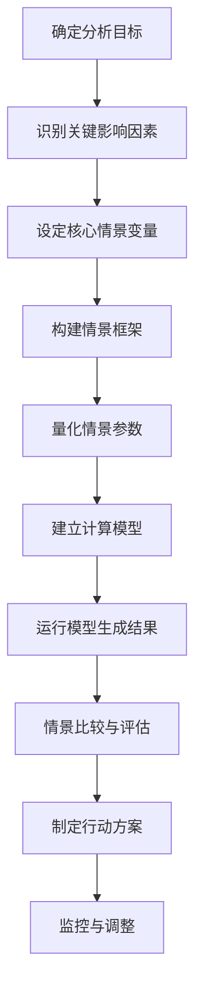

---
{"tags":["财务BP","情景分析","决策支持","多方案评估"],"aliases":["情景规划","多情境分析"],"created":"2023-11-16","dg-publish":true,"permalink":"/知识共享/001_财务/01_财务BP/01_学习内容/06_BP工具与模板/高级分析/情景分析工具/","dgPassFrontmatter":true}
---

# 情景分析工具

## 概述
情景分析是财务BP工作中应对不确定性的核心工具，通过构建多种可能的未来情景，评估不同情况下的财务表现和决策结果。本文详细介绍情景分析的基本概念、实施方法、应用领域、案例研究、实施挑战及最佳实践。

## 情景分析基础

### 基本概念
情景分析是一种系统性方法，通过构建多个可能的未来情境，评估各种条件下的决策方案表现。与单点预测不同，情景分析承认未来的不确定性，提供更全面的决策支持。

### 情景分析的类型
1. **定性情景分析**：基于专家判断和叙述性描述的情景构建
2. **定量情景分析**：基于数据模型和变量关系的情景模拟
3. **混合型情景分析**：结合定性判断和定量建模的综合分析

### 情景结构
典型的情景分析通常包含以下情景：
- **基准情景**：最可能发生的情况，通常基于当前趋势延续
- **乐观情景**：有利因素主导的情况，表现好于预期
- **悲观情景**：不利因素主导的情况，表现差于预期
- **极端情景**：低概率但高影响的情况，用于压力测试
- **替代情景**：基于不同核心假设的可能发展路径

## 情景分析实施流程

### 情景构建方法
1. **趋势外推法**：基于历史数据趋势进行延伸预测
2. **专家意见法**：基于领域专家对未来发展的判断
3. **德尔菲法**：通过多轮专家匿名问卷收集和反馈形成共识
4. **交叉影响分析**：分析多个变量间的相互影响关系
5. **形态分析法**：组合不同因素的可能状态创建情景

### 情景参数设定
1. **关键变量识别**：确定对结果有显著影响的核心变量
2. **变量取值范围**：基于历史数据、专家判断确定参数范围
3. **情景一致性检验**：确保各变量组合在逻辑上相互一致
4. **概率权重分配**：为不同情景分配发生的相对概率

## 财务BP中的情景分析应用

### 战略规划情景分析
**应用场景**：
- 长期业务发展战略评估
- 新市场进入决策
- 多年期投资组合规划

**核心变量**：
- 市场增长率
- 竞争格局变化
- 技术发展路径
- 宏观经济环境

**分析框架**：构建3-5个不同战略环境的情景，评估战略方向的稳健性

### 预算编制情景分析
**应用场景**：
- 年度预算编制
- 滚动预测更新
- 资源分配规划

**核心变量**：
- 销售预测变化
- 成本结构调整
- 运营效率改善
- 短期市场波动

**分析框架**：通常构建基准、乐观、悲观三种情景，为预算决策提供弹性区间

### 投资决策情景分析
**应用场景**：
- 资本支出决策
- 并购项目评估
- 新产品开发投资

**核心变量**：
- 初始投资规模
- 预期现金流量
- 市场接受度
- 技术实现难度

**分析框架**：评估投资项目在不同情景下的NPV、IRR和回收期变化

### 风险管理情景分析
**应用场景**：
- 流动性风险评估
- 汇率风险管理
- 供应链中断应对

**核心变量**：
- 风险事件发生概率
- 潜在损失规模
- 缓解措施有效性
- 恢复时间长度

**分析框架**：构建包含极端情况的压力测试情景，评估企业风险承受能力

## 情景分析实施工具

### Excel模型构建
**基本方法**：
1. **参数表设计**：创建包含所有情景变量的参数表
2. **情景切换机制**：使用下拉菜单或按钮在情景间切换
3. **计算引擎**：基于选定情景的参数进行计算
4. **结果展示**：通过表格和图表对比不同情景结果

**Excel函数技巧**：
- 使用VLOOKUP或INDEX/MATCH函数获取情景参数
- 使用DATA TABLE进行敏感性分析
- 使用OFFSET和INDIRECT函数创建动态引用
- 使用IF、CHOOSE函数处理情景选择逻辑

### 高级情景分析工具
1. **Palisade @RISK**：结合蒙特卡洛模拟的高级情景分析
2. **Oracle Crystal Ball**：基于Excel的情景模拟与优化工具
3. **Power BI What-If Analysis**：交互式情景分析可视化
4. **Python/R分析**：通过编程实现复杂情景模型的构建和分析

### 可视化表现方法
1. **情景树图**：展示决策分支和各情景概率
2. **蜘蛛网图**：比较多个情景在多维指标上的表现
3. **情景漏斗图**：展示从基准情景到极端情景的分布范围
4. **热力图**：展示不同情景组合下的结果变化
5. **瀑布图**：分析各因素对情景差异的贡献度

## 案例研究

### 案例一：高科技公司产品投资情景分析

**背景**：某高科技企业计划投资新产品线，面临市场需求、技术成熟度和竞争反应的不确定性。

**情景设定**：
1. **基准情景**：市场需求中等增长，技术按计划成熟，竞争对手反应中性
2. **乐观情景**：市场需求高速增长，技术提前突破，竞争对手反应滞后
3. **悲观情景**：市场需求增长低于预期，技术实现延迟，竞争对手快速跟进
4. **颠覆情景**：替代技术出现，市场结构发生根本性变化

**分析过程**：
1. 构建产品生命周期财务模型
2. 为各情景设置关键参数组合
3. 计算各情景下的财务指标和战略位置
4. 识别关键决策点和风险因素

**决策应用**：
1. 采用分阶段投资策略，设定明确的退出点
2. 针对悲观情景制定特定的成本控制计划
3. 建立技术监测机制，跟踪潜在的颠覆性技术
4. 设计模块化产品架构，提高战略灵活性

**结果**：企业成功应对了技术延迟问题，通过分阶段投资控制了风险，最终实现了预期的投资回报。

### 案例二：零售企业扩张策略情景分析

**背景**：某零售连锁企业计划在新区域扩张，需要评估不同扩张速度和模式的影响。

**情景设定**：
1. **保守扩张**：每年开设3-5家新店，集中在成熟市场
2. **积极扩张**：每年开设8-12家新店，同时进入成熟和新兴市场
3. **并购扩张**：通过收购区域性竞争对手快速扩张
4. **线上转型**：减缓实体店扩张，加大线上渠道投入

**分析过程**：
1. 构建多年期扩张财务模型
2. 设置各情景下的投资需求、收入增长和运营成本
3. 分析现金流、债务水平和盈利能力变化
4. 评估不同经济周期对各扩张策略的影响

**决策应用**：
1. 采用混合扩张策略，结合适度新店开设和小型区域并购
2. 建立基于绩效触发的扩张节奏调整机制
3. 为应对经济下行准备现金储备和融资方案
4. 同步发展线上能力，提高全渠道整合

**结果**：企业在市场下行期间保持了稳健的财务状况，并在市场恢复期捕捉到了关键扩张机会，实现了市场份额和盈利能力的双重提升。

## 情景分析实施挑战与解决方案

### 常见挑战
1. **情景数量平衡**：情景过多导致分析复杂，过少则覆盖不全面
2. **数据依赖性**：缺乏历史数据或可比参照支持情景设定
3. **偏见影响**：分析者的主观偏见影响情景设计和评估
4. **模型复杂度**：模型过于复杂难以维护，过于简单则失真
5. **组织接受度**：管理层对多情景思维的接受和应用能力有限

### 解决方案
1. **情景设计框架**：采用结构化方法确定关键不确定性和情景数量
2. **多来源数据整合**：结合内外部数据、专家判断和标杆分析
3. **多人参与设计**：引入多角度视角减少单一偏见影响
4. **模块化模型结构**：设计可扩展的模型架构，平衡复杂性和实用性
5. **结果可视化**：通过直观的可视化提高决策者对情景分析的理解和接受

## 最佳实践

### 情景设计最佳实践
1. **聚焦关键不确定性**：优先关注高影响、高不确定性的因素
2. **保持内部一致性**：确保情景内部逻辑自洽，变量关系合理
3. **覆盖合理范围**：情景范围既要足够宽泛以涵盖可能性，又要合理可信
4. **明确情景边界**：清晰定义每个情景的假设、时间范围和适用条件
5. **动态更新机制**：定期审视和更新情景设定，反映最新发展

### 应用与执行最佳实践
1. **情景监测指标**：设定早期预警指标，判断哪个情景正在成为现实
2. **弹性决策设计**：基于情景分析设计具有适应性的决策方案
3. **沟通与共识**：确保关键利益相关者理解情景分析结果及含义
4. **持续学习循环**：将实际结果与情景预测比较，不断改进分析方法
5. **制度化应用**：将情景分析纳入常规决策流程和战略规划周期

## 相关工具与资源
- **Excel模板**：情景分析基础模型模板
- **分析软件**：@Risk, Crystal Ball, Analytica, GoldSim
- **行业报告**：各行业情景分析和趋势预测报告
- **在线资源**：Global Business Network情景规划资源库
- **培训课程**：情景分析和战略规划专业培训

## 参考文献
1. Schwartz, P. (1996). The Art of the Long View: Planning for the Future in an Uncertain World.
2. Van der Heijden, K. (2005). Scenarios: The Art of Strategic Conversation.
3. Schoemaker, P. J. H. (1995). Scenario Planning: A Tool for Strategic Thinking.
4. Wilkinson, A., & Kupers, R. (2014). The Essence of Scenarios: Learning from the Shell Experience.
5. 《战略规划中的情景分析方法》，李明，2018年
6. 《企业财务决策中的情景分析应用》，张华，2021年 