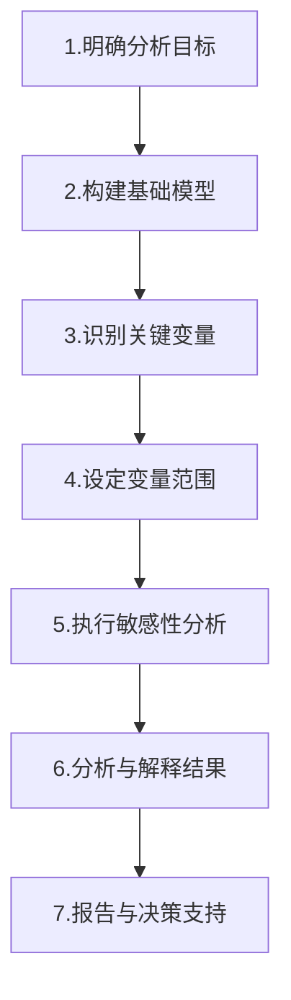

---
{"tags":["财务BP","敏感性分析","财务预测","风险评估"],"aliases":["灵敏度分析","变量影响分析","假设检验"],"created":"2023-11-16","dg-publish":true,"permalink":"/知识共享/001_财务/01_财务BP/01_学习内容/06_BP工具与模板/高级分析/敏感性分析工具/","dgPassFrontmatter":true}
---


# 敏感性分析工具

## 概述

敏感性分析是财务BP工作中系统评估模型输入变量变化对输出结果影响程度的重要技术。本文详细介绍敏感性分析的基本原理、分析方法、实施步骤及案例应用，并提供实用工具模板和最佳实践指南，帮助财务BP准确识别关键影响因素，优化决策过程，提高预测和规划的可靠性。通过掌握敏感性分析技术，财务BP能够更有效地处理不确定性，优化资源分配，并为业务决策提供更加可靠的定量支持。

## 基本概念

### 定义与目的

敏感性分析是通过系统改变模型输入变量来评估其对模型输出影响程度的分析方法。其主要目的包括：

- **识别关键因素**：找出对结果有显著影响的关键变量
- **量化风险**：评估模型对输入变量变化的敏感程度
- **优化决策**：为决策提供更全面的定量支持
- **验证模型**：检验模型的稳健性和合理性
- **资源分配**：指导资源集中于关键影响因素

### 与相关分析工具的区别

| 分析工具 | 主要功能 | 适用情境 | 局限性 |
|---------|----------|----------|--------|
| 敏感性分析 | 评估单个变量变化影响 | 识别关键变量 | 忽略变量间相关性 |
| 情景分析 | 评估多个变量组合变化 | 评估整体情景 | 情景数量有限 |
| Monte Carlo模拟 | 处理多变量概率分布 | 全面风险评估 | 复杂度高 |
| 压力测试 | 评估极端情况下的表现 | 风险承受能力 | 专注最差情况 |

### 敏感性分析的类型

#### 1. 按分析方法分类

- **局部敏感性分析**：一次只改变一个变量
- **全局敏感性分析**：考虑多个变量同时变化
- **多因素敏感性分析**：考虑多个变量的组合效应

#### 2. 按分析范围分类

- **单变量敏感性分析**：评估单个输入变量的影响
- **多变量敏感性分析**：评估多个输入变量的影响
- **极值敏感性分析**：评估输入变量在极端值下的影响

#### 3. 按实施方法分类

- **确定性方法**：使用固定变化值或比例
- **概率性方法**：使用概率分布进行分析
- **数值方法**：使用数值技术进行复杂模型分析

## 实施方法与步骤

### 基本实施流程



#### 1. 明确分析目标

- 确定需要分析的关键输出指标
- 明确决策者关注的不确定性范围
- 定义分析的详细程度和深度
- 确认分析结果的预期用途

#### 2. 构建基础模型

- 建立输入变量与输出变量的数学关系
- 使用最佳估计值建立基准情景
- 验证模型在基准情景下的合理性
- 确认模型结构和计算逻辑的准确性

#### 3. 识别关键变量

- 列出所有可能的输入变量
- 基于专业判断初步筛选潜在关键变量
- 确定历史波动性较大的变量
- 识别决策者特别关注的变量

#### 4. 设定变量范围

- 基于历史数据确定合理变化范围
- 设定均匀变化间隔或特定测试点
- 考虑变量的实际约束条件
- 确保涵盖关键决策阈值

#### 5. 执行敏感性分析

- 系统性更改输入变量的值
- 记录每次变更对输出的影响
- 对多变量分析，使用控制变量法
- 计算敏感性指标（如弹性、敏感系数）

#### 6. 分析与解释结果

- 绘制敏感性图表（如蜘蛛图、龙卷风图）
- 计算敏感性指标和排名
- 识别临界点和决策阈值
- 分析结果的业务含义和影响

#### 7. 报告与决策支持

- 将定量结果转化为业务见解
- 提供清晰的敏感性排名
- 强调决策的关键考量因素
- 提供基于敏感性的行动建议

### 常用敏感性分析技术

#### 单变量敏感性分析

**实施步骤**：
1. 选取一个输入变量
2. 在保持其他变量不变的情况下，系统性改变该变量的值
3. 计算并记录输出变量的变化
4. 对每个输入变量重复此过程
5. 比较不同输入变量对输出的影响程度

**适用场景**：
- 初步筛选关键变量
- 简单模型分析
- 资源有限时的快速评估

**局限性**：
- 忽略变量间的相互作用
- 可能低估复杂情境的风险

#### 情景敏感性分析

**实施步骤**：
1. 定义几个代表性情景（如乐观、基准、悲观）
2. 为每个情景设定一组一致的输入变量值
3. 运行模型计算各情景下的输出结果
4. 比较不同情景间的结果差异
5. 评估各情景的可能性和影响

**适用场景**：
- 战略决策分析
- 业务规划评估
- 风险评估与管理

**局限性**：
- 情景数量有限
- 依赖于主观情景设定

#### 临界点分析

**实施步骤**：
1. 确定关键决策阈值（如NPV=0、IRR=要求回报率）
2. 逐步改变输入变量直到达到阈值
3. 记录达到阈值时的输入变量值
4. 计算变量需要变化的百分比
5. 评估达到临界点的可能性

**适用场景**：
- 项目投资决策
- 风险承受能力评估
- 盈亏平衡分析

**局限性**：
- 专注于单一临界点
- 可能忽视临界点外的风险

#### 矩阵敏感性分析

**实施步骤**：
1. 选择两个关键输入变量
2. 为每个变量设定不同的取值水平
3. 创建二维矩阵，计算每个组合的输出值
4. 分析输出在整个矩阵中的变化模式
5. 识别最佳和最差的组合

**适用场景**：
- 分析两个关键变量的交互效应
- 价格-数量关系分析
- 最优组合寻找

**局限性**：
- 一次只能分析两个变量
- 难以扩展到多维分析

### 敏感性指标与衡量方法

#### 1. 敏感性系数

敏感性系数计算公式：

$$S = \frac{\Delta O/O}{\Delta I/I}$$

其中：
- S = 敏感性系数
- ΔO = 输出变化量
- O = 基准输出值
- ΔI = 输入变化量
- I = 基准输入值

**解释**：
- |S| > 1：高敏感性，输出变化比例大于输入变化比例
- |S| = 1：等比敏感性，输出变化比例等于输入变化比例
- |S| < 1：低敏感性，输出变化比例小于输入变化比例
- S > 0：正相关，输入增加导致输出增加
- S < 0：负相关，输入增加导致输出减少

#### 2. 敏感度范围

敏感度范围计算公式：

$$R = O_{max} - O_{min}$$

其中：
- R = 敏感度范围
- O<sub>max</sub> = 在给定输入变化范围内的最大输出值
- O<sub>min</sub> = 在给定输入变化范围内的最小输出值

**解释**：
- 范围越大，模型对该变量越敏感
- 可用于比较不同输出指标的敏感性

#### 3. 变异系数

变异系数计算公式：

$$CV = \frac{\sigma_O}{\mu_O}$$

其中：
- CV = 变异系数
- σ<sub>O</sub> = 输出值的标准差
- μ<sub>O</sub> = 输出值的平均值

**解释**：
- 用于比较不同单位或数量级变量的敏感性
- 标准化的波动性度量

#### 4. 弹性系数

弹性系数计算公式：

$$E = \frac{dO}{dI} \times \frac{I}{O}$$

其中：
- E = 弹性系数
- dO/dI = 输出对输入的偏导数
- I = 输入变量的值
- O = 输出变量的值

**解释**：
- 测量输入变量单位百分比变化导致的输出百分比变化
- 常用于经济和财务分析

## 可视化与报告技术

### 敏感性图表

#### 1. 龙卷风图(Tornado Chart)

**特点**：
- 横向条形图，按影响程度排序
- 每个条代表一个变量的敏感性范围
- 条越长，敏感性越高

**优势**：
- 直观展示影响程度排名
- 清晰比较不同变量的重要性
- 简洁且易于理解

**示例**：
```
 变量A |---------------------------|
 变量B |-----------------|
 变量C |----------|
 变量D |------|
       +----+----+----+----+----+
      -30% -15%   0%  +15% +30%
        输出变量变化百分比
```

#### 2. 蜘蛛图(Spider Chart)

**特点**：
- 放射状线图，展示多个变量的敏感性
- 曲线斜率反映敏感度
- 交叉点反映变量间的相互影响

**优势**：
- 可同时展示多个变量
- 展示非线性敏感性关系
- 直观展示变量影响的方向

**示例**：
```mermaid
graph TD
    A((中心点)) --- |变量A| B((-30%))
    A --- |变量A| C((+30%))
    A --- |变量B| D((-30%))
    A --- |变量B| E((+30%))
    A --- |变量C| F((-30%))
    A --- |变量C| G((+30%))
```

#### 3. 敏感性热图(Heat Map)

**特点**：
- 二维矩阵，颜色代表敏感性程度
- 通常用于展示两个变量交互影响
- 颜色深浅反映输出变化程度

**优势**：
- 展示变量交互效应
- 识别非线性关系
- 直观展示最佳/最差组合

**示例**：
```
变量A
  ^
高 |  绿  黄  橙  红
  |
  |  绿  黄  橙  红
  |
  |  蓝  绿  黄  橙
  |
低 |  蓝  蓝  绿  黄
  +---------------->
    低         高
       变量B
```

### 报告最佳实践

#### 关键内容要素

1. **分析目的与范围**
   - 明确说明分析目标
   - 定义模型假设和限制
   - 指明分析的应用场景

2. **分析方法与参数**
   - 说明使用的敏感性分析方法
   - 列出分析的关键变量
   - 说明变量范围设定依据

3. **主要发现与见解**
   - 列出关键敏感性排名
   - 强调显著影响因素
   - 突出非线性关系或临界点

4. **决策建议**
   - 明确指出需重点管理的变量
   - 提供基于敏感性的决策建议
   - 建议额外分析或监控措施

#### 有效沟通技巧

- 使用简明的执行摘要
- 将技术分析转化为业务语言
- 强调结果的管理含义
- 避免过度技术术语
- 使用清晰直观的图表
- 以行动建议收尾

## 工具与模板

### Excel实现方法

#### 基础敏感性分析表格模板

**模板结构**：
1. **输入参数工作表**
   - 基准值设置
   - 变化范围设定
   - 变化步长控制

2. **计算模型工作表**
   - 基本财务模型公式
   - 引用输入参数
   - 计算主要输出指标

3. **敏感性分析工作表**
   - 数据表功能（单变量/双变量）
   - 敏感性系数计算
   - 结果汇总表

4. **图表工作表**
   - 龙卷风图
   - 蜘蛛图
   - 结果汇总视图

**Excel关键功能**：
- **数据表**：快速计算多个输入值的结果
- **图表功能**：创建敏感性可视化
- **条件格式**：创建热图
- **数据验证**：控制输入范围
- **场景管理器**：创建和比较多个场景

#### 高级Excel实现技巧

- 使用VBA自动化分析过程
- 创建自定义敏感性分析函数
- 使用宏记录分析步骤
- 建立动态敏感性图表
- 开发交互式敏感性仪表板

### 专业软件工具

**财务建模软件**：
1. **@RISK**：专业风险分析软件，集成敏感性分析功能
2. **Crystal Ball**：Oracle提供的模拟和优化工具
3. **ModelRisk**：专注于风险建模和敏感性分析

**统计分析软件**：
1. **R**：开源统计分析工具，具有强大的敏感性分析包
2. **Python**：使用SALib等包进行敏感性分析
3. **MATLAB**：提供专业敏感性分析工具箱

**选择考虑因素**：
- 分析复杂度和规模
- 与现有系统的集成
- 用户技术熟练度
- 预算限制
- 报告需求

## 在财务BP中的应用

### 预算编制与预测

**应用方式**：
- 识别预算中的高敏感变量
- 评估不同假设对预算的影响
- 设定基于敏感性的预算缓冲
- 确定预算监控的关键指标

**实施要点**：
- 关注历史波动较大的预算项
- 分析成本结构的固定/变动组成
- 考虑收入驱动因素的敏感性
- 评估跨部门预算项的关联影响

**效益**：
- 更精确的预算编制
- 预算审批的更强支持
- 更有针对性的预算监控
- 提高预算调整的响应速度

### 投资项目评估

**应用方式**：
- 分析NPV/IRR对关键假设的敏感性
- 识别投资项目的成败关键因素
- 计算各参数的临界点值
- 评估项目对市场变化的抗风险能力

**实施要点**：
- 重点关注影响收入的市场因素
- 评估成本超支的潜在影响
- 分析项目延期的财务后果
- 考虑融资条件变化的影响

**效益**：
- 更稳健的投资决策
- 更有针对性的项目风险管理
- 提高投资组合的优化
- 改进投资后评估基准

### 定价策略优化

**应用方式**：
- 分析价格变化对销量和利润的影响
- 评估不同客户细分的价格敏感性
- 测试竞争对手价格反应的影响
- 优化产品组合定价

**实施要点**：
- 使用历史数据估计价格弹性
- 考虑成本结构对定价决策的影响
- 分析跨产品的价格关联效应
- 评估渠道结构对定价敏感性的影响

**效益**：
- 更科学的定价决策
- 提高产品组合利润
- 更有效的促销策略设计
- 改进客户价值管理

### 运营效率分析

**应用方式**：
- 评估生产/运营参数对成本的影响
- 分析资源分配对绩效的敏感性
- 识别效率提升的优先领域
- 评估流程改进的潜在收益

**实施要点**：
- 构建详细的成本驱动因素模型
- 考虑规模效应和容量利用率
- 分析供应链参数的敏感性
- 评估质量与成本的权衡关系

**效益**：
- 更有针对性的效率改进
- 优化资源分配决策
- 降低运营风险
- 提高成本控制精确性

## 案例分析

### 案例一：制造企业产品开发投资决策

**企业背景**：
某电子制造企业计划投资8000万元开发新产品线，项目期限5年，预期NPV为1亿元。

**敏感性分析过程**：

1. **变量选择**：
   - 市场需求增长率
   - 产品售价
   - 原材料成本
   - 开发周期
   - 初始投资额
   - 折现率

2. **分析设置**：
   - 基准情景：按最佳估计值
   - 变量范围：各变量上下浮动20%
   - 分析方法：单变量敏感性分析

3. **主要发现**：

   | 变量 | 敏感性系数 | 临界值 | 基准值 | 变化空间 |
   |------|------------|--------|--------|----------|
   | 产品售价 | 2.1 | -12% | 1000元 | 高敏感性 |
   | 市场需求 | 1.8 | -14% | 10万台/年 | 高敏感性 |
   | 原材料成本 | -1.2 | +20% | 400元/台 | 中敏感性 |
   | 开发周期 | -0.8 | +31% | 18个月 | 低敏感性 |
   | 初始投资 | -0.6 | +42% | 8000万元 | 低敏感性 |
   | 折现率 | -0.5 | +5% | 12% | 中敏感性 |

4. **敏感性图表**：
   ```mermaid
   graph LR
       A[龙卷风图] --> B[产品售价:±40%NPV]
       A --> C[市场需求:±36%NPV]
       A --> D[原材料成本:±24%NPV]
       A --> E[折现率:±10%NPV]
       A --> F[开发周期:±8%NPV]
       A --> G[初始投资:±6%NPV]
   ```

**决策支持与建议**：
- 项目盈利能力对产品定价和市场需求高度敏感
- 建议加强产品差异化以支持价格水平
- 实施灵活定价策略以应对市场变化
- 加强市场需求预测和监控
- 与供应商建立长期合约锁定材料成本
- 项目开发时间和初始投资波动对结果影响有限，可适当提高投入以保证质量和创新
- 设计分阶段投资策略，降低需求风险

### 案例二：零售企业门店扩张决策

**企业背景**：
某零售连锁计划在新区域开设15家门店，需评估不同扩张速度和区域选择的财务影响。

**敏感性分析应用**：

1. **矩阵敏感性分析**：
   - 横轴：不同区域组合(5个区域可选)
   - 纵轴：不同扩张速度(1-3年完成)
   - 矩阵值：5年ROI

2. **主要发现**：
   - 区域A+B组合下扩张速度对ROI影响较小(±5%)
   - 区域C+D组合对扩张速度高度敏感(±22%)
   - 最佳组合为区域B+E，2年扩张速度(ROI=18%)
   - 最差组合为区域C+D，1年扩张速度(ROI=6%)

3. **临界点分析**：
   - 单店销售额临界点：年均38万元
   - 人力成本临界点：不超过总成本的45%
   - 租金上涨临界点：年均不超过8%

**决策支持与建议**：
- 采用区域B+E的组合进行扩张
- 实施2年扩张计划，平衡速度与风险
- 设立单店销售额监控预警(40万元)
- 加强人力成本控制，推进部分流程自动化
- 优先选择长期稳定的租赁合同
- 针对区域C特别加强当地市场研究
- 建立门店表现评估体系，设定提前退出机制

## 实施挑战与应对策略

### 数据与假设挑战

**常见挑战**：
- 历史数据不足或质量差
- 难以确定合理的变量范围
- 对新业务缺乏参考基准
- 变量间关系复杂

**应对策略**：
- 结合内部数据与行业基准
- 使用专家判断补充数据
- 采用情境分析代替精确范围
- 清晰说明数据限制和假设
- 随着数据积累逐步细化模型

### 方法论挑战

**常见挑战**：
- 敏感性分析方法选择不当
- 忽略变量间的相互作用
- 过度复杂的模型难以解释
- 非线性关系处理不足

**应对策略**：
- 根据决策需求选择适当方法
- 使用多变量分析补充单变量分析
- 平衡模型复杂度与可解释性
- 使用适当工具处理非线性关系
- 分阶段应用不同敏感性技术

### 组织与沟通挑战

**常见挑战**：
- 决策者对不确定性的理解有限
- 过度关注数字而非洞察
- 分析结果未能转化为行动
- 团队缺乏敏感性分析技能

**应对策略**：
- 以业务语言解释技术结果
- 强调决策含义而非数字
- 明确提出可行的行动建议
- 开发敏感性分析培训材料
- 建立分析结果评估机制

## 最佳实践总结

### 实施成功关键因素

1. **目标明确**：将分析与具体决策问题紧密关联
2. **数据质量**：确保输入变量的值和范围合理
3. **方法选择**：根据问题复杂性选择合适的分析方法
4. **重点突出**：关注真正对结果有显著影响的变量
5. **清晰沟通**：以决策者理解的方式展示结果
6. **行动导向**：将分析结果转化为具体行动建议
7. **迭代改进**：持续完善分析方法和模型

### 实施清单

- [ ] 明确定义分析目标和范围
- [ ] 构建稳健的基础财务模型
- [ ] 识别并筛选关键输入变量
- [ ] 设定合理的变量变化范围
- [ ] 选择适当的敏感性分析方法
- [ ] 执行分析并记录结果
- [ ] 创建清晰的结果可视化
- [ ] 分析并解释关键发现
- [ ] 提出基于敏感性的建议
- [ ] 与决策者有效沟通
- [ ] 监控关键敏感变量
- [ ] 更新和完善分析

## 相关链接

- [[知识共享/001_财务/01_财务BP/01_学习内容/06_BP工具与模板/高级分析/Monte Carlo模拟工具\|知识共享/001_财务/01_财务BP/01_学习内容/06_BP工具与模板/高级分析/Monte Carlo模拟工具]]
- [[知识共享/001_财务/01_财务BP/01_学习内容/06_BP工具与模板/基础方法/决策树分析方法\|决策树分析方法]]
- [[知识共享/001_财务/01_财务BP/01_学习内容/06_BP工具与模板/财务建模/财务建模最佳实践\|财务建模最佳实践]]
- [[财务BP预测方法\|财务BP预测方法]]

## 参考文献

1. Saltelli, A., Ratto, M., Andres, T. (2017). 《Global Sensitivity Analysis: The Primer》. Wiley.
2. Pannell, D.J. (2019). 《Sensitivity Analysis of Normative Economic Models: Theoretical Framework and Practical Strategies》. Agricultural Economics, 16(2), 139-152.
3. French, S. (2018). 《Decision Theory: An Introduction to the Mathematics of Rationality》. Ellis Horwood.
4. 王华, 李明. (2019). 《敏感性分析在企业财务决策中的应用》. 财会月刊, 15(7), 56-70.
5. 张建国, 陈立. (2020). 《投资项目敏感性分析方法研究》. 会计研究, 12(4), 89-105.
6. Borgonovo, E., Plischke, E. (2018). 《Sensitivity Analysis: A Review of Recent Advances》. European Journal of Operational Research, 248(3), 869-887.
7. Day, R.H. (2019). 《Sensitivity Analysis in Business Planning》. Journal of Business, 36(1), 78-91. 