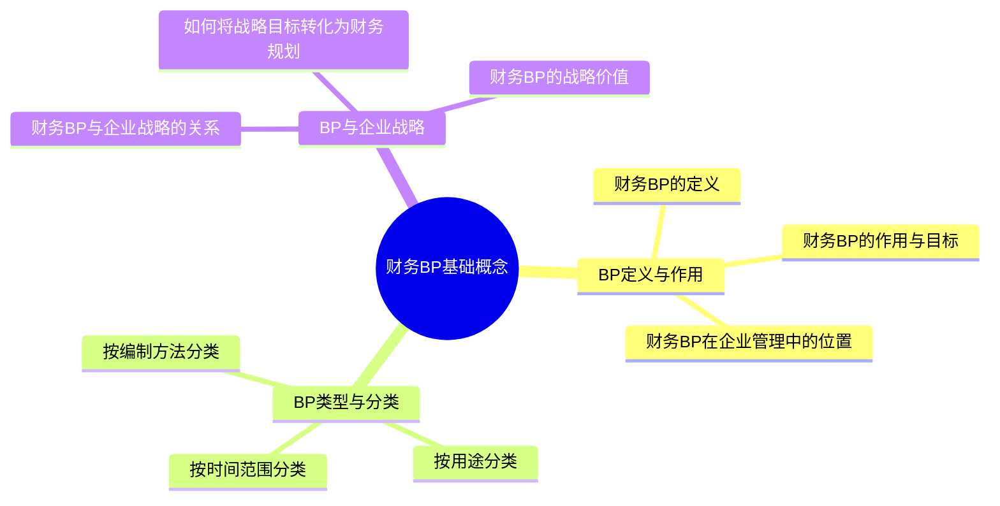
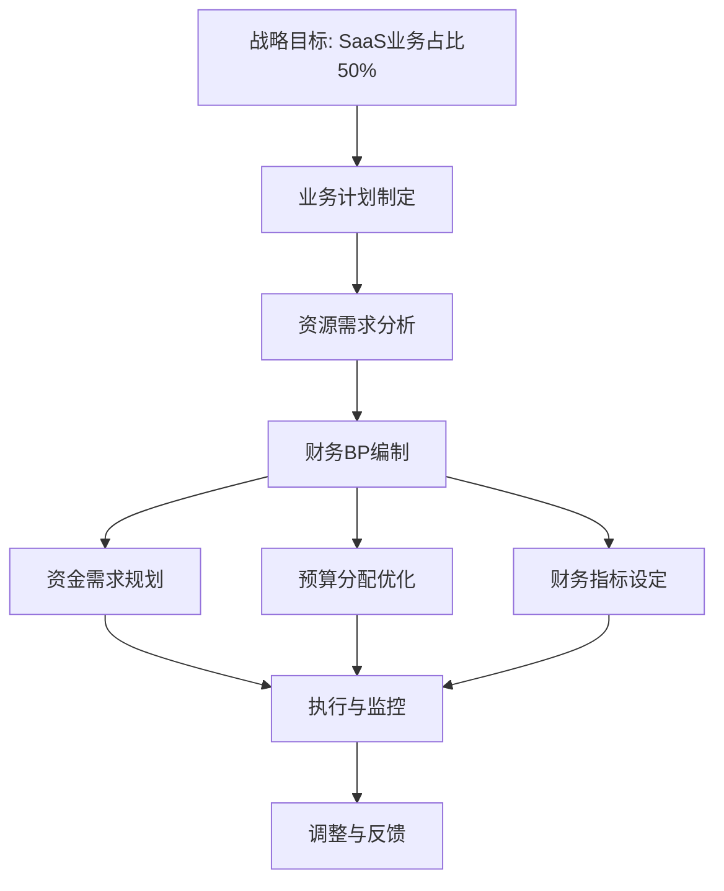

---
{"tags":["财务BP","基础概念","预算规划","财务规划","商业计划"],"aliases":["财务业务规划基础","预算基础知识"],"created":"2024-05-13","update":"2024-05-13","dg-publish":true,"permalink":"/知识共享/001_财务/01_财务BP/02_笔记/01-财务BP基础概念/","dgPassFrontmatter":true}
---

# 财务BP基础概念

## 引言

财务BP(Business Plan/Budget Planning)是连接企业战略与实际业务运营的桥梁，通过系统性的规划和预测，为企业提供资源配置和财务决策的依据。本章将系统介绍财务BP的核心概念、分类方法和战略意义，建立财务BP知识体系的基础框架。

## 核心内容

### 1. BP定义与作用

财务BP是指企业为实现战略目标而制定的财务计划和预算方案，通常包含收入预测、成本预算、资本支出计划和现金流预测等内容。

主要作用包括：
- 明确财务目标和计划
- 协调组织资源配置
- 作为业绩评估的基准
- 促进战略与执行的一致性

在企业管理体系中，财务BP处于战略规划与日常运营之间的关键环节，是战略落地的重要工具。

### 2. BP类型与分类

按时间范围分类：
- 短期BP（1年以内）：侧重于具体实施计划和精细预测
- 中期BP（1-3年）：关注业务发展方向和资源配置
- 长期BP（3-5年或更长）：聚焦战略目标和市场定位

按用途分类：
- 运营性BP（日常业务预算）：包括销售、生产、采购和费用预算
- 投资性BP（资本支出预算）：涵盖固定资产投资、研发投入等
- 融资性BP（资金需求与融资计划）：解决资金来源与使用问题

按编制方法分类：
- 自上而下法：管理层制定总体目标，向下分解
- 自下而上法：基层部门提出预算，向上汇总
- 混合法：兼顾战略指引和基层实际情况

### 3. BP与企业战略

财务BP与企业战略的关系是相互支持、相互验证的。战略决定BP的方向和重点，而BP则检验战略的可行性并提供资源保障。

将战略目标转化为财务规划的步骤：
1. 明确战略目标和关键指标
2. 分解战略到具体业务计划
3. 量化业务计划为财务指标
4. 制定详细的预算方案
5. 设置监控与调整机制

财务BP的战略价值包括：
- 资源有效配置，支持战略重点
- 发现战略执行中的障碍和冲突
- 促进组织协同和目标一致
- 为战略调整提供数据支持

## 应用示例

### 案例：科技企业的战略与BP对接

某科技企业制定了"三年内将SaaS业务收入提升至总收入50%"的战略目标。财务BP团队通过以下步骤支持该战略：

1. 分析当前SaaS业务基础（目前占比20%）
2. 与业务团队共同制定客户获取和留存目标
3. 规划必要的研发和营销资源投入
4. 建立季度追踪指标和调整机制
5. 设计多情景的财务预测模型

财务BP通过资源分配优化和财务可行性分析，帮助管理层确定了合理的增长路径和阶段性目标，确保战略落地。

## 相关链接

- [[知识共享/001_财务/01_财务BP/01_学习内容/02_预算编制基础/预算编制流程/预算编制的基本步骤\|预算编制的基本步骤]]
- [[知识共享/001_财务/01_财务BP/01_学习内容/03_财务预测与模型/财务报表预测/报表间的逻辑关系\|报表间的逻辑关系]]
- [[知识共享/001_财务/01_财务BP/01_学习内容/05_高级分析方法/风险评估/财务风险识别\|财务风险识别]]
- [[知识共享/001_财务/01_财务BP/01_学习内容/06_BP工具与模板/Excel模型构建/财务模型设计原则\|财务模型设计原则]]

## 参考文献

1. Bragg, S. M. (2021). *Budgeting: A Comprehensive Guide*. Accounting Tools.
2. Hope, J., & Fraser, R. (2013). *Beyond Budgeting: How Managers Can Break Free from the Annual Performance Trap*. Harvard Business Review Press.
3. 刘志远 (2020). 《战略财务管理》. 中信出版社.
4. 王永贵 (2019). 《预算管理实务》. 机械工业出版社.
5. Kaplan, R. S., & Norton, D. P. (2008). *The Execution Premium: Linking Strategy to Operations for Competitive Advantage*. Harvard Business Press. 