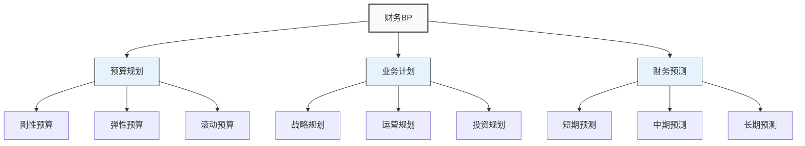

---
{"dg-publish":true,"tags":["财务BP","概念速查","基础知识","财务规划"],"创建日期":"2024-04-28","permalink":"/知识共享/001_财务/01_财务BP/02_笔记/01_概念速查/財務BP核心概念速查/","dgPassFrontmatter":true}
---

> [!info] 概述
> 本笔记汇总了财务BP(Business Plan/Budget Planning)中的核心概念，提供简明扼要的解释和关联，方便快速查阅和复习。

## 核心概念图谱

## 基础术语速查

| 术语 | 定义 | 关键特点 |
|-----|-----|---------|
| 财务BP | 通过定量分析和预测支持企业决策的财务规划过程 | 综合、前瞻、量化 |
| 预算 | 对未来一段时间内的收入、支出和资源分配的计划 | 控制性、目标导向 |
| 业务计划 | 阐述企业战略和行动方案的综合文档 | 战略性、叙述性 |
| 财务预测 | 基于历史数据和假设对未来财务状况的估计 | 预测性、多情景 |
| 责任中心 | 预算管理中的基本单位，明确预算执行责任 | 分权管理、绩效考核 |
| 成本动因 | 导致成本变化的因素或活动 | 因果关系、可控性 |
| 预算差异 | 实际结果与预算目标之间的差异 | 分析指标、纠偏依据 |
| 资本预算 | 规划长期资产投资和筹资的过程 | 长期性、战略性 |
| 营运预算 | 规划日常经营活动的收入与支出 | 短期性、运营性 |
| 预算周期 | 预算编制、执行、分析、反馈的完整流程 | 循环性、持续改进 |

## 预算类型比较

### 按时间范围分类

- **短期预算**：通常覆盖1年以内，细节精确，指导日常运营
- **中期预算**：覆盖1-3年，平衡详细度与前瞻性，支持中期规划
- **长期预算**：覆盖3-5年或更长，战略性强，精确度相对较低

### 按编制方法分类

- **固定预算**：期初制定后不变更，简单但缺乏灵活性
- **弹性预算**：随业务活动水平调整，适应性强
- **滚动预算**：定期更新，保持持续的前瞻期，始终具有完整规划
- **零基预算**：每期重新评估所有支出，不受历史限制
- **活动基础预算**：基于具体活动分配资源，精确性高

### 按用途分类

- **运营预算**：日常经营活动的收支规划
- **资本预算**：长期资产投资与筹资规划
- **现金预算**：流动性管理和现金流规划
- **特殊项目预算**：针对特定项目或活动的专项预算

## 核心流程速览

1. **预算规划启动**：确定目标、原则和时间表
2. **收集信息与数据**：汇总内外部信息和历史数据
3. **制定假设**：建立预算基础假设
4. **编制各部门预算**：自下而上收集预算需求
5. **汇总与平衡**：整合各部门预算并解决冲突
6. **审核与批准**：管理层审核和批准最终预算
7. **执行与监控**：对照预算执行业务活动
8. **分析与反馈**：分析差异并提供反馈
9. **修订与调整**：必要时修订预算

## 常见问题速查

**Q: 刚性预算与弹性预算的主要区别?**  
A: 刚性预算一旦确定不随环境变化调整，而弹性预算会根据业务活动水平自动调整。

**Q: 什么是滚动预算?**  
A: 定期（通常每月或每季度）更新的预算，保持固定的预测期长度，如持续保持12个月的预测期。

**Q: 预算差异分析的主要目的?**  
A: 识别实际与计划的偏差，分析原因，采取纠正措施，改进未来预算编制。

**Q: 零基预算的优势与挑战?**  
A: 优势是避免历史惯性，真正按需分配资源；挑战是工作量大，需要全面重新评估每项支出。

**Q: 财务BP与战略规划的关系?**  
A: 财务BP是战略规划的量化表达，将战略目标转化为具体的财务目标和资源分配计划。

## 相关概念链接

- [[知识共享/001_财务/01_财务BP/01_学习内容/01_财务BP基础概念/BP定义与作用/财务BP的定义\|财务BP的定义]]
- [[知识共享/001_财务/01_财务BP/01_学习内容/02_预算编制基础/预算编制流程/预算编制流程\|预算编制流程]]
- [[知识共享/001_财务/01_财务BP/01_学习内容/01_财务BP基础概念/BP定义与作用/财务BP在企业管理中的位置\|财务BP在企业管理中的位置]]
- [[知识共享/001_财务/01_财务BP/01_学习内容/01_财务BP基础概念/BP类型与分类/按时间范围分类\|按时间范围分类]]
- [[预算与战略的关系\|预算与战略的关系]] 