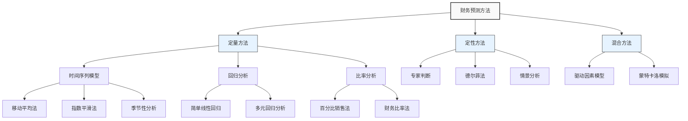

---
{"dg-publish":true,"tags":["财务BP","预测方法","财务规划","方法论","速查"],"创建日期":"2024-04-28","permalink":"/知识共享/001_财务/01_财务BP/02_笔记/01_概念速查/财务预测方法论速查/","dgPassFrontmatter":true}
---

> [!info] 概述
> 本笔记汇总了财务BP中常用的预测方法论，从基础预测技术到高级模型，提供简明扼要的解释和应用场景对比，便于快速查询和选择适合的预测方法。

## 预测方法分类图

## 常用预测方法速查表

| 预测方法 | 适用场景 | 优势 | 局限性 | 准确度 |
|---------|---------|------|--------|-------|
| 移动平均法 | 短期、稳定趋势 | 简单、易于理解和实施 | 不适合趋势变化快的数据 | ★★★☆☆ |
| 指数平滑法 | 短中期、有波动数据 | 对近期数据给予更高权重 | 参数选择影响结果 | ★★★★☆ |
| 季节性分析 | 有明显季节性数据 | 能捕捉周期性变化 | 需要足够历史数据 | ★★★★☆ |
| 简单线性回归 | 单一变量关系 | 直观、易解释 | 仅适用于线性关系 | ★★★☆☆ |
| 多元回归分析 | 多因素影响 | 考虑多个变量影响 | 变量间可能存在多重共线性 | ★★★★☆ |
| 百分比销售法 | 财务报表预测 | 简单、快速 | 假设线性关系可能不准确 | ★★☆☆☆ |
| 德尔菲法 | 长期预测、新领域 | 集合专家智慧 | 耗时、可能受个人偏见影响 | ★★★☆☆ |
| 情景分析 | 不确定环境 | 考虑多种可能性 | 情景选择可能主观 | ★★★☆☆ |
| 驱动因素模型 | 业务理解深入 | 直接链接业务驱动因素 | 需要精确识别驱动因素 | ★★★★☆ |
| 蒙特卡洛模拟 | 高不确定性 | 考虑多变量随机性 | 计算复杂、输入假设敏感 | ★★★★★ |

## 定量预测方法详解

### 时间序列分析

**移动平均法**
- **公式**: $F_t = \frac{A_{t-1} + A_{t-2} + ... + A_{t-n}}{n}$
- **应用**: 消除短期波动，识别基础趋势
- **实践技巧**: 周期选择应与业务周期相匹配

**指数平滑法**
- **公式**: $F_t = \alpha \times A_{t-1} + (1-\alpha) \times F_{t-1}$
- **应用**: 短期销售预测、库存管理
- **参数选择**: α值(0-1)越大，越重视近期数据

**季节性分析**
- **方法**: 分解时间序列为趋势、季节性和随机成分
- **关键步骤**: 季节指数计算 → 去季节化 → 趋势分析 → 重新季节化
- **适用**: 季节性明显的业务(零售、旅游)

### 回归分析

**简单线性回归**
- **公式**: $Y = a + bX + \varepsilon$
- **应用**: 分析单一因素对结果的影响
- **判断标准**: R²(决定系数)、p值

**多元回归分析**
- **公式**: $Y = a + b_1X_1 + b_2X_2 + ... + b_nX_n + \varepsilon$
- **应用**: 分析多因素对结果的综合影响
- **注意事项**: 变量选择、多重共线性检验、模型验证

### 比率分析

**百分比销售法**
- **原理**: 假设部分财务项目与销售收入成比例变动
- **步骤**: 确定销售预测 → 计算比率(项目/销售) → 应用比率预测
- **应用**: 资产负债表和利润表项目预测

**财务比率法**
- **常用比率**: 毛利率、净利率、周转率、负债比率等
- **应用**: 基于目标财务比率进行反向预测
- **优势**: 与财务目标直接关联

## 定性预测方法

### 专家判断
- **方法**: 基于经验和领域知识进行判断
- **适用**: 数据有限、新产品、市场变化大
- **增强技巧**: 结构化流程、多专家参与、明确假设

### 德尔菲法
- **流程**: 匿名问卷 → 汇总反馈 → 专家再次评估 → 达成共识
- **适用**: 长期规划、技术发展预测
- **优势**: 避免个人主导、集思广益

### 情景分析
- **步骤**: 识别关键不确定因素 → 构建情景矩阵 → 开发情景 → 评估影响
- **典型情景**: 最佳情景、基准情景、最差情景
- **应用**: 战略规划、风险评估

## 混合预测方法

### 驱动因素模型
- **原理**: 识别并量化核心业务驱动因素对财务结果的影响
- **步骤**: 驱动因素识别 → 关系量化 → 假设设定 → 模型构建
- **优势**: 直接链接业务活动与财务结果

### 蒙特卡洛模拟
- **方法**: 基于输入变量的概率分布进行大量随机模拟
- **输出**: 结果的概率分布而非单一值
- **应用**: 复杂项目评估、风险量化、投资决策

## 应用场景与选择指南

### 收入预测
- **短期(1-3个月)**: 移动平均法、指数平滑法
- **中期(3个月-1年)**: 季节性分析、回归分析、驱动因素模型
- **长期(1年以上)**: 情景分析、德尔菲法、多元回归

### 成本预测
- **变动成本**: 百分比销售法、回归分析
- **固定成本**: 趋势分析、专家判断
- **混合成本**: 高低点法、回归分析

### 资本支出预测
- **常规更新**: 历史数据分析、资产寿命周期
- **扩张投资**: 情景分析、专家判断、蒙特卡洛模拟

### 现金流预测
- **短期(月度)**: 直接法、应收应付周期分析
- **中长期**: 间接法、比率分析、驱动因素模型

## 预测准确性提升技巧

1. **组合多种方法**: 不同方法优缺点互补
2. **定期校准**: 对比预测与实际结果，调整模型
3. **敏感性分析**: 测试关键假设变化对结果的影响
4. **细分预测**: 按产品线、区域等细分预测后汇总
5. **考虑外部因素**: 宏观经济、行业趋势、竞争动态
6. **避免锚定偏差**: 不过度依赖历史数据或初始假设
7. **记录假设**: 清晰记录所有假设，便于回溯分析

## 常见问题与解决方案

**Q: 如何处理数据不足的情况?**  
A: 1) 寻找替代数据源或代理变量; 2) 结合专家判断; 3) 使用情景分析

**Q: 预测偏差较大时如何调整?**  
A: 1) 检查基础假设; 2) 考虑是否遗漏关键变量; 3) 尝试不同预测方法; 4) 缩短预测周期

**Q: 如何平衡多个部门的预测?**  
A: 1) 建立标准预测流程; 2) 使用一致的宏观假设; 3) 设立协调机制解决分歧

**Q: 预测与目标设定的关系?**  
A: 预测应客观反映可能结果，目标则体现期望值，两者应有合理区分但相互支持

## 相关链接

- [[知识共享/001_财务/01_财务BP/01_学习内容/02_预算编制基础/收入预测方法/收入预测方法\|收入预测方法]]
- [[知识共享/001_财务/01_财务BP/01_学习内容/02_预算编制基础/成本预测方法/成本预测方法\|成本预测方法]]
- [[知识共享/001_财务/01_财务BP/01_学习内容/03_财务预测与模型/情景分析/情景分析的决策应用\|情景分析的决策应用]]
- [[财务报表预测\|财务报表预测]]
- [[知识共享/001_财务/01_财务BP/01_学习内容/03_财务预测与模型/敏感性分析/敏感性分析的目的与方法\|敏感性分析的目的与方法]] 