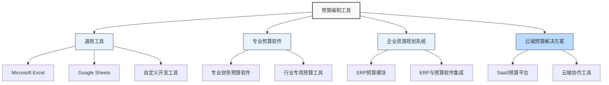

---
{"dg-publish":true,"tags":["财务BP","预算编制","工具比较","软件应用","速查"],"创建日期":"2024-04-28","permalink":"/知识共享/001_财务/01_财务BP/02_笔记/01_概念速查/预算编制工具速查/","dgPassFrontmatter":true}
---

> [!info] 概述
> 本笔记汇总了财务BP预算编制过程中常用的工具和软件，包括从基础电子表格到专业预算软件的比较、功能特点和适用场景，帮助选择最适合的预算工具。

## 预算工具分类图

## 工具对比速查表

| 工具类型 | 代表产品 | 成本级别 | 适用企业规模 | 实施难度 | 灵活性 | 协作能力 | 数据集成 |
|---------|---------|---------|------------|---------|-------|---------|---------|
| Excel/表格 | Excel, Google Sheets | ★☆☆☆☆ | 小型、部分中型 | ★☆☆☆☆ | ★★★★★ | ★★☆☆☆ | ★★☆☆☆ |
| 专业预算软件 | Prophix, Adaptive Planning | ★★★☆☆ | 中型、大型 | ★★★☆☆ | ★★★★☆ | ★★★★☆ | ★★★★☆ |
| ERP预算模块 | SAP BPC, Oracle PBCS | ★★★★★ | 中大型 | ★★★★★ | ★★★☆☆ | ★★★★☆ | ★★★★★ |
| 云端预算平台 | Anaplan, Workday Adaptive | ★★★★☆ | 各规模 | ★★★☆☆ | ★★★★☆ | ★★★★★ | ★★★★☆ |
| 自定义开发 | 内部开发系统 | ★★★★☆ | 特定需求企业 | ★★★★★ | ★★★★★ | ★★★☆☆ | ★★★☆☆ |

## 通用工具详解

### Microsoft Excel

**核心功能**:
- 数据输入与格式化
- 公式和函数计算
- 数据透视表分析
- 图表可视化
- 宏和VBA自动化

**预算应用技巧**:
- 使用命名区域提高公式可读性
- 建立输入、计算、输出分离的工作表结构
- 使用数据验证增强数据质量控制
- 创建驱动因素输入区，链接到预测公式
- 利用SUMIF、VLOOKUP等函数实现动态计算

**优势**:
- 几乎无学习门槛，大多数财务人员熟悉
- 极高的灵活性和定制能力
- 初始成本低，无需大额投资

**局限性**:
- 多用户协作有限
- 数据安全性和版本控制挑战
- 大型复杂模型可能导致性能问题
- 缺乏专业预算流程管理功能

### Google Sheets

**特有优势**:
- 实时多用户协作
- 云端存储，随时随地访问
- 版本历史记录自动保存
- 表单功能便于数据收集

**与Excel区别**:
- 功能相对简化，复杂计算能力较弱
- 处理大量数据的性能较差
- 无需安装，基于浏览器使用
- 集成Google生态系统工具

## 专业预算软件

### 专业财务预算软件

**代表产品**:
- Prophix
- Workday Adaptive Planning
- Vena Solutions
- Board

**核心功能**:
- 预定义的预算模板和工作流
- 版本控制和方案规划
- 多维度分析能力
- 自动合并和汇总
- 高级报表和仪表板
- 审批流程管理

**优势**:
- 预算流程规范化
- 内置财务逻辑和计算
- 支持协作与审批流
- 强大的分析能力

**局限性**:
- 学习曲线较陡
- 定制成本高
- 某些特殊行业需求可能无法满足

### 行业专用预算工具

**行业示例**:
- 零售业: Oracle Retail Financial Planning
- 医疗行业: Kaufman Hall Axiom
- 制造业: Plex Manufacturing Cloud
- 教育机构: Questica Budget

**特点**:
- 内置行业特定维度和指标
- 符合行业最佳实践的流程设计
- 预配置的行业标准报表

## 企业资源规划系统

### ERP预算模块

**代表产品**:
- SAP BPC (Business Planning and Consolidation)
- Oracle PBCS (Planning and Budgeting Cloud Service)
- Microsoft Dynamics 365 Finance

**核心优势**:
- 与交易数据直接集成
- 统一的数据源和业务规则
- 无缝衔接实际数据与预算数据
- 企业级安全和权限管理

**应用考量**:
- 实施周期长，成本高
- 对IT资源依赖程度高
- 需要专业顾问支持

## 云端预算解决方案

### SaaS预算平台

**代表产品**:
- Anaplan
- Planful
- Host Analytics
- Jedox

**核心特性**:
- 订阅模式，无需大额前期投资
- 快速部署，较短实施周期
- 自动更新，减少IT维护
- 随用随付，可扩展性强

**使用场景**:
- 快速增长的企业
- 分散地理位置的团队
- 预算流程需频繁调整的组织
- IT资源有限的企业

## 选择指南与最佳实践

### 企业规模考量

**小型企业(员工<100)**:
- 推荐: Excel/Google Sheets、入门级云端解决方案
- 考虑因素: 成本控制、实施简便、基本功能满足

**中型企业(员工100-1000)**:
- 推荐: 专业预算软件、中端云端解决方案
- 考虑因素: 部门协作、审批流程、多维分析

**大型企业(员工>1000)**:
- 推荐: ERP预算模块、高端专业预算软件、企业级云平台
- 考虑因素: 全球协作、系统集成、数据安全、高级分析

### 行业特性考量

**制造业**:
- 关注: 产能规划、原材料成本、库存预算
- 建议工具: 支持多维度产品线和成本中心的系统

**服务业**:
- 关注: 人力资源规划、项目预算、客户维度分析
- 建议工具: 灵活的人员规划和项目管理功能

**零售业**:
- 关注: 门店规划、季节预测、促销活动预算
- 建议工具: 强大的销售预测和多渠道分析能力

**金融服务**:
- 关注: 合规报告、风险管理、产品线分析
- 建议工具: 高安全性、强大的数据治理和合规功能

### 实施最佳实践

1. **明确需求先于工具选择**
   - 梳理预算流程和痛点
   - 确定必要功能和理想功能
   - 评估未来3-5年需求变化

2. **渐进式实施策略**
   - 从核心模块开始，逐步拓展
   - 先示范部门试点，再全面推广
   - 保留过渡期的备选方案

3. **数据治理同步规划**
   - 统一维度和科目定义
   - 建立数据质量检验机制
   - 明确数据所有权和责任

4. **关注用户采纳**
   - 设计直观易用的界面
   - 提供分层次培训
   - 收集用户反馈并持续优化

## 工具使用常见问题

**Q: Excel预算模型变得越来越复杂和臃肿，如何优化?**  
A: 1) 分拆为多个互联的工作簿; 2) 清理冗余计算和数据; 3) 使用Power Query处理大量数据; 4) 考虑部分迁移至专业工具

**Q: 如何选择云端与本地部署方案?**  
A: 考虑数据安全要求、IT资源、访问便捷性、成本结构偏好（前期资本支出vs持续运营支出）

**Q: 预算工具迁移的最佳时机?**  
A: 1) 年度预算周期开始前3-6个月; 2) 组织变革期（如合并、重组）; 3) 旧系统维护成本攀升时

**Q: 如何提高预算工具数据准确性?**  
A: 1) 实施输入验证规则; 2) 建立自动化一致性检查; 3) 定期与实际数据对比校准; 4) 明确责任制

## 预算工具发展趋势

1. **AI和机器学习集成**
   - 智能预测和异常检测
   - 自动化情景分析
   - 基于历史模式的建议

2. **实时规划与滚动预测**
   - 持续预测替代固定周期
   - 事件触发的预算更新
   - 更短周期的预算调整

3. **移动化与泛设备访问**
   - 移动应用支持
   - 自适应界面设计
   - 语音交互功能

4. **增强的可视化与叙事能力**
   - 数据故事讲述功能
   - 交互式仪表板
   - 自动化见解生成

## 相关链接

- [[Excel模型构建\|Excel模型构建]]
- [[知识共享/001_财务/01_财务BP/01_学习内容/06_BP工具与模板/财务软件应用/常用财务规划软件比较\|常用财务规划软件比较]]
- [[知识共享/001_财务/01_财务BP/01_学习内容/06_BP工具与模板/财务软件应用/软件选择考虑因素\|软件选择考虑因素]]
- [[知识共享/001_财务/01_财务BP/01_学习内容/06_BP工具与模板/财务软件应用/系统整合与数据导入\|系统整合与数据导入]]
- [[知识共享/001_财务/01_财务BP/01_学习内容/06_BP工具与模板/财务软件应用/自动化报告生成\|自动化报告生成]] 