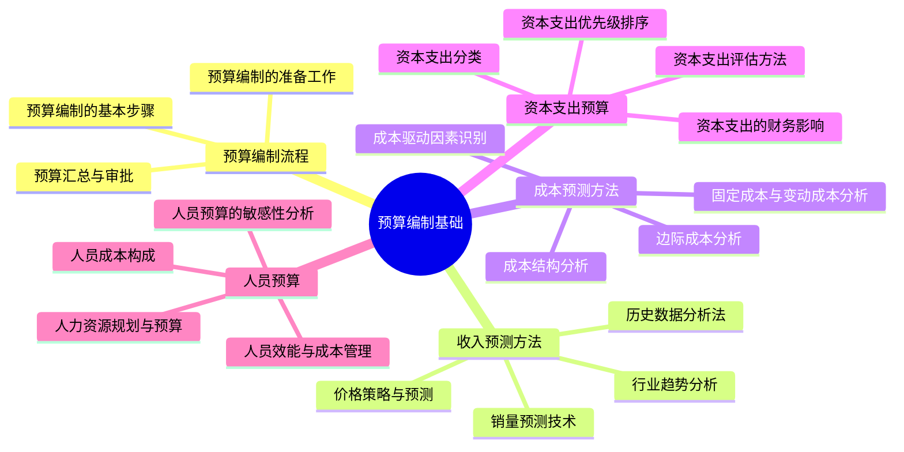
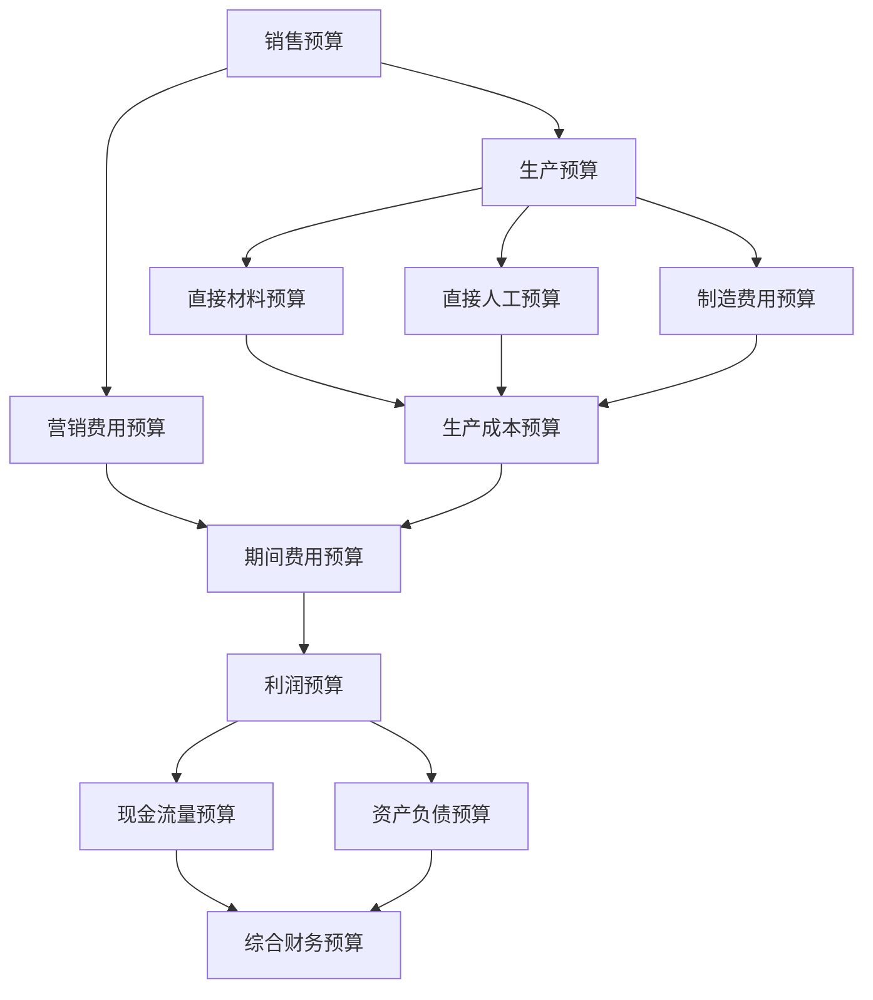

---
{"tags":["财务BP","预算编制","财务规划","收入预测","成本预测","资本支出","人员预算"],"aliases":["预算制定方法","预算编制技术","预算规划流程"],"created":"2024-05-13","update":"2024-05-13","dg-publish":true,"permalink":"/知识共享/001_财务/01_财务BP/02_笔记/02-预算编制基础/","dgPassFrontmatter":true}
---

# 预算编制基础

## 引言

预算编制是财务BP工作的核心环节，涉及企业各类资源的规划与配置。本章系统介绍预算编制的流程、方法和技巧，帮助财务BP人员掌握科学的预算编制方法，提高预算的准确性和实用性。通过标准化的预算编制流程和精准的预测技术，为企业资源优化配置提供有力支持。

## 核心内容

### 1. 预算编制流程

预算编制流程通常包括以下阶段：

**准备阶段**：
- 制定预算政策和指导原则
- 确定预算期间和目标
- 准备预算编制模板和工具
- 组织预算编制培训

**制定阶段**：
- 自上而下传达预算目标
- 各部门编制具体预算
- 部门间协调和平衡
- 初步预算草案形成

**汇总与审批阶段**：
- 整合各部门预算
- 检查预算一致性和合理性
- 管理层审核与调整
- 最终预算确认与批准

**执行与监控阶段**：
- 预算的分解和下达
- 定期预算执行分析
- 预算差异原因分析
- 预算调整与更新

关键成功因素：
- 明确的预算编制责任和权限
- 有效的跨部门沟通机制
- 合理的时间规划和里程碑
- 高层管理者的积极参与和支持

### 2. 收入预测方法

收入预测是预算编制的起点，常用方法包括：

**销量预测技术**：
- 时间序列分析：基于历史销售数据的趋势、季节性和周期性分析
- 市场调研法：通过客户调查、市场研究获取销售预期
- 销售人员评估：结合一线销售人员的市场判断
- 统计回归分析：建立销量与关键驱动因素的数量关系

**价格策略与预测**：
- 价格变动对销量的弹性分析
- 竞争对手定价策略的影响评估
- 产品生命周期与价格调整关系
- 渠道和客户结构变化的价格影响

**行业趋势与历史数据分析**：
- 行业增长率与企业表现对比
- 市场份额变化趋势分析
- 历史销售模式识别
- 新产品与老产品销售对比

### 3. 成本预测方法

成本预测是预算编制的重要组成部分，主要包括：

**成本结构分析**：
- 固定成本与变动成本的识别和分类
- 混合成本的分解技术
- 边际成本和平均成本分析
- 不同业务量下的成本行为预测

**成本驱动因素识别**：
- 业务量驱动因素：产量、销量、服务量等
- 复杂度驱动因素：产品种类、客户数量等
- 效率驱动因素：生产效率、能源利用率等
- 政策驱动因素：薪酬政策、福利制度等

**边际成本分析**：
- 产能利用率与边际成本关系
- 规模效应对成本的影响
- 边际成本在决策中的应用
- 成本控制重点区域识别

### 4. 资本支出预算与人员预算

**资本支出预算**关注企业长期投资活动：

- 资本支出分类：
  - 维持性资本支出
  - 扩张性资本支出
  - 战略性资本支出
  - 法规合规性资本支出

- 资本支出评估方法：
  - 净现值法(NPV)：考虑资金时间价值
  - 内部收益率法(IRR)：投资回报率分析
  - 投资回收期法：流动性风险评估
  - 会计回报率法：会计效益分析

- 资本支出优先级排序：
  - 战略契合度评估
  - 财务回报分析
  - 风险评估与管理
  - 资源约束考量

**人员预算**是大多数企业的主要成本来源：

- 人员成本构成：
  - 基本工资与津贴
  - 绩效奖金与股权激励
  - 社会保险与福利费用
  - 培训与发展成本

- 人员效能与成本管理：
  - 人均产出分析
  - 部门效能评估
  - 人力资源优化配置
  - 外包与自建分析

## 应用示例

### 案例：制造企业的全面预算编制

某中型制造企业的年度预算编制过程：

1. **准备阶段**：
   - 管理层确定下年度销售增长目标为15%
   - 设定毛利率改善1%的目标
   - 资本支出上限为年销售额的5%
   - 发布预算编制指导方针

2. **销售预算编制**：
   - 按产品线和销售区域分解销售目标
   - 考虑新产品上市和老产品退市的影响
   - 分析重点客户需求变化
   - 结合市场容量和份额分析验证目标可行性

3. **生产与成本预算**：
   - 根据销售预测制定生产计划
   - 分析原材料价格趋势，预测采购成本
   - 考虑产能限制和效率提升措施
   - 估算库存水平和生产节奏

4. **人员与费用预算**：
   - 根据产量变化调整生产人员需求
   - 制定销售人员绩效目标和薪酬预算
   - 管理费用控制在收入的8%以内
   - 评估组织结构调整需求

5. **资本支出预算**：
   - 必要性项目（设备更新）：1,000万
   - 效率提升项目：800万
   - 新产品开发设备：500万
   - 按IRR排序，确定最终投资组合

6. **综合财务预算**：
   - 编制损益预算、资产负债预算和现金流预算
   - 分析各财务指标影响
   - 制定融资或投资计划
   - 确定预算控制和调整机制

## 相关链接

- [[知识共享/001_财务/01_财务BP/01_学习内容/01_财务BP基础概念/BP定义与作用/财务BP的作用与目标\|财务BP的作用与目标]]
- [[知识共享/001_财务/01_财务BP/01_学习内容/03_财务预测与模型/财务报表预测/利润表预测方法\|利润表预测方法]]
- [[知识共享/001_财务/01_财务BP/01_学习内容/03_财务预测与模型/敏感性分析/关键变量识别\|关键变量识别]]
- [[知识共享/001_财务/01_财务BP/01_学习内容/05_高级分析方法/投资回报分析/ROI计算方法\|ROI计算方法]]
- [[知识共享/001_财务/01_财务BP/01_学习内容/06_BP工具与模板/Excel模型构建/模型结构与布局\|模型结构与布局]]

## 参考文献

1. Bragg, S. M. (2019). *Budgeting: The Comprehensive Guide*. Accounting Tools.
2. Shim, J. K., & Siegel, J. G. (2021). *Budgeting Basics and Beyond*. Wiley.
3. 陈虎 (2022). 《企业全面预算管理实务》. 中国财政经济出版社.
4. 李明 (2020). 《预算编制与控制》. 东北财经大学出版社.
5. Horngren, C. T., Datar, S. M., & Rajan, M. V. (2018). *Cost Accounting: A Managerial Emphasis*. Pearson.
6. 黄世忠 (2021). 《管理会计与成本控制》. 复旦大学出版社. 