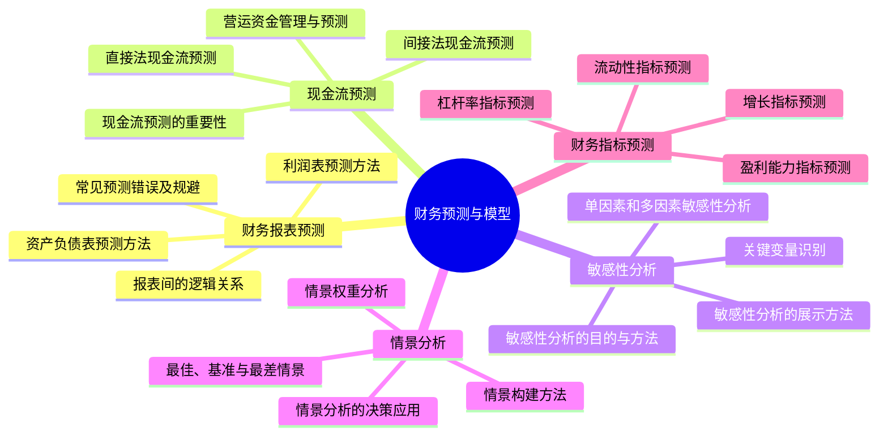
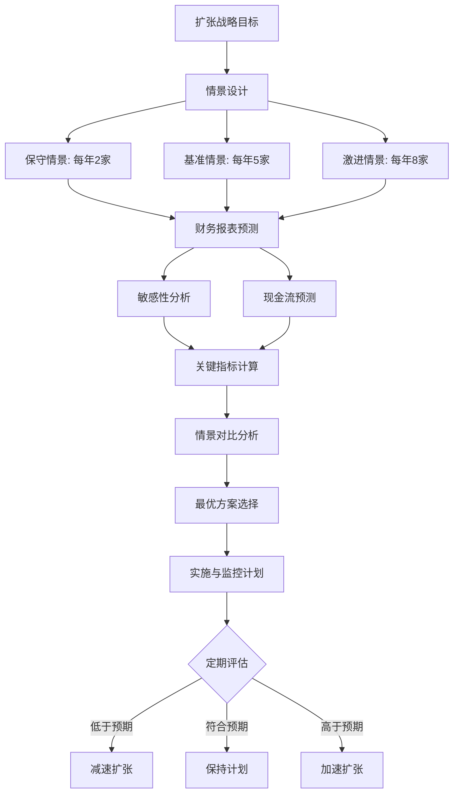

---
{"tags":["财务BP","财务预测","财务模型","现金流预测","敏感性分析","情景分析","指标预测","报表预测"],"aliases":["财务预测技术","模型构建方法","财务情景分析"],"created":"2024-05-13","update":"2024-05-13","dg-publish":true,"permalink":"/知识共享/001_财务/01_财务BP/02_笔记/03-财务预测与模型/","dgPassFrontmatter":true}
---


# 财务预测与模型

## 引言

财务预测与模型是财务BP的技术核心，通过科学的预测方法和模型构建，为企业决策提供数据支持和洞察。本章系统介绍财务报表预测、现金流预测、敏感性分析、情景分析及财务指标预测的方法和应用，帮助财务BP人员掌握全面的预测技能，构建有效的决策支持系统。

## 核心内容



### 1. 财务报表预测

财务报表预测是建立在对企业业务深入理解基础上的系统建模过程：

**利润表预测方法**：
- 收入预测：市场容量、份额、价格、销量等因素分析
- 成本预测：固定成本、变动成本区分和预测
- 费用预测：按费用性质、功能、部门等多维度预测
- 利润预测：毛利率、营业利润率、净利率目标设定

**资产负债表预测方法**：
- 资产项目预测：固定资产、存货、应收账款等
- 负债项目预测：应付账款、借款、其他应付款等
- 资本结构预测：权益和负债比例规划
- 资产负债平衡调整：保持报表平衡的技术方法

**报表间的逻辑关系**：
- 三大报表的勾稽关系
- 常见的逻辑验证公式
- 自动平衡机制的设计
- 循环引用的处理方法

**常见预测错误及规避**：
- 内部一致性错误及检验
- 增长率假设不合理的识别
- 季节性因素忽略的影响
- 极端情况下的模型稳定性

### 2. 现金流预测

现金流预测关注企业实际资金流入与流出，是评估企业生存和发展能力的关键：

**现金流预测的重要性**：
- 短期偿债能力评估
- 资金缺口识别和筹资规划
- 现金盈余管理
- 战略投资决策支持

**直接法现金流预测**：
- 销售收款预测：客户付款周期分析、账龄分析
- 采购付款预测：供应商付款条件、战略采购规划
- 工资及费用支出预测：人员成本、期间费用预测
- 税金及其他现金流预测：税款筹划、其他资金流向

**间接法现金流预测**：
- 基于净利润的调整
- 折旧摊销等非现金项目调整
- 营运资本变动影响
- 投资与筹资活动现金流预测

**营运资金管理与预测**：
- 应收账款周转天数预测
- 存货周转天数预测
- 应付账款周转天数预测
- 现金周期管理策略

### 3. 敏感性分析与情景分析

敏感性分析和情景分析帮助企业理解不确定性并为决策提供多维视角：

**敏感性分析关键点**：
- 关键财务驱动因素识别方法
- 变量波动范围的合理设定
- 单变量敏感性分析技术
- 多变量交叉敏感性分析

**关键变量识别**：
- 收入驱动因素敏感性分析
- 成本驱动因素敏感性分析
- 资本结构变量敏感性分析
- 运营效率指标敏感性分析

**情景分析方法**：
- 情景设计框架与方法论
- 外部环境情景设计（经济、政策、竞争等）
- 内部策略情景设计（定价、成本控制、投资等）
- 综合情景构建与分析

**情景结果评估**：
- 概率加权情景分析
- 情景间的比较分析
- 基准偏差分析
- 情景结果的战略含义解读

### 4. 财务指标预测

财务指标预测提供对企业财务状况的多维评估：

**盈利能力指标预测**：
- 毛利率变动趋势分析与预测
- ROE分解与预测（杜邦分析）
- EBITDA增长与质量分析
- 各业务线利润贡献率预测

**流动性指标预测**：
- 流动比率与速动比率预测
- 现金比率预测
- 经营现金流与净利润比率预测
- 收现比与付现比预测

**杠杆率指标预测**：
- 资产负债率变化趋势预测
- 利息保障倍数预测
- 债务/EBITDA比率预测
- 长短期债务结构预测

**增长指标预测**：
- 收入增长率预测（总体与分部门）
- 利润增长率预测
- 可持续增长率(SGR)分析
- 内部增长率与外部融资需求关系

## 应用示例

### 案例：零售企业的多情景财务预测模型

某零售企业计划在未来三年扩张店面，需要建立财务预测模型评估不同扩张策略的影响：

1. **基础假设设定**：
   - 现有店面年均收入增长5%
   - 新店开业当年实现成熟店面60%的收入水平
   - 新店第二年达到成熟店面90%的水平
   - 毛利率保持在40%±2%区间
   - 租金成本为销售额的10%

2. **扩张情景设计**：
   - 保守情景：每年新开2家店面，总投资1,200万
   - 基准情景：每年新开5家店面，总投资2,800万
   - 激进情景：每年新开8家店面，总投资4,400万

3. **三大报表预测模型构建**：
   ```
   步骤1：构建店面层级的销售预测
   步骤2：汇总销售，预测总收入
   步骤3：按成本结构预测总成本与费用
   步骤4：计算利润表关键项目
   步骤5：预测资产负债表项目
   步骤6：构建现金流量表
   步骤7：建立报表间勾稽关系
   ```

4. **敏感性分析与压力测试**：
   - 新店销售达成率变化的影响（50%-70%）
   - 毛利率波动的影响（38%-42%）
   - 租金成本上升的影响（10%-15%）
   - 开店时间安排变化的影响（前置/后置）

5. **关键结果指标对比**：

   | 情景 | 收入增长率 | 第三年ROE | 累计现金流 | 资金缺口 | 负债率峰值 |
   |-----|-----------|----------|-----------|---------|----------|
   | 保守 | 15% | 18% | 900万 | 0 | 45% |
   | 基准 | 25% | 22% | 300万 | 800万 | 52% |
   | 激进 | 38% | 24% | -600万 | 2,200万 | 60% |

6. **建议与决策支持**：
   - 基准情景财务可行，但需注意现金流管理
   - 建议第一年先开3家，视情况加速或减速
   - 提前半年进行融资规划，防范资金缺口
   - 设立月度业绩监控指标，包括坪效、客单价等
   - 制定应急预案，应对销售未达预期情况



## 相关链接

- [[知识共享/001_财务/01_财务BP/01_学习内容/02_预算编制基础/收入预测方法/销量预测技术\|销量预测技术]]
- [[知识共享/001_财务/01_财务BP/01_学习内容/05_高级分析方法/资金需求分析/资金缺口计算方法\|资金缺口计算方法]]
- [[知识共享/001_财务/01_财务BP/01_学习内容/06_BP工具与模板/Excel模型构建/模型结构与布局\|模型结构与布局]]
- [[01_财务BP/01_学习内容/高级分析方法/风险评估/压力测试应用\|压力测试应用]]
- [[知识共享/001_财务/01_财务BP/01_学习内容/03_财务预测与模型/财务指标预测/增长指标预测\|增长指标预测]]

## 参考文献

1. Benninga, S. (2014). *Financial Modeling*. MIT Press.
2. Pignataro, P. (2018). *Financial Modeling and Valuation: A Practical Guide to Investment Banking and Private Equity*. Wiley.
3. 陈志武 (2021). 《财务预测与决策》. 中国人民大学出版社.
4. 刘海龙 (2020). 《财务模型构建理论与实务》. 机械工业出版社.
5. Day, A. L. (2017). *Mastering Financial Modelling in Microsoft Excel*. FT Publishing.
6. McKinsey & Company (2015). *Valuation: Measuring and Managing the Value of Companies*. Wiley.
7. 何小锋 (2021). 《企业财务预测与规划》. 清华大学出版社. 