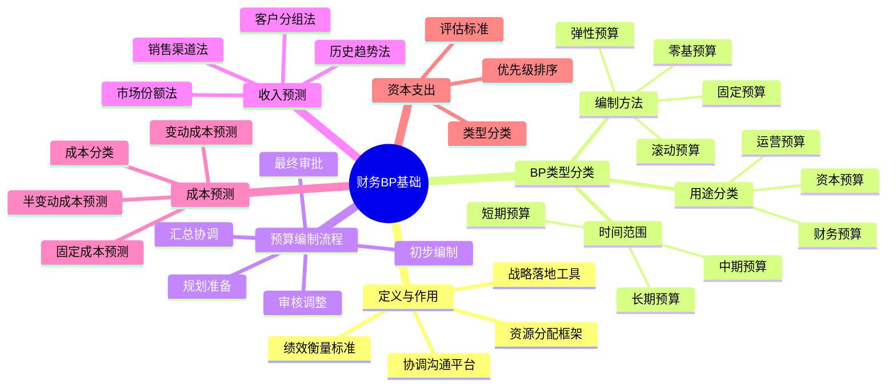

---
{"dg-publish":true,"tags":["财务BP","复习笔记","基础概念","学习笔记","速记"],"创建日期":"2024-04-28","permalink":"/知识共享/001_财务/01_财务BP/02_笔记/03_复习笔记/财务BP基础模块复习/","dgPassFrontmatter":true}
---

> [!info] 概述
> 本复习笔记汇总了财务BP基础模块的核心概念、关键知识点和常见问题，帮助快速回顾和掌握财务BP的基本框架和应用，为进阶学习打下坚实基础。

## 核心概念速记

### 财务BP的定义与作用

**定义**：
- 财务BP (Business Plan/Budget Planning) 是通过定量分析和预测支持企业决策的财务规划过程
- 涵盖从战略目标到实际资源分配的财务转化过程
- 既是目标设定工具，也是衡量绩效的标准

**主要作用**：
- 战略落地：将企业战略转化为可衡量的财务目标
- 资源分配：指导有限资源在各业务领域的分配
- 绩效评估：提供考核和奖惩的基础标准
- 协调协作：促进各部门目标一致和协作
- 风险管理：识别和应对潜在财务风险

**与企业战略的关系**：
- 战略确定方向，财务BP提供路径
- 战略目标→财务目标→资源配置→执行监控→战略调整

### BP类型与分类

**按时间范围分类**：
- 短期预算（1年以内）：高精度、运营导向
- 中期预算（1-3年）：中等精度、战术导向
- 长期预算（3-5年+）：低精度、战略导向

**按编制方法分类**：
- 固定预算：期初制定后不变
- 弹性预算：根据活动水平自动调整
- 滚动预算：定期更新，保持预测期一致
- 零基预算：每期重新评估所有支出
- 增量预算：基于上期增加必要调整

**按用途分类**：
- 运营预算：日常经营活动预测
- 资本预算：长期投资计划
- 财务预算：现金流和融资规划
- 项目预算：特定项目资源规划

## 预算编制基础

### 预算编制流程

**预算编制五步法**：
1. **规划准备**：设定目标、确定假设、制定时间表
2. **初步编制**：各部门根据指引编制初稿
3. **汇总协调**：财务汇总并识别冲突和差距
4. **审核调整**：解决冲突，与战略对齐
5. **最终审批**：提交管理层/董事会审批

**部门协作流程**：
- 自上而下：管理层设定总体目标和框架
- 自下而上：业务部门提供详细计划
- 综合平衡：通过协商达成最终一致

**时间规划建议**：
- 第1-2周：规划准备与培训
- 第3-5周：各部门编制
- 第6-7周：汇总与协调
- 第8-9周：审核与调整
- 第10周：最终审批

### 收入预测方法

**主要方法对比**：

| 预测方法 | 适用场景 | 优缺点 |
|---------|---------|-------|
| 历史趋势法 | 稳定业务环境 | 简单易用；可能忽视新变化 |
| 市场份额法 | 成熟市场 | 考虑竞争因素；需要市场数据 |
| 销售渠道法 | 多渠道销售 | 精细准确；需详细渠道数据 |
| 客户分组法 | B2B业务 | 高精度；工作量大 |
| 产品生命周期法 | 多产品组合 | 符合产品规律；需专业判断 |

**核心步骤**：
1. 确定预测方法和粒度
2. 收集历史数据和市场信息
3. 确定关键假设和增长因素
4. 初步预测与敏感性测试
5. 与销售/市场团队验证

### 成本预测方法

**成本分类基础**：
- 固定成本 vs 变动成本
- 直接成本 vs 间接成本
- 可控成本 vs 不可控成本

**预测技术**：
- 变动成本：通常与收入或产量线性关联
- 固定成本：基于历史数据和通胀调整
- 半变动成本：拆分固定和变动部分
- 阶梯式成本：识别成本增加的临界点

**成本预测常用公式**：
- 变动成本 = 单位变动成本 × 产量
- 基于收入的成本 = 收入 × 历史成本率
- 人工成本 = 人数 × 平均薪资 × (1 + 附加福利率)

### 资本支出预算

**资本支出类型**：
- 维持性资本支出：维持现有产能
- 增长性资本支出：扩大产能和规模
- 战略性资本支出：进入新市场或新产品
- 合规性资本支出：满足法规要求

**资本支出评估标准**：
- 战略契合度：支持企业战略目标
- 财务回报：NPV、IRR、回收期
- 风险评估：敏感性和情景分析
- 优先级：资源约束下的项目排序

**资本预算流程**：
1. 收集项目提案
2. 标准化财务评估
3. 风险和战略分析
4. 项目优先级排序
5. 批准和资源分配

## 思维导图：财务BP基础

## 实践应用要点

### 预算表格结构

**标准预算模板组成**：
- 假设与参数页
- 收入预测明细
- 成本费用明细
- 利润表预测
- 资产负债表预测
- 现金流量表预测
- 资本支出计划
- 人员编制计划
- 部门预算汇总
- 预算与实际对比

**预算表格设计原则**：
- 输入区与计算区明确分离
- 保持公式一致性和透明度
- 建立跨表链接和检查机制
- 格式简洁清晰，重点突出

### 预算假设框架

**关键假设分类**：
- 宏观经济假设：GDP增长、通胀率、汇率等
- 行业假设：市场规模、竞争格局、价格趋势等
- 公司特定假设：产能、销售增长、成本结构等
- 技术假设：效率提升、自动化程度等

**假设管理最佳实践**：
- 明确记录所有假设及来源
- 定期审核和更新关键假设
- 进行假设敏感性测试
- 设置假设变化的预警机制

### 预算协调技巧

**常见协调挑战与解决方案**：
- **问题**：销售预测过于乐观
  **解决**：使用历史准确性数据调整；引入多情景规划

- **问题**：部门预算总和超出企业财务能力
  **解决**：设定明确的资源约束；基于优先级进行资源分配

- **问题**：不同部门预测存在内部矛盾
  **解决**：建立跨部门协调会议；使用共同假设框架

- **问题**：战略目标与预算资源不匹配
  **解决**：明确优先级；调整战略执行时间表；寻求额外资源

## 常见问题与解答

**Q1: 固定预算与滚动预算各有什么优缺点？何时选择？**  
A: 固定预算提供稳定目标和简化流程，但缺乏灵活性；滚动预算能够适应环境变化，保持前瞻性，但工作量大。稳定环境选固定预算，快速变化环境选滚动预算。

**Q2: 如何提高预算预测的准确性？**  
A: 1) 分析历史预测偏差；2) 结合多种预测方法；3) 充分利用业务团队输入；4) 考虑外部市场数据；5) 设定合理假设并进行敏感性分析；6) 实施滚动预测及时调整。

**Q3: 预算与实际出现偏差时，如何进行有效分析？**  
A: 1) 区分价格和数量因素；2) 识别一次性因素与结构性因素；3) 将偏差分解到责任部门和具体原因；4) 关注趋势而非单期波动；5) 形成行动计划解决结构性问题。

**Q4: 零基预算适合哪些场景？实施挑战有哪些？**  
A: 零基预算适合组织变革期、成本重组阶段和间接成本占比高的部门。挑战包括：工作量大、需要详细活动分析、可能引起组织抵触、需要强有力的执行支持。

**Q5: 小型企业如何建立高效的预算体系？**  
A: 1) 从简单模型开始，逐步完善；2) 聚焦关键驱动因素；3) 使用标准化电子表格模板；4) 结合现金流预测；5) 实施月度滚动预测；6) 定期简化的预算评审会议。

## 基础知识测试题

1. 财务BP的主要目的是什么？
   - A) 仅为了控制成本
   - B) 仅为了预测未来财务状况
   - C) 将战略目标转化为财务计划并指导资源分配
   - D) 仅为了满足投资者要求

2. 以下哪种预算类型最适合快速变化的市场环境？
   - A) 固定预算
   - B) 增量预算
   - C) 滚动预算
   - D) 项目预算

3. 在预算编制流程中，"自上而下"与"自下而上"方法的最佳结合是：
   - A) 先自上而下设定总体目标，再自下而上提供详细计划
   - B) 完全由高层决定所有预算细节
   - C) 完全由部门决定所有预算内容
   - D) 预算流程不需要结合这两种方法

4. 变动成本与固定成本的主要区别是：
   - A) 变动成本总是高于固定成本
   - B) 变动成本随业务活动水平变化，固定成本不随业务活动水平变化
   - C) 变动成本只适用于生产企业
   - D) 固定成本不能被控制

5. 资本支出预算的评估通常不包括以下哪项指标？
   - A) 净现值(NPV)
   - B) 内部收益率(IRR)
   - C) 每股收益(EPS)
   - D) 投资回收期

**答案**：1-C, 2-C, 3-A, 4-B, 5-C

## 进阶学习路径

完成基础模块后，建议按以下路径继续深入学习：

1. **财务预测与模型**：掌握更高级的财务预测技术
   - 推荐资源：[[知识共享/001_财务/01_财务BP/02_笔记/01_概念速查/财务预测方法论速查\|财务预测方法论速查]]、[[财务报表预测\|财务报表预测]]

2. **情景分析与敏感性分析**：提升不确定环境下的预测能力
   - 推荐资源：[[知识共享/001_财务/01_财务BP/02_笔记/02_方法工具/敏感性分析操作指南\|敏感性分析操作指南]]、[[知识共享/001_财务/01_财务BP/01_学习内容/03_财务预测与模型/情景分析/情景分析的决策应用\|情景分析的决策应用]]

3. **行业特定应用**：学习特定行业的财务BP特点
   - 推荐资源：依据行业选择[[制造业BP特点\|制造业BP特点]]或[[服务业BP特点\|服务业BP特点]]

4. **高级分析方法**：掌握投资回报分析和风险评估
   - 推荐资源：[[知识共享/001_财务/01_财务BP/01_学习内容/05_高级分析方法/投资回报分析/投资决策指标的应用\|投资决策指标的应用]]、[[知识共享/001_财务/01_财务BP/01_学习内容/05_高级分析方法/风险评估/风险量化方法\|风险量化方法]]

5. **工具应用**：提升Excel和财务软件应用能力
   - 推荐资源：[[Excel财务模型构建技巧\|Excel财务模型构建技巧]]、[[知识共享/001_财务/01_财务BP/02_笔记/02_方法工具/财务BP模型构建步骤\|财务BP模型构建步骤]]

## 相关链接

- [[知识共享/001_财务/01_财务BP/02_笔记/01_概念速查/財務BP核心概念速查\|財務BP核心概念速查]]
- [[知识共享/001_财务/01_财务BP/01_学习内容/02_预算编制基础/预算编制流程/预算编制流程\|预算编制流程]]
- [[知识共享/001_财务/01_财务BP/01_学习内容/01_财务BP基础概念/BP定义与作用/财务BP在企业管理中的位置\|财务BP在企业管理中的位置]]
- [[知识共享/001_财务/01_财务BP/01_学习内容/01_财务BP基础概念/BP类型与分类/按时间范围分类\|按时间范围分类]]
- [[预算与战略的关系\|预算与战略的关系]] 