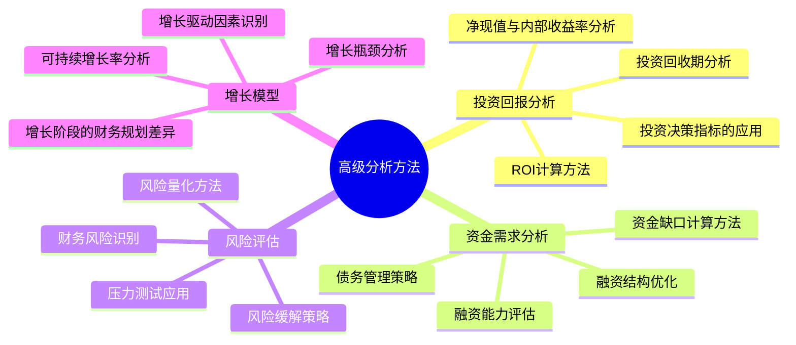
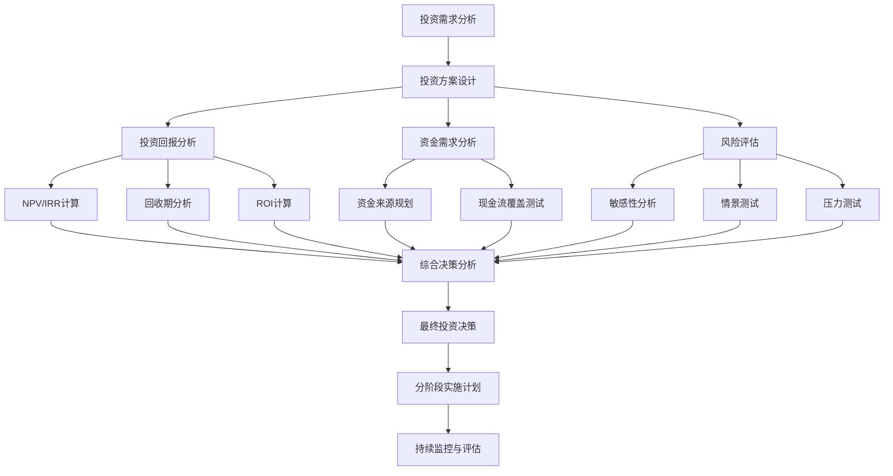

---
{"tags":["财务BP","高级分析方法","投资回报分析","资金需求分析","风险评估","增长模型","财务决策"],"aliases":["财务分析高级方法","财务决策支持","高级财务评估"],"created":"2024-05-13","update":"2024-05-13","dg-publish":true,"permalink":"/知识共享/001_财务/01_财务BP/02_笔记/05-高级分析方法/","dgPassFrontmatter":true}
---

# 高级分析方法

## 引言

高级分析方法是财务BP的深度决策支持工具，超越了基础的预算编制，提供更具战略性和前瞻性的分析视角。本章系统介绍投资回报分析、资金需求分析、风险评估和增长模型等高级分析方法，帮助财务BP人员构建更全面的决策支持体系，支持企业关键战略决策。

## 核心内容

### 1. 投资回报分析

投资回报分析帮助企业评估资本投入的价值回报，支持资源优化配置：

**ROI计算方法**：
- 会计ROI：净利润/投资额
- 现金ROI：现金流入/现金流出
- 风险调整ROI：考虑风险因素的回报率
- 增量ROI：增量收益/增量投资

**投资回收期分析**：
- 简单回收期：不考虑时间价值
- 折现回收期：考虑时间价值
- 风险调整回收期：考虑风险因素
- 动态回收期：在项目生命周期内评估

**净现值与内部收益率分析**：
- 净现值(NPV)计算方法与应用
- 内部收益率(IRR)计算与局限性
- 修正内部收益率(MIRR)
- 不同期间不同贴现率的应用

**投资决策指标的综合应用**：
- 多指标决策框架构建
- 战略投资与财务投资的评估差异
- 不确定性下的投资决策方法
- 投资组合优化模型

### 2. 资金需求分析

资金需求分析确保企业拥有足够资金支持业务发展，避免流动性危机：

**资金缺口计算方法**：
- 基于现金流的资金缺口分析
- 经营活动资金需求预测
- 投资活动资金需求预测
- 融资前资金缺口确定

**融资结构优化**：
- 股权融资与债务融资的平衡
- 短期与长期融资结构设计
- 融资时机与市场条件分析
- 融资成本最小化策略

**债务管理策略**：
- 债务承载能力评估
- 利率风险管理
- 债务期限结构优化
- 债务契约设计与管理

**融资能力评估**：
- 信用评级影响因素分析
- 抵押资产价值评估
- 未来现金流还款能力分析
- 融资渠道多元化策略

### 3. 风险评估

风险评估帮助企业识别潜在威胁并制定应对策略，提高财务韧性：

**财务风险识别**：
- 流动性风险分析
- 信用风险评估
- 市场风险因素识别
- 运营风险映射

**风险量化方法**：
- 敏感性分析在风险量化中的应用
- 蒙特卡洛模拟技术
- 情景分析与极端情况测试
- 风险价值(VaR)计算

**风险缓解策略**：
- 多元化策略设计
- 对冲工具的应用
- 风险转移机制
- 财务缓冲设计

**压力测试应用**：
- 极端市场条件下的表现测试
- 关键风险因素的临界点分析
- 企业生存能力评估
- 风险响应计划制定

### 4. 增长模型

增长模型分析企业的可持续发展能力，制定合理的增长预期：

**可持续增长率分析**：
- 可持续增长率(SGR)计算方法
- 实际增长率与SGR的差异分析
- 提高SGR的策略选择
- 超过SGR增长的资金需求估算

**增长驱动因素识别**：
- 收入增长驱动因素分解
- 利润增长驱动因素分解
- 资产效率对增长的贡献
- 杠杆效应对增长的影响

**增长阶段的财务规划差异**：
- 启动期的财务策略
- 快速增长期的资源配置
- 成熟期的效率优化
- 转型期的投资重点

**增长瓶颈分析**：
- 运营瓶颈识别与量化
- 资金瓶颈评估
- 人才与组织瓶颈分析
- 市场瓶颈预测

## 应用示例

### 案例一：制造企业产能扩张的综合投资评估

某制造企业计划投资新生产线，需要全面评估投资回报和风险：

1. **投资方案概述**：
   - 投资总额：8,000万元
   - 产能提升：40%
   - 项目周期：15年
   - 预计年均净现金流：1,200万元

2. **投资回报分析**：
   - NPV计算：使用12%的WACC，NPV为3,600万元
   - IRR计算：IRR为17.5%，高于最低要求回报率
   - 回收期：6.2年（简单回收期），7.5年（折现回收期）
   - 增量ROI：第一年10%，稳定期20%

3. **敏感性与情景分析**：
   | 变量 | 变动范围 | NPV影响 | IRR影响 |
   |-----|---------|---------|---------|
   | 产品价格 | ±10% | ±1,800万 | ±3.2% |
   | 原材料成本 | ±15% | ±1,200万 | ±2.1% |
   | 产能利用率 | 70%-90% | ±2,200万 | ±4.5% |
   | 投资额 | +20% | -1,600万 | -3.1% |

4. **资金需求分析**：
   - 资金来源规划：自有资金40%，银行贷款60%
   - 贷款期限：7年，利率5.5%
   - 债务覆盖率分析：DSCR始终>1.5
   - 年度最大资金缺口：800万（建设期第二年）

5. **风险评估与压力测试**：
   - 关键风险点：市场需求不足、原材料价格大幅上涨
   - 盈亏平衡分析：产能利用率最低需达65%
   - 极端情景测试：需求下降30%情况下仍能覆盖利息
   - 风险缓解措施：分阶段投资、锁定部分原材料长期供应

6. **增长影响评估**：
   - 项目对企业SGR的提升：2.5个百分点
   - 规模效应带来的成本优势：单位成本降低8%
   - 新产能释放节奏与市场增长匹配度分析
   - 战略价值评估：提高市场份额3个百分点

### 案例二：科技企业并购目标财务评估

某科技企业计划收购一家具有互补技术的初创公司，进行全面财务评估：

1. **收购方案概述**：
   - 收购价格：1.2亿元（现金+股权）
   - 目标公司年收入：3,000万元，增长率40%
   - 目标公司EBITDA：500万元
   - 战略协同预期：产品互补、渠道共享、技术整合

2. **估值分析**：
   - 交易倍数分析：4倍收入，24倍EBITDA
   - DCF估值：基于5年预测，永续增长率3%
   - 协同效应量化：年均增量利润600万元
   - 控制权溢价评估：15%-20%

3. **增长驱动因素分析**：
   | 增长驱动因素 | 收购前 | 收购后 | 提升幅度 |
   |------------|--------|--------|----------|
   | 产品线覆盖率 | 60% | 85% | +25% |
   | 客户交叉销售 | 15% | 35% | +20% |
   | 研发效率 | 基准 | +30% | +30% |
   | 市场进入速度 | 基准 | -40% | 提速40% |

4. **风险评估与缓解方案**：
   - 整合风险：人才流失、文化冲突
   - 估值风险：增长不及预期，技术落后
   - 财务风险：现金流压力，债务管理
   - 风险缓解：分期付款、业绩对赌、关键人才锁定

5. **融资与资本结构分析**：
   - 最优资金来源组合：自有资金50%，新增债务30%，股票支付20%
   - 收购后资本结构影响：债务比率提高10个百分点
   - 信用指标变化：利息覆盖率从8倍降至5倍
   - 未来再融资能力评估

6. **决策建议**：
   - 基于战略协同和财务回报，建议进行收购
   - 关键条件：收购价格不超过1.3亿，至少30%为股权支付
   - 业绩对赌设计：基于收入增长和毛利率指标
   - 风险控制措施：分阶段交割，关键人才保留机制
   - 整合计划：100天整合路线图，重点关注研发和销售协同

## 相关链接

- [[知识共享/001_财务/01_财务BP/01_学习内容/01_财务BP基础概念/BP与企业战略/财务BP与企业战略的关系\|财务BP与企业战略的关系]]
- [[知识共享/001_财务/01_财务BP/01_学习内容/03_财务预测与模型/敏感性分析/敏感性分析的目的与方法\|敏感性分析的目的与方法]]
- [[知识共享/001_财务/01_财务BP/01_学习内容/03_财务预测与模型/现金流预测/现金流预测的重要性\|现金流预测的重要性]]
- [[知识共享/001_财务/01_财务BP/01_学习内容/06_BP工具与模板/Excel模型构建/财务模型设计原则\|财务模型设计原则]]
- [[知识共享/001_财务/01_财务BP/01_学习内容/04_行业应用/科技企业BP特点/快速增长阶段的BP策略\|快速增长阶段的BP策略]]

## 参考文献

1. Brealey, R., Myers, S., & Allen, F. (2020). *Principles of Corporate Finance*. McGraw-Hill Education.
2. Damodaran, A. (2012). *Investment Valuation: Tools and Techniques for Determining the Value of Any Asset*. Wiley Finance.
3. 朱宁 (2021). 《投资决策与风险管理》. 中国人民大学出版社.
4. Copeland, T., Koller, T., & Murrin, J. (2015). *Valuation: Measuring and Managing the Value of Companies*. Wiley.
5. 陈泽忠 (2020). 《企业融资与资本运作》. 清华大学出版社.
6. Higgins, R. C. (2018). *Analysis for Financial Management*. McGraw-Hill Education.
7. 李曜 (2022). 《企业增长战略与财务支持》. 北京大学出版社. 