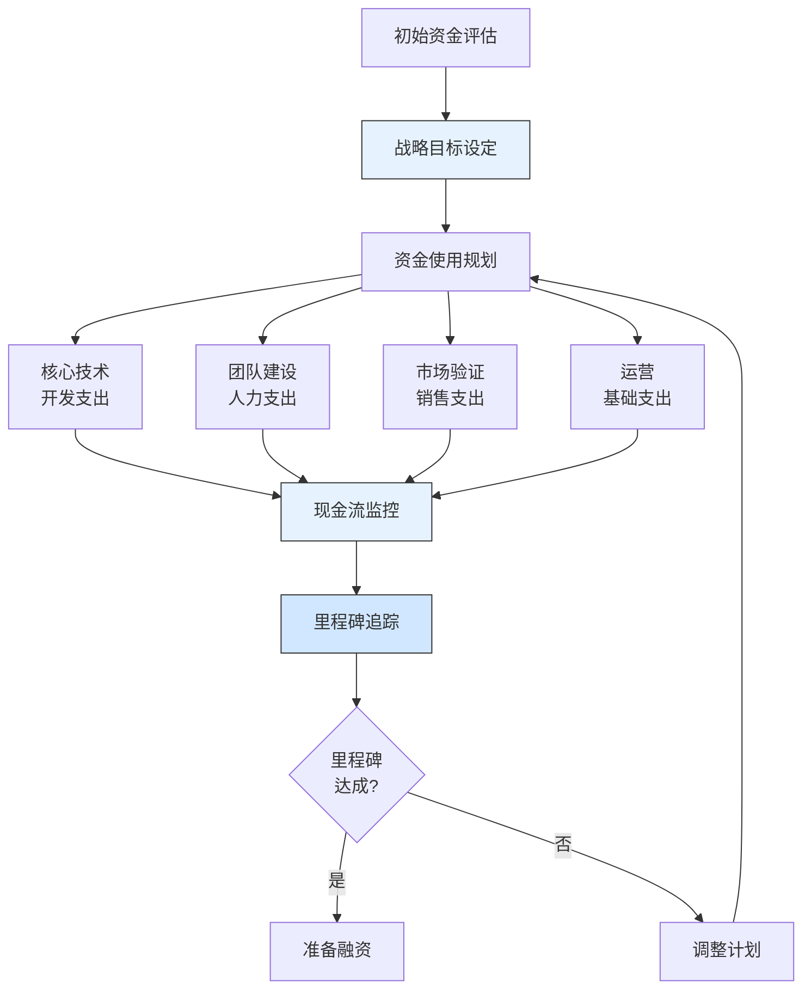

---
{"dg-publish":true,"tags":["财务BP","初创企业","AI企业","种子轮融资","现金流规划","创业融资","案例分析"],"创建日期":"2024-04-28","permalink":"/知识共享/001_财务/01_财务BP/03_案例/初创企业财务BP案例集/AI创业公司种子轮融资前的财务规划/","dgPassFrontmatter":true}
---

> [!quote] 案例简介
> 本案例分析一家AI创业公司"智见科技"在种子轮融资前如何制定财务规划，重点关注其如何在资源有限的情况下平衡技术开发、团队建设与商业验证，以及如何通过财务规划提高融资成功率和估值水平。

## 案例背景

### 企业背景
智见科技是一家成立于2023年的AI创业公司，由三位来自头部科技公司的技术专家创立，核心团队5人，主要产品是基于大语言模型的垂直领域智能助手，专注于金融和法律行业的文档处理与决策辅助。创立之初获得天使投资人投入的300万元人民币，目标是在12-18个月内完成种子轮融资，计划融资1500-2000万元。

### 财务状况
公司成立初期的财务状况：
- 初始资金：天使投资300万元人民币
- 月均支出：约25万元（包括团队薪资、开发设备、云服务费用、办公场地等）
- 收入状况：MVP(最小可行产品)已有小规模试用客户，尚未形成稳定收入
- 现金储备：约9个月的运营时间

### 市场环境
案例发生在2023-2024年，当时AI创业环境：
- 大语言模型(LLM)技术进入爆发期，投资热度高
- 行业应用场景不断涌现，但商业模式尚未成熟
- 头部科技公司和AI初创企业竞争加剧
- 资本市场对AI领域投资趋于理性，更注重技术能力和商业落地

## 挑战与机遇识别

### 核心问题
智见科技面临的核心财务规划挑战包括：
1. **资金使用效率**：如何在有限资金条件下最大化产品开发进度和市场验证
2. **现金流管理**：如何确保在融资前不出现资金断裂
3. **融资节奏规划**：如何确定最佳融资时间点和融资规模
4. **估值策略**：如何通过财务规划支持合理估值

### 问题根源分析
通过深入分析，财务规划挑战的根本原因包括：
- **天生矛盾**：早期创业公司需要证明产品价值，但缺乏资源进行全面开发
- **不确定性**：AI技术和市场应用存在高度不确定性，难以精准预测进展
- **成本结构**：AI创业特有的高研发成本和高算力需求
- **人才竞争**：关键AI人才稀缺且成本高，构成主要支出

### 机遇评估
智见科技识别的主要机遇包括：
1. 通过精细化财务规划延长资金使用周期，为产品开发赢得更多时间
2. 利用早期客户合作降低开发成本，同时验证商业模式
3. 通过里程碑式财务规划，设定清晰的融资前业绩目标
4. 将行业AI应用热潮转化为竞争优势和估值提升因素

## 财务策略分析

### 种子轮前财务规划策略
智见科技采取的核心财务策略包括：
1. **"精益研发+里程碑"模式**：
   - 将产品开发分为三个阶段：技术验证、客户试用、规模复制
   - 每个阶段设定明确的财务和业务指标
   - 根据里程碑调整资源分配和支出计划

2. **差异化现金流管理**：
   - 核心活动采用"保证供给"策略
   - 非核心活动采用"极度精简"策略
   - 建立优先级调整机制，根据进展动态调整资源分配

3. **融资前商业指标构建**：
   - 设计关键业绩指标(KPI)矩阵，平衡技术进步与商业验证
   - 构建基于实证的估值支持体系
   - 提前规划不同融资情景的应对措施

### 财务逻辑与假设
该战略的关键假设包括：
- AI产品开发需要较长的技术验证期，但可通过早期客户参与降低风险
- 种子轮投资者看重团队、技术和早期商业验证的组合
- 技术进步和客户验证双管齐下可实现最优估值
- 通过降低非必要开支可显著延长资金周期

### 财务分析工具应用
智见科技在财务规划中应用了以下工具：
1. **现金流预测模型**：基于不同业务进展情景的12-18个月滚动现金流预测
2. **燃烧率分析**：团队规模、产品开发、市场活动对资金消耗影响的敏感性分析
3. **里程碑值分析**：每个业务里程碑对估值影响的量化评估
4. **融资时点优化模型**：平衡资金需求、业务进展和市场条件的融资时机决策工具

## 实施过程

### 实施步骤与时间线
智见科技的财务规划实施分为三个阶段：

**第一阶段(1-4个月)：基础搭建期**
- 确定核心技术路线和初始团队构成
- 建立基础财务监控系统
- 制定详细的6个月支出计划和现金流预测
- 投入60%资源开发MVP，20%进行客户拜访，20%用于团队建设

**第二阶段(5-8个月)：产品验证期**
- 根据MVP反馈调整开发计划和预算
- 发展2-3个种子客户，提供定制化解决方案
- 优化现金流预测模型，纳入早期客户反馈
- 调整资源分配：50%继续产品开发，35%客户服务，15%运营

**第三阶段(9-12个月)：融资准备期**
- 基于早期客户案例构建商业模型和定价策略
- 制作融资路演材料，突出关键财务和业务指标
- 准备详细的融资后18个月业务规划和预算
- 开始接触潜在投资者，获取初步反馈

### 实施挑战
实施过程中面临的主要挑战包括：
1. 技术开发进度不及预期，导致预算压力
2. 早期客户合作谈判周期长于预计
3. AI行业竞争加剧，需要更多差异化资源投入
4. 核心团队扩张成本高于初始预算

### 关键成功因素
成功实施的关键因素包括：
1. 创始人团队亲自参与财务规划和监控
2. 建立周度现金流审查机制，及时发现偏差
3. 保持支出弹性，根据业务进展动态调整
4. 与天使投资人保持紧密沟通，获得持续指导

## 结果评估

### 短期效果
实施精细化财务规划后，智见科技取得了以下成效：
- 将初始资金支撑期从预计9个月延长至14个月
- 成功开发完成MVP并获得3家金融机构试用
- 建立了完整的产品技术栈和知识产权体系
- 初步验证了"按使用量+按场景"的混合收费模式

### 长期影响
这一财务规划对智见科技产生了深远影响：
- 顺利获得了2000万元种子轮融资，较初始估值提升3倍
- 建立了成熟的创业公司财务管理体系
- 形成了"技术里程碑+商业里程碑"双轨发展模式
- 获得投资人对长期发展战略的认可和支持

### 预期与实际差异
与预期相比，存在一些差异：
- 技术开发成本高于预期约20%，尤其是算力和数据成本
- 客户获取周期长于预期，但客户粘性和付费意愿高于预期
- 团队扩张速度慢于计划，但人均产出高于预期
- 融资环境波动，融资时点比计划推迟了约2个月

## 经验教训提炼

### 成功经验
智见科技种子轮前财务规划的成功经验包括：
1. **资源聚焦**：将有限资源聚焦于少数关键活动
2. **渐进式开发**：将产品开发分阶段，逐步验证和调整
3. **早期商业化**：尽早获取客户反馈和小额收入
4. **里程碑管理**：设定清晰的业务和财务里程碑，指导资源分配
5. **透明沟通**：与团队和投资人保持财务状况的透明沟通

### 失误与教训
值得反思的问题包括：
1. 初期对算力和数据成本估计不足
2. 未充分考虑销售周期长度对现金流的影响
3. 过于保守的薪资策略影响了某些关键人才引进
4. 对竞争环境变化反应不够迅速，错失部分市场机会

### 可借鉴原则
对其他初创企业有价值的借鉴原则：
1. 财务规划应基于业务里程碑，而非简单的时间周期
2. 保留25-30%的资金作为应急缓冲是必要的
3. 在核心竞争力上的投入不能过度削减
4. 融资时机应基于业务成就而非资金紧张程度

## 延伸思考

### 讨论问题
1. AI创业公司如何平衡高研发投入与有限资源的矛盾？
2. 在技术快速迭代的环境中，如何设计兼具稳定性和灵活性的财务规划？
3. 早期创业团队应如何使用财务工具辅助业务决策，而不仅仅是记录交易？

### 行业应用借鉴
智见科技的经验对以下创业领域有重要参考价值：
- **深科技创业**：高研发投入与产品商业化平衡
- **B2B创业公司**：长销售周期下的现金流管理
- **需求弹性高的创业项目**：里程碑式资源分配策略

### 未来趋势展望
初创企业财务规划可能的发展趋势：
1. 更加敏捷和模块化的财务规划工具，适应快速变化的创业环境
2. 融合数据分析和AI的创业决策支持系统
3. 更加透明和标准化的早期创业财务指标体系
4. 新型融资工具（如可转债、收入分成等）对财务规划的影响

## 参考资源

1. Ries, E. (2011). *The Lean Startup*. Crown Business.
2. Blank, S. (2020). *The Four Steps to the Epiphany*. K&S Ranch.
3. 《2023年中国AI创业公司融资报告》. 36氪研究院.
4. Harvard Business Review. (2021). *Financial Management for Tech Startups*.
5. CB Insights. (2023). *AI Startup Funding Trends and Valuation Metrics*. 