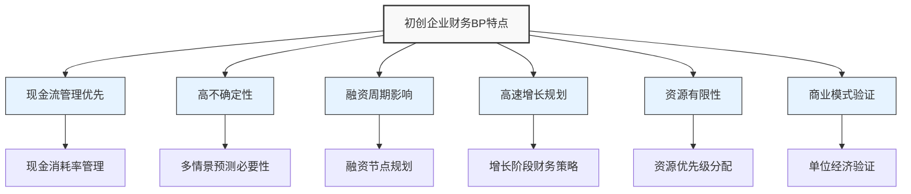

---
{"dg-publish":true,"tags":["财务BP","初创企业","案例集","融资规划","现金管理","增长策略"],"创建日期":"2024-04-28","permalink":"/知识共享/001_财务/01_财务BP/03_案例/初创企业财务BP案例集/初创企业财务BP案例集/","dgPassFrontmatter":true}
---

# 初创企业财务BP案例集

## 概述

本案例集汇总了初创企业在不同发展阶段的财务规划与预算管理案例，涵盖科技创业、消费品创业、平台型创业等多种业态。通过这些案例，展示初创企业在财务BP实践中的独特挑战与解决方案。

## 初创企业财务BP的特点

## 案例目录

### 1. 种子轮初创企业案例
- [AI创业公司种子轮融资前的财务规划](AI创业公司种子轮融资前的财务规划.md) - 分析AI初创企业早期财务规划
- [SaaS创业公司最低可行产品阶段财务策略](SaaS创业公司最低可行产品阶段财务策略.md) - 探讨MVP阶段的资源分配策略
- [生物科技初创企业研发周期的财务规划](生物科技初创企业研发周期的财务规划.md) - 分析长研发周期企业的现金流管理

### 2. A轮/B轮成长期企业案例
- [小米早期硬件互联网模式的财务策略案例文件](小米早期硬件互联网模式的财务策略案例文件.md) - 分析小米早期"硬件+互联网"模式的财务策略
- [拼多多下沉市场扩张的财务策略](拼多多下沉市场扩张的财务策略.md) - 研究社交电商平台的快速扩张财务决策
- [字节跳动全球化扩张的财务策略](../03_科技企业BP特点/字节跳动全球化扩张的财务策略.md) - 分析内容平台的国际化扩张财务规划

### 3. 规模化阶段企业案例
- [美团配送网络扩张的资本支出规划](美团配送网络扩张的资本支出规划.md) - 探讨本地生活服务平台的网络扩张投资
- [蔚来汽车规模化生产的财务战略](蔚来汽车规模化生产的财务战略.md) - 分析新能源车企业规模化阶段的财务挑战
- [瑞幸咖啡快速扩张模式的财务分析](瑞幸咖啡快速扩张模式的财务分析.md) - 研究快速扩张模式的财务风险控制

### 4. 特殊商业模式案例
- [共享单车企业的资产重型财务模式](共享单车企业的资产重型财务模式.md) - 分析资产密集型共享经济的财务规划
- [社区团购平台的低毛利模式财务策略](社区团购平台的低毛利模式财务策略.md) - 探讨薄利多销模式的现金流管理
- [To B企业长销售周期的财务规划](To B企业长销售周期的财务规划.md) - 研究企业级服务长周期销售的财务安排

## 初创企业财务BP关键挑战

1. **现金消耗率控制** - 如何在资源有限情况下优化现金使用效率
2. **融资节点规划** - 如何确定最佳融资时机和规模
3. **增长与盈利平衡** - 如何在快速增长与财务可持续性间取得平衡
4. **单位经济模型验证** - 如何构建和验证业务的基础盈利能力
5. **估值与财务规划** - 如何通过财务规划支持企业估值提升

## 初创企业财务BP最佳实践

1. **18-24个月现金流规划** - 确保覆盖下一轮融资周期的现金储备
2. **敏捷预算模型** - 采用滚动预算，定期调整以适应快速变化
3. **关键指标追踪** - 聚焦CAC、LTV、消耗率等关键指标的实时监控
4. **灵活成本结构** - 构建包含固定与可变成本的混合成本结构
5. **融资节点倒推规划** - 从融资里程碑倒推财务目标和业务进度

## 行业趋势与展望

- **精益创业财务** - 精益创业理念对财务规划的影响与应用
- **数据驱动决策** - 基于实时数据的财务决策与调整机制
- **增长黑客财务** - 增长黑客策略与财务规划的整合
- **ESG因素融入** - 可持续发展因素在初创企业融资中的重要性
- **全球化创业** - 初创企业早期全球化的财务策略与挑战

## 参考资源

1. Feld, B., & Mendelson, J. (2021). *Venture Deals: Be Smarter Than Your Lawyer and Venture Capitalist*.
2. Ries, E. (2011). *The Lean Startup*.
3. Blank, S., & Dorf, B. (2020). *The Startup Owner's Manual*.
4. 《创业公司财务管理》，清华大学出版社，2021.
5. 《从0到IPO：创业公司融资全攻略》，机械工业出版社，2023. 