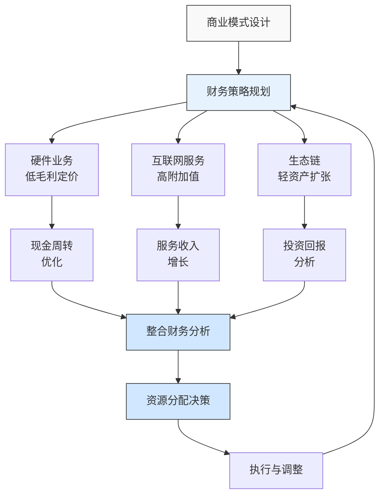

---
{"dg-publish":true,"tags":["财务BP","初创企业","小米","硬件互联网","轻资产模式","案例分析"],"创建日期":"2024-04-28","permalink":"/知识共享/001_财务/01_财务BP/03_案例/初创企业财务BP案例集/小米早期硬件互联网模式的财务策略/","dgPassFrontmatter":true}
---

> [!quote] 案例简介
> 本案例分析小米科技在其创业早期(2010-2014年)如何基于"硬件+互联网"的创新商业模式制定财务策略，重点关注其如何通过"低毛利硬件+高价值互联网服务"的模式实现快速增长，以及在高速发展阶段如何规划资源配置和现金流管理。

## 案例背景

### 企业背景
小米科技成立于2010年4月，由雷军、黎万强等人创立，初始定位为"移动互联网公司"。2011年8月，小米推出第一款手机产品MIUI，2011年底推出小米手机1。不同于传统手机厂商，小米采用"硬件+互联网"双轮驱动的商业模式，硬件以"几乎零利润"销售，通过互联网服务(MIUI、应用商店、游戏等)和生态链产品获取长期收入。

### 财务状况
公司早期的财务特点：
- 创立初期获投资人投入约4100万美元(A+B轮)
- 高效低成本运营，资金主要用于产品研发和供应链建设
- 2011年实现首款手机销售收入，2013年销售额破百亿元人民币
- 轻资产模式，较少固定资产投入，主要采用ODM合作生产

### 市场环境
2010-2014年中国智能手机市场特点：
- 功能手机向智能手机快速转换的窗口期
- 苹果、三星占据高端市场，本土品牌争夺中低端市场
- 电商销售模式兴起，传统渠道受到冲击
- 移动互联网爆发，应用生态价值凸显

## 挑战与机遇识别

### 核心问题
小米早期面临的核心财务策略挑战包括：
1. **资金效率与规模扩张**：如何在资金有限的情况下支持快速市场扩张
2. **硬件低毛利风险**：如何管理低毛利硬件销售带来的现金流压力和库存风险
3. **双轮驱动平衡**：如何在硬件和互联网服务之间合理分配资源
4. **供应链金融压力**：如何应对高速增长带来的采购资金需求

### 问题根源分析
通过分析，财务策略挑战的根本原因包括：
- **模式创新矛盾**：传统硬件企业和互联网企业有截然不同的财务特征
- **行业特性**：消费电子行业特有的资金密集性和库存周转压力
- **增长速度**：爆发式增长带来的资金需求与初创企业资源之间的不匹配
- **前沿定位**：无成熟案例可参考的商业模式探索过程

### 机遇评估
小米识别的主要机遇包括：
1. 通过互联网直销模式降低渠道成本，提高资金利用效率
2. 利用粉丝经济和社区运营降低营销投入，加速资金周转
3. 通过"饥饿营销"策略控制生产规模，降低库存风险
4. 建立互联网服务收入体系，提供长期稳定现金流支持

## 财务策略分析

### 早期财务规划策略
小米科技采取的核心财务策略包括：
1. **"轻资产+高周转"模式**：
   - 专注品牌、研发和销售，生产环节主要依靠ODM合作
   - 通过预售制度和控制产量降低库存和资金占用
   - 建立高效供应链管理系统，将库存周转控制在行业领先水平

2. **"薄利多销+服务收费"收入结构**：
   - 硬件产品价格接近成本，确保高销量和用户基数
   - 通过MIUI系统、内置应用和服务创造持续收入
   - 建立用户终身价值模型，指导产品定价和服务策略

3. **"小步快跑+滚动投资"资金使用策略**：
   - 新产品开发采用快速迭代方式，降低单次投入风险
   - 将硬件销售回款迅速投入下一代产品开发，形成滚动发展
   - 融资节奏与业务扩张阶段匹配，避免过早稀释或资金不足

### 财务逻辑与假设
该战略的关键假设包括：
- 用户规模增长与互联网服务收入呈正相关关系
- 通过硬件销售形成的生态锁定效应可带来长期服务收入
- 互联网模式可显著降低传统硬件业务的营销和渠道成本
- 社区运营和粉丝经济可降低客户获取成本

### 财务分析工具应用
小米在早期财务规划中应用了以下工具：
1. **用户终身价值(LTV)模型**：评估每个用户的长期贡献，指导硬件定价策略
2. **现金转换周期分析**：优化从采购支付到销售收款的时间差
3. **多元化收入预测**：预测硬件销售、MIUI广告、应用分成等各渠道收入
4. **敏感性分析**：评估产品价格、销量、成本变动对盈利能力的影响

## 实施过程

### 实施步骤与时间线
小米财务策略的实施大致分为三个阶段：

**第一阶段(2010-2011)：初创期**
- 精简团队，控制固定成本支出（初期仅约200人）
- A轮融资4100万美元主要用于MIUI系统开发和手机研发
- 采用社区推广策略，降低营销成本
- 建立以"性价比"为核心的产品定价策略

**第二阶段(2012-2013)：快速扩张期**
- 建立"饥饿营销"模式，降低库存风险
- 优化供应商付款条件，改善现金流状况
- C轮融资2.16亿美元，支持产能扩张和新品研发
- 开始多元化收入布局，增加互联网服务收入比例

**第三阶段(2013-2014)：多元生态期**
- 实施"生态链战略"，通过投资而非自建拓展产品线
- D轮融资超过10亿美元，支持国际化扩张
- 建立更完善的互联网服务收入体系
- 开始实施国际化布局，拓展海外市场

### 实施挑战
实施过程中面临的主要挑战包括：
1. 供应链风险：产能限制导致早期产品供不应求
2. 毛利率压力：低价策略下供应链成本上升影响整体盈利
3. 销售模式转变：从纯线上销售向线上线下融合模式转变带来的成本上升
4. 服务收入不及预期：互联网服务收入增长速度慢于硬件销量增长

### 关键成功因素
成功实施的关键因素包括：
1. 创始团队对"硬件+互联网"模式的坚定信念和执行力
2. 精细化成本控制文化和数据驱动的决策机制
3. 与供应链伙伴建立战略合作关系，获得更有利的交易条件
4. 灵活调整策略，根据市场反馈快速优化财务计划

## 结果评估

### 短期效果
实施创新财务策略后，小米在短期内取得了显著成效：
- 2012年销售收入超过126亿元，2013年突破300亿元
- 从创立到估值100亿美元仅用了2.5年，创造行业纪录
- 产品发布即售罄，资金周转效率居行业领先地位
- 建立了活跃用户超过3000万的MIUI生态系统

### 长期影响
这一财务策略对小米产生了深远影响：
- "硬件+互联网"模式被证明可行，并影响了众多创业企业
- 成功上市，2018年IPO估值达544亿美元
- 从单一手机品牌发展为多元化科技生态企业
- 建立了独特的"生态链投资"模式，低资金投入撬动大规模业务拓展

### 预期与实际差异
与预期相比，存在一些差异：
- 互联网服务收入占比低于最初预期
- 国际化扩张成本和难度高于预期
- 专利布局和研发投入需求超出初始计划
- 竞争对手快速跟进策略，价格战影响整体盈利能力

## 经验教训提炼

### 成功经验
小米早期财务策略的成功经验包括：
1. **轻资产高效率**：通过轻资产模式实现快速扩张
2. **极致性价比**：以低毛利策略快速抢占市场份额
3. **用户思维**：基于用户生命周期价值而非单次交易设计商业模式
4. **渠道优化**：互联网直销大幅降低分销成本
5. **社区运营**：通过社区和粉丝经济降低营销成本

### 失误与教训
值得反思的问题包括：
1. 低价策略导致过度依赖硬件销售量，增加供应链风险
2. 早期互联网服务变现不足，影响整体盈利模式
3. "饥饿营销"虽控制库存风险但也限制了市场份额扩张
4. 低价策略引发竞争对手跟进，导致行业利润下滑

### 可借鉴原则
对其他硬件创业企业有价值的借鉴原则：
1. 软硬结合的商业模式需要长期财务规划支持
2. 轻资产不等于零投入，核心能力建设不可削减
3. 供应链金融管理对硬件企业至关重要
4. 创新商业模式需要平衡短期现金压力与长期价值创造

## 延伸思考

### 讨论问题
1. "硬件+互联网"模式是否适用于所有电子消费品类别？不同产品类别的财务规划应有哪些差异？
2. 在竞争日益激烈的环境下，如何平衡价格策略与盈利能力？
3. 硬件企业如何科学评估互联网服务收入的长期价值，以支持财务决策？

### 行业应用借鉴
小米的经验对以下创业领域有重要参考价值：
- **智能硬件创业**：产品定价与生态价值平衡
- **消费电子企业**：供应链管理与资金效率优化
- **平台型企业**：硬件入口与服务收费模式设计

### 未来趋势展望
"硬件+互联网"模式的财务策略未来可能的发展趋势：
1. 更加精细化的用户生命周期价值评估模型
2. 基于AI和大数据的需求预测，降低库存风险
3. 服务收入比例提升，改善整体盈利结构
4. 生态链合作伙伴的财务协同与风险共担机制

## 参考资源

1. 雷军. (2015). *小米创业思考*. 中信出版社.
2. 黎万强. (2014). *参与感：小米口碑营销内部手册*. 中国人民大学出版社.
3. Harvard Business Review. (2014). *Xiaomi's Business Model Innovation*.
4. 《小米集团招股说明书》(2018).
5. McKinsey Quarterly. (2015). *The Hardware+Software Business Model in Consumer Electronics*. 